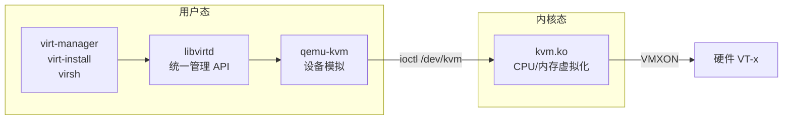
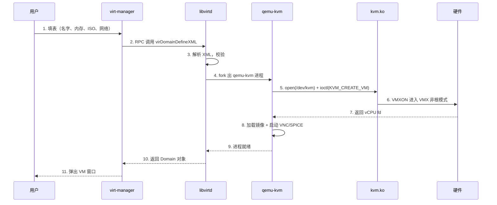
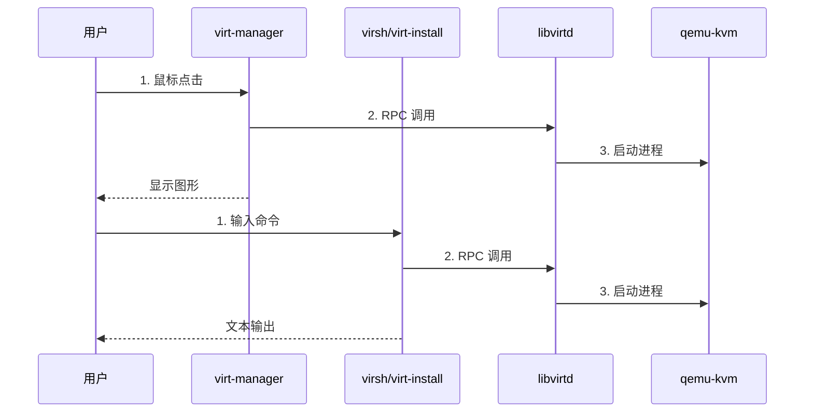
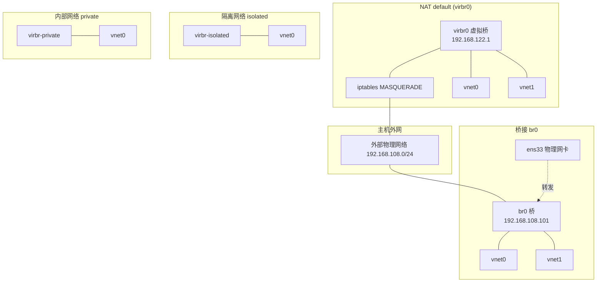
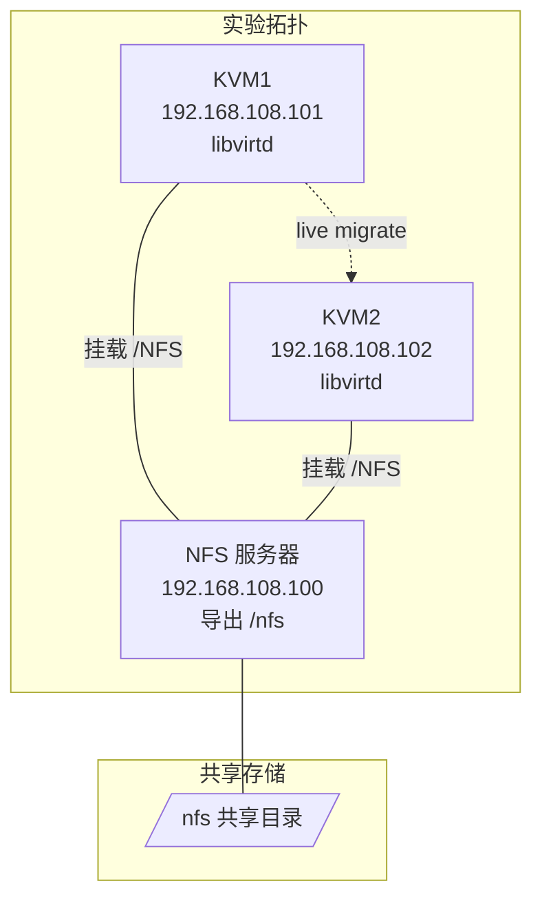
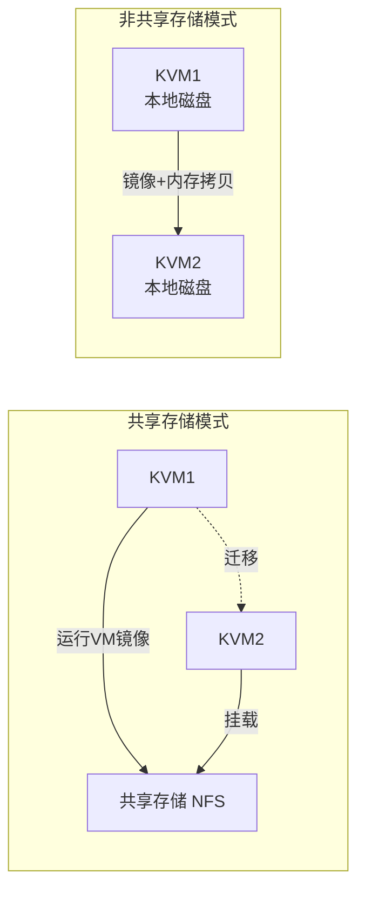

# Linux KVM 全面指南

> **一句话心智模型**：KVM = Linux 内核模块 `kvm.ko`（硬件辅助虚拟化）+ QEMU（用户态设备模拟）+ libvirt（统一管理 API）。一台 Linux 主机一旦加载了 `kvm` 内核模块，就变成"裸机 Hypervisor"——可以同时跑多个隔离的虚拟机。

---

## §0 心智模型

### 0.1 三层拼接的虚拟化栈

| 层级 | 组件 | 角色 | 关键路径 |
|------|------|------|----------|
| **硬件层** | CPU（Intel VT-x / AMD-V）、内存 EPT/NPT、IOMMU | 提供虚拟化扩展指令 | BIOS 中开启 VT |
| **内核层** | `kvm.ko` 内核模块 | 把 CPU/内存虚拟化能力暴露给用户态 | `lsmod \| grep kvm` |
| **用户层** | QEMU（设备模拟）、libvirt（统一 API） | QEMU 模拟磁盘/网卡/控制器；libvirt 提供 XML 配置 + virsh/virt-manager | `qemu-kvm`、`libvirtd` |

### 0.2 一句话三组件

- **KVM** = Linux 内核模块（Kernel-based Virtual Machine），把内核变成 Hypervisor。
- **QEMU** = 用户态模拟器，负责模拟虚拟机看到的全部硬件（CPU 除外，CPU 由 KVM 通过 `/dev/kvm` 接管）。
- **libvirt** = 统一管理 API，封装了 QEMU/Xen/VMware/LXC 等多种 Hypervisor，提供 `virsh` CLI 和 `virt-manager` GUI。

### 0.3 调用链

```
virt-manager (GUI) ─┐
virsh (CLI) ────────┼─→ libvirtd (守护进程) ─→ qemu-kvm 进程 ─→ /dev/kvm ─→ kvm.ko ─→ 硬件
virt-install (CLI) ─┘
```

### 0.4 为什么 KVM 性能好

KVM 是 **Type-1 裸机虚拟化**（Host OS = Hypervisor），虚拟机指令直接由硬件执行（VT-x 提供非根模式），不像 Type-2 那样完全靠软件翻译。QEMU 仅模拟 I/O 设备（virtio 半虚拟化把 I/O 性能拉回 80%+）。

---

## §1 虚拟化基础

### 1.1 Type-1 vs Type-2

| 类型 | 位置 | 代表 | 性能 | 代表产品 |
|------|------|------|------|----------|
| **Type-1 裸机** | Hypervisor 直接跑在硬件上 | KVM、ESXi、Xen | 高 | 数据中心 |
| **Type-2 宿主** | Hypervisor 跑在 Host OS 上 | VirtualBox、VMware Workstation | 中 | 桌面测试 |

KVM 在 Linux 上**介于两者之间**：内核模块 kvm.ko 是 Hypervisor，但又寄生在 Linux 内核中。所以严格说 KVM 是"内核虚拟化"，但效果等同 Type-1。

### 1.2 CPU 硬件辅助虚拟化

| 厂商    | 指令集            | 含义                                                             |
| ----- | -------------- | -------------------------------------------------------------- |
| Intel | **VT-x**（VMX）  | 提供 VMCS（Virtual Machine Control Structure），VMXON/VMXOFF 进入非根模式 |
| AMD   | **AMD-V**（SVM） | 提供 VMCB（Virtual Machine Control Block），VMRUN/VMEXIT 切换         |

判断命令：

```bash
egrep -c '(vmx|svm)' /proc/cpuinfo
# 输出 >0 表示 CPU 支持硬件虚拟化
# vmx = Intel VT-x
# svm = AMD-V
```

### 1.3 内存虚拟化

| 技术 | 厂商 | 原理 |
|------|------|------|
| **EPT**（Extended Page Table） | Intel | 影子页表的硬件加速，Guest 物理页 → Host 物理页由硬件查表 |
| **NPT**（Nested Page Table） | AMD | 同 EPT，AMD 叫法 |

优势：消除影子页表同步开销，Guest 内存访问无需陷入 Host。

### 1.4 I/O 虚拟化

| 方式 | 原理 | 性能 | 适用 |
|------|------|------|------|
| **全模拟** | QEMU 纯软件模拟 e1000/IDE | 差 | 兼容性最好 |
| **virtio 半虚拟化** | Guest 装 virtio 驱动，前后端共享环 | 高（80%+） | Linux 推荐 |
| **VT-d / IOMMU 直通** | 物理设备直接分配给 Guest | 几乎原生 | GPU 直通、NVMe 直通 |
| **SR-IOV** | 物理网卡虚拟成多个 VF | 接近原生 | 高吞吐网络 |

> 详见 [[Linux存储]] 的 IOMMU 章节。

### 1.5 关键名词

- **Host OS** = 宿主机（运行 KVM 的物理机）
- **Guest OS** = 虚拟机（被 KVM 启动的虚拟实例）
- **Hypervisor** = 虚拟化管理层（KVM 内核模块）
- **VMM** = Virtual Machine Monitor（KVM/QEMU 共同担当）
- **virtio** = 半虚拟化前后端通信框架，性能优化的关键

---

## §2 KVM 架构

### 2.1 三层架构图

```mermaid
graph TB
    subgraph UserSpace["用户态 (User Space)"]
        A1[virt-manager GUI]
        A2[virsh CLI]
        A3[virt-install]
        A4[QEMU 进程 qemu-kvm]
    end

    subgraph KernelSpace["内核态 (Kernel Space)"]
        B1[libvirtd 守护进程]
        B2[kvm.ko 内核模块]
        B3[/dev/kvm 字符设备]
    end

    subgraph Hardware["硬件层 (Hardware)"]
        C1[CPU VT-x / AMD-V]
        C2[内存 EPT / NPT]
        C3[IOMMU / VT-d]
    end

    A1 --> B1
    A2 --> B1
    A3 --> B1
    B1 --> A4
    A4 --> B3
    B3 --> B2
    B2 --> C1
    B2 --> C2
    B2 --> C3
```

### 2.2 KVM/QEMU/libvirt 三者关系



**核心关系**：

- QEMU 自己无法直接调用硬件虚拟化，需要打开 `/dev/kvm` 字符设备（由 `kvm.ko` 注册），通过 `ioctl(KVM_CREATE_VM)` 创建 Guest。
- libvirt 是"中间人"，把 XML 配置翻译成 QEMU 命令行启动 QEMU 进程。
- 所以**三个组件缺一不可**：

| 组件 | 缺失后果 |
|------|----------|
| 缺 `kvm.ko` | QEMU 启动报错 "Could not access KVM kernel module" |
| 缺 QEMU | libvirt 无可执行的 Hypervisor |
| 缺 libvirt | 你只能手动敲 `qemu-kvm -m 2048 -hda ...` 命令行 |

### 2.3 调用链时序图（virt-manager 创建 VM）



### 2.4 文件路径速查

| 文件 | 作用 |
|------|------|
| `/dev/kvm` | KVM 字符设备（用户态 ioctl 入口） |
| `/usr/libexec/qemu-kvm` | QEMU 二进制（RHEL/CentOS） |
| `/etc/libvirt/qemu/<vm>.xml` | 域定义文件（VM 配置） |
| `/var/lib/libvirt/images/` | 默认 qcow2 磁盘目录 |
| `/etc/libvirt/libvirtd.conf` | libvirtd 主配置 |
| `/etc/libvirt/qemu.conf` | QEMU 驱动配置 |
| `/var/log/libvirt/` | libvirt 日志 |
| `/var/log/libvirt/qemu/<vm>.log` | 单个 VM 的 QEMU 日志 |

---

## §3 部署前置

### 3.1 CPU 虚拟化检查

```bash
# 检查 CPU 是否支持 VT-x/AMD-V
egrep -c '(vmx|svm)' /proc/cpuinfo
# 输出 0 = 不支持
# 输出 ≥1 = 支持（数字 = 逻辑核数）
```

详细信息：

```bash
egrep '(vmx|svm)' /proc/cpuinfo | head -1
# 输出 flags 行中出现 vmx（Intel）或 svm（AMD）
```

### 3.2 BIOS 开启 VT

- **Intel CPU**：BIOS → Advanced → CPU Configuration → **Intel Virtualization Technology** → Enabled
- **AMD CPU**：BIOS → Advanced → CPU Configuration → **SVM Mode** → Enabled

服务器 BIOS（戴尔/华为/HP）通常在 "Processor Settings" 或 "Virtualization Technology" 子菜单。

### 3.3 IOMMU（可选）

IOMMU（Intel VT-d / AMD-Vi）用于：

- 物理设备直通（GPU Passthrough、NVMe Passthrough）
- 中断重映射
- 内存保护

```bash
# Intel CPU 在 /etc/default/grub 中添加：
GRUB_CMDLINE_LINUX="intel_iommu=on iommu=pt"
# AMD CPU：
GRUB_CMDLINE_LINUX="amd_iommu=on iommu=pt"

# 同步配置
grub2-mkconfig -o /boot/grub2/grub.cfg
reboot

# 验证
dmesg | grep -e DMAR -e IOMMU
```

### 3.4 内存/磁盘规划

| 角色 | 内存 | 磁盘 |
|------|------|------|
| KVM 主机（裸机） | ≥16 GB | ≥200 GB（容纳多个 VM 磁盘） |
| 单个 VM | 2~8 GB | 20~100 GB qcow2 |
| VM 数量 | 内存总和不能超过物理内存 80% | 各 VM 虚拟磁盘总和 ≤ 物理磁盘 |

> 经验值：单台 KVM 主机跑 5~10 个 VM 是舒适区，密集场景上 oVirt / OpenStack。

### 3.5 网络规划

| 网络类型 | 用途 | 隔离性 |
|----------|------|--------|
| **桥接 br0** | VM 与物理机同网段 | 无 |
| **NAT default** | VM 通过 NAT 上网 | 中 |
| **内部 private** | 仅 VM 之间互通 | 高 |
| **隔离 isolated** | VM 完全隔离 | 最高 |

---

## §4 安装 KVM

### 4.1 RHEL/CentOS 8 安装

```bash
# 1. 安装 KVM 与辅助工具
yum install -y qemu-kvm libvirt virt-install virt-manager virt-viewer

# 2. 验证内核模块加载
lsmod | grep kvm
# 应输出：
# kvm_intel       368640  0
# kvm              987136  1 kvm_intel
# （AMD 是 kvm_amd）

# 3. 启动 libvirtd 守护进程
systemctl enable --now libvirtd
systemctl status libvirtd

# 4. 验证 libvirt 与 QEMU 联通
virsh list --all
# 应输出空白表头（无 VM）
# Id    Name                           State
# ----------------------------------------
```

> 安装包来源：[[Linux包管理]] 章节。

### 4.2 桥接网络 br0 配置

```bash
# 1. 创建桥接配置文件
cat > /etc/sysconfig/network-scripts/ifcfg-br0 <<EOF
DEVICE=br0
TYPE=Bridge
ONBOOT=yes
BOOTPROTO=static
IPADDR=192.168.108.101
NETMASK=255.255.255.0
GATEWAY=192.168.108.2
EOF

# 2. 原物理网卡改为桥接从设备
cat > /etc/sysconfig/network-scripts/ifcfg-ens33 <<EOF
DEVICE=ens33
ONBOOT=yes
BRIDGE=br0
EOF

# 3. 重启网络
systemctl restart network
ip addr show br0
```

> 桥接细节见 [[Linux网络]] TAP 设备章节。

### 4.3 验证 kvm 正常工作

```bash
# 1. 检查内核模块
lsmod | grep kvm

# 2. 检查 /dev/kvm 设备
ls -la /dev/kvm

# 3. 检查 libvirtd 在监听
ss -tlnp | grep libvirtd
# 默认监听 127.0.0.1:16514

# 4. 创建一个最小 VM 验证（非持久）
virt-install --name testvm \
  --ram 512 --vcpus 1 \
  --disk size=1 \
  --import \
  --noautoconsole \
  --network none
# 几秒后 virsh list --all 看是否出现 testvm
```

### 4.4 防火墙放行

> 详见 [[Linux防火墙]]。

```bash
# KVM 需要的端口
firewall-cmd --permanent --add-service=libvirt
firewall-cmd --permanent --add-port=5900-5999/tcp   # VNC 范围
firewall-cmd --permanent --add-port=16514/tcp       # libvirtd
firewall-cmd --reload
```

### 4.5 SSH 远程管理（virsh 远程连接）

> 详见 [[Linux服务与SSH]]。

```bash
# 在 KVM 主机上准备 libvirtd 监听所有地址
# /etc/libvirt/libvirtd.conf
listen_tls = 0
listen_tcp = 1
auth_tcp = "none"      # 测试用，生产建议 sasl
tcp_port = "16514"

# 重启
systemctl restart libvirtd

# 远程客户端连接
virsh -c qemu+tcp://192.168.108.101:16514/system list --all
```

> 生产环境强烈建议走 SSH 而不是 TLS：

```bash
virsh -c qemu+ssh://root@192.168.108.101/system list --all
```

---

## §5 virt-manager 图形界面

### 5.1 启动方式

```bash
# 方式 1：图形界面菜单调出
# 桌面 → 应用程序 → 系统工具 → 虚拟系统管理器

# 方式 2：命令行调出（必须先 X 转发）
ssh -X root@KVM1
virt-manager
```

### 5.2 准备 ISO 镜像

```bash
# 1. 创建镜像目录
mkdir /iso

# 2. 上传镜像（Windows 用 scp/winscp，Linux 用 scp）
# 上传 cn_windows_7_enterprise_with_sp1_x64_dvd_u_677685.iso 到 /iso/

# 3. 验证
ls -lh /iso/
```

> 详见 [[Linux文件传输]] ISO 上传。

### 5.3 创建 VM 完整流程（GUI）

**步骤 1**：virt-manager 启动 → 右击 **localhost (QEMU)** → **新建 (N)**。

**步骤 2**：选择安装方式

- **本地安装介质（ISO）** → 浏览
- → **Other Locations** → **Computer** → `/iso` → 选 win7 iso

**步骤 3**：设置内存与 CPU

- 内存：2048 MB（按需）
- CPU：2 核

**步骤 4**：设置磁盘

- 大小：40 GB
- 位置：默认 `/var/lib/libvirt/images/win7.qcow2`

**步骤 5**：命名 + 网络

- 名称：win7
- 网络：默认 NAT（virbr0）

**步骤 6**：完成 → 弹出 "Virtual Machine Manager wants to inhibit shortcuts" → **Allow**

**步骤 7**：进入 win7 安装流程 → 选择 "自定义(高级)" → 全盘安装 → 安装时按 `Shift+F10` 调出 CMD → 启用 administrator 账户。

### 5.4 三种工具调用关系



三者最终都走 libvirtd → qemu-kvm 的同一条路径。

### 5.5 virt-manager 高级操作

- **添加硬盘**：右击 VM → 详情 → 左侧 "+" 加新硬件 → 存储
- **加网卡**：详情 → 网卡 → 添加
- **查看 VNC/串口**：详情 → 显示/控制台
- **拍摄快照**：右击 VM → 快照 → 拍摄快照
- **克隆**：右击 VM → 克隆

---

## §6 virsh 命令行

### 6.1 生命周期管理

```bash
# 1. 查看 KVM / virsh 版本
virsh version
# Compiled against library: libvirt 8.0.0
# Using library: libvirt 8.0.0
# Using API: QEMU 8.0.0
# Running hypervisor: QEMU 6.2.0

# 2. 列出 VM
virsh list              # 仅运行中的
virsh list --all        # 全部（含关机的）
virsh list --autostart  # 自启动的

# 3. 启动 / 关闭 / 重启
virsh start win7        # 启动
virsh shutdown win7     # 优雅关机（Guest acpi）
virsh reboot win7       # 重启
virsh destroy win7      # 强制断电（拔电源）
virsh suspend win7      # 挂起（内存落盘）
virsh resume win7       # 恢复挂起

# 4. 设置自启动
virsh autostart win7
virsh autostart --disable win7

# 5. 控制台（串口）
virsh console win7
# 退出：Ctrl + ]
```

### 6.2 定义与删除

```bash
# 1. 从 XML 注册 VM（不启动）
virsh define /etc/libvirt/qemu/vm2.xml
# Domain vm2 defined from /etc/libvirt/qemu/vm2.xml

# 2. 立即启动已定义的 VM
virsh start vm2

# 3. 导出 XML
virsh dumpxml win7 > win7-bak.xml

# 4. 编辑 XML（保存立即生效）
virsh edit win7

# 5. 删除 VM（不删除磁盘）
virsh undefine win7
# 彻底删除（连带磁盘）
virsh undefine win7 --remove-all-storage
```

### 6.3 信息查询

```bash
# 1. 域基本信息
virsh dominfo win7
# 输出 Id、Name、UUID、OS Type、State、CPU(s)、Max memory、Used memory、Persistent、Autostart

# 2. 域 XML 配置
virsh dumpxml win7

# 3. vCPU 数量
virsh vcpucount --active win7

# 4. 主机 node 信息
virsh nodeinfo
# 输出 CPU model / CPU(s) / CPU frequency / NUMA cell(s) / Memory size

# 5. 域状态
virsh domstate win7
# running / shut off / paused / suspended

# 6. 网络接口
virsh domiflist win7
# 输出 Interface Type / Source / MAC / Model / State
```

### 6.4 virsh 命令分组（来自 `virsh --help`）

| 分组 | 关键词 | 常用命令 |
|------|--------|----------|
| **Domain Management** | `domain` | start, shutdown, destroy, reboot, console, define, undefine, dumpxml, edit |
| **Domain Monitoring** | `monitor` | dominfo, domstate, domiflist, domblklist, dommemstat |
| **Host and Hypervisor** | `host` | nodeinfo, hostname, version, capabilities |
| **Interface** | `interface` | iface-list, iface-dumpxml, iface-start, iface-stop |
| **Network Filter** | `filter` | nwfilter-list, nwfilter-define |
| **Networking** | `network` | net-list, net-dumpxml, net-start, net-destroy, net-define |
| **Node Device** | `nodedev` | nodedev-list, nodedev-dumpxml |
| **Secret** | `secret` | secret-list, secret-define |
| **Snapshot** | `snapshot` | snapshot-create-as, snapshot-list, snapshot-revert |
| **Storage Pool** | `pool` | pool-list, pool-define, pool-start |
| **Storage Volume** | `volume` | vol-list, vol-create-as, vol-clone |

---

## §7 virt-install 自动化

### 7.1 完整命令模板

```bash
virt-install \
  --name vm2 \
  --memory 4096 \
  --vcpus 2 \
  --disk path=/disk/vm2.qcow2,size=20,format=qcow2 \
  --cdrom /iso/CentOS-7-x86_64-Minimal-1810.iso \
  --network network=default \
  --graphics vnc,listen=0.0.0.0,port=5902 \
  --noautoconsole \
  --os-variant rhel8.0
```

### 7.2 参数详解

| 参数 | 含义 | 示例 |
|------|------|------|
| `--name` | VM 名 | `vm2` |
| `--memory` | 内存（MB） | `4096` |
| `--vcpus` | vCPU 数量 | `2` |
| `--vcpus 5,maxvcpus=10,cpuset=1-4,6,8` | 拓扑：5 vCPU、最大 10、绑定核 | 服务器生产 |
| `--disk path=` | 磁盘位置 | `path=/disk/vm2.qcow2` |
| `--disk size=10` | 默认位置创建 10G | 快速测试 |
| `--disk device=cdrom,bus=scsi` | 光驱 | 装系统 |
| `--cdrom` | 光盘镜像 | `/iso/CentOS-7.iso` |
| `--location` | 安装源 URL（内核+initrd） | `https://mirror.centos.org/...` |
| `--pxe` | PXE 网络启动 | 自动化装机 |
| `--import` | 已有磁盘直接启动 | cloud-init |
| `--network bridge=br0` | 桥接 | `bridge=br0` |
| `--network network=default` | NAT 虚拟网络 | `network=default` |
| `--network network=my_net,model=virtio` | 半虚拟化网卡 | 性能优化 |
| `--graphics vnc,listen=0.0.0.0` | VNC 监听 | `vnc,listen=0.0.0.0,port=5902` |
| `--graphics none` | 无显示 | 配合 `--console` |
| `--os-variant` | 操作系统类型（优化默认值） | `rhel8.0`、`win10` |
| `--noautoconsole` | 不自动打开控制台 | 脚本 |
| `--autostart` | 随主机启动 | 生产 |
| `--dry-run` | 仅打印 XML，不执行 | 测试 |
| `--print-xml` | 仅生成 XML | 模板生成 |

### 7.3 几种典型用法

**1. 纯 VNC 远程安装（无 virsh 环境）**

```bash
virt-install \
  --name vm3 \
  --memory 2048 \
  --vcpus 1 \
  --disk path=/disk/vm3.qcow2,size=20 \
  --location /iso/CentOS-7-x86_64-Minimal-1810.iso \
  --network network=default \
  --noautoconsole \
  --vnclisten=0.0.0.0 \
  --vncport=5903 \
  --vnc
```

> 安装时从 Windows 客户端用 VNC Viewer 连 `192.168.108.101:5903` 完成安装。

**2. 导入已有磁盘**

```bash
virt-install \
  --name imported-vm \
  --memory 2048 \
  --vcpus 2 \
  --import \
  --disk path=/disk/existing.qcow2 \
  --network bridge=br0 \
  --noautoconsole
```

**3. Cloud-init 自动化**

```bash
virt-install \
  --name cloud-vm \
  --memory 2048 \
  --vcpus 2 \
  --disk size=20 \
  --import \
  --cloud-init \
  --network bridge=br0 \
  --noautoconsole
```

> Shell 脚本化操作见 [[LinuxShell]]。

### 7.4 性能实践

- **virtio 半虚拟化**：在 `virt-install` 中用 `--disk bus=virtio` 和 `--network model=virtio` 提速 80%。
- **CPU model**：`--cpu host-passthrough` 让 Guest 看到真实 CPU 型号（高负载业务用）。
- **NUMA 亲和**：`--numatune` 把 VM 绑到指定 NUMA 节点，减少跨节点内存访问。

---

## §8 虚拟机网络

### 8.1 四种网络模式对比



### 8.2 桥接 br0

**原理**：物理网卡 `ens33` 接到虚拟桥 `br0`，VM 的虚拟网卡 `vnet0` 也接 `br0`，VM 就像一台独立的物理机直接连到交换机。

**配置**（已在 §4 写过）：

```bash
# /etc/sysconfig/network-scripts/ifcfg-br0
DEVICE=br0
TYPE=Bridge
ONBOOT=yes
BOOTPROTO=static
IPADDR=192.168.108.101
NETMASK=255.255.255.0
GATEWAY=192.168.108.2

# /etc/sysconfig/network-scripts/ifcfg-ens33
DEVICE=ens33
ONBOOT=yes
BRIDGE=br0
```

**特点**：

- VM 与物理机同网段，可被外网直接访问
- 适合**服务型 VM**（Web、DB）
- VM 占用物理网络 IP 资源

### 8.3 NAT 默认网络（virbr0）

libvirt 安装时自动创建 `default` 虚拟网络。

**查看**：

```bash
virsh net-list --all
#  Name      State    Autostart   Persistent
# --------------------------------------------
#  default   active   yes         yes

virsh net-dumpxml default
# <network>
#   <name>default</name>
#   <bridge name='virbr0' stp='on' delay='0'/>
#   <ip address='192.168.122.1' netmask='255.255.255.0'>
#     <dhcp>
#       <range start='192.168.122.2' end='192.168.122.254'/>
#     </dhcp>
#   </ip>
#   <forward mode='nat'>
#     <interface dev='ens33'/>  <!-- 注意：实际可能没有这一行，由 dnsmasq/iptables 处理 -->
#   </forward>
# </network>
```

**特点**：

- VM 拿到 192.168.122.0/24 网段
- 通过 iptables MASQUERADE 上网
- 外网无法直接访问 VM（需端口转发）
- 适合**桌面/测试 VM**

### 8.4 隔离网络 isolated

```bash
# 创建 XML
cat > /tmp/isolated-net.xml <<EOF
<network>
  <name>isolated</name>
  <bridge name='virbr-isolated'/>
  <ip address='192.168.150.1' netmask='255.255.255.0'>
    <dhcp>
      <range start='192.168.150.2' end='192.168.150.254'/>
    </dhcp>
  </ip>
</network>
EOF

# 启用
virsh net-define /tmp/isolated-net.xml
virsh net-start isolated
virsh net-autostart isolated
```

**特点**：

- VM 之间可互通
- **VM 完全无法访问外网**
- 适合**隔离测试、病毒分析**

### 8.5 内部网络 private

```bash
cat > /tmp/private-net.xml <<EOF
<network>
  <name>private</name>
  <bridge name='virbr-private'/>
</network>
EOF
```

**特点**：

- VM 互通
- **不能上外网，VM 拿不到 IP（没有 DHCP）**
- 适合**纯内网集群**

### 8.6 网络管理命令

```bash
# 1. 列出网络
virsh net-list --all

# 2. 启动/停止/删除
virsh net-start default
virsh net-destroy default
virsh net-undefine default

# 3. 查看网桥
brctl show
# 或
virsh iface-list

# 4. 查看 DHCP 租约
virsh net-dhcp-leases default

# 5. 添加 VM 网络
virsh attach-interface vm1 --type network --source default --model virtio --config --live
```

### 8.7 防火墙与 NAT 关系

libvirt 默认会在 iptables 中插入规则：

```bash
iptables -t nat -L
# 默认链中：
# Chain LIBVIRT_PRT (1 references)
# target     prot opt source               destination
# RETURN     all  --  192.168.122.0/24     anywhere
# MASQUERADE  all  --  anywhere             anywhere
```

> 详见 [[Linux防火墙]]。

---

## §9 虚拟机存储

### 9.1 qcow2 vs raw 对比

| 维度 | qcow2 | raw |
|------|-------|-----|
| **本质** | 稀疏文件（按需扩展） | 立即分配全部磁盘 |
| **初始大小** | 占用小（几乎为 0） | 等于虚拟磁盘大小 |
| **性能** | 略低于 raw（10%~15%） | 接近原生 |
| **快照** | 支持内外部快照 | 不支持（需 qemu-img snapshot） |
| **加密** | 支持（qcow2 + AES） | 不支持 |
| **压缩** | 支持 | 不支持 |
| **后端镜像** | 支持 backing file（链接克隆） | 不支持 |
| **迁移** | 跨主机迁移友好 | 通用 |
| **应用** | 通用生产 | 数据库、高性能 |

### 9.2 qemu-img 常用命令

```bash
# 1. 创建 qcow2 磁盘（20G）
qemu-img create -f qcow2 /var/lib/libvirt/images/vm2.qcow2 20G

# 2. 查看信息
qemu-img info /var/lib/libvirt/images/vm2.qcow2
# 输出：
# image: vm2.qcow2
# file format: qcow2
# virtual size: 20 GiB (21474836480 bytes)
# disk size: 196 KiB
# cluster_size: 65536
# Format specific information:
#     compat: 1.1
#     compression type: zlib

# 3. 格式转换（qcow2 → raw）
qemu-img convert -O raw /var/lib/libvirt/images/vm2.qcow2 /var/lib/libvirt/images/vm2.raw

# 4. 校验
qemu-img check /var/lib/libvirt/images/vm2.qcow2

# 5. 压缩
qemu-img convert -c -O qcow2 source.qcow2 compressed.qcow2

# 6. 改大
qemu-img resize /var/lib/libvirt/images/vm2.qcow2 +10G
```

> 详见 [[Linux存储]] qcow2 文件。

### 9.3 存储池（Storage Pool）

KVM 把一组磁盘抽象成"池"统一管理。

```bash
# 1. 列出存储池
virsh pool-list --all

# 2. 创建基于目录的池
virsh pool-define-as mypool dir - - - - /var/lib/libvirt/pools/mypool
virsh pool-build mypool
virsh pool-start mypool
virsh pool-autostart mypool

# 3. 在池内创建卷（VM 磁盘）
virsh vol-create-as mypool vm3.qcow2 20G qcow2

# 4. 删除池
virsh pool-destroy mypool
virsh pool-undefine mypool
```

**池类型**：

| 类型 | 后端 | 用途 |
|------|------|------|
| `dir` | 本地目录 | 默认 |
| `fs` | 文件系统 | 预格式化分区 |
| `netfs` | NFS 共享 | 跨节点迁移（关键！） |
| `disk` | 整块磁盘 | 高性能 |
| `iscsi` | iSCSI 目标 | 企业存储 |
| `rbd` | Ceph RBD | 分布式 |
| `gluster` | GlusterFS | 分布式 |

### 9.4 卷（Volume）

```bash
# 1. 列出卷
virsh vol-list mypool

# 2. 克隆
virsh vol-clone vm3.qcow2 vm3-clone.qcow2 --pool mypool

# 3. 删除
virsh vol-delete vm3-clone.qcow2 --pool mypool

# 4. 改大小
virsh vol-resize vm3.qcow2 30G --pool mypool

# 5. 上传（从本地文件到卷）
virsh vol-upload /path/to/iso /var/lib/libvirt/images/ubuntu.iso
```

---

## §10 克隆

### 10.1 完整克隆 vs 链接克隆

| 维度 | 完整克隆 | 链接克隆 |
|------|----------|----------|
| **复制方式** | 复制整盘（独立 qcow2） | 仅记录 backing file 引用 |
| **磁盘占用** | 大（VM 总量 × N） | 小（仅变化部分） |
| **独立性** | 完全独立，互不影响 | 依赖原 VM 磁盘，源删链接瘫痪 |
| **性能** | 接近原生 | 略降（COW 开销） |
| **适用** | 生产、迁移 | 临时测试、批量部署 |

### 10.2 virt-clone 完整克隆

```bash
# 命令行克隆
virt-clone --original vm1 \
  --name vm2 \
  --file /var/lib/libvirt/images/vm2.qcow2 \
  --mac 52:54:00:11:22:33

# 关键参数：
# --original (-o)      源 VM 名
# --name (-n)          新 VM 名
# --file (-f)          新磁盘文件
# --mac                重写 MAC（避免冲突）
```

### 10.3 链接克隆（手动 qemu-img）

```bash
# 1. 找到原 VM 磁盘
qemu-img info /var/lib/libvirt/images/vm1.qcow2

# 2. 创建 backing 关系
qemu-img create -f qcow2 \
  -b /var/lib/libvirt/images/vm1.qcow2 \
  -F qcow2 \
  /var/lib/libvirt/images/vm3-link.qcow2 \
  20G

# 3. 验证 backing file
qemu-img info /var/lib/libvirt/images/vm3-link.qcow2
# 输出：
# image: vm3-link.qcow2
# file format: qcow2
# backing file: /var/lib/libvirt/images/vm1.qcow2
# backing file format: qcow2

# 4. virt-install 导入
virt-install --name vm3-link \
  --memory 2048 --vcpus 1 \
  --import \
  --disk path=/var/lib/libvirt/images/vm3-link.qcow2 \
  --network network=default \
  --noautoconsole

# 警告：原 VM 磁盘被删，链接克隆会失败
```

### 10.4 克隆后处理

克隆生成的 VM 与源 VM 共享 hostname、MAC、IP，需要清理：

```bash
# 进入 VM 后：
hostnamectl set-hostname vm2
rm -f /etc/udev/rules.d/70-persistent-net.rules
nmcli connection reload
systemctl restart NetworkManager
```

---

## §11 快照

### 11.1 内部快照 vs 外部快照

| 维度 | 内部快照 | 外部快照 |
|------|----------|----------|
| **存储位置** | 同一个 qcow2 文件内 | 独立 qcow2 文件 |
| **数量** | 有限 | 无限 |
| **性能** | 略降 | 略高 |
| **回滚** | 立即 | 立即 |
| **删除** | 释放元数据 | 删除独立文件 |
| **应用** | 短期测试 | 长期备份 |

### 11.2 快照命令

```bash
# 1. 创建快照
virsh snapshot-create-as win7 snap1 "before update"
# Domain snapshot snap1 created

# 2. 列出快照
virsh snapshot-list win7
#  Name       Creation Time               State
# ------------------------------------------------
#  snap1     2024-09-03 09:54:06 +0800   shutoff

# 3. 查看快照详情
virsh snapshot-info win7 snap1

# 4. 还原快照（VM 会被强制关闭）
virsh snapshot-revert win7 snap1
# Domain snapshot snap1 reverted

# 5. 删除快照
virsh snapshot-delete win7 snap1

# 6. 导出快照 XML
virsh snapshot-dumpxml win7 snap1
```

### 11.3 思考：用命令行为 vm3 拍摄快照并还原

```bash
# 1. 摄像快照
virsh snapshot-create-as vm3 before-upgrade "before apt upgrade"

# 2. 进入 VM 升级
virsh console vm3
# ... apt upgrade ...

# 3. 出问题后还原
virsh snapshot-revert vm3 before-upgrade
```

### 11.4 快照与备份的关系

- **快照**：本机的"撤销"，速度快，但依赖原磁盘
- **备份**：跨机/异地/压缩副本，慢但救灾难

```bash
# 备份一个完整 VM
rsync -avP /var/lib/libvirt/images/vm1.qcow2 192.168.108.200:/backup/
virsh dumpxml vm1 > /etc/libvirt/qemu/vm1.xml.bak
```

> 详见 [[Linux存储]] 备份策略。

---

## §12 存储迁移 + 热迁移

### 12.1 实验拓扑



**前置要求**：

1. KVM1、KVM2、NFS 三节点**时钟同步**（nptdate/chrony）
2. KVM1 与 KVM2 互相 **SSH 免密登录**
3. KVM1 和 KVM2 都挂载 NFS 共享到相同路径（如 `/NFS`）
4. **关闭防火墙**（或放行 49152-49215 迁移端口 + NFS 端口）
5. libvirt 版本一致

### 12.2 节点准备

#### 12.2.1 主机名与 IP

```bash
# KVM1
hostnamectl set-hostname KVM1
sed -i 's/IPADDR=.*/IPADDR=192.168.108.101/' /etc/sysconfig/network-scripts/ifcfg-ens160
nmcli connection reload ens160

# KVM2
hostnamectl set-hostname KVM2
sed -i 's/IPADDR=.*/IPADDR=192.168.108.102/' /etc/sysconfig/network-scripts/ifcfg-ens160
nmcli connection reload ens160

# NFS
hostnamectl set-hostname NFS
sed -i 's/IPADDR=.*/IPADDR=192.168.108.100/' /etc/sysconfig/network-scripts/ifcfg-ens160
nmcli connection reload ens160
```

> 注：克隆出来的 VM 一定要**删除 ifcfg-ens160 中的 UUID** 行，否则会冲突。

#### 12.2.2 hosts 文件

```bash
cat >> /etc/hosts << EOF
192.168.108.100 NFS
192.168.108.101 KVM1
192.168.108.102 KVM2
EOF

# KVM1 推送到 KVM2 / NFS
scp /etc/hosts root@KVM2:/etc/hosts
scp /etc/hosts root@NFS:/etc/hosts
```

> 详见 [[Linux服务与SSH]] 主机名解析。

#### 12.2.3 NFS 共享存储

```bash
# NFS 服务器
mkdir /nfs
cat > /etc/exports <<EOF
/nfs *(rw,no_root_squash,no_subtree_check)
EOF

systemctl restart nfs-server
showmount -e localhost
# Export list for localhost:
# /nfs *

# 防火墙
systemctl stop firewalld.service
```

> NFS 配置详解见 [[LinuxNFS]]。

```bash
# KVM1 和 KVM2 都做
mkdir /NFS
mount -t nfs 192.168.108.100:/nfs /NFS

# 验证
ls /NFS
```

### 12.3 virsh 迁移命令

**热迁移（共享存储）**：

```bash
# 1. 启动 VM 在 KVM1
virsh start vm1
virsh list --all

# 2. 在 KVM1 上触发热迁移
virsh migrate --live --verbose vm1 qemu+ssh://192.168.108.102/system
# 输出
# migration: [ 12 %] ...

# 3. 在 KVM2 查看
virsh list --all
# vm1 应该已经在 KVM2 跑
```

**关键参数**：

| 参数 | 含义 |
|------|------|
| `--live` | 热迁移（不停机） |
| `--verbose` | 显示进度 |
| `--unsafe` | 忽略安全检查（不推荐） |
| `--persistent` | 目标端持久化 |
| `--undefinesource` | 源端删除定义 |
| `--copy-storage-all` | 非共享存储迁移（见下） |
| `--compressed` | 压缩内存传输 |
| `--bandwidth` | 限定带宽（Mb/s） |

### 12.4 存储迁移 vs 热迁移 对比



| 维度 | 共享存储热迁移 | 非共享存储迁移（存储迁移） |
|------|----------------|--------------------------|
| **存储位置** | NFS 共享 / Ceph | 各自本地 |
| **VM 停机** | 无 | 有短暂停机（毫秒级） |
| **迁移耗时** | 秒级（仅内存） | 分钟级（镜像 + 内存） |
| **带宽压力** | 低 | 高（磁盘内容传输） |
| **前置要求** | NTP + SSH 免密 + 共享存储 | NTP + SSH 免密 |
| **命令** | `virsh migrate --live vm1 qemu+ssh://kvm2/system` | `virsh migrate --live --copy-storage-all vm1 qemu+ssh://kvm2/system` |

### 12.5 存储迁移示例

```bash
# 源 VM 在 KVM1 本地磁盘
# 目标 KVM2 本地磁盘
virsh migrate --live --copy-storage-all --verbose vm1 \
  qemu+ssh://root@192.168.108.102/system
```

执行过程：

1. 在 KVM2 创建空 qcow2
2. KVM1 内存传给 KVM2
3. KVM1 磁盘镜像 **一边运行一边拷贝** 到 KVM2（bitmap 跟踪增量）
4. 最后短暂停机（`<1s`），同步最后一次脏页
5. KVM2 启动 VM

### 12.6 virt-manager 图形化迁移

1. 关闭 KVM1、KVM2 防火墙
2. 在 KVM1 详情页 → Done → 菜单 → **Migrate**
3. 选目标主机 KVM2
4. 选 **New host** → 填 IP + 用户
5. 点 **Migrate**

### 12.7 迁移失败常见原因

| 错误 | 原因 |
|------|------|
| `unable to connect to server` | SSH 免密失败或 port 错 |
| `operation failed: migration job: connection ...` | 防火墙挡了 49152-49215 端口 |
| `migration out of memory` | 源主机内存不够 |
| `target machine ... cannot handle` | 不支持 CPU 特性 |
| `end of file` | 时间不同步（差 > 1s） |

> 详见 [[Linux日志与时间]] NTP 时间同步。

---

## §13 性能监控 + 故障排查

### 13.1 virt-top（实时监控）

```bash
# 安装
yum install -y virt-top

# 运行
virt-top
# 界面类似 top，但显示 VM 列表：
#  ID    Name    State    CPU    Mem    Disk    Time
#  1     vm1     running  25.0%  2.0G   1.2G    0:30:15
#  2     vm2     running  12.3%  1.5G   800M    0:15:30
```

参数：

- `-d N`：刷新间隔秒
- `-c URI`：远程主机
- `-p`：周期模式

**交互按键**：

- `1`：每个 vCPU 一行
- `V`：详细
- `q`：退出

### 13.2 virsh 监控命令

```bash
# 1. 域统计
virsh domstats vm1
# 输出 CPU、内存、磁盘、网络、I/O 全维度

# 2. 内存统计
virsh dommemstat vm1

# 3. 块设备统计
virsh domblkstat vm1 vda

# 4. 网络接口统计
virsh domifstat vm1 vnet0

# 5. 主机 CPU baseline
virsh cpu-baseline cpu-map.xml

# 6. 主机综合
virsh nodeinfo
```

### 13.3 libvirt 日志

| 路径 | 内容 |
|------|------|
| `/var/log/libvirt/libvirtd.log` | libvirtd 主日志 |
| `/var/log/libvirt/qemu/<vm>.log` | 单个 VM 的 QEMU 启动参数 + 控制台 |
| `/var/log/messages` | 内核层面虚拟化错误 |

开启 DEBUG：

```bash
# /etc/libvirt/libvirtd.conf
log_level = 1
log_outputs = "1:file:/var/log/libvirt/libvirtd.log"

systemctl restart libvirtd
```

QEMU 调试：

```bash
# /etc/libvirt/qemu.conf
stdio_handler = "file"
log_level = 0  # 0-3

# 或启动时直接
virsh start vm1 --console --log /tmp/vm1-debug.log
```

> 详见 [[Linux日志与时间]]。

### 13.4 常见错误 + 排查

| 错误 | 排查思路 |
|------|----------|
| `KVM is not available` | `lsmod \| grep kvm` 是否加载？BIOS VT 是否开？`dmesg` 看 `kvm: disabled by BIOS` |
| `failed to start: network default not found` | `virsh net-start default` |
| `permission denied on /dev/kvm` | 用户必须在 `qemu` 组；SELinux 标签 |
| `host network bridge br0 already in use` | `ip link` 看 br0 状态 |
| `internal error: failed to load /iso/xxx.iso` | ISO 文件不存在 / 权限不够 |
| `cannot move guest memory` | 内存不足 / 大页不够 |
| `migration failed` | 时钟同步 / SSH 免密 / NFS mount 状态 |
| `live migration: connection refused` | 防火墙挡了 49152-49215 |
| `virsh console` 卡死 | Guest 内核 `console=ttyS0` 没启用 |
| `qemu-kvm: cannot open backup file` | 权限 / 磁盘满 |

### 13.5 性能优化清单

- **CPU 绑定**：`--vcpus 4,cpuset=1-4` 把 vCPU 绑到固定物理核
- **大页**：`vm.nr_hugepages=1024` 用 2M 大页
- **CPU 模式**：`host-passthrough` 直接透传 CPU 型号
- **IO 方式**：`--disk bus=virtio` + `--network model=virtio`
- **缓存**：`--disk cache=none` 或 `writeback`
- **NUMA**：`--numatune` 绑到本地 NUMA 节点
- **多队列**：`--controller virtio-scsi,iothread=4`

---

## §14 易错 + 速查 + 面试 + 跨模块

### 14.1 易错点 ×10

| # | 易错 | 症状 | 解决 |
|---|------|------|------|
| 1 | **CPU 虚拟化未开启** | `lsmod \| grep kvm` 空 / `kvm: disabled by BIOS` | BIOS 开启 VT-x / AMD-V |
| 2 | **libvirtd 未启动** | `virsh: Failed to connect` | `systemctl start libvirtd` |
| 3 | **桥接配置错误** | VM 拿不到 IP | 检查 `ifcfg-br0` `BRIDGE=br0` + 物理网卡重启 |
| 4 | **NFS 未 mount** | 热迁移 `source or destination not found` | `mount -t nfs ...` + 写入 `/etc/fstab` |
| 5 | **时间不同步** | 迁移失败/`end of file` | `ntpdate` 或 `chrony` 同步 |
| 6 | **qcow2 路径错** | `domain not found` | `virsh dumpxml` 看 `source file` |
| 7 | **迁移中 VM 被锁** | `domain is already migrating` | 等迁移完成 / `virsh domjobabort` |
| 8 | **SSH 免密未配** | `Permission denied (publickey)` | `ssh-copy-id root@kvm2` |
| 9 | **SELinux 阻挡** | `permission denied on /NFS` | `setsebool -P virt_use_nfs 1` |
| 10 | **桥接 IP 冲突** | VM 与物理机 IP 冲突 | 重写 VM MAC 或改 IP |

### 14.2 速查表

#### virsh 速查

| 类别 | 命令 | 功能 |
|------|------|------|
| **生命周期** | `virsh list --all` | 所有 VM |
| | `virsh start vm1` | 启动 |
| | `virsh shutdown vm1` | 关机 |
| | `virsh destroy vm1` | 强断 |
| | `virsh reboot vm1` | 重启 |
| | `virsh suspend vm1` | 挂起 |
| | `virsh resume vm1` | 恢复 |
| **查询** | `virsh dominfo vm1` | 信息 |
| | `virsh domstate vm1` | 状态 |
| | `virsh domiflist vm1` | 网卡 |
| | `virsh domblklist vm1` | 磁盘 |
| | `virsh vcpucount vm1` | vCPU |
| | `virsh dumpxml vm1` | XML |
| **配置** | `virsh define /path/to.xml` | 注册 |
| | `virsh undefine vm1` | 删除 |
| | `virsh edit vm1` | 编辑 |
| | `virsh autostart vm1` | 自启动 |
| **迁移** | `virsh migrate --live vm1 qemu+ssh://kvm2/system` | 热迁移 |
| | `virsh migrate --copy-storage-all vm1 qemu+ssh://kvm2/system` | 存储迁移 |
| **快照** | `virsh snapshot-create-as vm1 snap1` | 创建 |
| | `virsh snapshot-list vm1` | 列表 |
| | `virsh snapshot-revert vm1 snap1` | 还原 |
| | `virsh snapshot-delete vm1 snap1` | 删除 |
| **网络** | `virsh net-list --all` | 网络列表 |
| | `virsh net-dumpxml default` | 网络 XML |
| | `virsh net-start default` | 启动网络 |
| **存储** | `virsh pool-list --all` | 池列表 |
| | `virsh vol-list mypool` | 卷列表 |

#### qemu-img 速查

| 命令 | 功能 |
|------|------|
| `qemu-img create -f qcow2 img.qcow2 20G` | 创建 20G qcow2 |
| `qemu-img info img.qcow2` | 查看 |
| `qemu-img convert -O raw src.qcow2 dst.raw` | 格式转换 |
| `qemu-img check img.qcow2` | 校验 |
| `qemu-img resize img.qcow2 +10G` | 扩容 |
| `qemu-img snapshot -l img.qcow2` | 内部快照列表 |
| `qemu-img create -f qcow2 -b base.qcow2 -F qcow2 new.qcow2` | 链接克隆 |
| `qemu-img amend -o compat=1.1 img.qcow2` | 改格式信息 |

#### virt-install 速查

```bash
virt-install \
  --name NAME \
  --memory MEMORY \
  --vcpus VCPUS \
  --disk path=DISK,size=SIZE,format=FORMAT \
  --cdrom ISO \
  --network network=NET \
  --graphics vnc,listen=0.0.0.0,port=PORT \
  --noautoconsole \
  --os-variant VARIANT
```

### 14.3 面试追问 ×6

#### Q1. KVM/QEMU/libvirt 三者关系？

**A**：KVM 是 Linux 内核模块（kvm.ko），提供 CPU/内存虚拟化能力；QEMU 是用户态进程，模拟 I/O 设备，通过 `/dev/kvm` 调用 KVM；libvirt 是统一管理 API，把 XML 配置翻译成 QEMU 命令行，提供 virsh/virt-manager/virt-install 三种交互工具。**KVM 提供能力，QEMU 实现模拟，libvirt 提供管理**。

#### Q2. 完整克隆 vs 链接克隆区别？

**A**：

- **完整克隆**：完整拷贝 qcow2 文件，独立磁盘，源删后克隆仍可用；占用空间大（VM 数 × 磁盘大小）。
- **链接克隆**：qcow2 通过 `backing file` 指向源磁盘，只存差异块；占用空间小，但源磁盘损坏后所有链接克隆全军覆没。

#### Q3. 共享存储迁移 vs 非共享存储迁移？

**A**：

- **共享存储（热迁移）**：NFS/Ceph 后端共享一份磁盘镜像，迁移只传内存数据，VM 无停机时间。`virsh migrate --live`。
- **非共享存储（存储迁移）**：源和目标各自独立磁盘，迁移需要拷贝磁盘内容 + 内存数据，VM 短暂停机（毫秒级）。`virsh migrate --live --copy-storage-all`。

#### Q4. 热迁移过程中 VM 是否停机？

**A**：QEMU 默认采用 **pre-copy** 策略：
1. **迭代拷贝**：源 KVM 把 VM 内存迭代拷贝到目标 KVM，过程中 VM 继续运行
2. **停机切换**：当剩余脏页足够小（如 < 50MB）时，VM 短暂停机，把最后一批内存 + CPU 状态切到目标
3. **目标恢复**：目标 KVM 启动 VM，Client 几乎无感

总停机时间通常 < 1 秒，但对应用层透明。

#### Q5. 桥接网络 vs NAT 网络？

**A**：

- **桥接**：VM 直接暴露在外网，分配物理网段 IP，外网可访问 VM。性能好，IP 占用多。
- **NAT**：VM 在 192.168.122.0/24 内部虚拟网，通过 libvirt MASQUERADE 上网，外网无法直接访问 VM。隔离性好，IP 占用少。

#### Q6. qcow2 vs raw 格式？

**A**：

- **qcow2**：QEMU 特有，支持稀疏（按需扩展）、快照、加密、压缩、backing file 链接克隆。性能比 raw 略低（10%~15%）。
- **raw**：纯二进制镜像，无附加功能、立即分配全部磁盘。性能接近原生（数据库/Hadoop 常用）。

选择：**业务 VM 用 qcow2，数据库/高 IO 用 raw**。

### 14.4 跨模块链接

KVM 不是一个孤岛。下表列出与其它模块的关联：

| 关联模块 | 关联点 |
|----------|--------|
| [[Linux包管理]] | `yum install qemu-kvm libvirt virt-install` |
| [[Linux服务与SSH]] | libvirtd 守护进程 + SSH 远程 virsh |
| [[Linux网络]] | 桥接 br0、TAP 设备 vnet0、IP 设置 |
| [[Linux防火墙]] | iptables MASQUERADE、libvirt 默认网络规则、NFS 端口 |
| [[Linux存储]] | qcow2 文件、IOMMU、磁盘规划 |
| [[LinuxNFS]] | NFS 共享存储 = 热迁移前置 |
| [[LinuxKeepalived]] | KVM + Keepalived HA 集群 |
| [[LinuxRAID]] | KVM 主机本地 RAID 保护 |
| [[LinuxShell]] | virt-install 自动化脚本 |
| [[Linux日志与时间]] | libvirt 日志路径、NTP 同步 |
| [[Linux文件传输]] | ISO 镜像上传到 KVM 主机 |

### 14.5 推荐学习路径

1. **入门**：先学 virt-manager 装一个 win7 / Linux VM（§5）
2. **CLI**：用 virsh 和 virt-install 完成同样操作（§6、§7）
3. **存储**：理解 qcow2 格式、存储池（§9）
4. **高级**：克隆、快照（§10、§11）
5. **HA**：NFS 共享存储 + 热迁移（§12）
6. **运维**：性能监控 + 故障排查（§13）

---

## 附录 A：典型部署流程

1. 准备物理机（CPU 检查、BIOS 开启 VT）
2. 安装 KVM：`yum install -y qemu-kvm libvirt virt-install`
3. 配置桥接 br0
4. 启动 libvirtd：`systemctl enable --now libvirtd`
5. 上传 ISO：上传到 `/iso`
6. 创建 VM：用 virt-manager 或 virt-install
7. 拍快照：基线快照
8. 配置 NFS 共享（多节点场景）
9. 演练热迁移

---

## 附录 B：相关服务

| 服务 | 端口 | 用途 |
|------|------|------|
| `libvirtd` | 16514/tcp | libvirt 守护进程 |
| `qemu-kvm` | 5900+ N/tcp | VNC 端口 |
| `qemu-guest-agent` | 监听 Socket | Guest 与 Host 通信 |
| `nfs-server` | 2049/tcp | 共享存储 |
| `chronyd` | 123/udp | NTP 同步 |

---

## 附录 C：关键文件路径

```
/etc/libvirt/libvirtd.conf           # libvirtd 主配置
/etc/libvirt/qemu.conf                # QEMU 驱动配置
/etc/libvirt/qemu/<vm>.xml            # VM 配置 XML
/etc/libvirt/qemu/networks/default.xml # default 网络 XML
/var/lib/libvirt/images/               # 默认磁盘目录
/var/log/libvirt/                      # libvirt 日志
/var/log/libvirt/qemu/<vm>.log         # 单 VM QEMU 日志
/dev/kvm                               # KVM 字符设备
/proc/cpuinfo                          # 检查 vmx/svm
```

---

## 附录 D：参考资料

- **两条原始 PDF**：
  - 《KVM基础使用》Typora 导出，37 页
  - 《KVM热迁移实验》Typora 导出，20 页
- **官方文档**：
  - <https://www.linux-kvm.org/page/Main_Page>
  - <https://libvirt.org/docs.html>
  - <https://qemu.readthedocs.io/>
- **RHEL 虚拟化指南**：
  - <https://access.redhat.com/documentation/en-us/red_hat_enterprise_linux/8/html/virtualization/>

---

## 附录 E：版本与依赖

| 组件 | 版本 |
|------|------|
| libvirt | 8.0.0 |
| QEMU | 6.2.0 |
| 主机内核 | Linux 4.18+（含 kvm 模块） |
| Guest OS | Windows 7 / CentOS 7 / RHEL 8 / Ubuntu 20.04+ |

---

> **下一篇**：[[LinuxDocker]] — 容器化与 KVM 虚拟化的结合，KVM 跑 Linux VM，VM 内跑 Docker 容器，构成"双层虚拟化"集群。
