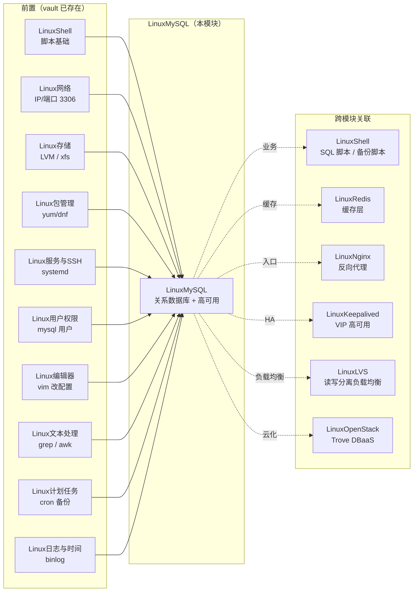
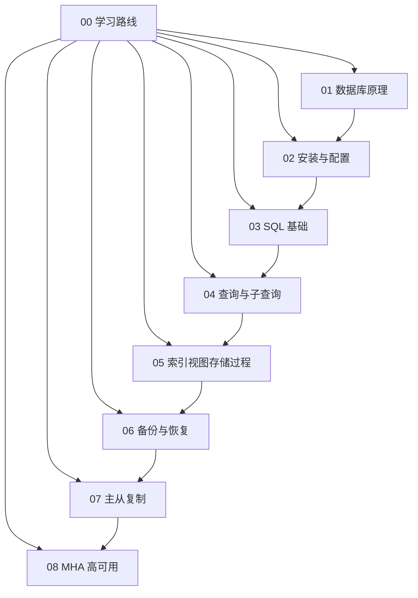

# LinuxMySQL 模块设计

## 1. 一段理由

基于 OpenStack 模块成熟的"主笔记 + 8 分章节 + canvas + 镜像"模板，把 196 页 MySQL 教材系统性整理为 vault 第 33 个模块。**理论 → 安装 → SQL → 备份 → 复制 → HA** 6 步走，覆盖运维/DBA 全链路，对齐 vault 已有 32 个模块风格。

## 2. 模块依赖图



## 3. 笔记内部依赖（8 章）



## 4. 文件结构

```
E:\Linux\LinuxMySQL\
├── LinuxMySQL.md                      # 主笔记（≥800 行）
├── LinuxMySQL.canvas                  # 模块 canvas
├── .dev/                              # dev-pipeline 制品
│   ├── spec.md
│   ├── design.md（本文件）
│   ├── STATUS.md
│   ├── decision-log.md
│   ├── pdf-text/                      # PDF 文本提取（参考用）
│   └── gate-report-*.md
├── 00-MySQL学习路线.md
├── 01-数据库原理与MySQL概述.md
├── 02-MySQL安装与配置.md
├── 03-SQL语言基础与数据类型.md
├── 04-数据查询与子查询.md
├── 05-索引视图存储过程触发器.md
├── 06-备份与恢复.md
├── 07-主从复制与读写分离.md
└── 08-MHA高可用集群.md
```

## 5. 视觉规范

参考 vault OpenStack/Redis 模块风格：

- **mermaid 图**：架构图（部署拓扑）/ 流程图（查询流程）/ 序列图（复制流程）/ 类图（索引结构）
- **表格**：对比表 / 速查表 / 故障 Runbook 表
- **代码块**：SQL / bash / my.cnf 配置 / Python
- **callout**：`> [!info]` 提示、`> [!warning]` 警告、`> [!example]` 示例
- **链接**：内部 `[[#section-id]]`，跨模块 `[[LinuxShell]]` `[[LinuxOpenStack]]`

---

最后更新: 2026-08-11