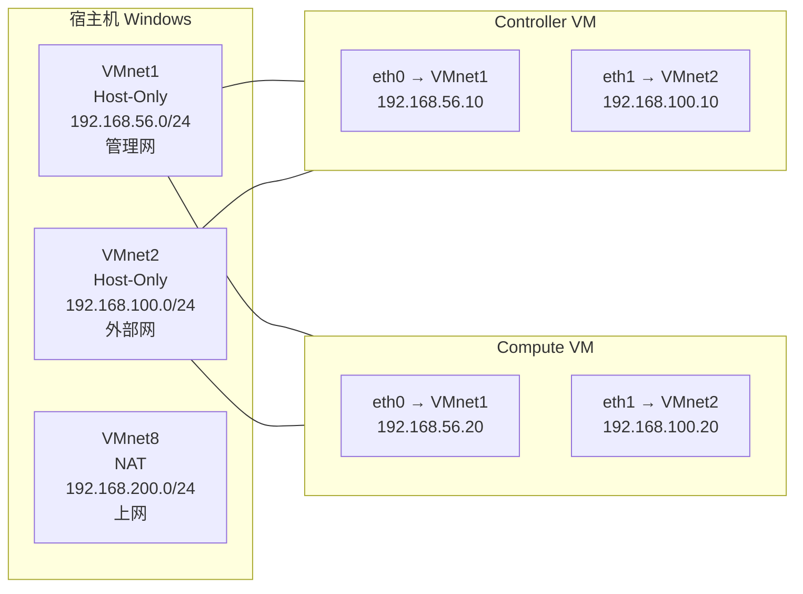

# OpenStack 学习路线与课堂知识地图

> **目标**：先把课堂学过的 OpenStack 知识完整过一遍，再进入架构理解、部署实战、故障排查、业务案例（电商云平台）的深化路线。
>
> **学习方式**：不把 OpenStack 当成零基础课程，而是用"心智模型 → 最小实验 → 画关系 → 制造故障 → 用命令解释现象"的循环，对应到 7 个分章节。

## 目录

- [[#§0 总体心智模型：OpenStack 是模块化 IaaS 控制平面]]
- [[#§1 课堂资料覆盖范围]]
- [[#§2 方案 A 快速复习顺序]]
- [[#§3 复习时每个主题都要回答的 7 个问题]]
- [[#§4 实验环境策略：16GB 主机 + VMware 三网段]]
- [[#§5 第一轮复习验收标准]]
- [[#§6 后续深化路线（架构 → 部署 → 故障 → 业务）]]
- [[#§7 课堂资料 → 章节映射]]

---

## §0 总体心智模型：OpenStack 是模块化 IaaS 控制平面

OpenStack 不是一个软件，而是**一组松耦合的微服务**，每个微服务负责 IaaS 的一类资源。这组服务通过 **REST API + Keystone 令牌 + 消息总线** 互相协作。理解 OpenStack 的第一步是放弃"OpenStack 是一个软件"的直觉。

```text
用户提交期望（创建 VM / 创建卷 / 分配网络）
        ↓
Horizon / CLI / API 把请求发给对应服务
        ↓
Keystone 校验 Token + 权限（认证 + 鉴权）
        ↓
服务内部把任务拆解成多步，调度到计算节点执行
        ↓
Nova 调度 → 选定 compute 节点 → 调用 libvirt → 启动 VM
Neutron 在 compute + network 节点上配置 OVS/OVN
Cinder 在 volume 节点上创建 LVM 卷并挂载
Glance 提供镜像（从本地 / Swift / Ceph）
        ↓
状态回报 → 资源进入 ACTIVE 状态
        ↓
用户通过 Horizon 看到资源
```

把这个模型套到每个服务上：

| 服务 | 解决的资源类型 | 调度目标 | 状态回报路径 |
|------|----------------|----------|--------------|
| **Keystone** | 用户/项目/角色/Token | 全局（不调度） | 数据库 |
| **Nova** | 虚拟机（CPU/内存/磁盘配额） | compute 节点 | nova-compute → DB |
| **Neutron** | 网络/子网/路由/端口/安全组 | network 节点 + compute 节点 | OVS/OVN → DB |
| **Glance** | 镜像（系统盘模板） | 任意 glance-api 节点 | swift/本地/Ceph |
| **Cinder** | 块存储卷（独立于 VM 的持久卷） | cinder-volume 节点 | LVM / Ceph / 第三方 |
| **Swift** | 对象存储（大文件/备份） | 任意 proxy + account/container/object 节点 | ring 一致性哈希 |
| **Horizon** | Web 控制台 | dashboard 节点 | Django + DB |
| **Heat** | 编排（多资源栈） | 任意 heat-engine 节点 | DB |

**核心要点**：

1. **松耦合**：每个服务可独立部署/扩展；坏掉一个不影响其他（除了依赖它的）
2. **共享数据库**：大部分服务有自己的 DB，但通过 service catalog 互相发现
3. **消息总线**：Nova 用 RabbitMQ 在 scheduler/conductor/compute 间传消息
4. **Token 一致**：所有服务都接受 Keystone 的 Token，没有第二套身份系统

---

## §1 课堂资料覆盖范围

### 1.1 理论素材：《OpenStack管理》PDF（160 页）

来源：`E:\QQ下载\OpenStack管理.pdf`

**已读章节**（PDF TOC）：

| 章节 | 页码 | 笔记对应 |
|------|------|----------|
| OpenStack 概述 | p1~p10 | [[01-OpenStack核心概念#§1 OpenStack 是什么]] |
| OpenStack 认证服务 Keystone | p1~p29 | [[03-OpenStack认证与多租户]]（吸收原稿 685 行） |
| OpenStack 镜像服务 Glance | p29~p49 | [[04-OpenStack存储与镜像#§1 Glance 架构]] |
| OpenStack 计算服务 Nova | p49~p80 | [[01-OpenStack核心概念#§3 Nova 架构]] |
| OpenStack 网络服务 Neutron（待读） | ~p80~p130 | [[02-OpenStack网络]] |
| OpenStack 块存储 Cinder（待读） | ~p130~p150 | [[04-OpenStack存储与镜像#§2 Cinder]] |
| OpenStack 对象存储 Swift（待读） | ~p150~p155 | [[04-OpenStack存储与镜像#§3 Swift]] |
| OpenStack 编排 Heat / Horizon（待读） | ~p155~p160 | [[01-OpenStack核心概念#§5 Horizon]] |

### 1.2 实验素材：《OpenStack实验指导手册new》PDF（225 页）

来源：`E:\QQ下载\OpenStack实验指导手册new.pdf`

**未读章节**（PDF 无书签，需 Stage 6 Code 时再抽取）：

- 实验环境准备（VMware / CentOS / 网络）
- 实验 1：Keystone 用户/项目管理
- 实验 2：Glance 镜像上传/管理
- 实验 3：Nova 虚拟机创建/迁移
- 实验 4：Neutron 网络/路由/安全组
- 实验 5：Cinder 卷管理
- 实验 6：综合案例（WordPress / 多 VM 网络）
- 故障排查实验

### 1.3 安装素材：《CentOS-Stream-8-packstack》PDF（16 页 + 937 行 md）

来源：`E:\QQ下载\CentOS-Stream-8-packstack安装OpenStack-Victoria.pdf` + 两个 md 文件

- packstack 快速部署（all-in-one / 3 节点）
- 对应 [[05-OpenStack安装配置手册#§1 packstack 快速部署]]

### 1.4 部署项目素材：`E:\openstack-deploy\` + `E:\openstack-deploy-dual\`

- kolla-ansible 双节点部署（Antelope）
- kolla-ansible 三控制节点 HA 部署（Bobcat 2023.2）
- README + DEPLOYMENT-SUMMARY + NETWORK-ARCHITECTURE + KEY-CODE-EXAMPLES 共 ~2700 行 md
- 对应 [[05-OpenStack安装配置手册#§2 kolla-ansible 生产级]]

### 1.5 业务案例素材：毕业论文《基于 OpenStack 的电商云平台》

来源：`E:\QQ下载\基于OpenStack的电商云平台的设计与实现-格式转换.pdf` (58 页) + `E:\openstack-deploy\thesis\` (6 章)

- thesis chapter1 绪论 / chapter2 理论基础 / chapter3 需求分析与设计 / chapter4 系统实现 / chapter5 测试验证 / chapter6 总结
- 对应 [[04-OpenStack存储与镜像#§5 业务案例：电商云平台（ECShop）]]

---

## §2 方案 A 快速复习顺序

按"先骨架后血肉"原则，2-3 天可以过一遍：

| 天 | 时段 | 章节 | 目标 |
|----|------|------|------|
| D1 上午 | 90 min | [[01-OpenStack核心概念]] | 理解 7 个核心服务的关系 |
| D1 下午 | 90 min | [[02-OpenStack网络]] | 看懂 Neutron/ML2/OVS 三层架构 |
| D2 上午 | 60 min | [[03-OpenStack认证与多租户]] | 吸收 Keystone 685 行笔记 |
| D2 下午 | 90 min | [[04-OpenStack存储与镜像]] | Cinder/Swift/Glance 三件套 |
| D3 上午 | 90 min | [[05-OpenStack安装配置手册]] | packstack + kolla-ansible 双路径 |
| D3 下午 | 90 min | [[06-OpenStack故障排查与运维]] | 7 类故障分类定位 |

**方案 A 的目标**：能口头描述 OpenStack 7 大服务的边界 + 互相调用关系 + 一次完整 VM 创建流程。

---

## §3 复习时每个主题都要回答的 7 个问题

每个核心服务复习时，问自己：

1. **它是什么资源类型的控制平面**？（如 Nova = 虚拟机）
2. **它接收谁的请求**？（用户 / 其他服务 / 调度器）
3. **它通过什么协议交互**？（REST API + AMQP + DB）
4. **它把状态存在哪里**？（MySQL / etcd / 自有 DB）
5. **它的瓶颈在哪里**？（API 节点 / scheduler / 存储后端）
6. **它挂了影响谁**？（依赖它的服务 + 用户）
7. **它的生产部署怎么排**？（多节点 / HA / 容器化）

例：Nova 的回答模板

1. 虚拟机的控制平面
2. 接收 Horizon / CLI / Heat 的请求
3. nova-api REST → nova-scheduler → nova-compute (AMQP)
4. nova DB（通常 MySQL）
5. scheduler 是单点瓶颈；需要 filter_weigher 调优
6. Nova 挂了 → VM 不能创建/迁移/删除；但已运行的 VM 不受影响
7. 控制节点多实例 + compute 无状态；HA 用 Pacemaker + 负载均衡

---

## §4 实验环境策略：16GB 主机 + VMware 三网段

### 4.1 硬件基线

- **宿主机**: Windows 11 + VMware Workstation 17.6.3 + 16GB RAM
- **VM 数量**: 控制节点 1-3 个 + 计算节点 1 个
- **内存分配**:
  - 单节点实验：6GB（够 Glance/Nova/Neutron/Cinder/Keystone 全跑）
  - 双节点：4GB + 2.5GB
  - HA 三节点：3 个 4GB + 1 个 2.5GB

### 4.2 网络三段（关键）



**三网段职责**：

| 网段 | 角色 | 不能少的原因 |
|------|------|--------------|
| **VMnet1** (192.168.56.0/24) | **管理网** | OpenStack 内部 API + DB + AMQP 通信 |
| **VMnet2** (192.168.100.0/24) | **外部网** | Neutron br-ex 浮动 IP 出口；OVS 接管后 ens256 不能有 IP |
| **VMnet8** (192.168.200.0/24) | **上网** | 拉镜像 / 下载 ansible collections / 同步 ACR |

### 4.3 已有 VM 模板

- `E:\op-controller\openstack-controller.vmx`：单控制节点模板（已部署 Bobcat 2023.2）
- `E:\op-compute\openstack-compute.vmx`：计算节点模板
- `E:\vmx\openstack.ovf`：通用 OVA 模板

### 4.4 网络核心约束（最常踩的坑）

**ens256 一旦被 OVS 接管，IP 必须迁到 br-ex**：

```bash
# 关键代码（详见 [[06-OpenStack故障排查与运维#§2 网络故障]]）
ip addr show ens256   # 此时应该没有 IP
ip addr show br-ex    # IP 已迁过来（192.168.100.10）
```

**原因**：如果 ens256 保留 IP，内核路由会绕过 OVN，浮动 IP 不通。

---

## §5 第一轮复习验收标准

能**口头 + 画图 + 命令**回答：

- [ ] AC-L1: 画出 OpenStack 7 大服务的关系图（含 API/AMQP/DB 三种连线）
- [ ] AC-L2: 完整描述"用户从 Horizon 点'创建 VM'到 VM 进入 ACTIVE"的 12 个步骤
- [ ] AC-L3: Keystone Token 的生命周期（issue/validate/revoke/expire）
- [ ] AC-L4: Neutron 三层架构（ML2 plugin + OVS agent + OVN chassis）
- [ ] AC-L5: Cinder 多后端（LVM / Ceph / 第三方）的差异
- [ ] AC-L6: 一次故障排查演练（人为制造 1 个故障 → 用命令定位 → 修复）
- [ ] AC-L7: packstack 与 kolla-ansible 的部署差异（all-in-one vs 容器化多节点）

---

## §6 后续深化路线（架构 → 部署 → 故障 → 业务）

第一轮复习完成后，按兴趣选方向深化：

| 方向 | 切入点 | 终点 |
|------|--------|------|
| **架构** | Nova cell 架构 / Neutron DVR / Cinder HA | [[01-OpenStack核心概念]] + [[02-OpenStack网络]] 进阶节 |
| **部署** | kolla-ansible 自定义 / 离线部署 / 多 region | [[05-OpenStack安装配置手册]] 进阶节 |
| **故障** | 生产级 Runbook / 日志聚合 / 监控告警 | [[06-OpenStack故障排查与运维]] 完整版 |
| **业务** | 电商云平台 / 多租户计费 / 混合云 | [[04-OpenStack存储与镜像#§5 业务案例：电商云平台（ECShop）]] |

**面试向**：架构 + 故障两条线。

---

## §7 课堂资料映射

| 资料 | 路径 | 对应章节 | 状态 |
|------|------|----------|------|
| 《OpenStack管理》PDF | `E:\QQ下载\OpenStack管理.pdf` | [[01]] [[02]] [[03]] [[04]] | 部分已读 |
| 《OpenStack实验指导手册new》PDF | `E:\QQ下载\OpenStack实验指导手册new.pdf` | [[06]] 排错参考 | 待抽取 |
| packstack-Victoria PDF | `E:\QQ下载\CentOS-Stream-8-packstack安装OpenStack-Victoria.pdf` | [[05]] §1 packstack 段 | 已读目录 |
| packstack-Victoria md (488 行) | `E:\QQ下载\CentOS-Stream-8-packstack安装OpenStack-Victoria.md` | [[05]] §1 实战命令 | 直接吸收 |
| packstack-Victoria 3 节点 md (449 行) | `E:\QQ下载\CentOS-Stream-8-packstack安装OpenStack-Victoria - 3节点.md` | [[05]] §1 3 节点差异 | 直接吸收 |
| 毕业论文 PDF (58 页) | `E:\QQ下载\基于OpenStack的电商云平台的设计与实现-格式转换.pdf` | [[04]] §5 业务案例 | 已读目录 |
| 毕业论文 thesis 6 章 | `E:\openstack-deploy\thesis\` | [[04]] §5 | 已就位 |
| openstack-deploy README (969 行) | `E:\openstack-deploy\README.md` | [[05]] §2 双节点 | 直接吸收 |
| openstack-deploy DEPLOYMENT-SUMMARY (342 行) | `E:\openstack-deploy\DEPLOYMENT-SUMMARY.md` | [[05]] §2 5 阶段 | 直接吸收 |
| openstack-deploy-dual README (566 行) | `E:\openstack-deploy-dual\README.md` | [[05]] §2 HA 三节点 | 直接吸收 |
| openstack-deploy-dual NETWORK-ARCHITECTURE (355 行) | `E:\openstack-deploy-dual\NETWORK-ARCHITECTURE.md` | [[02]] 核心 | 直接吸收 |
| openstack-deploy-dual KEY-CODE-EXAMPLES (419 行) | `E:\openstack-deploy-dual\KEY-CODE-EXAMPLES.md` | [[06]] 调试命令 | 直接吸收 |
| Keystone 学习笔记 (685 行) | `E:\云计算学习\云计算学习\笔记\OpenStack认证管理-Keystone学习笔记.md` | [[03]] 核心 | 直接吸收 |

**素材总量盘点**：~4200 行 md + 459 页 PDF + 70K kolla-ansible 脚本，足够支撑 7 个分章节的 ≥800 行指标。

---

## 跨模块链接（指向已有 vault 模块）

- [[Linux网络]] — Neutron/OVS 的网络基础
- [[Linux存储]] — Cinder LVM 后端的基础
- [[LinuxKVM]] — Nova 底层调用 libvirt/QEMU/KVM
- [[Linux服务与SSH]] — systemd + SSH 免密是部署前置
- [[LinuxShell]] — 部署脚本基于 bash + ansible
- [[Linux用户权限]] — Keystone RBAC 的概念对应
- [[kubernetes]] — kolla-ansible 容器化部署的对照
- [[Linux总览.canvas|OpenStack 在 vault 总览图中的位置]] — 接入 [[Linux总览.canvas]]

---

## 与 K8s 学习路线的对比

| 维度 | K8s | OpenStack |
|------|-----|-----------|
| 控制平面 | API Server + Scheduler + Controller Manager | 多个独立服务（Nova/Neutron/Cinder...） |
| 节点角色 | master + worker | controller + compute + network + storage |
| 调度对象 | Pod | VM（虚拟化）/ Volume / Network |
| 网络模型 | CNI 插件 | Neutron + ML2 + OVS/OVN |
| 存储模型 | CSI 插件 | Cinder 多后端 |
| 部署工具 | kubeadm / kubespray | packstack / kolla-ansible / devstack |
| 业务定位 | 容器编排（应用层） | IaaS（基础设施层） |
| 学习曲线 | 6 个月 | 12+ 个月 |

**结论**：K8s 在 OpenStack 之上，两者互补而非替代。

---

## §8 复习题库（30 题速记）

### 第一组：核心概念（10 题）

1. OpenStack 是单一软件还是一组服务？答：一组松耦合的微服务
2. 所有服务都依赖哪个基础服务？答：Keystone
3. Nova 调度的资源类型是什么？答：虚拟机（VM）
4. Cinder 调度的资源类型是什么？答：块存储卷
5. Neutron 调度的资源类型是什么？答：网络/子网/路由/端口
6. Glance 调度的资源类型是什么？答：镜像
7. Swift 调度的资源类型是什么？答：对象
8. Horizon 是控制平面还是数据平面？答：纯控制平面（Web UI）
9. Heat 的作用是什么？答：编排（多资源栈）
10. Cell 架构是为了解决什么问题？答：Nova DB 单点瓶颈

### 第二组：认证与多租户（5 题）

11. Keystone 三大概念是什么？答：User / Project / Role
12. Domain 是什么？答：一组 User/Group/Project 的容器
13. Token 的生命周期？答：issue / validate / expire / revoke
14. RBAC 三要素？答：Who（User/Group）→ What（Role）→ On which（Domain/Project）
15. 为什么 Keystone 不能挂？答：所有 API 都要验 Token

### 第三组：网络（5 题）

16. ML2 的两层分别指什么？答：Type driver + Mechanism driver
17. OVS agent 与 OVN chassis 的区别？答：OVS agent 直连 ML2；OVN 用集中控制面
18. br-ex 的作用？答：连接物理 NIC 与 OVS 桥，让浮动 IP 出口
19. Provider Network 与 Tenant Network 的区别？答：管理员创建 vs 租户自建
20. DVR 的目的？答：让 compute 节点直接处理 L3 转发，减少网络节点瓶颈

### 第四组：存储（5 题）

21. Cinder volume 的存储后端有哪些？答：LVM / Ceph RBD / NFS / 第三方（NetApp/华为）
22. Glance 后端可以是什么？答：本地文件系统 / Swift / Ceph RBD / HTTP
23. Swift 的"ring"是什么？答：一致性哈希环，决定数据放在哪个节点
24. LVM 后端的局限？答：单节点；不支持多后端热迁移
25. 多后端的 cinder.conf 怎么写？答：定义多个 volume_backend_name，用 volume_type 关联

### 第五组：部署（5 题）

26. packstack 适合什么场景？答：单节点 / 3 节点快速实验
27. kolla-ansible 用什么部署 OpenStack？答：Docker 容器化
28. kolla-ansible 双节点最关键的 IP 是什么？答：管理网 192.168.56.10/20 + 外部网 192.168.100.10/20
29. HA 三控制节点用哪个 VIP 软件？答：keepalived + haproxy
30. 为什么 kolla-ansible 部署前要拉镜像？答：避免运行时拉取失败（国内网络抖动）

---

## §9 速查表

### 9.1 命令速查

| 操作 | 命令 | 出处 |
|------|------|------|
| 看 token | `openstack token issue` | [[03]] §4 |
| 列镜像 | `openstack image list` | [[04]] §1 |
| 列卷 | `openstack volume list` | [[04]] §2 |
| 列网络 | `openstack network list` | [[02]] §3 |
| 看 Nova 调度 | `openstack server show <id>` | [[01]] §3 |
| 看 neutron agent | `openstack network agent list` | [[02]] §6 |
| 重启 cinder-volume | `docker restart cinder_volume` | [[05]] §2 |
| 看 kolla 容器 | `docker ps --format 'table {{.Names}}\t{{.Status}}'` | [[05]] §2 |

### 9.2 配置文件速查

| 服务 | 主配置 | 关键字段 |
|------|--------|----------|
| Nova | `/etc/nova/nova.conf` | `[DEFAULT] transport_url` `[scheduler] filter_weigher` |
| Neutron | `/etc/neutron/neutron.conf` + plugins/ml2/ml2_conf.ini | `[ml2] type_drivers` `[ml2_type_vxlan] vni_ranges` |
| Cinder | `/etc/cinder/cinder.conf` | `[DEFAULT] enabled_backends` `[lvm] volume_driver` |
| Keystone | `/etc/keystone/keystone.conf` | `[database] connection` `[token] provider` |
| Glance | `/etc/glance/glance-api.conf` | `[glance_store] stores` `default_backend` |

### 9.3 端口速查

| 服务 | 端口 | 协议 |
|------|------|------|
| Keystone | 5000 / 35357 | HTTP（public / admin） |
| Nova API | 8774 | HTTP |
| Neutron API | 9696 | HTTP |
| Glance API | 9292 | HTTP |
| Cinder API | 8776 | HTTP |
| Swift Proxy | 8080 | HTTP |
| Horizon | 80 / 443 | HTTP / HTTPS |
| AMQP | 5672 | TCP（RabbitMQ） |

### 9.4 路径速查

| 路径 | 用途 |
|------|------|
| `/var/log/nova/*.log` | Nova 控制平面日志 |
| `/var/log/neutron/*.log` | Neutron 日志 |
| `/var/log/cinder/*.log` | Cinder 日志 |
| `/var/lib/nova/instances/` | Nova 虚拟机磁盘目录 |
| `/var/lib/glance/images/` | Glance 上传镜像存放目录 |
| `/etc/kolla/` | kolla-ansible 配置目录 |
| `/etc/kolla/passwords.yml` | 自动生成的密码文件（keystone_admin_password 在这） |
| `/var/log/kolla/` | kolla 容器日志 |

---

## §10 复习 Checklist（可勾选）

### 10.1 概念层
- [ ] 画出 OpenStack 7 大服务的关系图
- [ ] 解释 Keystone Token 生命周期
- [ ] 描述 Nova 一次调度到 compute 的完整流程
- [ ] 描述 Neutron 三层架构（ML2 + OVS + OVN）
- [ ] 区分 Cinder volume / Swift object / Glance image 三种存储

### 10.2 部署层
- [ ] packstack 部署一个 all-in-one 环境
- [ ] kolla-ansible 部署一个双节点环境
- [ ] kolla-ansible 部署一个 HA 三控制节点环境
- [ ] 镜像同步到阿里云 ACR（解决国内拉镜像问题）
- [ ] 验证 VIP 切换（拔 controller1 网线看 controller2/3 是否接管）

### 10.3 故障层
- [ ] 制造 1 个 VM 创建失败故障并定位（nova scheduler log）
- [ ] 制造 1 个网络不通故障并定位（neutron agent + OVN chassis）
- [ ] 制造 1 个卷挂载失败故障并定位（cinder-volume log + iSCSI）
- [ ] 制造 1 个镜像上传失败故障并定位（glance store 配置）
- [ ] 模拟 controller 宕机并观察 HA 切换

### 10.4 业务层
- [ ] 在 OpenStack 上部署一个 3 VM 的电商应用（ECShop）
- [ ] 写一个 Heat 模板创建多 VM 栈
- [ ] 写一个 Cinder 多后端配置（LVM + NFS）
- [ ] 设计一个跨可用区的多 region 架构

---

最后更新: 2026-08-10 22:25（T2 Stage 6 Code 完成，补 §8~§10）