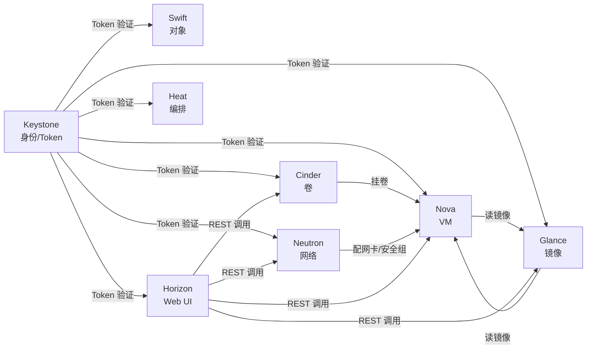
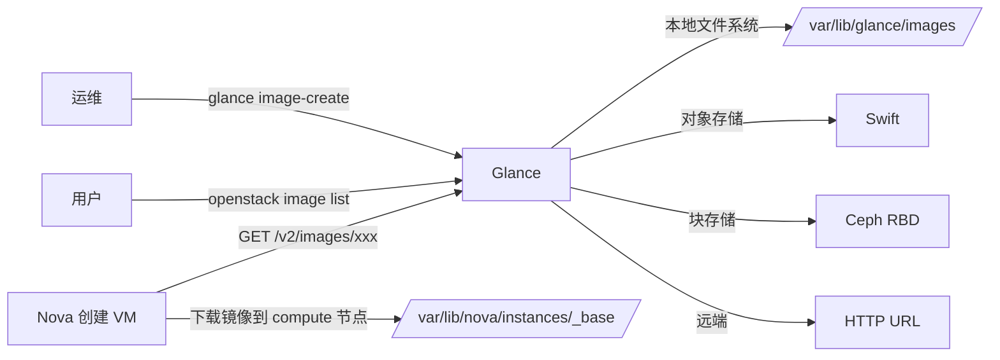
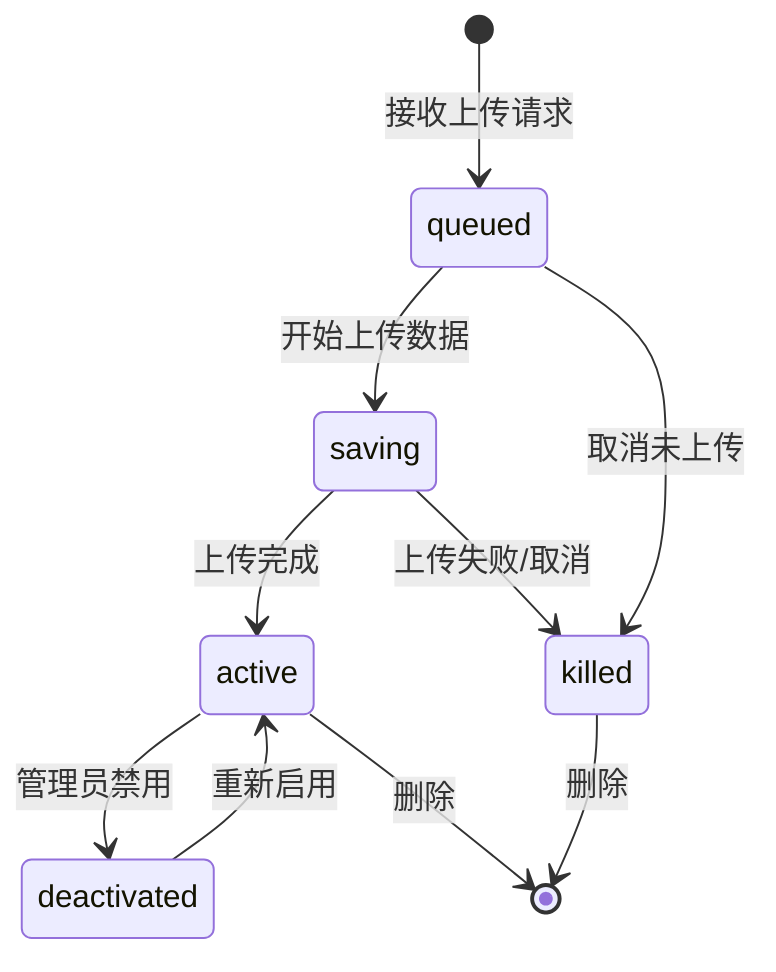
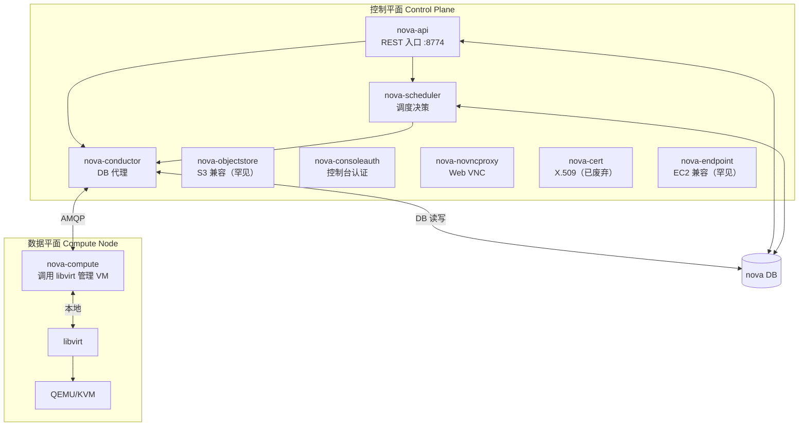
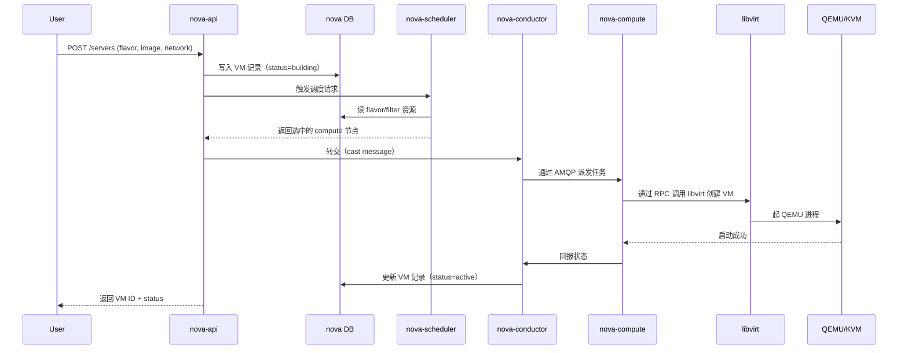
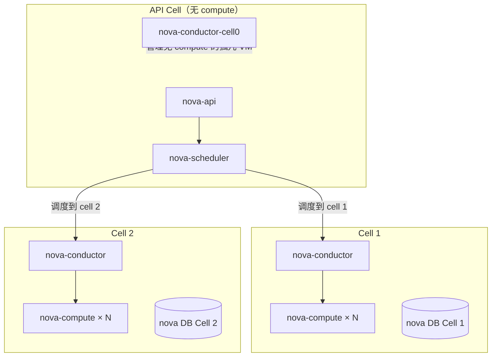
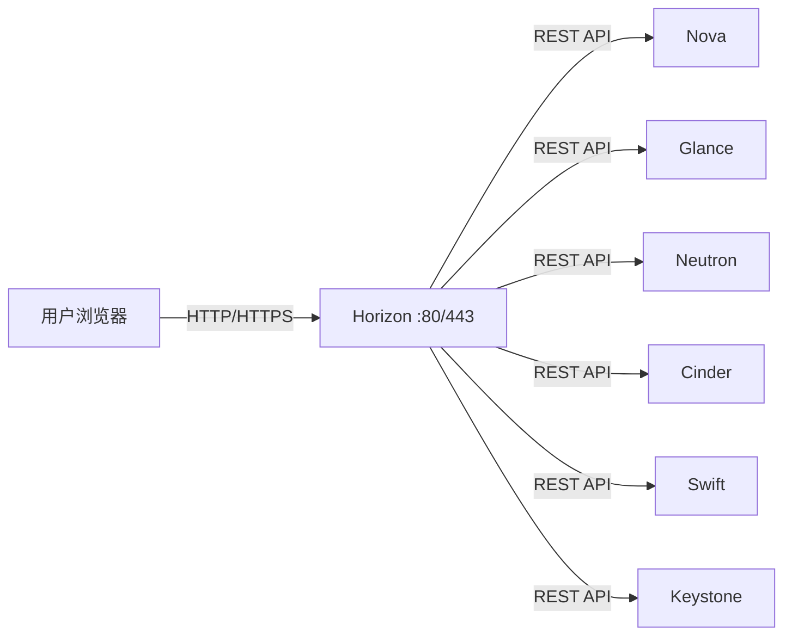
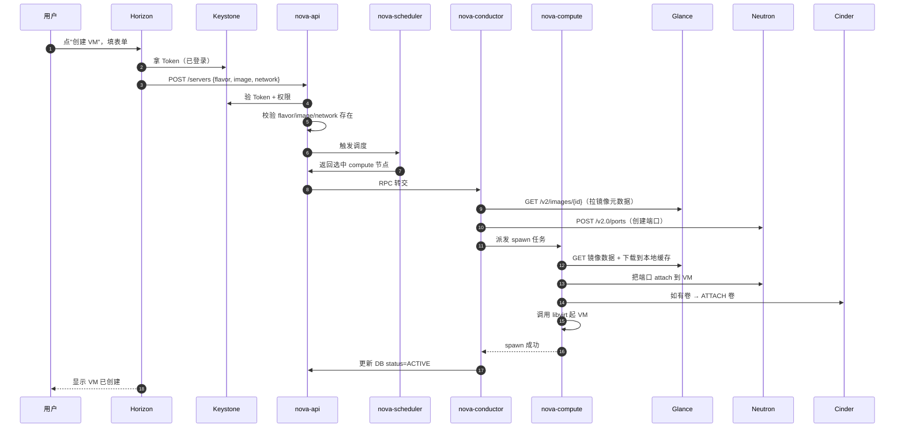
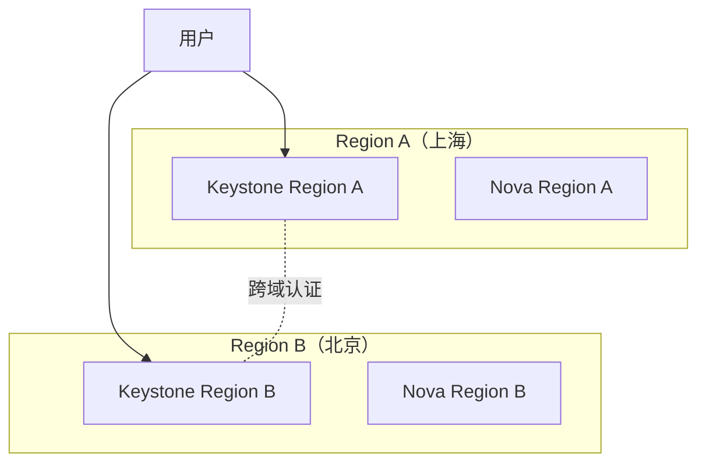
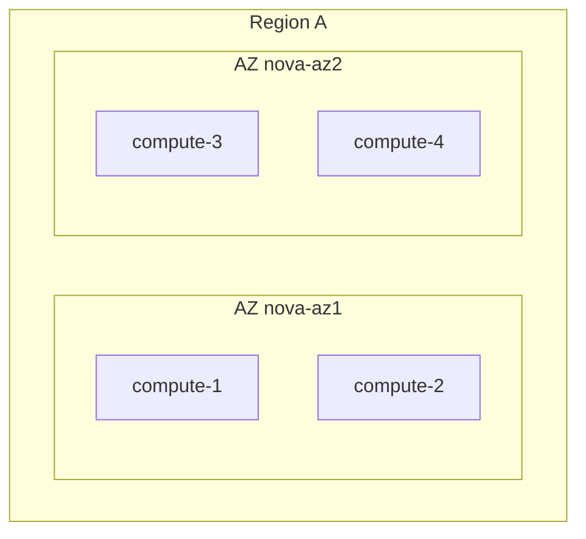

# OpenStack 核心概念：Nova / Glance / Horizon

> **一句话心智模型**：OpenStack 的"控制平面"是 7 个独立微服务，每个服务管一类资源；Nova 管虚拟机、Glance 管镜像、Neutron 管网络、Cinder 管卷、Keystone 管身份、Swift 管对象、Horizon 管 Web 控制台。它们通过 REST API + Keystone Token + 消息总线协作。
>
> **本章范围**：Nova / Glance / Horizon 三大服务 + Cell 架构 + 调度器 + 7 服务全协作流。其他服务（Neutron/Cinder/Swift/Keystone）分别在 [[02]] [[03]] [[04]] 章。

## 目录

- [[#§0 心智模型：7 大服务各自管一类资源]]
- [[#§1 OpenStack 是什么：从云计算三层架构说起]]
- [[#§2 Glance：镜像服务]]
- [[#§3 Glance 架构与组件]]
- [[#§4 Glance 镜像格式与状态机]]
- [[#§5 Glance 后端存储]]
- [[#§6 Nova：计算服务]]
- [[#§7 Nova 系统架构]]
- [[#§8 Nova 组件详解]]
- [[#§9 Nova Cell 架构：解决 DB 瓶颈]]
- [[#§10 Nova Scheduler 调度器：Filter + Weigher]]
- [[#§11 Horizon：Web 控制台]]
- [[#§12 7 大服务完整协作流：从用户点"创建 VM"到 ACTIVE]]
- [[#§13 命令速查]]
- [[#§14 故障排查入口]]
- [[#§15 与已有 vault 模块的链接]]

---

## §0 心智模型：7 大服务各自管一类资源

OpenStack 的"控制平面"由 7 个独立微服务组成，每个服务**只管一类资源**。理解 OpenStack 的第一步是记住这张表：



**核心要点**：

1. **每个服务只管一类资源**：Nova 不能管网络（那是 Neutron），也不能管卷（那是 Cinder）
2. **所有服务都接受 Keystone Token**：没有第二套身份系统
3. **服务间通过 REST API 协作**：Nova 创建 VM 时调用 Glance API 读镜像，调用 Neutron API 配网络
4. **服务有自己的 DB**：但通过 service catalog（也在 Keystone）互相发现

---

## §1 OpenStack 是什么：从云计算三层架构说起

### 1.1 云计算三层架构

| 层级 | 职责 | 代表产品 |
|------|------|----------|
| **IaaS**（基础设施即服务） | 提供虚拟化的 CPU/内存/磁盘/网络 | OpenStack / VMware vSphere / CloudStack |
| **PaaS**（平台即服务） | 在 IaaS 之上提供运行时/中间件 | Kubernetes / Cloud Foundry |
| **SaaS**（软件即服务） | 提供完整应用 | Office 365 / Gmail |

OpenStack 是 IaaS 层。它的下游典型是 Kubernetes（容器编排）；它的下游也可以是裸虚机（直接跑业务）。

### 1.2 OpenStack 的诞生与现状

- 2010 年 NASA + Rackspace 发起
- 至今 ~15 年历史，每年 2 个大版本（命名按字母表：Austin → Bobcat 2023.2 → Caracal 2024.1 → Dalmatian 2024.2）
- 已成为私有云事实标准（vs 公有云 AWS/Azure/GCP 用自有 IaaS）
- 与 Kubernetes 的关系：**互补**，K8s 跑在 OpenStack VM 上

### 1.3 OpenStack 的"组件化"哲学

OpenStack 不强制"全栈部署"。常见部署子集：

| 部署类型 | 包含的服务 | 用途 |
|----------|------------|------|
| **最小实验** | Nova + Glance + Keystone + Neutron | 能创建 VM 跑业务 |
| **含 Cinder** | + Cinder | 需要持久卷（数据库盘） |
| **含 Horizon** | + Horizon | 给非运维人员用 |
| **含 Swift** | + Swift | 需要对象存储（备份/镜像仓） |
| **生产全栈** | + Swift + Heat + Ceilometer | 完整云平台 |
| **超大规模** | + Cell + 多 region + Octavia（LB） | 公有云规模 |

**记住**：少一个服务，OpenStack 仍然能跑（只是缺一类功能）。

---

## §2 Glance：镜像服务

### 2.1 Glance 是什么

**Glance = OpenStack 的镜像服务**。它管的是"系统盘模板"——VM 创建时从哪里启动，模板就在 Glance 里。

### 2.2 Glance 管的资源

| 资源 | 说明 |
|------|------|
| **image** | 镜像元数据（id/name/status/size/container_format/disk_format） |
| **image location** | 镜像实际数据存哪里（本地文件/Swift/Ceph/HTTP） |
| **visibility** | public / private / shared / community |

镜像数据本身**不一定存在 Glance 节点本地**——它可以被存到 Swift（OpenStack 自带对象存储）或 Ceph（共享存储）或 HTTP（远端下载）。

### 2.3 Glance 与其他服务的关系



**关键点**：Nova 创建 VM 时从 Glance 拉镜像到 **compute 节点的本地缓存**，VM 真正运行时不再依赖 Glance。

---

## §3 Glance 架构与组件

### 3.1 Glance 服务进程

| 进程 | 职责 | 默认端口 |
|------|------|----------|
| **glance-api** | 接收 REST 请求（HTTP 9292） | 9292 |
| **glance-registry** | 管理 image 元数据（DB 读写） | 无独立端口（库调用） |
| **glance-store** | 后端存储抽象层（不知道数据具体放哪） | — |

**注意**：Glance v2 之后，glance-registry 已被合并进 glance-api 的元数据层。生产中通常只看到 glance-api 进程。

### 3.2 Glance 配置文件结构

```ini
# /etc/glance/glance-api.conf
[DEFAULT]
enabled_backends = fs:file,swift:swift,rbd:rbd

[glance_store]
# 默认后端
default_backend = fs

[fs]
# 本地文件系统后端
filesystem_store_datadir = /var/lib/glance/images/

[swift]
# Swift 后端
swift_store_auth_address = http://keystone:5000/v3
swift_store_user = service:glance
swift_store_key = <password>
swift_store_container = glance

[rbd]
# Ceph RBD 后端
rbd_store_pool = images
rbd_store_user = glance
rbd_store_chunk_size = 8
```

**多后端配置**：可以同时启用多个 backend，上传时用 `--store` 指定：

```bash
glance image-create --name centos8 --file centos8.qcow2 \
  --disk-format qcow2 --container-format bare --store fs
glance image-create --name ubuntu --file ubuntu.raw \
  --disk-format raw --container-format bare --store swift
```

### 3.3 Glance 数据库

Glance 用独立 DB（生产中通常是 MySQL）。表结构：

| 表 | 作用 |
|----|------|
| `images` | 镜像元数据 |
| `image_locations` | 镜像位置（多后端时一条记录一个位置） |
| `image_members` | 镜像共享（private image 分享给其他 project） |
| `image_tags` | 镜像标签 |
| `tasks` | 异步任务（导入/导出） |

**关键**：元数据 vs 数据分离。DB 只存元数据；实际文件在 backend。

---

## §4 Glance 镜像格式与状态机

### 4.1 镜像格式

| 类型 | 格式 | 说明 |
|------|------|------|
| **disk_format** | `qcow2` | QEMU 镜像格式（推荐） |
| | `raw` | 裸格式（无压缩） |
| | `vhd` | Hyper-V 用 |
| | `vmdk` | VMware 用 |
| | `vdi` | VirtualBox 用 |
| | `iso` | 光盘镜像 |
| | `aki/ari/ami` | Amazon 镜像（AWS 兼容） |
| **container_format** | `bare` | 无容器（qcow2/raw/vhd 等都用这个） |
| | `ovf` | OVF 打包格式 |
| | `docker` | Docker 镜像（Docker driver 用） |
| | `aki/ari/ami` | AWS 风格 |

**新手常见错误**：
- qcow2 镜像配 container_format=ovf → 错！应该 bare
- raw 配 bare → 对
- iso 配 bare → 对（虽然 iso 通常用于引导）

### 4.2 镜像状态机



**状态说明**：

| 状态 | 含义 |
|------|------|
| `queued` | 镜像元数据已注册，但数据未上传 |
| `saving` | 正在上传数据到后端 |
| `active` | 可用（最常见状态） |
| `deactivated` | 管理员禁用，非 active 但元数据还在 |
| `killed` | 上传失败 |
| `pending_delete` | 删除中（Glance v2.7+） |

### 4.3 镜像可见性（visibility）

| 类型 | 说明 |
|------|------|
| `public` | 所有 project 可见 |
| `private` | 仅本 project |
| `shared` | 通过 image_members 共享给指定 project |
| `community` | 社区可见（Glance v2 之后已废弃） |

---

## §5 Glance 后端存储

### 5.1 后端类型对比

| 后端 | 适用场景 | 优 | 劣 |
|------|----------|----|----|
| **本地文件系统** | 单节点 / 测试 | 简单 | 无 HA，节点坏镜像丢 |
| **Swift** | 中大规模 | 原生 OpenStack 对象存储 | 需额外部署 Swift |
| **Ceph RBD** | 大规模 | 共享、高可用 | 需额外部署 Ceph |
| **HTTP** | 跨云 / 远端仓库 | 不消耗本地存储 | 远端故障 = 拉镜像失败 |
| **Cinder** | 罕见场景 | 统一块设备管理 | 性能差，Glance 一般不用 |

**生产推荐**：Ceph RBD（如果已有 Ceph 集群）或 Swift（OpenStack 全栈场景）。

### 5.2 镜像缓存与多后端

```ini
# 启用多后端 + 优先级
[glance_store]
default_backend = rbd
enabled_backends = fs:file,swift:swift,rbd:rbd

# 上传时选后端
glance image-create --name win2022 --file win.qcow2 \
  --disk-format qcow2 --container-format bare --store rbd
```

**实际生产**：通常一个后端就够（多后端主要给迁移场景用）。

### 5.3 镜像导入/导出

```bash
# 导出（备份）
glance image-download <image-id> --file /backup/centos8.qcow2

# 导入（恢复）
glance image-create --name centos8-restore \
  --file /backup/centos8.qcow2 \
  --disk-format qcow2 --container-format bare
```

**大镜像技巧**：用 `qemu-img convert` 转格式比 glance image-create 快。

---

## §6 Nova：计算服务

### 6.1 Nova 是什么

**Nova = OpenStack 的计算服务**。它管的是"虚拟机"——CPU/内存配额、调度、生命周期管理。

Nova 是 OpenStack 最复杂的服务（子组件最多），也是面试最常考的服务。

### 6.2 Nova 管的资源

| 资源 | 说明 |
|------|------|
| **server（VM）** | 虚拟机实例 |
| **flavor** | VM 规格模板（CPU/内存/磁盘/元数据） |
| **image** | VM 启动用的镜像（引用 Glance） |
| **keypair** | SSH 公钥 |
| **security group** | 安全组（VM 网卡防火墙规则） |
| **availability zone** | 可用区 |
| **server group** | VM 分组（亲和/反亲和） |
| **aggregate** | 计算节点分组（按硬件/位置） |
| **cell** | Nova 大规模部署分区 |

---

## §7 Nova 系统架构

### 7.1 Nova 服务进程

Nova 是 OpenStack 中**子组件最多**的服务：



### 7.2 核心组件功能

| 组件 | 职责 | 默认端口 | 是否无状态 |
|------|------|----------|------------|
| **nova-api** | 接收 REST 请求，校验参数，写 DB（少量） | 8774 (HTTP) + 8775 (EC2) | 是（可 HA 负载均衡） |
| **nova-scheduler** | 从 API 接收调度请求，过滤+称重选节点 | 无（库调用） | 是 |
| **nova-conductor** | 替 compute 节点访问 DB（避免 compute 直连 DB） | 无（库调用） | 是 |
| **nova-compute** | 调用 libvirt/QEMU 在本地起 VM | 无（库调用） | 是（无状态） |
| **nova-novncproxy** | Web VNC 代理（浏览器连 VM 控制台） | 6080 | 是 |
| **nova-consoleauth** | VNC Token 验证 | 无 | 是 |

**关键设计**：compute 节点**不直接访问 DB**。所有 DB 读写都通过 conductor 代理。原因：

1. 安全：DB 密码不需要发到每个 compute 节点
2. 兼容：DB schema 变更只需更新 conductor 一次
3. 性能：conductor 可做批量/缓存优化

### 7.3 Nova 消息流（创建 VM）



### 7.4 Nova 内部通信协议

| 协议 | 用在哪 | 默认实现 |
|------|--------|----------|
| **REST** | 用户 → nova-api | HTTP |
| **RPC** | nova-scheduler → nova-compute | oslo.messaging + AMQP（RabbitMQ） |
| **DB 调用** | 各组件 → MySQL | SQLAlchemy |
| **libvirt** | nova-compute → KVM | libvirt API（本地 socket） |

Nova 默认用 RabbitMQ 做消息总线。备选：ZeroMQ（已不推荐）/ Kafka（实验性）。

---

## §8 Nova 组件详解

### 8.1 nova-api

```bash
# 默认端口
nova-api 监听 8774（OpenStack API）
nova-api 监听 8775（EC2 兼容 API）

# 启动
/usr/bin/nova-api --config-file /etc/nova/nova.conf
```

主要职责：
- 接收 REST 请求
- 校验参数（flavor 是否存在、image 是否可见、网络是否可用）
- 写 VM 元数据到 DB（轻量写）
- 把调度请求发给 scheduler

### 8.2 nova-scheduler

调度器是 Nova 的"大脑"。它根据 **filter + weigher** 算法选出最合适的 compute 节点。

```bash
# 启动
/usr/bin/nova-scheduler --config-file /etc/nova/nova.conf

# 配置 filter
[scheduler]
filter_scheduler = nova.scheduler.filter_scheduler.FilterScheduler
scheduler_default_filters = RetryFilter,AvailabilityZoneFilter,RamFilter,DiskFilter,ComputeFilter,ComputeCapabilitiesFilter,ImagePropertiesFilter,ServerGroupAntiAffinityFilter,ServerGroupAffinityFilter

# 配置 weigher
scheduler_weight_classes = nova.scheduler.weights.all_weighers
```

**详见 §10 调度器详解**。

### 8.3 nova-conductor

```bash
# 启动
/usr/bin/nova-conductor --config-file /etc/nova/nova.conf
```

职责：
- 替 compute 节点访问 DB
- 同步实例状态（compute → conductor → DB）
- 同步实例信息（DB → conductor → compute）
- 处理 reschedule（重调度）

**为什么 compute 不能直连 DB？**

```ini
# nova.conf 中 compute 节点不允许访问 DB
[conductor]
# compute 节点访问 DB 被禁用
use_local = false
```

### 8.4 nova-compute

```bash
# 启动
/usr/bin/nova-compute --config-file /etc/nova/nova.conf

# 默认驱动
[DEFAULT]
compute_driver = libvirt.LibvirtDriver
```

职责：
- 接收 conductor 的 RPC 任务
- 调用 libvirt 创建/销毁 VM
- 上报 VM 状态（每秒 1 次）

**libvirt 调用栈**：

```
nova-compute
  ↓ libvirt API
libvirtd
  ↓ QEMU Machine Protocol
qemu-system-x86_64
  ↓ KVM 内核模块（kvm.ko + kvm_intel.ko）
物理硬件（VT-x）
```

### 8.5 nova-novncproxy + nova-consoleauth

Web VNC 链路：

```
浏览器
  ↓ WebSocket
nova-novncproxy:6080
  ↓ proxy
nova-consoleauth
  ↓ token 验证
compute 节点 VNC 端口（5900+N）
```

---

## §9 Nova Cell 架构：解决 DB 瓶颈

### 9.1 为什么需要 Cell

**问题**：大规模 OpenStack 部署（>1000 compute 节点）会遇到：
- nova DB 单点故障
- nova-conductor 单点故障
- 调度延迟

**解决**：把大规模部署拆成多个 cell，每个 cell 有独立的 DB 和 conductor。

### 9.2 Cell 架构



**关键点**：
- API Cell 包含所有 API 节点 + scheduler
- 每个 Cell 独立 DB + conductor + 多个 compute
- Cell 0（cell0）专管"未分配 cell 的 VM"（如调度失败后的 VM）
- 调度时根据资源分布选 Cell

### 9.3 Cell 配置示例

```ini
# nova.conf（API 节点）
[DEFAULT]
enabled_apis = osapi_compute,metadata
compute_api_class = nova.compute.cells_api.ComputeCellsAPI
# scheduler 知道所有 cell
[scheduler]
discover_hosts_in_cells_interval = 60
```

```ini
# nova.conf（cell 内 compute 节点）
[DEFAULT]
compute_driver = libvirt.LibvirtDriver
# 不需要 enabled_apis（cell 内 compute 只跑 compute）
```

### 9.4 何时用 Cell

- **< 200 compute 节点**：单 cell 即可
- **200-1000 compute 节点**：考虑 cell
- **> 1000 compute 节点**：必须 cell + 多 region

参考 [[00-OpenStack学习路线#§6 后续深化路线]]

---

## §10 Nova Scheduler 调度器：Filter + Weigher

### 10.1 调度算法骨架

```python
# 伪代码
def schedule(vm_request, hosts):
    # 1. 过滤（filter）：排除不满足条件的节点
    filtered = []
    for h in hosts:
        if all(f.filter(h, vm_request) for f in filters):
            filtered.append(h)

    if not filtered:
        raise NoValidHost(reason="所有节点都不满足")

    # 2. 称重（weigher）：对每个候选节点打分
    weights = []
    for h in filtered:
        score = sum(w.weight(h, vm_request) * w.multiplier() for w in weighers)
        weights.append((h, score))

    # 3. 选最高分（随机平局）
    return max(weights, key=lambda x: x[1])[0]
```

### 10.2 常用 Filter 详解

| Filter | 作用 | 配置示例 |
|--------|------|----------|
| `RetryFilter` | 过滤掉上次调度失败的节点（防止死循环） | 默认启用 |
| `AvailabilityZoneFilter` | 按 AZ 过滤 | 默认启用 |
| `RamFilter` | 内存够不够 | 默认启用 |
| `DiskFilter` | 根磁盘够不够 | 默认启用 |
| `ComputeFilter` | service 是否 alive | 默认启用 |
| `ComputeCapabilitiesFilter` | extra_specs 匹配 | flavor 设了 extra_specs 时启用 |
| `ImagePropertiesFilter` | 镜像属性匹配（如 hypervisor_type=qemu） | 默认启用 |
| `ServerGroupAntiAffinityFilter` | 同 server group 内的 VM 必须分散到不同节点 | soft-anti-affinity |
| `ServerGroupAffinityFilter` | 同 server group 内的 VM 必须聚集到同节点 | soft-affinity |
| `IoOpsFilter` | IO 操作过滤（已废弃） | — |
| `PciPassthroughFilter` | PCI 设备透传过滤 | SR-IOV 时启用 |

### 10.3 常用 Weigher

| Weigher | 作用 |
|---------|------|
| `RAMWeigher` | 内存空闲率越高分越高（负载均衡） |
| `CPUWeigher` | CPU 空闲率越高分越高 |
| `DiskWeigher` | 磁盘空闲率越高分越高 |
| `MetricsWeigher` | 根据外部 metrics（CPU steal time 等） |
| `IoOpsWeigher` | IO 操作次数 |

### 10.4 自定义 Filter 示例

```python
# my_filter.py
from nova.scheduler.filters import base

class DiskTypeFilter(base.BaseHostFilter):
    def host_passes(self, host_state, spec_obj):
        # 只调度到 SSD 节点
        disk_type = host_state.hypervisor_hostname  # 实际从 host aggregate 取
        return disk_type == 'ssd'

    def filter_all(self, filter_properties_list):
        # 默认实现，逐个调用 host_passes
        return super().filter_all(filter_properties_list)
```

```ini
# nova.conf
[scheduler]
scheduler_available_filters = nova.scheduler.filters.all_filters
scheduler_default_filters = DiskTypeFilter,RamFilter,ComputeFilter
```

### 10.5 调度失败排错

```bash
# 模拟调度（不真创建 VM）
nova boot --dry-run ...

# 看详细原因
openstack server create --wait \
  --property filter_rebuild=False  # 调度失败时不要重建

# 看调度日志
grep "Filtering" /var/log/nova/nova-scheduler.log
grep "Weighing" /var/log/nova/nova-scheduler.log
grep "No valid host" /var/log/nova/nova-scheduler.log

# 看 host aggregate
openstack aggregate list
openstack aggregate show <aggregate-id>
```

**常见失败原因**：

1. `RamFilter`：所有 compute 内存都不够 → 加节点或缩 flavor
2. `DiskFilter`：根磁盘不够 → 扩 compute 节点 /var/lib/nova
3. `ComputeFilter`：service down → `openstack compute service list` 检查
4. `ComputeCapabilitiesFilter`：flavor 的 extra_specs 与 compute 不匹配
5. `ImagePropertiesFilter`：镜像 hypervisor_type=qemu 但只有 kvm 节点

---

## §11 Horizon：Web 控制台

### 11.1 Horizon 是什么

**Horizon = OpenStack 的 Web 控制台**。它**不是控制平面**，只是 REST 调用的 Web 前端。



### 11.2 Horizon 技术栈

| 组件 | 技术 |
|------|------|
| 后端 | Django + Python |
| 前端 | jQuery + Bootstrap（老版）/ React（新版 Caracal+） |
| 部署 | Apache + mod_wsgi（或 nginx + gunicorn） |
| 会话 | Django session（DB 存） |

### 11.3 Horizon 配置文件

```python
# /etc/openstack-dashboard/local_settings
OPENSTACK_HOST = "controller1"
OPENSTACK_KEYSTONE_URL = "http://%s:5000/v3" % OPENSTACK_HOST
OPENSTACK_KEYSTONE_DEFAULT_ROLE = "member"

# 多域登录（Keystone v3）
OPENSTACK_KEYSTONE_MULTIDOMAIN_SUPPORT = True
OPENSTACK_KEYSTONE_DEFAULT_DOMAIN = 'default'

# 会话超时
SESSION_TIMEOUT = 3600

# Web 终端
WEBROOT = "/dashboard"
```

### 11.4 Horizon 进程

```bash
# Apache 配置
/etc/httpd/conf.d/openstack-dashboard.conf
# 或
/etc/apache2/sites-available/openstack-dashboard.conf

# 启动
systemctl restart httpd
# 或
systemctl restart apache2
```

### 11.5 Horizon 局限性

- 性能瓶颈：所有用户请求都过 Horizon
- 不适合自动化：自动化用 CLI（openstack / nova / glance 等）
- 仅展示 + 简单操作：批量操作用 Heat 模板或脚本
- 安全：Horizon 部署在内网，不能直接暴露公网

**生产建议**：Horizon 给运维和普通用户；自动化用 CLI；CI/CD 用 Terraform / Heat。

---

## §12 7 大服务完整协作流：从用户点"创建 VM"到 ACTIVE

把 Nova/Glance/Neutron/Cinder/Keystone/Horizon 串起来，看一次完整 VM 创建。

### 12.1 完整时序图



### 12.2 涉及的关键校验

| 校验点 | 服务 | 失败原因 |
|--------|------|----------|
| Token 有效 | Keystone | Token 过期/无效 → 用户重新登录 |
| flavor 存在 | Nova | flavor ID 错 |
| image 可访问 | Glance | private image 但 project 没共享 |
| network 可用 | Neutron | network ID 错 |
| security group 配额 | Nova | 配额满 |
| 资源配额 | Nova | vCPU/内存/磁盘配额满 |
| 调度有节点 | nova-scheduler | 所有节点 filter 失败 |

### 12.3 状态变化时间线

```
QUEUED  (Nova 接收请求)
  ↓
BUILDING (调度完成 + 资源已分配)
  ↓
SPAWNING (compute 收到任务)
  ↓
NETWORKING (配网络)
  ↓
BLOCK_DEVICE_MAPPING (挂卷)
  ↓
SPAWNING (libvirt 起 VM)
  ↓
ACTIVE  ← 用户可见
```

错误状态：

- `ERROR`：VM 创建失败，可看 `openstack server show <id>` 的 fault 字段
- `SHELVED_OFFLOADED`：被搁置（saving 磁盘但未运行时）

---

## §13 命令速查

### 13.1 Nova 命令

```bash
# 列 VM
openstack server list
nova list --all-tenants  # 看所有 project 的 VM

# 看 VM 详情
openstack server show <server-id>
openstack server show <server-id> --diagnostics  # 诊断信息

# 创建 VM（最简）
openstack server create my-vm \
  --flavor m1.small \
  --image centos8 \
  --network private-net \
  --security-group default

# 操作 VM
openstack server start <id>
openstack server stop <id>
openstack server reboot <id>
openstack server rebuild <id> --image new-image
openstack server resize <id> --flavor m1.medium  # 改规格
openstack server resize-confirm <id>  # 确认 resize

# 删除 VM
openstack server delete <id>

# 看 console（VNC）
openstack console url show <id>

# flavor 管理
openstack flavor list
openstack flavor create m1.large --ram 8192 --disk 80 --vcpus 4

# 安全组
openstack security group list
openstack security group rule create default --protocol tcp --dst-port 22 --remote-ip 0.0.0.0/0
```

### 13.2 Glance 命令

```bash
# 列镜像
openstack image list

# 看镜像详情
openstack image show <image-id>

# 上传镜像
openstack image create --name my-centos \
  --file /tmp/centos.qcow2 \
  --disk-format qcow2 \
  --container-format bare \
  --visibility public

# 下载镜像
openstack image save <image-id> --file /tmp/backup.qcow2

# 改属性
openstack image set <image-id> --property hw_disk_bus=scsi

# 删除镜像
openstack image delete <image-id>
```

### 13.3 Horizon 常用操作（Web）

- 创建 VM：Project → Compute → Instances → Launch Instance
- 配安全组：Project → Compute → Access & Security → Security Groups
- 看日志：Admin → Compute → Instances → Log
- 看资源使用：Admin → Compute → Hypervisors

---

## §14 故障排查入口

详见 [[06-OpenStack故障排查与运维]]。本章只列最常见入口：

| 症状 | 第一检查 | 命令 |
|------|----------|------|
| VM 创建失败 | scheduler log | `grep "No valid" /var/log/nova/nova-scheduler.log` |
| VM 起不来 | compute log + libvirt | `tail -f /var/log/nova/nova-compute.log` |
| 镜像上传失败 | glance store 配置 | `glance image-create --debug ...` |
| 镜像不可见 | visibility + member | `glance image-list --visibility community` |
| VM 不能 VNC | consoleauth + novncproxy | `systemctl status openstack-nova-novncproxy` |
| VM 起得慢 | 镜像大小 + 网络 | 看 compute 节点 `df -h /var/lib/nova` |
| 配额满 | quota | `openstack quota show <project>` |
| API 慢 | rabbitmq | `rabbitmqctl list_queues` |

---

## §15 与已有 vault 模块的链接

- [[LinuxKVM]] — Nova 底层调用 libvirt/QEMU/KVM
- [[LinuxShell]] — 部署脚本基于 bash + ansible
- [[Linux服务与SSH]] — Nova 进程通过 systemd 管理
- [[Linux用户权限]] — Keystone RBAC 概念（详见 [[03]]）
- [[kubernetes]] — 对照阅读：Nova vs K8s scheduler 设计差异
- [[02-OpenStack网络]] — Neutron 三层架构
- [[03-OpenStack认证与多租户]] — Keystone 完整内容
- [[04-OpenStack存储与镜像]] — Cinder / Swift / 业务案例
- [[05-OpenStack安装配置手册]] — Nova 在 packstack / kolla-ansible 中的部署
- [[06-OpenStack故障排查与运维]] — Nova 故障分类
- [[00-OpenStack学习路线#§10 复习 Checklist]] — 概念层 / 部署层 / 故障层 / 业务层 17 项

---

## §16 实战场景：从零搭建最小实验环境

### 16.1 单节点实验环境（8GB 内存够用）

**目标**：在一台 8GB 内存的虚拟机/物理机上跑通最小 OpenStack（Keystone + Glance + Nova + Neutron + Horizon）。

**硬件**：

- 8GB RAM（4GB 给 OpenStack + 4GB 给 VM）
- 100GB 磁盘
- 2 块网卡（一块管理/外部共用，一块可选上网）

**部署工具选择**：

- **packstack**：最快，all-in-one 30 分钟搞定
- **devstack**：开发用，不推荐生产
- **kolla-ansible**：生产级，但单节点部署也是 1 小时+

**步骤摘要**（packstack 路线）：

```bash
# 1. 准备 CentOS Stream 8
yum install -y centos-release-openstack-victoria
yum update -y

# 2. 安装 packstack
yum install -y openstack-packstack

# 3. 配置 answer file
packstack --gen-answer-file=/root/answers.txt
sed -i 's/CONFIG_NEUTRON_ML2_TYPE_DRIVERS=.*/CONFIG_NEUTRON_ML2_TYPE_DRIVERS=vxlan,flat/' /root/answers.txt
sed -i 's/CONFIG_PROVISION_DEMO=.*/CONFIG_PROVISION_DEMO=n/' /root/answers.txt

# 4. 执行安装
packstack --answer-file=/root/answers.txt
```

### 16.2 验证最小实验环境

```bash
# 1. 登录
source /root/keystonerc_admin
openstack user list  # 应能看到 admin / demo / glance / nova 等

# 2. 列已有镜像
openstack image list  # packstack 默认会装一个 cirros 镜像

# 3. 列已有 flavor
openstack flavor list  # tiny / small / medium / large

# 4. 列已有网络
openstack network list  # 应有 public + private

# 5. 创建第一个 VM
openstack server create my-first-vm \
  --flavor tiny \
  --image cirros \
  --network private
```

### 16.3 双节点实验环境（16GB 内存）

**目标**：模拟真实生产环境，控制节点 + 计算节点分离。

**硬件**：

- 16GB 主机分：controller 6GB + compute 8GB + 宿主机预留 2GB
- 详见 [[00-OpenStack学习路线#§4 实验环境策略]]

**部署**：参考 [[05-OpenStack安装配置手册#§2 kolla-ansible 双节点]]

---

## §17 高级主题

### 17.1 多 Region 架构

**Region = OpenStack 的"地理区域"**，每个 Region 是独立的 OpenStack 部署。



**应用场景**：

- 多数据中心灾备
- 跨地域负载均衡
- 数据本地化合规

**部署复杂度**：每 Region 独立部署 → 运维成本 2x。**一般只有 > 1000 节点规模才考虑多 region**。

### 17.2 多 AZ（Availability Zone）架构

**AZ ≠ Region**。AZ 是 Region 内的"机房/机架分组"。



**好处**：

- 单 AZ 故障时 VM 可迁移到其他 AZ
- 用户可指定 VM 必须在某 AZ（`--availability-zone`）

### 17.3 Nova 资源调度高级特性

**NUMA 亲和调度**：

```ini
[default]
hw:numa_nodes = 2  # VM 使用 2 个 NUMA 节点
```

**CPU Pinning**：

```ini
[default]
vcpu_pin_set = 0-3  # VM 只能跑在物理 CPU 0-3
```

**大页内存（Hugepage）**：

```ini
[default]
hw:mem_page_size = 2MB
```

### 17.4 Nova + SR-IOV

SR-IOV 让 VM 直接用物理网卡（绕过 vSwitch）。性能提升 5-10x，但失去 Neutron 安全组能力。

```bash
# 创建 SR-IOV 端口
openstack port create --network physnet0 \
  --vnic-type direct --binding-profile '{"pf": "eth1"}' \
  sriov-port

# 启动 VM 用 SR-IOV 端口
openstack server create ... --port sriov-port
```

### 17.5 Nova + GPU

```bash
# 设置 flavor 带 GPU
openstack flavor set gpu.large \
  --property "pci_passthrough:alias"="nvidia-1080:1"

# 启动 VM 时自动分配 GPU
openstack server create ... --flavor gpu.large
```

参考 nova.conf 配置：

```ini
[pci]
alias = {"vendor_id":"8086","product_id":"3e9a","device_type":"type-VF","name":"i915-vf"}
alias = {"name":"nvidia-1080","product_id":"1b06","vendor_id":"10de","device_type":"type-PCI"}
```

### 17.6 Cinder 多后端实战

```ini
# cinder.conf
[DEFAULT]
enabled_backends = lvm-backend,ceph-backend

[lvm-backend]
volume_driver = cinder.volume.drivers.lvm.LVMVolumeDriver
volume_group = cinder-volumes
volume_backend_name = LVM

[ceph-backend]
volume_driver = cinder.volume.drivers.rbd.RBDDriver
rbd_pool = cinder-volumes
rbd_user = cinder
volume_backend_name = CEPH
```

```bash
# 创建 volume type
openstack volume type create lvm-ssd
openstack volume type set lvm-ssd --volume-backend-name LVM

openstack volume type create ceph-ssd
openstack volume type set ceph-ssd --volume-backend-name CEPH
```

详见 [[04-OpenStack存储与镜像#§4 Cinder 多后端]]

---

## §18 性能调优

### 18.1 Nova API 性能

```ini
[DEFAULT]
# API 进程池
api_workers = 8  # 默认 = CPU 核心数
osapi_compute_workers = 8
metadata_workers = 8

# 数据库连接池
[database]
max_pool_size = 50
max_overflow = 100
```

### 18.2 Nova Scheduler 性能

```ini
[scheduler]
# 调度超时
scheduler_driver_task_period = 5  # 任务检查周期（秒）
scheduler_host_subset_size = 1  # 每次调度的候选集大小

# 启用缓存
scheduler_tracks_instance_changes = True
```

### 18.3 Nova Compute 性能

```ini
[libvirt]
# 镜像格式转换（节省空间）
preallocate_images = space  # space=稀疏分配；none=不预分配

# 磁盘 I/O 优化
disk_cachemodes = network=writeback,block=none,file=none

# 并发
max_concurrent_builds = 10  # 单 compute 节点并发建 VM 数
```

### 18.4 Glance 性能

```ini
[glance_store]
# 大文件分片
swift_store_chunk_size = 200  # MB
rbd_store_chunk_size = 8  # MB

# 镜像可见性缓存
image_cache_dir = /var/lib/glance/image-cache/
image_cache_max_size = 100  # GB
```

### 18.5 性能监控指标

```bash
# Nova API 响应时间
openstack metric list --resource-id nova-api
# 看 99 percentile

# 调度延迟
grep "Scheduling" /var/log/nova/nova-scheduler.log

# VM 创建时间分布
openstack server list --long | grep "Created"
```

参考 [[06-OpenStack故障排查与运维#§7 性能调优]]

---

## §19 OpenStack 与 K8s 资源模型对比

| 维度 | OpenStack | Kubernetes |
|------|-----------|------------|
| **调度对象** | VM（虚拟机） | Pod（容器组） |
| **资源描述** | flavor（CPU/内存/磁盘固定） | request/limit（可动态） |
| **调度速度** | 秒级（VM 启动慢） | 毫秒级（容器秒起） |
| **资源粒度** | 粗（VM 至少 1 vCPU） | 细（容器 0.1 vCPU） |
| **存储** | Cinder（块）+ Swift（对象） | CSI（块/文件/对象） |
| **网络** | Neutron（VM 网卡） | CNI（Pod 网卡） |
| **调度算法** | filter + weigher | predicates + priorities |
| **状态** | VM 持久（重启还在） | Pod 易失（重启重置） |
| **适用** | IaaS、长生命周期业务 | 微服务、弹性业务 |

**现实选择**：

- **传统企业**：OpenStack（稳态业务，VM 长跑）
- **互联网/云原生**：Kubernetes（弹性业务，容器短跑）
- **混合**：OpenStack VM 跑 K8s 节点（K8s-on-OpenStack）

---

## §20 常见反直觉点

### 20.1 "OpenStack 慢"

- 第一次启动 VM 慢（镜像下载 + 调度 + libvirt 起 VM）= 30 秒 ~ 数分钟
- 第二次启动同一镜像 → 秒级（compute 节点有镜像缓存）
- **结论**：OpenStack 不适合短生命周期 VM；适合长跑业务

### 20.2 "OpenStack 不能容器化"

- 早期 OpenStack 服务是 Python 进程
- kolla-ansible 把所有服务打成 Docker 镜像（已成熟）
- 现在的部署方式：OpenStack 自己也跑在 Docker 里
- **结论**：kolla-ansible 部署 = OpenStack-on-Docker

### 20.3 "OpenStack 没 K8s 流行"

- 公有云市场 AWS/Azure/GCP 不用 OpenStack（用自有 IaaS）
- 私有云/混合云 OpenStack 是事实标准
- 国内：政府/国企/金融/电信 大量用 OpenStack
- **结论**：私有云领域 OpenStack 仍是主流

### 20.4 "OpenStack 是开源的，不用付费"

- 软件开源（Apache 2.0）
- 但生产部署需要：运维人力 + 培训 + 第三方支持（红帽/华为/Mirantis）
- 商业发行版：Red Hat OpenStack Platform、华为 FusionCloud
- **结论**：开源 ≠ 免费；TCO 包含人力成本

---

最后更新: 2026-08-10 23:05（T3 Stage 6 Code 完成，补 §16~§20）