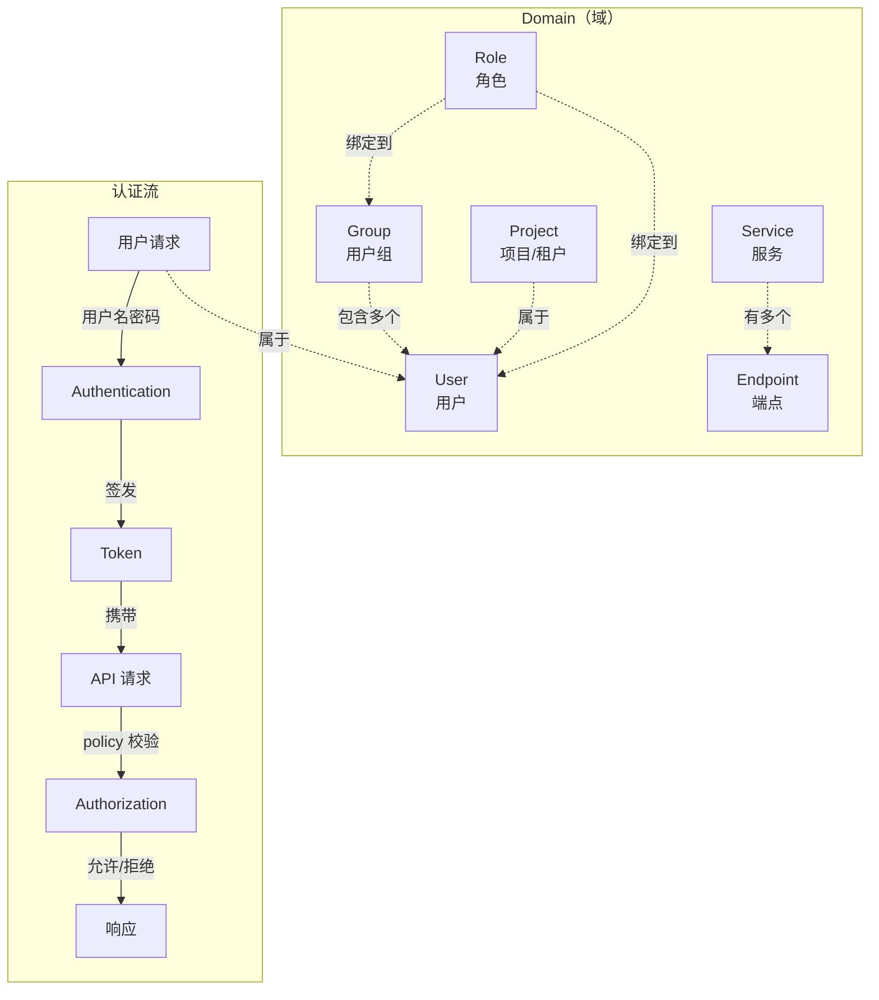
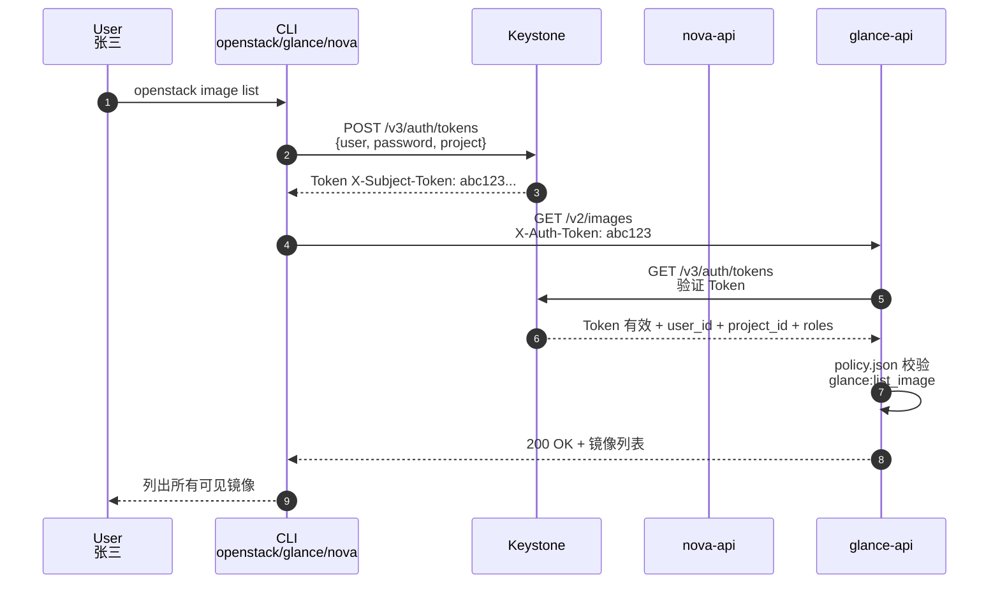
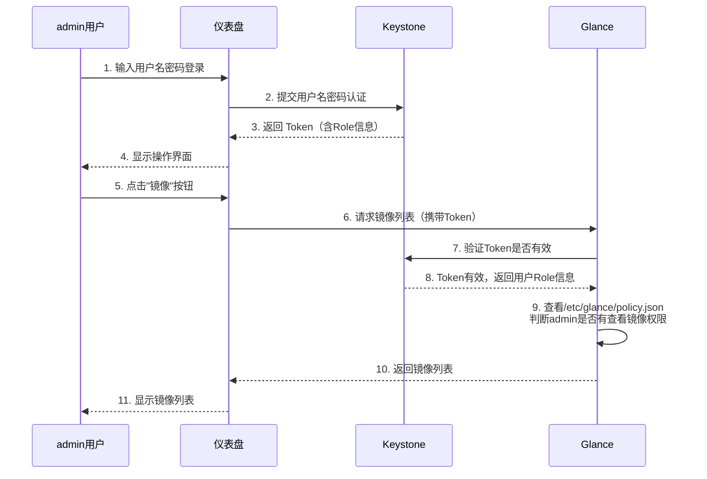
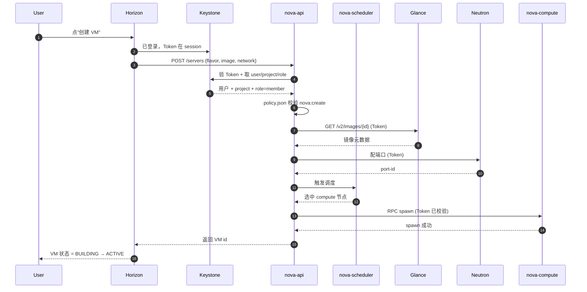
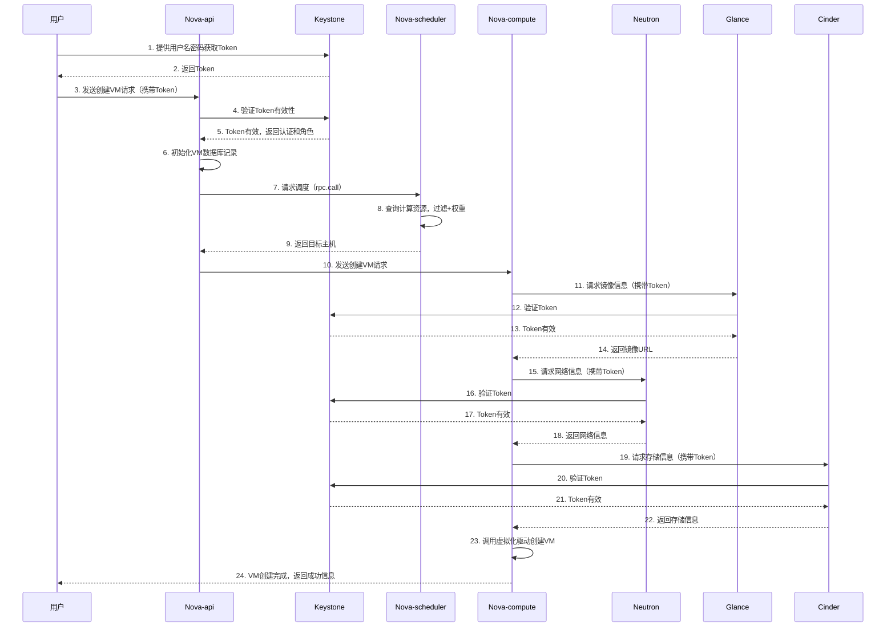
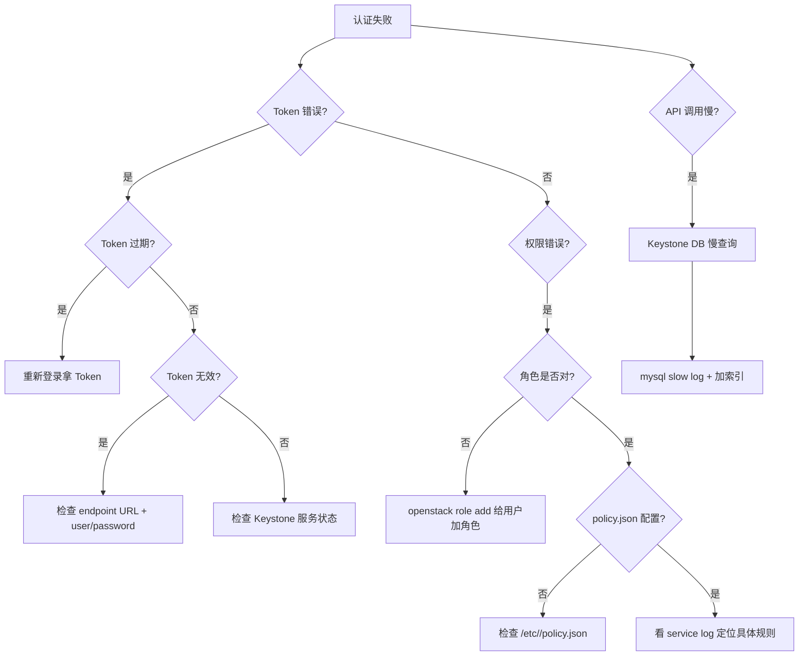

# OpenStack 认证与多租户：Keystone

> **一句话心智模型**：Keystone = OpenStack 的"门禁系统"。所有用户和服务要进入大楼（使用资源），必须先到 Keystone 验明身份，换取临时通行证（Token），之后才能去各个楼层（Service）办事。Keystone 不管你能干什么，只管你是谁；具体权限由各服务的 policy.json 决定。
>
> **本章来源**：本文整理自《OpenStack管理》PDF 中 "OpenStack认证管理-Keystone" 章节，用于复习与加深理解，同时可作为日常操作与部署参考手册。
>
> **与已有 vault 模块的链接**：
> - [[Linux用户权限]] — Keystone RBAC 的概念基础（POSIX rwx vs Keystone role）
> - [[01-OpenStack核心概念#§1 OpenStack 是什么]] — Keystone 在 7 大服务中的位置
> - [[02-OpenStack网络]] — Neutron 安全组与 Keystone policy 配合
> - [[04-OpenStack存储与镜像]] — Cinder/Swift/Glance 的 policy.json
> - [[05-OpenStack安装配置手册#§1 packstack 快速部署]] — packstack 自动创建 admin 用户

## 目录

- [[#§0 Keystone 全景图：一张表看清所有概念]]
- [[#§1 概述]]
- [[#§2 核心概念详解（Domain / User / Group / Project / Role / Service / Endpoint / Token / Credential / Authentication vs Authorization）]]
- [[#§3 工作流程与认证机制（含完整 mermaid 时序图）]]
- [[#§4 部署与操作实战]]
- [[#§5 常用命令与配置汇总]]
- [[#§6 核心概念对比表]]
- [[#§7 认证 vs 鉴权 对比]]
- [[#§8 Troubleshoot（故障排查）]]
- [[#§9 关键总结]]
- [[#§10 速查表（命令 / 配置 / 端口 / 路径）]]
- [[#§11 复习题（30 题）]]
- [[#§12 与已有 vault 模块的链接]]

---

## §0 Keystone 全景图：一张表看清所有概念



**10 个核心概念一句话解释**：

| 概念 | 一句话 | 类别 |
|------|--------|------|
| **Domain** | 一组 User/Group/Project 的容器 | 组织 |
| **User** | OpenStack 的账号（可以是人或服务） | 身份 |
| **Group** | 一组 User 的容器，可批量赋 Role | 身份 |
| **Project** | 资源的容器（VM/卷/网络都属于 Project） | 资源 |
| **Role** | 权限的集合（admin / member / reader） | 权限 |
| **Service** | OpenStack 中的一个服务（nova / neutron ...） | 服务 |
| **Endpoint** | 服务的访问地址（admin/internal/public 三种） | 服务 |
| **Token** | 用户通过认证后获得的临时通行证 | 凭证 |
| **Credential** | 用户的认证凭据（密码 / 密钥） | 凭证 |
| **Authentication vs Authorization** | 你是谁 vs 你能干什么 | 流程 |

---

## 一、概述

### 1.1 Keystone 是什么

Keystone 是 OpenStack 的**身份认证服务（Identity Service）**，是整个 OpenStack 云平台的基础支撑服务。所有其他服务（Nova、Glance、Neutron、Cinder 等）都依赖 Keystone 来完成用户身份的确认和权限的判定。

可以把 Keystone 理解为整个 OpenStack 的"门禁系统"：所有人和服务要进入大楼（使用资源），都必须先到门禁这里验明身份，换取临时通行证（Token），之后才能去各个楼层（Service）办事。

### 1.2 Keystone 做的三件事

1. **管理用户及其权限**（User / Group / Role / Project）
2. **维护 OpenStack Services 的 Endpoint**（Service / Endpoint）
3. **Authentication（认证）** 与 **Authorization（鉴权）**

---

## 二、核心概念详解

### 2.1 Domain（域）

**官方定义**

> Domain 是 Keystone 中的一个虚拟概念，一个域是一组 User、Group 或 Project 的容器。一个域可以对应一个大的机构、一个数据中心，并且必须全局唯一。

**通俗理解**

Domain 就像一个"大公司"的边界。在这个大公司里，可以有多个部门（Project）、员工（User）、员工组（Group）。不同的大公司（Domain）之间资源是隔离的，但由同一个云平台管理。

**关键特性**

- **全局唯一**：在整个 OpenStack 环境中，Domain 名称不能重复
- 云的终端用户可以在自己的 Domain 中创建多个 Project、User、Group 和 Role
- 具备对多个 Project 进行统一管理的能力
- 默认存在一个名为 `default` 的域

---

### 2.2 User（用户）

**官方定义**

> User 指代任何使用 OpenStack 的实体，可以是真正的用户，其他系统或者服务。当 User 请求访问 OpenStack 时，Keystone 会对其进行验证。

**通俗理解**

User 就是 OpenStack 的"账号"。它不一定是真人——Nova、Glance 这些服务本身也需要账号来互相通信。每个账号登录时都需要出示密码等凭证，验证通过后才能拿到通行证（Token）。

**关键特性**

- **域内唯一**：只需在所属 Domain 内唯一，不必全局唯一
- Keystone 通过认证信息（Credential，如密码等）验证用户请求的合法性
- 通过验证的用户会被分配一个特定的 **Token**，作为后续资源访问的通行证

---

### 2.3 Group（用户组）

**官方定义**

> Group 是一组 User 的容器，可以向 Group 中添加用户，并直接给 Group 分配角色。在这个 Group 中的所有用户就拥有了 Group 所拥有的角色权限。

**通俗理解**

Group 相当于"部门"。你可以把多个员工拉进一个部门，然后直接给整个部门分配权限（比如"财务部都能报销"），而不需要一个个员工单独设置。这样管理起来方便得多，新员工入职只需要加入部门就自动获得权限。

**关键特性**

- 通过引入 Group 的概念，Keystone 实现了**同时管理一组用户权限**的目的
- 给用户组分配 Role 后，组内所有用户自动继承该角色权限
- 简化了大规模用户的权限管理工作

---

### 2.4 Project（项目 / 租户）

**官方定义**

> Project 用于将 OpenStack 的资源（计算、存储和网络）进行分组和隔离。项目是各个服务中一些可以访问的资源集合。

**通俗理解**

Project 就是一个"项目预算账号"。在 OpenStack 里，所有资源（虚拟机、磁盘卷、网络等）都属于某个项目，而不是属于某个个人。张三可以在 A 项目里创建虚拟机，也可以在 B 项目里创建虚拟机——但这两个项目里的资源是完全隔离的。

**关键特性**

- **资源所有权属于 Project，而不是 User**
- 在 OpenStack 的界面和文档中，**Tenant / Project / Account** 这几个术语是通用的，但长期看会倾向使用 **Project**（公有云叫租户）
- 每个 User（包括 admin）**必须挂在 Project 里**才能访问该 Project 的资源
- 一个 User 可以属于**多个 Project**
- **域内唯一**：只需在某个域下唯一即可

---

### 2.5 Role（角色）

**官方定义**

> Role 具有一组定义的用户权限和特权，以执行一组特定操作。角色不同，被赋予的权限不同。Keystone 借助 Role 实现 Authorization。

**通俗理解**

Role 就是"职位头衔"。你是"只读观众"还是"系统管理员"，决定了你能做什么操作。同一个用户在不同项目里可以有不同的角色——比如在 A 项目里他是管理员，在 B 项目里他只是普通成员。

**关键特性**

- **全局唯一**：Role 名称在整个 OpenStack 环境中必须唯一
- 用户可以被赋予**域内角色** → 对域内所有项目都具有相同权限
- 用户可以被赋予**项目内角色** → 只对该特定项目有权限
- **权限可继承**：在项目树下，拥有父项目的访问权限意味着同时拥有对子项目的访问权限
- OpenStack 默认配置只区分 **admin** 和 **非 admin** 两种 Role

---

### 2.6 Service（服务）

**官方定义**

> Service 是一种 OpenStack 服务。OpenStack 的 Service 包括 Compute (Nova)、Block Storage (Cinder)、Object Storage (Swift)、Image Service (Glance)、Networking Service (Neutron) 等。每个 Service 都会提供若干个 Endpoint。

**通俗理解**

Service 就是 OpenStack 大楼里的各个"职能部门"——计算部（Nova）、存储部（Cinder）、网络部（Neutron）等。每个部门都对外提供服务窗口（Endpoint），用户通过这些窗口来办理具体业务。

---

### 2.7 Endpoint（端点）

**官方定义**

> Endpoint 是一个网络上可访问的地址，通常是一个 URL。Service 通过 Endpoint 暴露自己的 API。Keystone 负责管理和维护每个 Service 的 Endpoint。

**通俗理解**

Endpoint 就是每个职能部门的"办事窗口地址"。你要去 Nova 申请虚拟机，就得知道 Nova 的窗口在哪（URL）。Keystone 相当于一个"大厅导览台"，记录着所有部门的窗口位置，用户先问 Keystone，再去对应窗口办事。

**三种入口类型**

| 类型 | 用途 |
|------|------|
| **Admin** | 管理员入口，用于管理操作 |
| **Public** | 公网入口，外部用户访问 |
| **Internal** | 内部入口，服务之间互相调用 |

---

### 2.8 Token（令牌）

**官方定义**

> Token 是由数字和字母组成的字符串，User 成功 Authentication 后 Keystone 生成 Token 并分配给 User。Token 是允许访问特定资源的凭证。

**通俗理解**

Token 就是"临时通行证"。你在大门口（Keystone）用身份证（用户名/密码）验证了身份后，门卫给你一张 24 小时有效的临时通行证。之后你去任何部门办事，只要出示这张通行证就行，不用再掏身份证。

**关键特性**

- Token 用做访问 Service 的 Credential
- Service 会通过 Keystone 验证 Token 的有效性
- Token 中包含了 User 的 Role 信息
- Token 的有效期默认是 **24 小时**

---

### 2.9 Credential（凭证）

**官方定义**

> Credential 是确认用户身份的数据，是 User 用来证明自己身份的信息。

**通俗理解**

Credential 就是"能证明你是你的东西"。最常见的是用户名和密码，但也可以是 Token、API Key 等。Keystone 验证 Credential 后才会给你发 Token。

**常见形式**

1. 用户名 / 密码
2. Token
3. API Key
4. 其他高级方式

---

### 2.10 Authentication（认证）与 Authorization（鉴权）

**官方定义**

> Authentication 是 Keystone 验证 User 身份的过程。Authorization 解决的是"你能干什么？"的问题。

**通俗理解**

- **Authentication（认证）** = "你是谁？" → 查身份证，确认你是合法人员
- **Authorization（鉴权）** = "你能干什么？" → 查你的职位（Role），决定你能进哪些办公室、能办哪些业务

**关键理解**

- Authentication 解决"你是谁"的问题
- Authorization 解决"你能干什么"的问题
- Keystone 借助 **Role** 实现 Authorization
- Service 决定每个 Role 能做什么事情，通过各自的 **policy.json** 文件对 Role 进行访问控制

---

## 三、工作流程与认证机制

### 3.0 整体认证时序图（mermaid 版）



**关键节点**：

| 步骤 | 协议 | 携带 |
|------|------|------|
| 1 | 用户输入 | username + password + project |
| 2 | Keystone POST /v3/auth/tokens | {user, password, domain, project, scope} |
| 3 | Keystone 返回 Token | X-Subject-Token: abc123 + expires_at |
| 4 | 后续 API 携带 Token | X-Auth-Token: abc123 |
| 5 | 服务向 Keystone 验 Token | GET /v3/auth/tokens |
| 6 | 服务返回 Token 信息 | user_id + project_id + roles |
| 7 | 服务查 policy.json | { "admin_required": [["role:admin"]] } |
| 8 | 校验通过 → 执行业务 | 镜像列表 / 创建 VM 等 |

### 3.1 用户查询镜像的完整认证流程

以 admin 用户查看 Glance 镜像列表为例，整个流程如下：



**流程说明**

1. **登录阶段**：用户在 Horizon 登录，Keystone 验证用户名密码，签发 Token
2. **界面展示**：admin 已从 Keystone 获取各 Service 的 Endpoints，界面可以正常显示
3. **请求资源**：用户点击"镜像"，请求发送到 Glance 的 Endpoint，请求头中携带 Token
4. **Token 验证**：Glance 收到请求后，将 Token 传递到 Keystone 验证有效性
5. **权限判定**：Glance 查看自身的 `/etc/glance/policy.json`，判断 admin 角色是否有查看 image 的权限
6. **返回结果**：权限判定通过，Glance 将镜像列表返回给用户

---

### 3.2 创建虚拟机的完整 Keystone 认证流程



**关键点**：

- nova-api 是 Token 校验的"中间人"，compute 节点不再单独验 Token
- 调度器只需知道"哪个用户要 VM"，不需知道密码
- compute 节点只看 RPC 消息，不接触 Keystone API



**流程说明**

1. 用户先向 Keystone 认证，获取 Token
2. 用户向 Nova-api 发送创建虚拟机请求，请求头部携带 Token
3. Nova-api 收到请求后，将 Token 传递到 Keystone 验证是否有效合法
4. 验证成功后，Nova 开始进行创建 VM 操作
5. Nova 需要准备网络、镜像、存储等资源时，会向 Neutron、Glance、Cinder 发送请求，**每个请求头部都携带同一个 Token**
6. Neutron、Glance、Cinder 收到请求后，都会向 Keystone 验证 Token 的有效性
7. 验证通过后，各服务执行相应操作，最终 VM 创建完成

**关键理解**

- 不同服务间的调用也要携带 Token
- **Keystone 只校验 Token 的有效性**，不负责判断具体业务操作是否允许
- 每个服务的**具体操作权限控制**是通过各自的 **policy.json** 文件实现的

---

## 四、部署与操作实战

### 4.1 环境准备

在进行 Keystone 管理操作前，需要先加载 admin 环境变量：

```bash
# 加载 admin 认证环境
[root@controller ~]# source keystonerc_admin

# 加载后命令提示符会变化，表示当前处于 keystone_admin 上下文
[root@controller ~(keystone_admin)]#
```

---

### 4.2 Domain 管理

**查看 Domain 列表**

```bash
[root@controller ~(keystone_admin)]# openstack domain list
+----------------------------------+---------+---------+--------------------+
| ID                               | Name    | Enabled | Description        |
+----------------------------------+---------+---------+--------------------+
| 2c99588e109d427abb530cbb9aada74a | heat    | True    |                    |
| default                          | Default | True    | The default domain |
+----------------------------------+---------+---------+--------------------+
```

**创建 Domain**

```bash
# 创建新的 domain 叫 domain-test
[root@controller ~(keystone_admin)]# openstack domain create domain-test
+-------------+----------------------------------+
| Field       | Value                            |
+-------------+----------------------------------+
| description |                                  |
| enabled     | True                             |
| id          | c70009318d0141c7a84b26ff427ff9d6 |
| name        | domain-test                      |
| options     | {}                               |
| tags        | []                               |
+-------------+----------------------------------+
```

**删除 Domain（需先禁用）**

```bash
# 设置 domain 禁用（删除前必须先禁用）
[root@controller ~(keystone_admin)]# openstack domain set --disable domain-test

# 删除 domain
[root@controller ~(keystone_admin)]# openstack domain delete domain-test
```

---

### 4.3 User 管理

**查看用户列表**

```bash
[root@controller ~(keystone_admin)]# openstack user list
+----------------------------------+------------+
| ID                               | Name       |
+----------------------------------+------------+
| 7ef9147a8abe485889ece90dce340ab1 | admin      |
| 8624a4e61d6c4b589814c369af26cb5f | heat_admin |
| 8770fb183087426eb29543f3d629b66f | glance     |
| ...                              | ...        |
+----------------------------------+------------+
```

**创建用户**

```bash
# 创建用户 user1，密码为 HUAWEI
[root@controller ~(keystone_admin)]# openstack user create --password HUAWEI user1
+---------------------+----------------------------------+
| Field               | Value                            |
+---------------------+----------------------------------+
| domain_id           | default                          |
| enabled             | True                             |
| id                  | 77ae3f5b216749ef8663c3bdb5679d36 |
| name                | user1                            |
| options             | {}                               |
| password_expires_at | None                             |
+---------------------+----------------------------------+
```

**查看用户详细信息**

```bash
[root@controller ~(keystone_admin)]# openstack user show user1
```

---

### 4.4 Group 管理

**创建组并添加用户**

```bash
# 创建组 group1
[root@controller ~(keystone_admin)]# openstack group create group1
+-------------+----------------------------------+
| Field       | Value                            |
+-------------+----------------------------------+
| description |                                  |
| domain_id   | default                          |
| id          | f259902c4c0242d3b392d951494e747f |
| name        | group1                           |
+-------------+----------------------------------+

# 列出所有组
[root@controller ~(keystone_admin)]# openstack group list

# 将 user1 加入 group1
[root@controller ~(keystone_admin)]# openstack group add user group1 user1

# 验证 user1 是否隶属于 group1
[root@controller ~(keystone_admin)]# openstack group contains user group1 user1
user1 in group group1
```

---

### 4.5 Role 管理

**查看角色列表**

```bash
[root@controller ~(keystone_admin)]# openstack role list
+----------------------------------+------------------+
| ID                               | Name             |
+----------------------------------+------------------+
| 030b4ca553dc41349168eaca4fd43f42 | ResellerAdmin    |
| 461321ea6a284081b692a469a15d7938 | SwiftOperator    |
| 4ef39ef24f694c9aa6c1101622da0e92 | admin            |
| 8b24d8bef4004573a8f3cb1f5a1517a8 | _member_         |
| 973e0706bc66471a90d09f177bfb6a1d | member           |
| a3af83fe8bf84014b01feae786f83b8b | heat_stack_owner |
| ce4a3e671d9040359d6f6f55555bf429 | reader           |
| e9cd36ba1b8744878cc15a05709ab1fd | heat_stack_user  |
+----------------------------------+------------------+
```

**给组分配角色**

```bash
# 给 group1 在 admin 项目下赋予 admin 角色
[root@controller ~(keystone_admin)]# openstack role add --project admin --group group1 admin
```

**验证角色分配**

```bash
[root@controller ~(keystone_admin)]# openstack role assignment list --names --group group1
+-------+------+----------------+---------------+--------+--------+-----------+
| Role  | User | Group          | Project       | Domain | System | Inherited |
+-------+------+----------------+---------------+--------+--------+-----------+
| admin |      | group1@Default | admin@Default |        |        | False     |
+-------+------+----------------+---------------+--------+--------+-----------+
```

---

### 4.6 Project 管理

**创建项目**

```bash
# 创建项目 ProjectA
[root@controller ~(keystone_admin)]# openstack project create ProjectA
+-------------+----------------------------------+
| Field       | Value                            |
+-------------+----------------------------------+
| description |                                  |
| domain_id   | default                          |
| enabled     | True                             |
| id          | a6aa11ee311a46889ac34e49b8da47d1 |
| is_domain   | False                            |
| name        | ProjectA                         |
| options     | {}                               |
| parent_id   | default                          |
| tags        | []                               |
+-------------+----------------------------------+
```

**用户绑定到项目并赋予角色**

```bash
# 将 user1 绑定到 ProjectA
[root@controller ~(keystone_admin)]# openstack user set --project ProjectA user1

# 给 ProjectA 里的 user1 赋予 admin 角色
[root@controller ~(keystone_admin)]# openstack role add --user user1 --project ProjectA admin
```

**修改项目配额**

```bash
# 将 ProjectA 的配额设置为：实例 3 个，vCPU 5 个，内存 5000MB
[root@controller ~(keystone_admin)]# openstack quota set --instance 3 --cores 5 --ram 5000 ProjectA
```

---

### 4.7 Service 与 Endpoint 查看

**查看 OpenStack 服务列表**

```bash
[root@controller ~(keystone_admin)]# openstack service list
+----------------------------------+------------+----------------+
| ID                               | Name       | Type           |
+----------------------------------+------------+----------------+
| 006d8f9e6a054e238a1093fe5af715bf | swift      | object-store   |
| 1abf3641147f40368f8d1c7e8b5677e1 | heat       | orchestration  |
| 2e6919aa53eb48cb99bc992b506a0e3e | glance     | image          |
| 5dfb29073cf140199cc78b2d84fac299 | keystone   | identity       |
| 9a6c3edee4ba431db7d1cac840b91dcb | neutron    | network        |
| a747c0c45e544fa9b20538474ac579d1 | nova       | compute        |
| ...                              | ...        | ...            |
+----------------------------------+------------+----------------+
```

**查看 Endpoint**

```bash
[root@controller ~(keystone_admin)]# openstack endpoint list
[root@controller ~(keystone_admin)]# openstack catalog list
```

---

### 4.8 开启 Horizon 多域登录

默认情况下 Horizon 不显示 Domain 输入框，需要手动开启多域支持：

```bash
# 进入 Horizon 配置目录
[root@controller ~(keystone_admin)]# cd /etc/openstack-dashboard/

# 编辑 local_settings 文件
[root@controller openstack-dashboard(keystone_admin)]# vim local_settings

# 修改第 83 行，开启 Keystone 多域支持
OPENSTACK_KEYSTONE_MULTIDOMAIN_SUPPORT = True

# 重启 httpd 服务生效
[root@controller openstack-dashboard(keystone_admin)]# systemctl restart httpd
```

---

## 五、常用命令与配置汇总

### 5.1 常用命令速查表

| 操作对象 | 命令 | 作用 |
|----------|------|------|
| Domain | `openstack domain list` | 查看域列表 |
| Domain | `openstack domain create <name>` | 创建域 |
| Domain | `openstack domain set --disable <name>` | 禁用域 |
| Domain | `openstack domain delete <name>` | 删除域 |
| User | `openstack user list` | 查看用户列表 |
| User | `openstack user create --password <pwd> <name>` | 创建用户 |
| User | `openstack user show <name>` | 查看用户详情 |
| User | `openstack user set --project <project> <user>` | 绑定用户到项目 |
| Group | `openstack group list` | 查看组列表 |
| Group | `openstack group create <name>` | 创建组 |
| Group | `openstack group add user <group> <user>` | 添加用户到组 |
| Group | `openstack group contains user <group> <user>` | 验证用户是否在组中 |
| Project | `openstack project list` | 查看项目列表 |
| Project | `openstack project create <name>` | 创建项目 |
| Project | `openstack project show <name>` | 查看项目详情 |
| Project | `openstack quota set --instance n --cores n --ram n <project>` | 修改项目配额 |
| Role | `openstack role list` | 查看角色列表 |
| Role | `openstack role add --user <user> --project <project> <role>` | 给用户分配角色 |
| Role | `openstack role add --project <project> --group <group> <role>` | 给组分配角色 |
| Role | `openstack role assignment list --names` | 查看角色分配情况 |
| Service | `openstack service list` | 查看服务列表 |
| Endpoint | `openstack endpoint list` | 查看端点列表 |
| Endpoint | `openstack catalog list` | 查看服务目录 |

### 5.2 重要配置文件

| 文件路径 | 说明 |
|----------|------|
| `/etc/keystone/keystone.conf` | Keystone 主配置文件 |
| `/etc/keystone/policy.json` | Keystone 访问策略文件 |
| `/var/log/keystone/keystone.log` | Keystone 日志文件 |
| `/etc/SERVICE_NAME/policy.json` | 各服务的访问策略文件（如 `/etc/nova/policy.json`） |
| `/etc/openstack-dashboard/local_settings` | Horizon 仪表盘配置文件 |
| `/etc/openstack-dashboard/SERVICE_NAME_policy.json` | Packstack 安装时的策略文件路径 |

---

## 六、核心概念对比表

| 概念 | 英文 | 作用 | 唯一性 | 类比理解 |
|------|------|------|--------|----------|
| 域 | Domain | User/Group/Project 的容器 | **全局唯一** | 大公司 |
| 用户 | User | 使用 OpenStack 的实体 | 域内唯一 | 员工账号 |
| 用户组 | Group | 一组 User 的容器，统一分配角色 | 域内唯一 | 部门 |
| 项目 | Project | 资源的集合，资源隔离单位 | 域内唯一 | 项目预算账号 |
| 角色 | Role | 定义权限和特权 | **全局唯一** | 职位头衔 |
| 服务 | Service | OpenStack 各组件服务 | - | 职能部门 |
| 端点 | Endpoint | 服务暴露的访问地址（URL） | - | 办事窗口 |
| 令牌 | Token | 访问凭证，含 Role 信息 | - | 临时通行证 |
| 凭证 | Credential | 证明身份的数据（密码等） | - | 身份证 |

---

## 七、认证 vs 鉴权 对比

| 对比项 | Authentication（认证） | Authorization（鉴权） |
|--------|------------------------|------------------------|
| **解决的问题** | "你是谁？" | "你能干什么？" |
| **实现方式** | 验证用户名/密码，发放 Token | 通过 Role + policy.json 判定权限 |
| **负责组件** | Keystone | 各 Service（借助 Keystone 的 Role 信息） |
| **实际例子** | 刷身份证进大门 | 查职位决定你能进哪些办公室 |

---

## 八、Troubleshoot（故障排查）

### 8.0 排错决策树（mermaid）



### 8.1 常见故障速查表

### 8.1 日志定位

OpenStack 排查问题的主要方法是通过日志。每个 Service 都有自己的日志文件：

```bash
# Keystone 日志目录
[root@controller ~]# cd /var/log/keystone/
[root@controller keystone]# ls
keystone.log
```

### 8.2 开启 Debug 模式

如果需要最详细的日志信息，可以在 Keystone 配置文件中开启 debug：

```bash
[root@controller ~]# cd /etc/keystone/
[root@controller keystone]# vim keystone.conf

# 修改第 94 行
[DEFAULT]
debug = True
```

**注意**：生产环境没有故障时，不要开启 debug，会浪费性能。

---

## 九、关键总结

1. **Keystone 是 OpenStack 的心脏**：所有服务的访问都要先过 Keystone，它不做具体业务，只做"守门人"。

2. **Token 是通行证**：用户登录一次换取 Token，后续访问各服务都携带 Token，避免反复验证密码。

3. **Project 是资源的拥有者**：虚拟机、卷等资源都属于 Project，不属于个人。用户必须挂在项目下才能操作资源。

4. **Role 决定权限边界**：Keystone 定义 Role，各 Service 的 policy.json 决定 Role 能做什么。默认只区分 admin 和非 admin。

5. **权限可以继承**：在项目树结构中，父项目的权限自动继承到子项目。

6. **Group 简化批量管理**：给组分配角色，组内所有用户自动获得权限，适合大规模用户场景。

7. **Authentication 不等于 Authorization**：Keystone 只验证"你是谁"（发 Token），具体"你能干什么"由各服务自己通过 policy.json 决定。

8. **Endpoint 有三种类型**：admin（管理）、public（公网）、internal（内部服务间调用），Keystone 负责统一维护。

---

## §10 速查表（命令 / 配置 / 端口 / 路径）

### 10.1 Keystone 核心命令

| 操作 | 命令 | 出处 |
|------|------|------|
| 拿 Token | `openstack token issue` | §4.1 |
| 看 Token 信息 | `openstack token issue -c id -c user_id -c project_id` | §4.1 |
| 列 User | `openstack user list` | §4.3 |
| 列 Group | `openstack group list` | §4.4 |
| 列 Project | `openstack project list` | §4.6 |
| 列 Role | `openstack role list` | §4.5 |
| 列 Domain | `openstack domain list` | §4.2 |
| 列 Service | `openstack service list` | §4.7 |
| 列 Endpoint | `openstack endpoint list` | §4.7 |
| 看 Service Catalog | `openstack catalog list` | §4.7 |
| 加角色 | `openstack role add --project <p> --user <u> <role>` | §4.5 |
| 创建 User | `openstack user create --project <p> --password <pwd> <name>` | §4.3 |
| 创建 Project | `openstack project create --domain <d> <name>` | §4.6 |

### 10.2 关键配置文件

| 文件 | 用途 |
|------|------|
| `/etc/keystone/keystone.conf` | Keystone 主配置 |
| `/etc/keystone/keystone-paste.ini` | WSGI pipeline |
| `/etc/keystone/policy.json` | Keystone 自己的 policy |
| `/etc/keystone/domains/` | 多 domain 配置目录 |
| `/etc/<service>/policy.json` | 各服务的 policy（nova/neutron/cinder...） |
| `/etc/httpd/conf.d/wsgi-keystone.conf` | Apache WSGI 配置 |
| `/var/log/keystone/keystone.log` | Keystone 日志 |

### 10.3 端口

| 服务 | 端口 | 用途 |
|------|------|------|
| Keystone public | 5000 | 用户访问 |
| Keystone admin | 35357 | 管理访问（已废弃，统一用 5000 + admin endpoint） |
| Keystone DB | 3306 | MySQL |

### 10.4 关键路径

| 路径 | 用途 |
|------|------|
| `/etc/keystone/` | 配置目录 |
| `/var/log/keystone/` | 日志目录 |
| `/var/lib/keystone/` | 数据目录（fernet keys 等） |
| `keystone-manage fernet_setup` | 初始化 fernet token key |

### 10.5 常见 policy.json 规则

```json
{
  "admin_required": [["role:admin"]],
  "project_member": [["role:member"], ["project_id:%(project_id)s"]],
  "project_reader": [["role:reader"], ["project_id:%(project_id)s"]],
  "service_role": [["role:service"]]
}
```

### 10.6 Token 类型对比

| 类型 | 特点 | 推荐 |
|------|------|------|
| **UUID** | 简单，无加密 | 已不推荐 |
| **PKI** | 用 X.509 证书 | 性能好，部署复杂 |
| **PKIZ** | PKI + 压缩 | 大集群推荐 |
| **Fernet** | 加密无 DB | **当前默认推荐** |
| **JWT** | 无状态，新一代 | 实验中 |

---

## §11 复习题（30 题）

### 第一组：核心概念（10 题）

1. Keystone 在 OpenStack 中的核心作用是什么？答：身份认证 + Endpoint 注册
2. 三大核心实体？答：User / Project / Role
3. Domain 的作用？答：隔离 User/Group/Project 命名空间
4. User 与 Project 的关系？答：N:N，User 通过 role 访问 Project
5. 什么是 Token？答：用户通过认证后获得的临时凭证
6. Token 默认有效期？答：1 小时（可配置）
7. Credential 包含哪些？答：password / token / EC2 credential
8. Endpoint 三种类型？答：admin / public / internal
9. Service 与 Endpoint 的关系？答：Service = 逻辑概念；Endpoint = Service 的访问 URL
10. Authentication 与 Authorization 的区别？答：前者验证身份；后者验证权限

### 第二组：认证流程（5 题）

11. 用户获取 Token 的第一步？答：POST /v3/auth/tokens 带 username/password
12. 服务如何验证 Token？答：调用 Keystone GET /v3/auth/tokens
13. Token 在 HTTP 哪个 header？答：X-Auth-Token
14. Token 过期后怎么办？答：返回 401；客户端重新登录
15. 什么是 unscoped/scoped Token？答：未指定 project vs 指定了 project

### 第三组：多租户（5 题）

16. 多 Domain 的核心场景？答：跨组织隔离（如母公司 vs 子公司）
17. Domain 唯一还是 Project 唯一？答：Domain 全局唯一；Project 域内唯一
18. Role 唯一还是 Group 唯一？答：Role 全局唯一
19. 配额（quota）作用于哪个层级？答：Project 层级
20. 多 region 时 Keystone 怎么部署？答：每个 region 独立 Keystone + federation

### 第四组：实战操作（5 题）

21. 创建 user1 的命令？答：`openstack user create --password HUAWEI user1`
22. 创建 group1 并加 user？答：`openstack group create group1` + `openstack group add user group1 user1`
23. 给 project 配额命令？答：`openstack quota set --ram 5000 --instances 3 <project>`
24. 列出所有 service？答：`openstack service list`
25. 开启 Horizon 多域登录？答：编辑 `/etc/openstack-dashboard/local_settings` 设 `OPENSTACK_KEYSTONE_MULTIDOMAIN_SUPPORT = True`

### 第五组：故障排查（5 题）

26. Token 401 的最常见原因？答：过期或密码错误
27. Token 403 的最常见原因？答：权限不足（role 不对）
28. Domain 切换失败？答：检查 user 是否属于该 domain
29. Project quota 报错？答：`openstack quota show <project>` 看配额
30. Keystone 慢查询？答：mysql slow log + 给 token 表加索引

---

## §12 与已有 vault 模块的链接

- [[Linux用户权限]] — POSIX rwx vs Keystone role 的对照；UID/GID vs User/Project 的概念映射
- [[Linux网络]] — Neutron 安全组 policy.json 与 Keystone 协作
- [[LinuxShell]] — `source keystonerc_admin` 加载环境的脚本技巧
- [[Linux服务与SSH]] — Keystone 通过 systemd / Apache mod_wsgi 运行
- [[Linux防火墙]] — Keystone 端口 5000/35357 的 iptables 规则
- [[Linux存储]] — Keystone DB 用 MySQL（与 LVM/Ceph 关系）
- [[01-OpenStack核心概念#§0 心智模型]] — Keystone 在 7 大服务中的中心位置
- [[01-OpenStack核心概念#§12 7 大服务完整协作流]] — 创建 VM 时 Keystone 校验 Token 的 12 步
- [[02-OpenStack网络#§11 安全组]] — policy.json 与安全组规则的对比
- [[04-OpenStack存储与镜像]] — Cinder/Swift/Glance 的 policy.json
- [[05-OpenStack安装配置手册#§1 packstack 快速部署]] — packstack 自动创建 admin/demo/glance/nova 服务账号
- [[06-OpenStack故障排查与运维]] — Keystone 故障分类
- [[00-OpenStack学习路线#§10 复习 Checklist]] — 认证层复习要点

---

最后更新: 2026-08-10 23:50（T5 Stage 6 Code 完成）
