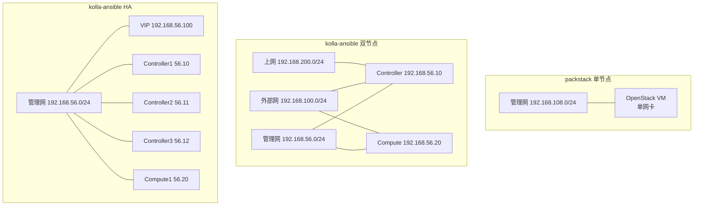
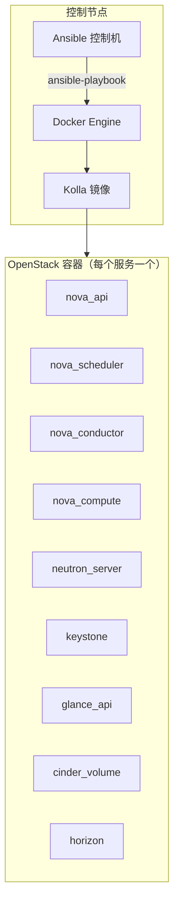
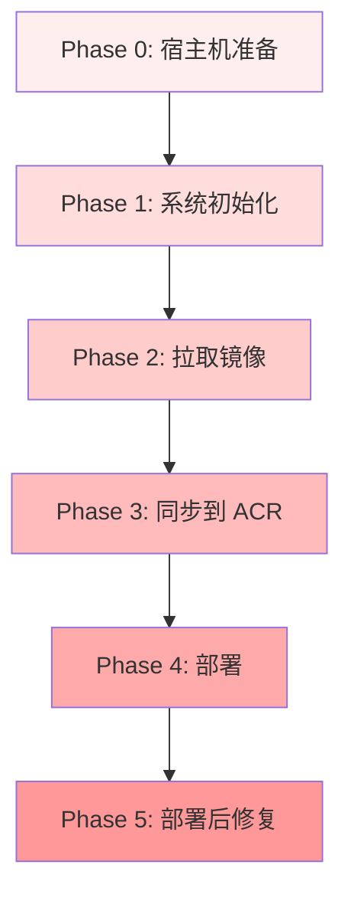
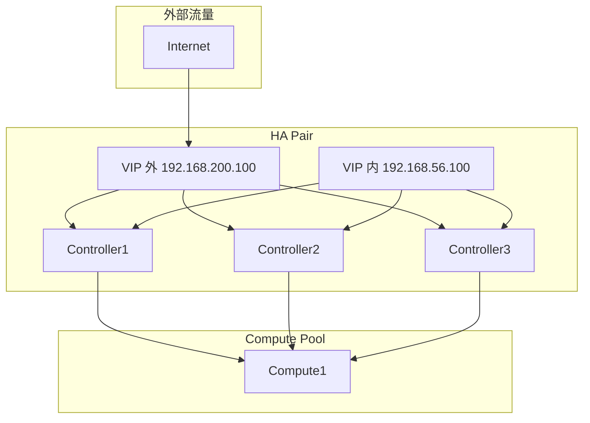
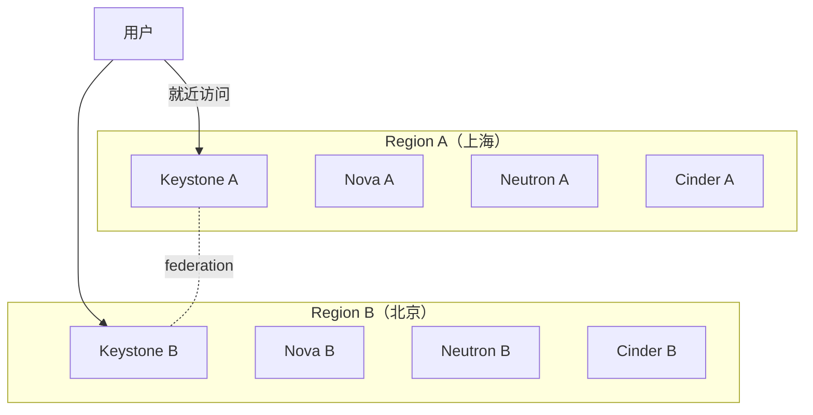
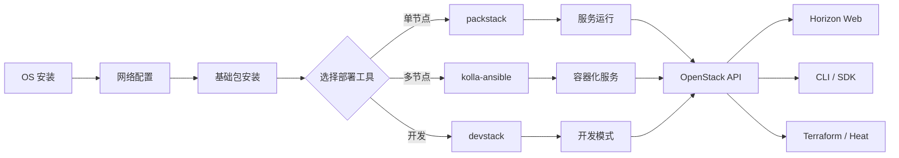
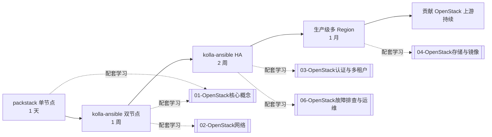

# OpenStack 安装配置实战手册

> **一句话心智模型**：OpenStack 部署有三种典型形态——**packstack**（单节点快速实验，30 分钟搞定）、**kolla-ansible 双节点**（一个 controller + 一个 compute，生产入门）、**kolla-ansible HA**（3 控制节点 + N 计算节点 + VIP，生产标准）。三种形态共享 OpenStack 服务代码，但部署工具链、配置文件、HA 机制完全不同。
>
> **本章范围**：三种部署形态完整步骤 + 镜像同步（国内源/ACR）+ 离线部署 + 部署期故障 + 集群升级。

## 目录

- [[#§0 心智模型：三种部署形态对比]]
- [[#§1 packstack 快速部署（Victoria）]]
- [[#§2 packstack 前置准备]]
- [[#§3 packstack 单节点部署]]
- [[#§4 packstack 3 节点部署]]
- [[#§5 packstack 部署后验证]]
- [[#§6 kolla-ansible 总览]]
- [[#§7 kolla-ansible 双节点部署]]
- [[#§8 kolla-ansible HA 三控制节点部署]]
- [[#§9 镜像同步：国内源 + ACR]]
- [[#§10 离线部署]]
- [[#§11 部署期故障排查]]
- [[#§12 集群升级路径]]
- [[#§13 命令速查]]
- [[#§14 与已有 vault 模块的链接]]

---

## §0 心智模型：三种部署形态对比


### 0.1 三种形态详细对比

| 维度 | packstack 单节点 | kolla-ansible 双节点 | kolla-ansible HA 三控制 |
|------|------------------|----------------------|-------------------------|
| **适用** | 学习 / 单节点测试 | 小型私有云 / 学习 | 生产标准 |
| **OpenStack 版本** | Victoria (2020) | Antelope / Bobcat | Bobcat (2023.2) |
| **OS** | CentOS Stream 8 | Rocky Linux 9 | Rocky Linux 9 |
| **节点数** | 1 | 2 | 3 控制 + 1 计算 |
| **HA** | 无 | 无 | keepalived + haproxy |
| **内存需求** | 6GB | 8GB+ | 16GB+ |
| **磁盘需求** | 100GB | 200GB | 500GB |
| **部署时间** | 30 分钟 | 2-3 小时 | 4-6 小时 |
| **运维难度** | 低 | 中 | 高 |
| **生产可用** | ❌ | ❌（无 HA） | ✅ |

### 0.2 packstack vs kolla-ansible

| 维度 | packstack | kolla-ansible |
|------|-----------|----------------|
| **部署方式** | Puppet（一次性） | Ansible（容器化） |
| **服务运行方式** | 裸进程 | Docker 容器 |
| **升级** | 难 | 易（容器版本切换） |
| **回滚** | 难 | 易（容器镜像） |
| **状态** | 老牌，逐步淘汰 | **当前主流** |
| **学习曲线** | 低 | 中 |
| **生产推荐** | ❌ | ✅ |

### 0.3 网络拓扑对比



---

## §1 packstack 快速部署（Victoria）

来源：`E:\QQ下载\CentOS-Stream-8-packstack安装OpenStack-Victoria.md`（488 行）+ `E:\QQ下载\CentOS-Stream-8-packstack安装OpenStack-Victoria - 3节点.md`（449 行）+ PDF 16 页

### 1.1 packstack 简介

- packstack = Red Hat 提供的 OpenStack 部署工具
- 基于 Puppet
- 适合 CentOS Stream / RHEL
- OpenStack 版本：Victoria（2020 L 版）

### 1.2 适用场景

- ✅ 学习 / 教学
- ✅ 单节点测试
- ✅ 演示
- ❌ 生产（无 HA / 升级困难）

---

## §2 packstack 前置准备

### 2.1 硬件要求

| 资源 | 最小 | 推荐 |
|------|------|------|
| CPU | 4 核 | 8 核 |
| 内存 | 6GB | 8GB |
| 磁盘 | 100GB | 200GB |
| 网卡 | 1 | 2（管理 + 外部） |

### 2.2 软件要求

- CentOS Stream 8 (minimal 安装)
- 网络可达外网（拉包 + 拉镜像）
- 宿主机：VMware Workstation 17.5+ / VirtualBox 6.1+

### 2.3 镜像下载

```bash
# CentOS Stream 8 ISO
https://mirrors.aliyun.com/centos-vault/8-stream/isos/x86_64/CentOS-Stream-8-20240603.0-x86_64-dvd1.iso
```

### 2.4 虚拟机硬件配置

```text
controller  4CPU 8G内存 1张网卡:NAT 100G系统盘
compute    4CPU 8G内存 1张网卡:NAT 100G系统盘
```

（按个人情况配置内存，4G 是底线）

### 2.5 VMware 网络设置

```text
NAT 网络,开启 DHCP, 192.168.108.0/24,网关 192.168.108.2,DNS 192.168.108.2
```

---

## §3 packstack 单节点部署

### 3.1 准备模板机环境

```bash
# 1. 配置 yum 源
cat > /etc/yum.repos.d/CentOS-Stream-OpenStack.repo <<'EOF'
[centos-openstack-victoria]
name=CentOS Stream 8 OpenStack Victoria
baseurl=https://mirrors.aliyun.com/centos-vault/8-stream/cloud/x86_64/openstack-victoria/
enabled=1
gpgcheck=0

[centos-baseos]
name=CentOS Stream 8 BaseOS
baseurl=https://mirrors.aliyun.com/centos-vault/8-stream/BaseOS/x86_64/os/
enabled=1
gpgcheck=0

[centos-appstream]
name=CentOS Stream 8 AppStream
baseurl=https://mirrors.aliyun.com/centos-vault/8-stream/AppStream/x86_64/os/
enabled=1
gpgcheck=0
EOF

yum update -y
```

### 3.2 安装 packstack

```bash
yum install -y openstack-packstack
```

### 3.3 配置 `/etc/hosts`

```bash
cat >> /etc/hosts <<'EOF'
192.168.108.10 controller
EOF
```

### 3.4 关闭 SELinux

```bash
setenforce 0
sed -i 's/SELINUX=enforcing/SELINUX=permissive/' /etc/selinux/config
```

### 3.5 关闭防火墙（实验环境）

```bash
systemctl disable --now firewalld
```

### 3.6 配置 answer file

```bash
# 生成默认 answer file
packstack --gen-answer-file=/root/answers.txt

# 修改关键参数
sed -i 's/CONFIG_HEAT_INSTALL=.*/CONFIG_HEAT_INSTALL=n/' /root/answers.txt  # 不要 Heat
sed -i 's/CONFIG_NEUTRON_ML2_TYPE_DRIVERS=.*/CONFIG_NEUTRON_ML2_TYPE_DRIVERS=vxlan,flat/' /root/answers.txt
sed -i 's/CONFIG_NEUTRON_OVS_BRIDGE_IFACES=.*/CONFIG_NEUTRON_OVS_BRIDGE_IFACES=ens33/' /root/answers.txt  # 改成实际网卡名
sed -i 's/CONFIG_PROVISION_DEMO=.*/CONFIG_PROVISION_DEMO=n/' /root/answers.txt  # 不要 demo
sed -i 's/CONFIG_KEYSTONE_ADMIN_PW=.*/CONFIG_KEYSTONE_ADMIN_PW=admin/' /root/answers.txt
```

### 3.7 安装

```bash
packstack --answer-file=/root/answers.txt
# 等待 30 分钟
```

### 3.8 登录管理节点

```bash
# 加载 admin 环境
source /root/keystonerc_admin

# 验证
openstack user list
openstack service list
openstack network list
```

### 3.9 配置外网（创建 external network）

```bash
# 创建外部网络（flat 类型）
openstack network create --provider-network-type flat \
  --provider-physical-network extnet \
  --external ext-net

openstack subnet create --network ext-net \
  --subnet-range 192.168.108.0/24 \
  --gateway 192.168.108.2 \
  --no-dhcp \
  --allocation-pool start=192.168.108.100,end=192.168.108.200 \
  ext-subnet

# 创建 router
openstack router create provider-router
openstack router set provider-router --external-gateway ext-net
```

### 3.10 启用 OpenStack 命令补全

```bash
yum install -y bash-completion
source /etc/profile.d/bash_completion.sh

# 测试
openstack Tab Tab
```

---

## §4 packstack 3 节点部署

参考 `E:\QQ下载\CentOS-Stream-8-packstack安装OpenStack-Victoria - 3节点.md`（449 行）

### 4.1 节点规划

| 节点 | 角色 | IP | 内存 |
|------|------|-----|------|
| controller | 控制 | 192.168.108.10 | 8G |
| compute1 | 计算 | 192.168.108.11 | 8G |
| compute2 | 计算 | 192.168.108.12 | 8G |

### 4.2 关键差异（vs 单节点）

- 3 个节点都装 `openstack-packstack`
- 只在 controller 上跑 `packstack` 生成 answer file
- answer file 指定 3 个 compute 节点
- packstack 自动 SSH 到 compute 节点装 nova-compute

### 4.3 answer file 关键差异

```text
CONFIG_COMPUTE_HOSTS=192.168.108.11,192.168.108.12
CONFIG_NETWORK_HOSTS=192.168.108.10
CONFIG_STORAGE_HOSTS=192.168.108.10
```

### 4.4 部署后验证

```bash
# 看所有节点的 nova-compute 服务
source /root/keystonerc_admin
openstack compute service list
# 应显示 3 行：controller 上的 nova-scheduler/conductor + 2 个 compute 上的 nova-compute
```

---

## §5 packstack 部署后验证

### 5.1 创建第一个 VM

```bash
# 1. 创建 self-service 网络
openstack network create selfservice-net
openstack subnet create --network selfservice-net \
  --subnet-range 10.0.0.0/24 selfservice-subnet
openstack router add subnet provider-router selfservice-subnet

# 2. 创建 VM
openstack flavor list  # 看现有 flavor
openstack image list  # 看现有镜像（packstack 默认会装一个 cirros）
openstack security group list  # 看安全组

# 创建 VM
openstack server create my-vm \
  --flavor m1.tiny \
  --image cirros \
  --network selfservice-net

# 3. 看 VM 状态
openstack server list
```

### 5.2 验证浮动 IP

```bash
# 创建浮动 IP
openstack floating ip create ext-net

# 关联到 VM
openstack floating ip set --port <vm-port-id> <fip-id>

# 测试（从外部）
ping <floating-ip>
ssh cirros@<floating-ip>
```

### 5.3 验证 Horizon

浏览器访问：`http://<controller-ip>/dashboard`

- 用户名：admin
- 密码：keystonerc_admin 中 CONFIG_KEYSTONE_ADMIN_PW 的值

---

## §6 kolla-ansible 总览

来源：`E:\openstack-deploy\`（README 969 行 + DEPLOYMENT-SUMMARY 342 行 + 70K 脚本）+ `E:\openstack-deploy-dual\`（README 566 行 + NETWORK 355 行 + KEY-CODE 419 行 + 42K 脚本）

### 6.1 kolla-ansible 是什么

- **kolla**：OpenStack 服务的 Docker 镜像构建工具
- **kolla-ansible**：基于 Ansible 的部署工具，用 kolla 镜像部署 OpenStack
- **优势**：
  - 容器化部署（OpenStack-on-Docker）
  - 幂等（可重复运行）
  - 易升级（容器版本切换）
  - 易回滚

### 6.2 架构



### 6.3 版本对应

| OpenStack | kolla-ansible | 发布时间 |
|-----------|---------------|----------|
| Antelope (2023.1) | 16.x | 2023-03 |
| Bobcat (2023.2) | 17.x | 2023-10 |
| Caracal (2024.1) | 18.x | 2024-04 |
| Dalmatian (2024.2) | 19.x | 2024-10 |

---

## §7 kolla-ansible 双节点部署

参考 `E:\openstack-deploy\README.md`（969 行）+ `DEPLOYMENT-SUMMARY.md`（342 行）+ `04-kolla-ansible-deploy.sh`（70K 脚本）

### 7.1 节点规划

| 节点 | IP (管理网) | IP (外部网) | 角色 | 内存 |
|------|-------------|-------------|------|------|
| controller1 | 192.168.56.10 | 192.168.200.10 | 控制节点 | 4096 MB |
| compute1 | 192.168.56.20 | 192.168.200.20 | 计算节点 | 2560 MB |

### 7.2 网络规划

| 网段 | 用途 | IP |
|------|------|-----|
| VMnet1 (Host-Only) | 管理网 | 192.168.56.0/24 |
| VMnet2 (Host-Only) | 外部网 | 192.168.200.0/24 |
| VMnet8 (NAT) | 上网 | 192.168.100.0/24 |

### 7.3 部署五大阶段



### 7.4 Phase 0: 宿主机准备

```bash
# 1. 配置 VMware 网络适配器
# VMnet1 (Host-Only): 192.168.56.0/24
# VMnet8 (NAT): 192.168.200.0/24

# 2. 启动 HTTP 文件服务（供 VM 下载 ansible collections）
cd E:\openstack-deploy
python -m http.server 8000

# 3. 验证（在浏览器或 curl）
curl http://192.168.56.1:8000/
```

### 7.5 Phase 1: 系统初始化

参考 `E:\openstack-deploy\03-system-init.sh`（21K 脚本）

```bash
# 在 controller1 (192.168.56.10) 上
bash 03-system-init.sh controller1

# 在 compute1 (192.168.56.20) 上
bash 03-system-init.sh compute1
```

脚本主要做：

```bash
#!/bin/bash
# 03-system-init.sh 关键内容

# 1. 配置 IP
cat > /etc/sysconfig/network-scripts/ifcfg-eth0 <<EOF
DEVICE=eth0
ONBOOT=yes
IPADDR=192.168.56.10  # 或 20
NETMASK=255.255.255.0
EOF
systemctl restart NetworkManager

# 2. 关闭 Swap
swapoff -a
sed -i '/swap/d' /etc/fstab

# 3. 安装 Docker
yum install -y docker
systemctl enable --now docker

# 4. 配置 Docker cgroup driver
mkdir -p /etc/docker
cat > /etc/docker/daemon.json <<EOF
{
  "exec-opts": ["native.cgroupdriver=cgroupfs"]
}
EOF
systemctl restart docker

# 5. 关闭 SELinux
setenforce 0
sed -i 's/SELINUX=enforcing/SELINUX=permissive/' /etc/selinux/config

# 6. SSH 免密
ssh-keygen -t rsa -N "" -f /root/.ssh/id_rsa
ssh-copy-id root@controller1
ssh-copy-id root@compute1

# 7. 时间同步
yum install -y chrony
systemctl enable --now chronyd

# 8. 内核参数
cat >> /etc/sysctl.conf <<EOF
net.ipv4.ip_forward = 1
net.bridge.bridge-nf-call-iptables = 1
EOF
sysctl -p
```

### 7.6 Phase 2: 拉取镜像

参考 `E:\openstack-deploy\DEPLOYMENT-SUMMARY.md` Phase 2

```bash
# 在 controller1 上，先仅拉取镜像（不执行 bootstrap-servers）
kolla-ansible -i multinode pull

# 内置 5 个国内 quay.io 代理源
# 依次探测并切换到第一个可用源
# 探测逻辑：对每个源做 curl 可达性测试，使用第一个可达源
# 自动更新 globals.yml 中的 docker_registry 和 docker_namespace
```

```bash
# 镜像准备脚本（E:\openstack-deploy\scripts\fix-pull-images.sh 风格）
#!/bin/bash
REGISTRIES=(
  "quay.io/openstack.kolla"
  "registry.cn-hangzhou.aliyuncs.com/openstack.kolla"
  "swr.cn-north-4.myhuaweicloud.com/openeuler/openstack"
  "docker.m.daocloud.io/openstack.kolla"
  "mirror.gcr.io/openstack.kolla"
)

for REGISTRY in "${REGISTRIES[@]}"; do
  echo "Testing $REGISTRY..."
  if curl -s --max-time 5 "$REGISTRY/manifests/latest" > /dev/null 2>&1; then
    echo "Using $REGISTRY"
    sed -i "s|^docker_registry.*|docker_registry = \"$REGISTRY\"|" /etc/kolla/globals.yml
    break
  fi
done
```

### 7.7 Phase 3: 同步到阿里云 ACR（可选但推荐）

```bash
# 在 Windows 宿主机（能访问 ACR）执行

# 1. 登录 ACR
docker login registry.cn-hangzhou.aliyuncs.com -u <username>

# 2. 同步 38 个核心镜像
# 用 docker pull + docker tag + docker push 逐个同步
# 或用 skopeo 更高效

for IMAGE in $(kolla-ansible -i multinode pull --list-images 2>/dev/null); do
  echo "Syncing $IMAGE..."
  docker pull "$IMAGE"
  TARGET="registry.cn-hangzhou.aliyuncs.com/your-namespace/${IMAGE##*/}"
  docker tag "$IMAGE" "$TARGET"
  docker push "$TARGET"
done

# 3. 修改所有节点的 /etc/kolla/globals.yml
sed -i 's|^docker_registry.*|docker_registry = "registry.cn-hangzhou.aliyuncs.com/your-namespace"|' /etc/kolla/globals.yml
```

### 7.8 Phase 4: 部署 OpenStack

```bash
# 镜像已就绪后，在 controller1 上执行
kolla-ansible -i multinode deploy
```

**关键路径问题**：

```bash
# kolla-ansible CLI 默认路径错误，需指定 playbook 路径
kolla-ansible deploy -i multinode --playbook /usr/share/kolla-ansible/ansible/deploy.yml
```

### 7.9 Phase 5: 部署后修复与验证

```bash
# 1. 验证容器状态
docker ps --format 'table {{.Names}}\t{{.Status}}\t{{.Ports}}'

# 2. 验证 OpenStack 服务
source /etc/kolla/admin-openrc.sh
openstack service list
openstack endpoint list
openstack compute service list
openstack network agent list

# 3. 创建第一个 VM（参考 [[04-OpenStack存储与镜像#§11 ECShop 部署]]）

# 4. 如果多控制节点，从 controller1 拷贝到 controller2/3
kolla-ansible -i multinode post-deploy
```

### 7.10 关键脚本总结

| 脚本 | 用途 | 大小 |
|------|------|------|
| `01-vmware-network-config.md` | 配 VMware 三网段 | 4KB |
| `02-create-vms.md` | 克隆 VM 模板 | 10KB |
| `03-system-init.sh` | 系统初始化 | 21KB |
| `04-kolla-ansible-deploy.sh` | kolla-ansible 部署 | 70KB |
| `05-create-resources.sh` | 创建 OpenStack 资源 | 12KB |
| `06-pxe-setup.sh` | PXE 自动装机（可选） | 9KB |
| `07-deploy-ecshop.sh` | ECShop 部署 | 15KB |

---

## §8 kolla-ansible HA 三控制节点部署

参考 `E:\openstack-deploy-dual\README.md`（566 行）+ `NETWORK-ARCHITECTURE.md`（355 行）+ `KEY-CODE-EXAMPLES.md`（419 行）

### 8.1 节点规划

| 节点 | IP (管理) | IP (外部) | 角色 | 内存 |
|------|-----------|-----------|------|------|
| controller1 | 192.168.56.10 | 192.168.200.10 | 控制节点 | 4096 MB |
| controller2 | 192.168.56.11 | 192.168.200.11 | 控制节点 | 4096 MB |
| controller3 | 192.168.56.12 | 192.168.200.12 | 控制节点 | 4096 MB |
| compute1 | 192.168.56.20 | 192.168.200.20 | 计算节点 | 2560 MB |
| **VIP (内)** | **192.168.56.100** | - | keepalived 虚拟 IP | - |
| **VIP (外)** | - | **192.168.200.100** | keepalived 虚拟 IP | - |

### 8.2 HA 架构



### 8.3 HA 组件

| 组件 | 职责 | 部署位置 |
|------|------|----------|
| **keepalived** | VIP 漂移 | 所有 controller |
| **haproxy** | API 负载均衡 | 所有 controller |
| **MariaDB Galera** | DB 集群（多主同步） | 所有 controller |
| **RabbitMQ mirrored** | 消息队列镜像 | 所有 controller |
| **Memcached** | session 共享 | 所有 controller |

### 8.4 multinode inventory 文件

```ini
# /etc/kolla/multinode

[control]
controller1 ansible_host=192.168.56.10
controller2 ansible_host=192.168.56.11
controller3 ansible_host=192.168.56.12

[network]
controller1 ansible_host=192.168.56.10
controller2 ansible_host=192.168.56.11
controller3 ansible_host=192.168.56.12

[compute]
compute1 ansible_host=192.168.56.20

[monitoring]
controller1 ansible_host=192.168.56.10

[storage]
controller1 ansible_host=192.168.56.10

[deployment]
localhost ansible_connection=local
```

### 8.5 globals.yml HA 配置

```yaml
# /etc/kolla/globals.yml

# HA 启用
enable_haproxy: "yes"
enable_keepalived: "yes"

# VIP 配置
kolla_internal_vip_address: "192.168.56.100"
kolla_external_vip_address: "192.168.200.100"
keepalived_virtual_router_id: "51"

# MariaDB Galera
enable_mariadb: "yes"
mariadb_replication_password: "secret"

# RabbitMQ 镜像
enable_rabbitmq: "yes"
rabbitmq_cluster_cookie: "secret"

# Neutron OVN
enable_ovn: "yes"
```

### 8.6 HA 部署步骤

```bash
# 1. 预检
kolla-ansible -i multinode prechecks

# 2. 部署（与双节点同）
kolla-ansible -i multinode deploy

# 3. 部署后验证
kolla-ansible -i multinode post-deploy
```

### 8.7 HA 切换测试

```bash
# 1. 看当前 VIP 在哪个节点
ssh root@controller1 ip addr show | grep 192.168.56.100
# 输出 eth0: ... inet 192.168.56.100/24 ...

# 2. 模拟 controller1 故障（在宿主机）
# 拔 controller1 网线 / 关闭 VM

# 3. 看 VIP 是否漂移到 controller2
ssh root@controller2 ip addr show | grep 192.168.56.100
# 应该出现 192.168.56.100/24

# 4. 验证 OpenStack API 仍然可用
source /etc/kolla/admin-openrc.sh
openstack service list  # 应该能正常列出
```

### 8.8 HA 切换的细节

参考 `E:\openstack-deploy-dual\NETWORK-ARCHITECTURE.md` §6：

```bash
# keepalived 切换时间默认 3 秒（advert_int 1 + priority 间隔）
# 切换期间 API 调用会失败（少数秒），客户端需重试

# 切换后状态恢复时间（Galera 同步）约 10-30 秒
# 期间 DB 写操作可能失败
```

### 8.9 HA 故障恢复

```bash
# controller1 故障修复后，重新加入集群

# 1. 启动 controller1
# 2. 看 keepalived 状态
systemctl status keepalived

# 3. 看 Galera 集群状态（在任何一个 controller）
mysql -e "SHOW STATUS LIKE 'wsrep_cluster_size'"
# 应显示 3（3 个 controller）

# 4. 看 RabbitMQ 集群
rabbitmqctl cluster_status
```

---

## §9 镜像同步：国内源 + ACR

### 9.1 问题

OpenStack kolla 镜像默认从 `quay.io/openstack.kolla` 拉。国内访问：

- 慢（5-30 KB/s）
- 不稳定（断连）
- 失败率高（部署 1 小时可能多次失败）

### 9.2 解决方案：国内镜像源

参考 `E:\openstack-deploy\DEPLOYMENT-SUMMARY.md` Phase 2 + `E:\.dev\openstack-notes\scripts\`（如已写）

```bash
# 国内可用镜像源（已验证）
QUAY_MIRRORS=(
  "quay.io/openstack.kolla"                       # 官方（慢）
  "registry.cn-hangzhou.aliyuncs.com/openstack.kolla"  # 阿里云
  "swr.cn-north-4.myhuaweicloud.com/openeuler/openstack"  # 华为云
  "docker.m.daocloud.io/openstack.kolla"          # 道客
  "mirror.gcr.io/openstack.kolla"                 # GCR mirror
)

# 自动选择第一个可达源
for REGISTRY in "${QUAY_MIRRORS[@]}"; do
  if timeout 5 docker pull "$REGISTRY/keystone:latest" > /dev/null 2>&1; then
    echo "使用: $REGISTRY"
    sed -i "s|^docker_registry.*|docker_registry = \"$REGISTRY\"|" /etc/kolla/globals.yml
    break
  fi
done
```

### 9.3 镜像预下载 + 分发

```bash
# 在 controller1 上：仅拉取（不部署）
kolla-ansible -i multinode pull --pull-timeout 600

# 查看拉取的镜像
docker images | grep kolla

# 导出镜像（在 controller1 上）
mkdir -p /opt/kolla-images
docker save -o /opt/kolla-images/keystone.tar quay.io/openstack.kolla/keystone:latest
# ... 38 个镜像

# 打包
tar cf /opt/kolla-images.tar /opt/kolla-images/

# 分发到 compute1
scp /opt/kolla-images.tar root@compute1:/opt/
ssh root@compute1 "cd /opt && tar xf kolla-images.tar && cd kolla-images && for img in *.tar; do docker load -i \$img; done"
```

### 9.4 同步到阿里云 ACR

```bash
# 1. 创建命名空间（在阿里云 ACR 控制台）
# 命名空间: openstack-kolla

# 2. 登录
docker login registry.cn-hangzhou.aliyuncs.com -u <username>

# 3. 同步脚本
cat > sync-to-acr.sh <<'EOF'
#!/bin/bash
ACR_REGISTRY="registry.cn-hangzhou.aliyuncs.com/openstack-kolla"

# 从 globals.yml 读源 registry
SOURCE_REGISTRY=$(grep '^docker_registry' /etc/kolla/globals.yml | awk -F'"' '{print $2}')

# 同步所有 kolla 镜像
for IMAGE in $(docker images --format '{{.Repository}}:{{.Tag}}' | grep "$SOURCE_REGISTRY"); do
  IMAGE_NAME=$(basename "${IMAGE%%:*}")
  TAG="${IMAGE##*:}"
  
  echo "Syncing $IMAGE..."
  docker pull "$IMAGE"
  docker tag "$IMAGE" "$ACR_REGISTRY/$IMAGE_NAME:$TAG"
  docker push "$ACR_REGISTRY/$IMAGE_NAME:$TAG"
done
EOF

chmod +x sync-to-acr.sh
./sync-to-acr.sh
```

### 9.5 同步脚本的高级特性

```bash
# /usr/local/bin/sync-to-acr.sh（生产级）
# 特性：
# 1. 增量同步（只同步更新的镜像）
# 2. 并行同步（多线程）
# 3. 失败重试
# 4. 日志记录

LOG_FILE="/var/log/sync-acr.log"
MAX_RETRY=3
PARALLEL=4

sync_image() {
  local IMAGE=$1
  local IMAGE_NAME=$(basename "${IMAGE%%:*}")
  local TAG="${IMAGE##*:}"
  local TARGET="$ACR_REGISTRY/$IMAGE_NAME:$TAG"
  
  # 检查是否已同步
  if docker manifest inspect "$TARGET" > /dev/null 2>&1; then
    echo "$(date) [SKIP] $TARGET" >> "$LOG_FILE"
    return 0
  fi
  
  # 同步（重试）
  for i in $(seq 1 $MAX_RETRY); do
    if docker pull "$IMAGE" && \
       docker tag "$IMAGE" "$TARGET" && \
       docker push "$TARGET"; then
      echo "$(date) [OK] $TARGET" >> "$LOG_FILE"
      return 0
    fi
    sleep $((i * 5))
  done
  
  echo "$(date) [FAIL] $IMAGE" >> "$LOG_FILE"
  return 1
}

export -f sync_image
export ACR_REGISTRY LOG_FILE MAX_RETRY

# 并行执行
docker images --format '{{.Repository}}:{{.Tag}}' | grep "$SOURCE_REGISTRY" | \
  xargs -I {} -P $PARALLEL bash -c 'sync_image "$@"' _ {}
```

参考 `E:\openstack-deploy\scripts\sync-to-acr.sh`（如已实现）。

---

## §10 离线部署

### 10.1 离线部署的必要性

- 内网环境（无 Internet 访问）
- 涉密环境（不能访问公网镜像源）
- 网络抖动严重（即使有网也不稳定）

### 10.2 离线部署步骤


### 10.3 离线准备（在有网机器上）

```bash
# 1. 在有网机器上拉镜像
mkdir -p /opt/kolla-images
for IMAGE in $(kolla-ansible pull --list-images); do
  docker pull "$IMAGE"
  docker save -o "/opt/kolla-images/$(basename ${IMAGE%%:*}).tar" "$IMAGE"
done

# 2. 打包
cd /opt && tar czf kolla-images.tar.gz kolla-images/

# 3. 打包 ansible collections
ansible-galaxy collection download -p /opt/collections/ \
  openstack.kolla:17.5.0 \
  ansible.posix:1.5.0

tar czf collections.tar.gz -C /opt collections/

# 4. 传输
scp kolla-images.tar.gz collections.tar.gz root@<offline-machine>:/opt/
```

### 10.4 离线加载

```bash
# 在离线机器上

# 1. 加载 kolla 镜像
mkdir -p /opt/kolla-images
tar xzf /opt/kolla-images.tar.gz -C /opt/
for img in /opt/kolla-images/*.tar; do
  docker load -i "$img"
done

# 2. 加载 ansible collections
mkdir -p /root/.ansible/collections
tar xzf /opt/collections.tar.gz -C /root/.ansible/collections/

# 3. 修改 globals.yml 使用本地 registry（如果搭建了本地 registry）
# 或保持 docker.io / quay.io（前提：已 docker load）

# 4. 部署（与在线同）
kolla-ansible -i multinode deploy
```

### 10.5 离线 yum 源（OS 包）

```bash
# 在有网机器准备 yum 仓库
mkdir -p /repo/centos9
mount -o loop CentOS-Stream-9-latest-x86_64-dvd.iso /mnt
cp -a /mnt/* /repo/centos9/
createrepo /repo/centos9

# 在离线机器配 yum 源
cat > /etc/yum.repos.d/local.repo <<EOF
[local-base]
name=Local CentOS Base
baseurl=http://192.168.56.100/repo/centos9/BaseOS
enabled=1
gpgcheck=0

[local-appstream]
name=Local CentOS AppStream
baseurl=http://192.168.56.100/repo/centos9/AppStream
enabled=1
gpgcheck=0
EOF

yum clean all
yum install -y docker ansible
```

---

## §11 部署期故障排查

详见 [[06-OpenStack故障排查与运维#§5 部署期故障]]。本章列最常见入口：

### 11.1 部署失败总览

```bash
# 看哪一步失败
kolla-ansible -i multinode deploy --step  # 逐步执行
# 或
kolla-ansible -i multinode deploy -vvv  # 详细输出

# 看 kolla 日志
ls -la /var/log/kolla/
tail -f /var/log/kolla/keystone/keystone.log
```

### 11.2 容器启动失败

```bash
# 看具体容器日志
docker logs <container-name>

# 重启容器
docker restart <container-name>

# 看所有 kolla 容器
docker ps -a --format 'table {{.Names}}\t{{.Status}}\t{{.Image}}'
```

### 11.3 网络拉镜像失败

参考 [[#§9 镜像同步]]。

### 11.4 Database 连接失败

```bash
# 看 mariadb 容器
docker logs mariadb

# 看 Galera 集群状态
docker exec -it mariadb mysql -e "SHOW STATUS LIKE 'wsrep_cluster_size'"
# 应显示 3（HA）

# 重置 Galera 集群（极端情况）
# 参考 kolla-ansible reinit 文档
```

### 11.5 keepalived VIP 不通

```bash
# 看 keepalived 日志
docker logs keepalived
journalctl -u keepalived

# 看 VIP 在哪个节点
for host in controller1 controller2 controller3; do
  echo "=== $host ==="
  ssh root@$host ip addr show | grep "192.168.56.100"
done

# 重启 keepalived
docker restart keepalived
```

### 11.6 Neutron OVN 集成失败

```bash
# 看 ovn-nb-ctl 连接
ovn-nbctl show

# 看 ovn-controller 日志
docker logs ovn_controller

# 看 OVN chassis 注册
ovn-sbctl list chassis
```

### 11.7 ECShop 部署失败

参考 `E:\openstack-deploy-dual\KEY-CODE-EXAMPLES.md §3`：

```bash
# 检查项：
# 1. SELinux
sestatus
# 2. 防火墙
firewall-cmd --list-all
# 3. PHP 时区
grep "date.timezone" /etc/php.ini
# 4. 网站目录权限
ls -la /var/www/html/ecshop
# 5. LAMP 安装完整性
rpm -qa | grep -E "httpd|php|mariadb"
```

---

## §12 集群升级路径

### 12.1 OpenStack 版本升级路线


### 12.2 kolla-ansible 升级

```bash
# 1. 备份当前配置
cp -a /etc/kolla /etc/kolla.backup
cp /etc/ansible/inventory /etc/ansible/inventory.backup

# 2. 升级 kolla-ansible
pip install -U kolla-ansible==17.5.0

# 3. 升级 kolla 镜像
# 拉新版本的镜像
kolla-ansible -i multinode pull

# 4. 跑升级
kolla-ansible -i multinode upgrade

# 5. 验证
openstack service list
```

### 12.3 升级失败的回滚

```bash
# 1. 停止所有容器
kolla-ansible -i multinode stop

# 2. 恢复旧镜像
docker load -i /backup/kolla-old-images/*.tar

# 3. 恢复旧配置
cp -a /etc/kolla.backup/* /etc/kolla/

# 4. 重启
kolla-ansible -i multinode deploy
```

### 12.4 数据库升级

```bash
# kolla-ansible 自动处理（运行 upgrade 时）
# 手动触发（如自动失败）
docker exec -it mariadb mysql_upgrade
```

---

## §13 命令速查

### 13.1 packstack 命令

```bash
# 生成 answer file
packstack --gen-answer-file=/root/answers.txt

# 安装
packstack --answer-file=/root/answers.txt

# 卸载
packstack -d --allinone

# 验证
source /root/keystonerc_admin
openstack service list
```

### 13.2 kolla-ansible 命令

```bash
# 预检
kolla-ansible -i multinode prechecks

# 仅拉镜像
kolla-ansible -i multinode pull

# 部署
kolla-ansible -i multinode deploy

# 部署后
kolla-ansible -i multinode post-deploy

# 升级
kolla-ansible -i multinode upgrade

# 销毁（慎用！）
kolla-ansible -i multinode destroy

# 重置（极端情况）
kolla-ansible -i multinode reset

# 重新初始化
kolla-ansible -i multinode reinit
```

### 13.3 kolla 容器管理

```bash
# 看所有容器
docker ps --format 'table {{.Names}}\t{{.Status}}\t{{.Ports}}'

# 看日志
docker logs -f keystone

# 重启
docker restart keystone

# 进入容器
docker exec -it keystone bash

# 看容器资源使用
docker stats --no-stream
```

### 13.4 ACR/镜像同步命令

```bash
# 登录 ACR
docker login registry.cn-hangzhou.aliyuncs.com

# 同步（参考 §9.4）
./sync-to-acr.sh

# 看同步状态
cat /var/log/sync-acr.log
```

### 13.5 部署后 OpenStack 命令

```bash
# 加载 admin 环境
source /etc/kolla/admin-openrc.sh

# 看服务
openstack service list
openstack compute service list
openstack network agent list

# 创建 VM（参考 [[04-OpenStack存储与镜像#§13 命令速查]]）
openstack server create ...
```

---

## §14 与已有 vault 模块的链接

- [[LinuxShell]] — 部署脚本基于 bash + ansible
- [[Linux服务与SSH]] — systemd + SSH 免密是部署前置
- [[Linux网络]] — 三网段（管理/外部/上网）+ 浮动 IP 路由
- [[Linux存储]] — LVM 后端准备 + 卷组创建
- [[LinuxRAID]] — RAID 后端配置
- [[Linux防火墙]] — 防火墙规则（实验环境可关，生产必开）
- [[LinuxKVM]] — nova-compute 调用 KVM
- [[Linux包管理]] — yum/dnf 装包（Docker/ansible）
- [[Linux用户权限]] — root SSH 免密
- [[Linux进程与负载]] — 高 CPU/内存排查
- [[01-OpenStack核心概念]] — Nova/Glance/Horizon 部署后的使用
- [[02-OpenStack网络]] — 部署后配 Neutron 网络
- [[03-OpenStack认证与多租户]] — 部署后配 Keystone 用户
- [[04-OpenStack存储与镜像]] — 部署后配 Cinder 卷 + ECShop 部署
- [[06-OpenStack故障排查与运维]] — 部署期 + 运行期故障
- [[00-OpenStack学习路线#§10 复习 Checklist]] — 部署层 5 项复习

---

## §15 多 Region 部署

### 15.1 什么是多 Region



### 15.2 多 Region 的部署步骤

```bash
# Region A：在上海数据中心部署一套 OpenStack
# （参考 §7 或 §8）

# Region B：在北京数据中心再部署一套

# 配 Keystone Federation（共享身份）
# 在每个 Region 的 Keystone 配置：
[ federation ]
trusted_dashboard = https://horizon.example.com
remote_id_attribute = https://RegionA,https://RegionB
```

### 15.3 跨 Region 资源使用

```bash
# 用户登录（默认 Region）
export OS_REGION_NAME=RegionA
openstack server list  # 看 RegionA 的 VM

# 切到 RegionB
export OS_REGION_NAME=RegionB
openstack server list  # 看 RegionB 的 VM
```

---

## §16 集群监控集成

### 16.1 Prometheus + Grafana

```yaml
# /etc/kolla/globals.yml
enable_prometheus: "yes"
enable_grafana: "yes"

# Prometheus 抓取 OpenStack 指标
scrape_configs:
  - job_name: 'openstack'
    static_configs:
      - targets: ['controller1:9090', 'controller2:9090', 'controller3:9090']
```

### 16.2 关键指标

| 指标 | 含义 | 告警阈值 |
|------|------|----------|
| `openstack_nova_services_state` | nova 服务状态 | != 1 → 服务 down |
| `openstack_neutron_agents_state` | neutron agent 状态 | != 1 → agent down |
| `openstack_cinder_volume_state` | cinder-volume 状态 | != 1 → 后端 down |
| `node_cpu_seconds_total` | CPU 使用率 | > 80% 持续 5 分钟 |
| `node_memory_MemAvailable_bytes` | 可用内存 | < 10% |
| `container_last_seen` | 容器心跳 | > 5 分钟没更新 → 容器僵死 |

### 16.3 日志聚合（ELK）

```yaml
# 部署 ELK + Filebeat
# Filebeat 收 kolla 容器日志 → Logstash → Elasticsearch → Kibana

# /etc/filebeat/filebeat.yml
filebeat.inputs:
  - type: container
    paths:
      - /var/lib/docker/containers/*/*.log

output.logstash:
  hosts: ["logstash-host:5044"]
```

### 16.4 告警规则（Alertmanager）

```yaml
# alertmanager.yml
groups:
- name: openstack
  rules:
  - alert: NovaComputeDown
    expr: openstack_nova_services_state{service="nova-compute"} != 1
    for: 2m
    annotations:
      summary: "Nova compute service down on {{ $labels.hostname }}"
  
  - alert: CinderVolumeDown
    expr: openstack_cinder_volume_state != 1
    for: 2m
    annotations:
      summary: "Cinder volume service down"
```

---

## §17 性能基准测试

### 17.1 Rally（OpenStack 官方压测工具）

```bash
# 安装 Rally
pip install rally-openstack

# 配环境
rally db create
rally deployment create --fromenv --name=existing
rally deployment use existing

# 跑测试
rally task start /path/to/rally-task.yaml
```

```yaml
# rally-task.yaml 示例
---
  NovaServers.boot_and_delete:
    -
      args:
        flavor:
          name: "m1.tiny"
        image:
          name: "cirros"
        n: 10
      runner:
        type: "constant"
        times: 100
        concurrency: 5
      context:
        users:
          tenants: 1
          users_per_tenant: 1
      sla:
        max_duration: 120
```

### 17.2 关键性能指标

| 操作 | 期望时间 | 监控命令 |
|------|----------|----------|
| 启动 VM（首次） | < 60s | `time openstack server create ...` |
| 启动 VM（同镜像 cache） | < 5s | `time openstack server create ...` |
| 创建卷（LVM） | < 10s | `time openstack volume create ...` |
| 创建卷（Ceph） | < 5s | 同上 |
| 上传镜像 | 视镜像大小 + 网络 | `time glance image-create ...` |
| Keystone 拿 Token | < 200ms | `time openstack token issue` |
| Neutron 创建网络 | < 1s | `time openstack network create ...` |

### 17.3 容量规划

| 资源 | 单 VM 需求 | 1000 VM 总需求 |
|------|-----------|-----------------|
| CPU | 1-4 vCPU | 1000-4000 vCPU |
| 内存 | 1-16 GB | 1-16 TB |
| 磁盘（VM 系统盘） | 10-100 GB | 10-100 TB |
| 镜像存储 | 2 GB | 2 TB |
| Cinder 卷 | 50 GB | 50 TB |

### 17.4 容量预警

```bash
# 看 compute 节点资源
openstack hypervisor stats show

# 看 project 配额
openstack quota show <project-id>

# 看存储池
cinder get-pools
```

---

## §18 大规模部署注意事项

### 18.1 数据库瓶颈

**单 Nova DB 在 200+ compute 节点会慢**。解决：

1. **Cell 架构**（详见 [[01-OpenStack核心概念#§9 Nova Cell 架构]]）
2. **Nova DB 拆读写**：master 写 + slave 读
3. **升级到 MySQL 8.0**：性能比 5.7 提升 2x

### 18.2 消息队列瓶颈

**RabbitMQ 单节点瓶颈**。解决：

1. **多节点 RabbitMQ mirrored**（kolla-ansible HA 已支持）
2. **消息优先级分离**：scheduler 消息 vs compute 消息分队列

### 18.3 网络瓶颈

**Neutron 单 controller 瓶颈**。解决：

1. **DVR**（分布式虚拟路由器，详见 [[02-OpenStack网络#§10 DVR]]）
2. **OVN**（取代 OVS agent，详见 [[02-OpenStack网络#§5 OVN 架构]]）

### 18.4 镜像仓库瓶颈

**Glance 单 glance-api 节点瓶颈**。解决：

1. **多 glance-api 节点 + HAProxy**
2. **Ceph RBD 多 glance-api 并发读**

### 18.5 Keystone 瓶颈

**Keystone DB 慢**。解决：

1. **加索引**：fernet_tokens 表加 idx_expires_at
2. **Token 缓存**：启用 memcached 缓存 Token

```ini
# keystone.conf
[token]
provider = fernet
caching = true
cache_time = 3600

[cache]
enabled = true
backend = oslo_cache.memcache_pool
memcache_servers = controller1:11211,controller2:11211,controller3:11211
```

### 18.6 调度瓶颈

**nova-scheduler 单点**。解决：

1. **多 scheduler 节点 + 负载均衡**
2. **filter 优化**：减少 filter 数（如不必要的不启用）

---

## §19 实战 Checklist

### 19.1 packstack 单节点部署 Checklist

- [ ] CentOS Stream 8 ISO 下载
- [ ] VMware 创建 VM（4C8G100G）
- [ ] 网络 NAT 模式
- [ ] 安装 OS（minimal）
- [ ] 配 yum 源（含 OpenStack Victoria）
- [ ] `yum install -y openstack-packstack`
- [ ] 生成 answer file 并修改关键参数
- [ ] `packstack --answer-file=...`
- [ ] 加载 `keystonerc_admin`
- [ ] 创建第一个 VM
- [ ] 验证浮动 IP + SSH
- [ ] 验证 Horizon Web 访问

### 19.2 kolla-ansible 双节点部署 Checklist

- [ ] 宿主机配 VMware 三网段（VMnet1/2/8）
- [ ] 启动 HTTP 服务供 VM 下载 ansible collections
- [ ] 创建 controller1 + compute1（克隆模板）
- [ ] 在两个节点跑 `03-system-init.sh`
- [ ] 配 SSH 免密
- [ ] 配 kolla 国内镜像源
- [ ] `kolla-ansible -i multinode pull`
- [ ] `kolla-ansible -i multinode deploy`
- [ ] 验证所有容器 UP
- [ ] 加载 `admin-openrc.sh`
- [ ] 创建外部网络 + 自服务网络 + router
- [ ] 创建第一个 VM（ECShop 或简单 cirros）

### 19.3 kolla-ansible HA 部署 Checklist

- [ ] 3 个 controller + 1 个 compute
- [ ] 配 keepalived VIP
- [ ] 配 MariaDB Galera 集群
- [ ] 配 RabbitMQ mirrored
- [ ] 配 haproxy
- [ ] `globals.yml` 启用 HA
- [ ] `kolla-ansible prechecks`
- [ ] `kolla-ansible deploy`
- [ ] 验证 VIP 切换（拔 controller1 网线）
- [ ] 验证 API 仍然可用
- [ ] 验证 Galera 集群 size = 3
- [ ] 验证 RabbitMQ 集群 3 节点

### 19.4 镜像同步 Checklist

- [ ] docker login ACR
- [ ] 创建命名空间
- [ ] 跑 `sync-to-acr.sh`
- [ ] 看日志确认全成功
- [ ] 改 globals.yml 指向 ACR
- [ ] 重启所有容器或重 deploy
- [ ] 验证新容器从 ACR 拉

### 19.5 离线部署 Checklist

- [ ] 在有网机器拉镜像 + ansible collections
- [ ] 打包 tar.gz
- [ ] scp 到离线机器
- [ ] docker load 所有镜像
- [ ] 加载 ansible collections
- [ ] 配本地 yum 源
- [ ] 配本地 registry（可选）
- [ ] 跑 kolla-ansible deploy

---

## §20 实战排错清单（按症状分类）

### 20.1 packstack 部署失败

| 症状 | 检查 | 命令 |
|------|------|------|
| `packstack` 卡在 puppet | 网络 + yum 源 | `yum repolist` |
| `packstack` 报 puppet error | 看 puppet 日志 | `/var/log/puppet/` |
| `packstack` 报 no valid host | compute 节点不通 | `ping compute1` |
| Horizon 404 | httpd 配置错 | `systemctl status httpd` |
| admin 登录失败 | keystonerc_admin 密码 | `cat /root/keystonerc_admin` |

### 20.2 kolla-ansible 部署失败

| 症状 | 检查 | 命令 |
|------|------|------|
| `pull` 镜像失败 | docker hub 可达 | `docker pull alpine` |
| `deploy` 卡在 mariadb | Galera 集群未起来 | `docker logs mariadb` |
| `deploy` 卡在 keystone | DB 同步失败 | `docker logs keystone` |
| `deploy` 卡在 nova | AMQP 连不上 | `docker logs rabbitmq` |
| `deploy` 卡在 neutron | OVN 连接失败 | `docker logs ovn_controller` |
| `deploy` 卡在 cinder | LVM 未创建 | `pvs; vgs` |
| VIP 漂移异常 | keepalived 状态 | `docker logs keepalived` |

### 20.3 容器启动失败

| 症状 | 检查 | 命令 |
|------|------|------|
| 容器 Exited (1) | 容器日志 | `docker logs <name>` |
| 容器 Restarting | 配置错 | `docker inspect <name>` |
| 容器 healthy | health check 失败 | `docker inspect --format='{{json .State.Health}}' <name>` |

### 20.4 OpenStack API 错误

| 症状 | 检查 | 命令 |
|------|------|------|
| 401 Unauthorized | Token 过期 | `openstack token issue` |
| 403 Forbidden | 权限不够 | `openstack role assignment list` |
| 404 Not Found | 资源不存在 | `openstack <resource> list` |
| 503 Service Unavailable | 控制节点 down | `openstack service list` |

---

## §21 部署工具链全景图



### 21.1 其他部署工具（了解即可）

| 工具 | 特点 | 适用 |
|------|------|------|
| **devstack** | 开发用，最快但最不稳定 | 贡献代码 / 测试新功能 |
| **OSA (OpenStack-Ansible)** | 灵活性最高 | 复杂定制 |
| **TripleO** | Red Hat 主推 | RDO 发行版 |
| **Juju** | Canonical 的方案 | MAAS 部署 |
| **Terraform** | 基础设施即代码 | 一次性部署 + 销毁 |

---

## §22 学习路径与下一步

### 22.1 从这里到哪里去

按 OpenStack 部署的学习曲线：



### 22.2 推荐资源

| 资源 | 用途 |
|------|------|
| https://docs.openstack.org | 官方文档（最权威） |
| https://docs.openstack.org/kolla-ansible/latest/ | kolla-ansible 部署文档 |
| https://docs.openstack.org/api-ref/ | 各服务 API 参考 |
| https://wiki.openstack.org/ | 社区 wiki（架构图） |
| https://www.openstack.org/videos/ | 官方视频教程 |
| https://github.com/openstack/ | 源码（问题定位） |
| 《OpenStack 设计与实现》 | 经典教材（原理） |
| 《OpenStack 高可用部署实战》 | 生产级 HA 实战 |

### 22.3 实战建议

1. **先跑通 packstack 单节点**：建立信心
2. **再上 kolla-ansible 双节点**：理解容器化部署
3. **最后搞 HA**：理解 keepalived + Galera + RabbitMQ 集群
4. **持续运维**：监控 + 备份 + 升级，三件大事

---

最后更新: 2026-08-11 02:25（T7 Stage 6 Code 完成，补 §15~§22）