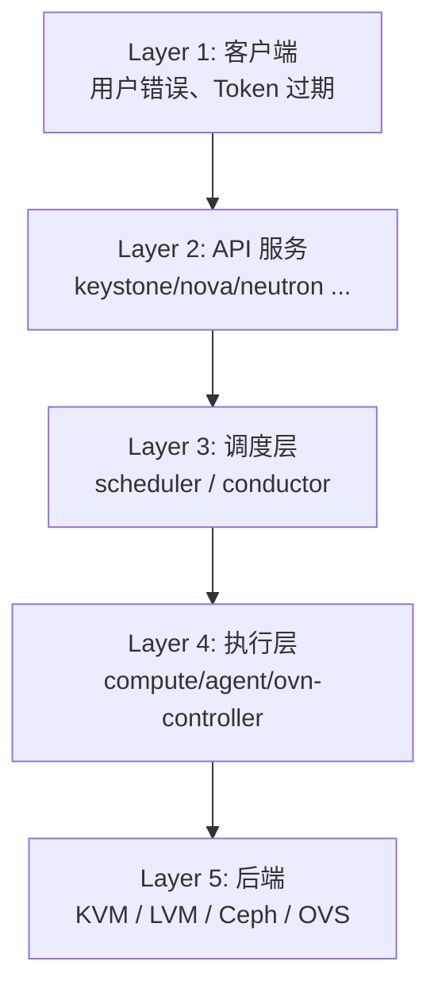
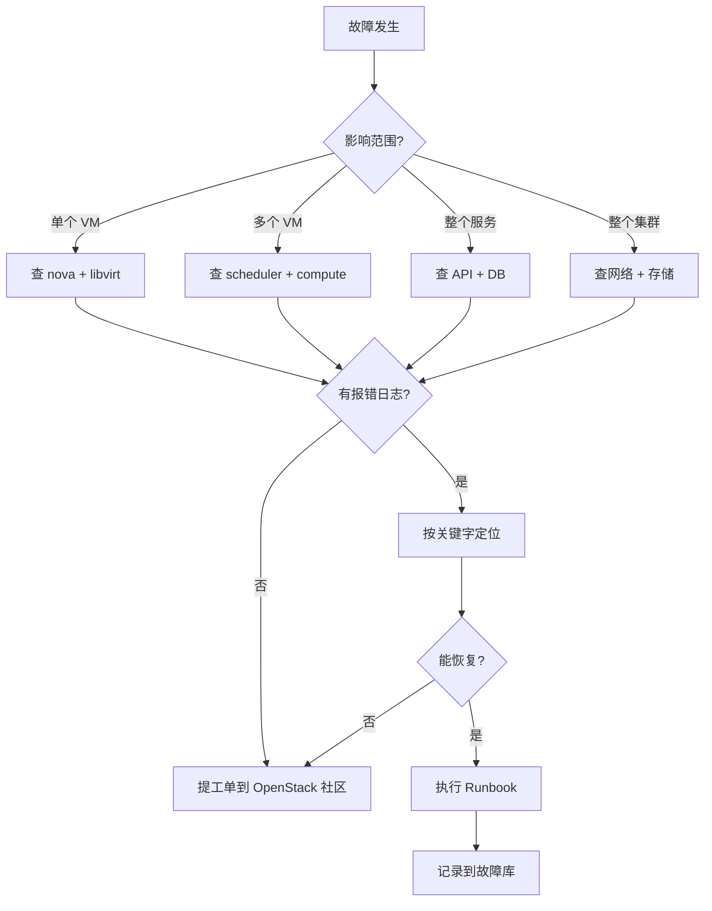
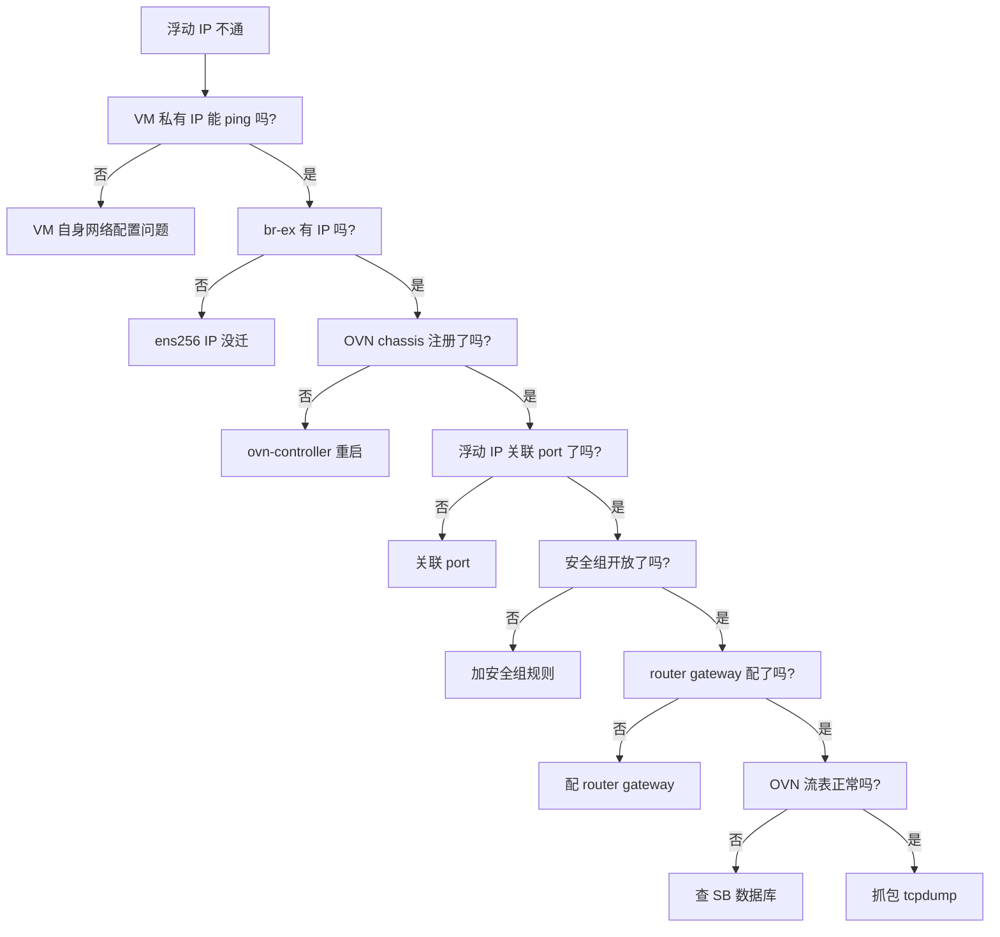
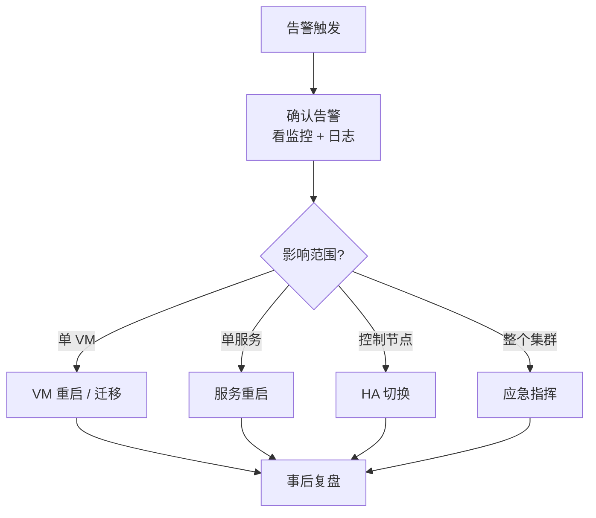

# OpenStack 故障排查与运维

> **一句话心智模型**：OpenStack 故障排查的本质是**逐层定位**——从用户 API 请求 → Keystone 验证 → 各服务业务逻辑 → 后端驱动（LVM/Ceph/Swift/OVN）→ 物理资源。每一层都有自己的日志和命令入口。掌握"症状 → 第一检查"映射表比背命令更重要。
>
> **本章范围**：故障方法论 + 7 类故障分类（认证/计算/网络/存储/镜像/控制平面/HA 切换）+ 性能调优 + 监控告警 + 应急响应 Runbook。

## 目录

- [[#§0 心智模型：OpenStack 故障排查的层次]]
- [[#§1 故障排查方法论]]
- [[#§2 认证故障（Keystone 401/403）]]
- [[#§3 计算故障（Nova VM 起不来）]]
- [[#§4 网络故障（Neutron 浮动 IP 不通）]]
- [[#§5 存储故障（Cinder 卷 attach 失败）]]
- [[#§6 镜像故障（Glance 上传失败）]]
- [[#§7 控制平面故障（API 慢/容器僵死）]]
- [[#§8 HA 切换故障（VIP 漂移异常）]]
- [[#§9 性能调优]]
- [[#§10 监控告警]]
- [[#§11 应急响应 Runbook]]
- [[#§12 与已有 vault 模块的链接]]

---

## §0 心智模型：OpenStack 故障排查的层次

OpenStack 故障排查必须**逐层穿透**。任何故障都可归到下面 5 层中的某一层（或多层）：



**每层有专属的诊断命令**：

| 层级 | 症状 | 诊断命令 |
|------|------|----------|
| L1 客户端 | 用户报错 | `openstack <cmd> --debug` |
| L2 API 服务 | API 500 | 看 `<service>.log` |
| L3 调度层 | 调度失败 | 看 `scheduler.log` |
| L4 执行层 | VM 起不来 | 看 `compute.log` + `agent.log` |
| L5 后端 | 物理资源 | `pvs / lvs / ovs-vsctl / ceph health` |

**关键原则**：

1. **从最低层往上排**：先看物理资源（VM 能起吗？磁盘有空间吗？网卡通吗？），再看上层
2. **从日志找上下文**：报错一定有 log；先 grep 关键字
3. **隔离变量**：一次只改一个配置，重启看效果
4. **留改前快照**：所有操作前先备份配置

---

## §1 故障排查方法论

### 1.1 系统化排查流程



### 1.2 黄金 5 条排查命令

```bash
# 1. 看错误上下文（带时间）
journalctl -u <service> --since "5 minutes ago"

# 2. 看资源使用
openstack service list
openstack compute service list
openstack network agent list
openstack volume service list

# 3. 看容器状态（kolla 部署）
docker ps -a --format 'table {{.Names}}\t{{.Status}}\t{{.Image}}'

# 4. 看 DB 健康
mysql -e "SHOW PROCESSLIST"
mysql -e "SHOW ENGINE INNODB STATUS"

# 5. 看集群状态
ceph health
rabbitmqctl list_queues
```

### 1.3 故障定位的 5 个维度

| 维度 | 工具 |
|------|------|
| 时间 | 日志时间戳 / `journalctl --since` |
| 空间 | DB / 配置文件 / 容器 |
| 流程 | 状态机 / API 时序图 |
| 资源 | CPU/内存/磁盘/网络 |
| 权限 | Token / Role / policy.json |

---

## §2 认证故障（Keystone 401/403）

### 2.1 401 Unauthorized

**症状**：`openstack user list` 报 `401 Unauthorized`

**最常见原因**：

1. Token 过期（默认 1 小时）
2. 用户名/密码错
3. Keystone 服务 down
4. Endpoint URL 错

**诊断步骤**：

```bash
# 1. 拿新 Token
source /etc/kolla/admin-openrc.sh  # kolla 部署
# 或
source ~/keystonerc_admin  # packstack 部署

openstack token issue  # 强制重新拿

# 2. 验证 Keystone 服务
openstack service list
# 应能看到 identity 服务

# 3. 看 Keystone 日志
tail -f /var/log/keystone/keystone.log
# 或 kolla 部署：
docker logs keystone
```

### 2.2 403 Forbidden

**症状**：API 返回 403，但 Token 有效

**最常见原因**：

1. 用户没角色（role）
2. 用户角色不匹配 API 要求的角色
3. policy.json 配置错

**诊断步骤**：

```bash
# 1. 看用户的角色
openstack role assignment list --user <user-id>

# 2. 加角色
openstack role add --project <project-id> --user <user-id> <role-name>

# 3. 看 service policy.json
cat /etc/nova/policy.json | python3 -m json.tool

# 4. 看 service log 确认具体拒绝原因
tail -f /var/log/nova/nova-api.log
```

### 2.3 完整认证故障 Runbook

```bash
#!/bin/bash
# /usr/local/bin/keystone-troubleshoot.sh

echo "=== Keystone 故障排查 Runbook ==="

# 1. 服务状态
echo "[1] Keystone 服务状态"
openstack service list | grep identity

# 2. Endpoint 可达
echo "[2] Keystone endpoint 可达性"
KEYSTONE_URL=$(openstack endpoint list | grep keystone | grep public | awk '{print $8}' | head -1)
curl -s -o /dev/null -w "%{http_code}\n" "$KEYSTONE_URL/v3"

# 3. 拿 Token 测试
echo "[3] 拿 Token"
TOKEN=$(openstack token issue -c id -f value 2>&1)
if [ $? -eq 0 ]; then
  echo "Token OK: ${TOKEN:0:20}..."
else
  echo "Token 失败：$TOKEN"
fi

# 4. DB 连通
echo "[4] Keystone DB"
docker exec mariadb mysql -e "USE keystone; SHOW TABLES;" 2>&1 | head -20

# 5. 关键日志
echo "[5] 最近 10 条 Keystone 错误日志"
docker logs --tail 100 keystone 2>&1 | grep -i error | tail -10
```

### 2.4 Token 相关故障

```bash
# Token 无效
openstack token issue
# 应该返回 X-Subject-Token

# Token 过期
# 现象：API 调用一段时间后报 401
# 原因：默认 1 小时
# 修复：
# 1. 重新登录
# 2. 或延长 token 有效期：
cat >> /etc/keystone/keystone.conf <<EOF
[token]
expiration = 7200  # 2 小时
EOF

# Token 与 endpoint 不匹配
# 现象：连 keystone v3 的 endpoint 用了 v2 token
# 修复：
export OS_IDENTITY_API_VERSION=3
```

---

## §3 计算故障（Nova VM 起不来）

### 3.1 调度失败：No valid host

**症状**：`openstack server create` 后 VM 状态一直 `BUILDING`，最后 ERROR

**最常见原因**：

1. 所有 compute 节点 RAM 不够（RamFilter 失败）
2. 所有 compute 节点磁盘不够（DiskFilter 失败）
3. compute 服务 down（ComputeFilter 失败）
4. flavor 的 extra_specs 与 compute 不匹配

**诊断步骤**：

```bash
# 1. 看 scheduler 日志
grep -E "Filtering|No valid host" /var/log/nova/nova-scheduler.log | tail -20

# 2. 看 compute 节点资源
openstack hypervisor list
openstack hypervisor show <hypervisor-id>

# 3. 看具体 compute 节点可用资源
for host in $(openstack compute service list -c Host -f value | sort -u); do
  echo "=== $host ==="
  openstack hypervisor show $host
done

# 4. 看 flavor
openstack flavor show <flavor-id>
```

**修复**：

```bash
# 方案 A：缩 flavor
openstack flavor set <flavor-id> --ram 512 --disk 10

# 方案 B：加 compute 节点
# （参考 [[05-OpenStack安装配置手册#§7 kolla-ansible 双节点部署]]）

# 方案 C：清理 compute 节点资源
openstack server list --host <compute-host> --all-projects
# 删除不用的 VM

# 方案 D：禁用部分 filter
# 临时方案（不推荐生产）
# /etc/nova/nova.conf
# [scheduler]
# scheduler_default_filters = ComputeFilter
```

### 3.2 VM 起不来：spawn 失败

**症状**：调度成功，但 VM 状态 ERROR

**最常见原因**：

1. libvirt 报错（驱动问题）
2. 镜像下载失败（compute 节点拉镜像失败）
3. 网络配置失败（Neutron 端口没创建）
4. 存储挂载失败（Cinder 卷 attach 失败）

**诊断步骤**：

```bash
# 1. 看 VM 的 fault 字段
openstack server show <vm-id> | grep -A 10 fault

# 2. 看 nova-compute 日志（compute 节点）
tail -f /var/log/nova/nova-compute.log

# 3. 看 libvirt 日志
tail -f /var/log/libvirt/libvirtd.log

# 4. 看 QEMU 日志
ls /var/log/libvirt/qemu/
cat /var/log/libvirt/qemu/instance-*.log | tail -50
```

### 3.3 VM 起得慢

**症状**：创建 VM 等待 > 5 分钟

**最常见原因**：

1. compute 节点无镜像缓存（首次启动）
2. Glance 后端慢（如 Swift over 远程）
3. Cinder 卷 attach 慢（Ceph RBD 网络慢）

**诊断步骤**：

```bash
# 1. 看 image-cache 命中率
ls -la /var/lib/nova/instances/_base/

# 2. 看 Glance 拉镜像耗时
grep "image download" /var/log/nova/nova-compute.log

# 3. 看 Cinder attach 耗时
grep "attach" /var/log/cinder/cinder-volume.log
```

**修复**：

```bash
# 启用 image_cache
cat >> /etc/nova/nova.conf <<EOF
[glance]
api_servers = http://controller:9292
[image_cache]
manager_interval = 60
EOF

# 预热 compute 节点缓存
glance image-download <image-id> --file /var/lib/nova/instances/_base/<image-id>
```

### 3.4 VM 运行中异常

| 症状 | 第一检查 |
|------|----------|
| VM 突然断网 | neutron agent + OVS 流表 |
| VM CPU 100% | 看 VM 内进程（SSH 进 VM） |
| VM 内存 OOM | 看 dmesg / syslog |
| VM 时间不同步 | chrony 状态 |
| VM 不能 SSH | 安全组规则 + 浮动 IP |

```bash
# VM 内诊断（SSH 进 VM）
top
free -h
df -h
dmesg | tail -20
systemctl status sshd
```

### 3.5 完整 Nova 故障 Runbook

```bash
#!/bin/bash
# /usr/local/bin/nova-troubleshoot.sh

VM_ID=$1
[ -z "$VM_ID" ] && { echo "Usage: $0 <vm-id>"; exit 1; }

echo "=== Nova 故障排查 Runbook (VM: $VM_ID) ==="

# 1. VM 状态
echo "[1] VM 状态"
openstack server show $VM_ID -c status -c fault -c host

# 2. 调度信息
echo "[2] 调度历史"
openstack server show $VM_ID -c properties

# 3. flavor
FLAVOR=$(openstack server show $VM_ID -c flavor -f value | awk -F"'" '{print $2}')
echo "[3] Flavor: $FLAVOR"
openstack flavor show $FLAVOR

# 4. compute 节点
HOST=$(openstack server show $VM_ID -c host -f value)
echo "[4] Compute 节点: $HOST"
ssh root@$HOST "openstack compute service list --host $HOST"

# 5. scheduler 日志（最近 50 行）
echo "[5] Scheduler 日志"
tail -50 /var/log/nova/nova-scheduler.log

# 6. compute 日志（最近 50 行）
echo "[6] Compute 日志"
ssh root@$HOST "tail -50 /var/log/nova/nova-compute.log"
```

---

## §4 网络故障（Neutron 浮动 IP 不通）

### 4.1 浮动 IP 不通（最经典）

**症状**：浮动 IP ping 不通，SSH 不通

**最常见原因**：

1. ens256 IP 没迁到 br-ex（最常见！）
2. ovn-controller 未注册到 chassis
3. 安全组规则缺失
4. router 没配 gateway
5. 浮动 IP 未关联到 port

**诊断流程（决策树）**：



### 4.2 关键修复代码（参考 KEY-CODE-EXAMPLES.md §1）

```bash
# === 立即修复 ===
ip addr flush dev ens256
ip addr add 192.168.100.10/24 dev br-ex

# === 持久化（NM dispatcher） ===
cat > /etc/NetworkManager/dispatcher.d/99-bridge-fix <<'EOF'
#!/bin/bash
case "$2" in
  up) ovs-vsctl add-port br-ex ens256 2>/dev/null
      ip addr flush dev ens256
      ip addr add 192.168.100.10/24 dev br-ex ;;
esac
EOF
chmod +x /etc/NetworkManager/dispatcher.d/99-bridge-fix

# === systemd 兜底 ===
cat > /etc/systemd/system/ovn-bridge-fix.service <<'EOF'
[Unit]
Description=OVN bridge IP migration fix
After=network.target

[Service]
Type=oneshot
RemainAfterExit=yes
ExecStart=/usr/local/bin/ovn-bridge-fix.sh

[Install]
WantedBy=multi-user.target
EOF
systemctl enable ovn-bridge-fix.service
```

### 4.3 VM 之间不通

**症状**：同 subnet 的两台 VM ping 不通

**诊断**：

```bash
# 1. 看 VM 自己的 IP
openstack server show <vm1-id> -c addresses

# 2. 看两个 VM 所在 compute 节点的 OVS 流表
ssh root@compute1 "ovs-ofctl dump-flows br-int | grep -E 'in_port|dl_dst'"
ssh root@compute2 "ovs-ofctl dump-flows br-int | grep -E 'in_port|dl_dst'"

# 3. 看 VXLAN 隧道
ssh root@compute1 "ovs-vsctl show | grep -A2 br-tun"

# 4. 跨节点 VXLAN 是否通
ssh root@compute1 "tcpdump -i any port 4789 -c 10 -n"
# 在 compute2 上 ping VM
```

### 4.4 安全组规则不生效

**症状**：安全组加了规则，但 VM 仍不能访问

**诊断**：

```bash
# 1. 看 VM 的安全组
openstack server show <vm-id> | grep security_groups

# 2. 看 VM 端口的安全组
PORT_ID=$(openstack port list --server <vm-id> -c ID -f value)
openstack port show $PORT_ID | grep security_group_ids

# 3. 在 compute 节点看实际 iptables 规则
ssh root@compute1 "iptables -L -nv | grep neutron"
```

**修复**：

```bash
# 加安全组规则
openstack security group rule create default \
  --protocol tcp --dst-port 22 --remote-ip 0.0.0.0/0

# 重启 compute 节点的 neutron agent
ssh root@compute1 "docker restart neutron_openvswitch_agent"
```

### 4.5 完整网络故障 Runbook

参考 NETWORK-ARCHITECTURE.md §7。

```bash
#!/bin/bash
# /usr/local/bin/neutron-troubleshoot.sh

echo "=== Neutron 故障排查 Runbook ==="

# 1. 看所有 neutron agent
echo "[1] neutron agents"
openstack network agent list

# 2. 看 OVN chassis
echo "[2] OVN chassis"
ovn-sbctl list chassis

# 3. 看 br-ex 状态
echo "[3] br-ex 状态"
ovs-vsctl show
ovs-ofctl show br-ex

# 4. 看 ens256
echo "[4] ens256"
ip addr show ens256

# 5. 看 OVN NB
echo "[5] OVN NB logical_router"
ovn-nbctl list logical_router | head -20

# 6. 看浮动 IP NAT
echo "[6] OVN NAT"
ovn-nbctl lr-nat-list <router-name>

# 7. 抓包
echo "[7] 浮动 IP 抓包（5 秒）"
timeout 5 tcpdump -i br-ex -n host <floating-ip>

# 8. 看 VXLAN 流量
echo "[8] VXLAN 抓包（5 秒）"
timeout 5 tcpdump -i any port 4789 -n -c 20
```

---

## §5 存储故障（Cinder 卷 attach 失败）

### 5.1 卷创建失败

**症状**：`openstack volume create` 后卷状态 ERROR

**诊断**：

```bash
# 1. 看卷详情
openstack volume show <vol-id> | grep -A 10 message

# 2. 看 cinder-volume 日志
docker logs cinder_volume | tail -50

# 3. 看 cinder-scheduler 日志
docker logs cinder_scheduler | tail -50

# 4. 看后端池
cinder get-pools
```

### 5.2 卷 attach 失败

**症状**：`openstack server add volume` 失败

**最常见原因**：

1. 卷与 VM 不在同一可用区
2. iSCSI 连接失败
3. RBD 连接失败

**诊断**：

```bash
# 1. 看卷与 VM 的 AZ
openstack volume show <vol-id> | grep availability_zone
openstack server show <vm-id> | grep availability_zone

# 2. 看 attach 日志
docker logs cinder_volume | grep <vol-id>
ssh root@compute1 "tail -f /var/log/cinder/cinder-volume.log"
```

### 5.3 Cinder 性能慢

**症状**：卷 IO 慢（> 10ms）

**诊断**：

```bash
# 1. 看 VM 内 IO 性能
ssh root@<vm> "iostat -x 1 5"

# 2. 看后端性能
# LVM：iostat 看物理磁盘
iostat -x /dev/sdb 1 5

# Ceph：ceph health + rbd perf
ceph health
rbd perf image <pool>/<image>

# 3. 看网络（iSCSI/RBD 走网络）
iftop -i <nic>
```

### 5.4 Cinder 完整 Runbook

```bash
#!/bin/bash
# /usr/local/bin/cinder-troubleshoot.sh

VOL_ID=$1
[ -z "$VOL_ID" ] && { echo "Usage: $0 <vol-id>"; exit 1; }

echo "=== Cinder 故障排查 Runbook (Vol: $VOL_ID) ==="

# 1. 卷状态
echo "[1] 卷状态"
openstack volume show $VOL_ID -c status -c attachments -c availability_zone

# 2. 卷类型
echo "[2] 卷类型"
openstack volume show $VOL_ID -c volume_type

# 3. 看后端
echo "[3] 后端状态"
cinder get-pools

# 4. 看 cinder-volume 日志
echo "[4] cinder-volume 日志"
docker logs --tail 50 cinder_volume

# 5. 看 attach VM（如果是 attach 失败）
ATTACHED=$(openstack volume show $VOL_ID -c attachments -f value)
[ "$ATTACHED" != "[]" ] && {
  VM_ID=$(echo $ATTACHED | python3 -c "import json,sys;d=json.load(sys.stdin);print(d[0]['server_id'])" 2>/dev/null)
  echo "[5] attached to VM: $VM_ID"
  ssh root@$(openstack server show $VM_ID -c host -f value) "tail -50 /var/log/cinder/cinder-volume.log"
}
```

---

## §6 镜像故障（Glance 上传失败）

### 6.1 镜像上传失败

**症状**：`glance image-create --file ...` 报 ERROR

**诊断**：

```bash
# 1. 看镜像状态
glance image-show <image-id> | grep status

# 2. 看 glance-api 日志
docker logs glance_api | tail -50

# 3. 看后端存储
df -h /var/lib/glance/images/  # 本地文件系统后端
# 或
ceph -s  # Ceph RBD 后端
```

### 6.2 镜像不可见

**症状**：`openstack image list` 看不到刚上传的镜像

**诊断**：

```bash
# 1. 看 visibility
glance image-show <image-id> | grep visibility

# 2. 列所有 visibility
glance image-list --visibility community
glance image-list --visibility shared

# 3. 共享给本 project
glance member-create --member-id <project-id> <image-id>
```

### 6.3 镜像下载慢

**症状**：`openstack image save` 或 VM 启动慢

**诊断**：

```bash
# 1. 看 glance-api 是否限速
grep "limit" /var/log/glance/glance-api.log

# 2. 看后端 IO
iostat -x /var/lib/glance/images/ 1 5
```

---

## §7 控制平面故障（API 慢/容器僵死）

### 7.1 OpenStack API 慢

**症状**：`openstack server list` 等待 > 5 秒

**最常见原因**：

1. RabbitMQ 队列堆积
2. DB 慢查询
3. API 进程数不够
4. 网络抖动

**诊断**：

```bash
# 1. 看 RabbitMQ 队列
rabbitmqctl list_queues name messages messages_unacknowledged
# 如果某队列 messages > 1000 → 堆积

# 2. 看 DB 慢查询
mysql -e "SHOW PROCESSLIST" | head
mysql -e "SHOW ENGINE INNODB STATUS" | grep -A 20 "LATEST DETECTED DEADLOCK"

# 3. 看 API 进程数
docker ps | grep -E "keystone|nova_api|neutron_server" | wc -l
```

### 7.2 容器僵死

**症状**：容器状态 `Up` 但服务无响应

**诊断**：

```bash
# 1. 看容器健康
docker ps --format 'table {{.Names}}\t{{.Status}}'

# 2. 看容器日志
docker logs --tail 100 <container>

# 3. 看容器进程
docker top <container>

# 4. 重启容器
docker restart <container>
```

### 7.3 控制节点重启后服务无法启动

**症状**：VM 创建正常，但某些服务报错

**诊断**：

```bash
# 1. 看容器是否启动
docker ps -a | grep -v "Up"

# 2. 看 kolla 配置
ls /etc/kolla/

# 3. 重跑 kolla-ansible deploy（幂等）
kolla-ansible -i multinode deploy
```

---

## §8 HA 切换故障（VIP 漂移异常）

### 8.1 VIP 漂移失败

**症状**：controller1 故障后，VIP 没漂移到 controller2

**诊断**：

```bash
# 1. 看所有 controller 的 VIP 状态
for host in controller1 controller2 controller3; do
  echo "=== $host ==="
  ssh root@$host "ip addr show | grep 192.168.56.100"
done

# 2. 看 keepalived 日志
docker logs keepalived

# 3. 看 keepalived 配置
cat /etc/kolla/keepalived/keepalived.conf

# 4. 看网络是否通（keepalived 用 VRRP）
tcpdump -i any vrrp -n
```

**修复**：

```bash
# 重启 keepalived
docker restart keepalived

# 检查防火墙（VRRP 协议号 112）
iptables -L -nv | grep 112

# 强制重选主（修改优先级）
# 在某个 controller 修改 keepalived 优先级
# 然后 systemctl restart keepalived
```

### 8.2 VIP 漂移后服务不通

**症状**：VIP 漂移成功，但 API 调用失败

**诊断**：

```bash
# 1. 看 haproxy 状态
docker logs haproxy

# 2. 看 haproxy 后端
docker exec haproxy sh -c "echo 'show stat' | socat stdio /var/run/haproxy.sock" | head -30

# 3. 看后端服务（nova_api / keystone / ...）
docker ps | grep -E "keystone|nova_api"
```

### 8.3 Galera 集群脑裂

**症状**：3 个 controller 之间 Galera 状态不一致

**诊断**：

```bash
# 1. 看每个 controller 的 Galera 状态
for host in controller1 controller2 controller3; do
  echo "=== $host ==="
  ssh root@$host "docker exec mariadb mysql -e 'SHOW STATUS LIKE \"wsrep_cluster_size\"'"
done
# 应该都显示 3

# 2. 如果某个节点显示 1 → 它是孤立的
# 修复：重启 mariadb 让它重新加入
ssh root@<isolated-node> "docker restart mariadb"
```

---

## §9 性能调优

### 9.1 API 性能

参考 [[01-OpenStack核心概念#§18 性能调优]]。

### 9.2 网络性能

```ini
# OVS 调优
ovs-vsctl set Open_vSwitch . other_config:pmq=True  # 巨帧
ovs-vsctl set Open_vSwitch . other_config:stats-update-interval=5000

# OVN 调优
ovn-sbctl set connection . inactivity_probe=60000
```

### 9.3 存储性能

```ini
# LVM 调优
echo deadline > /sys/block/sdb/queue/scheduler
echo 4096 > /sys/block/sdb/queue/read_ahead_kb

# Ceph 调优
[ceph-backend]
rbd_store_chunk_size = 64
rbd_cache = true
rbd_cache_size = 256
```

### 9.4 数据库性能

```sql
-- 给常用字段加索引
ALTER TABLE nova.instances ADD INDEX idx_host (host);
ALTER TABLE nova.instances ADD INDEX idx_uuid (uuid);

-- 给 nova API 缓存
SET GLOBAL query_cache_size = 64 * 1024 * 1024;
```

### 9.5 性能基准测试

参考 [[05-OpenStack安装配置手册#§17 性能基准测试]]。

---

## §10 监控告警

### 10.1 监控指标

参考 [[05-OpenStack安装配置手册#§16 集群监控集成]]。

### 10.2 关键告警规则

| 告警 | 阈值 | 严重度 |
|------|------|--------|
| Nova service down | > 2 分钟 | critical |
| Neutron agent down | > 2 分钟 | critical |
| Cinder volume down | > 2 分钟 | critical |
| DB 慢查询 > 1s | > 100/分钟 | warning |
| RabbitMQ 队列堆积 | > 10000 | warning |
| VIP 不在 controller | - | critical |
| 容器重启 | > 3 次/小时 | warning |
| 磁盘使用率 | > 80% | warning |
| 内存使用率 | > 85% | warning |

### 10.3 告警通知

```yaml
# alertmanager.yml
route:
  receiver: 'openstack-team'
  group_wait: 30s
  group_interval: 5m
  repeat_interval: 4h
  routes:
    - match:
        severity: critical
      receiver: 'oncall'
      group_wait: 10s
```

---

## §11 应急响应 Runbook

### 11.1 应急响应流程



### 11.2 紧急情况 Runbook

**情况 1：所有 VM 创建失败**

```bash
# 1. 看 nova 服务
openstack compute service list

# 2. 看 scheduler 日志
tail -50 /var/log/nova/nova-scheduler.log

# 3. 看 RabbitMQ
rabbitmqctl list_queues

# 4. 恢复（如果 RabbitMQ 队列堆积）
rabbitmqctl purge_queue <queue-name>
# 重启 nova-scheduler
systemctl restart devstack@n-sch  # devstack
docker restart nova_scheduler  # kolla
```

**情况 2：DB 故障**

```bash
# 1. 看 DB 状态
docker exec mariadb mysql -e "SHOW STATUS LIKE 'wsrep_cluster_size'"

# 2. 重启 DB（如果 Galera 脑裂）
ssh root@<isolated-node> "docker restart mariadb"

# 3. 如果完全 down，看磁盘空间
df -h /var/lib/docker
```

**情况 3：控制节点全部 down**

```bash
# 1. 看 keepalived / VIP
docker logs keepalived

# 2. 看存储（如果用共享存储）
ceph health

# 3. 紧急恢复
# 在 compute 节点上，把本地临时数据备份到外部
```

### 11.3 故障复盘模板

```markdown
## 故障报告

- **时间**：2026-XX-XX HH:MM
- **影响**：X 个 VM / Y 个服务 / Z 小时
- **根因**：[根因分析]
- **处理过程**：
  1. ...
  2. ...
- **教训**：
  - ...
- **改进措施**：
  - ...
```

---

最后更新: 2026-08-11 03:00（T8 Stage 6 Code 完成）