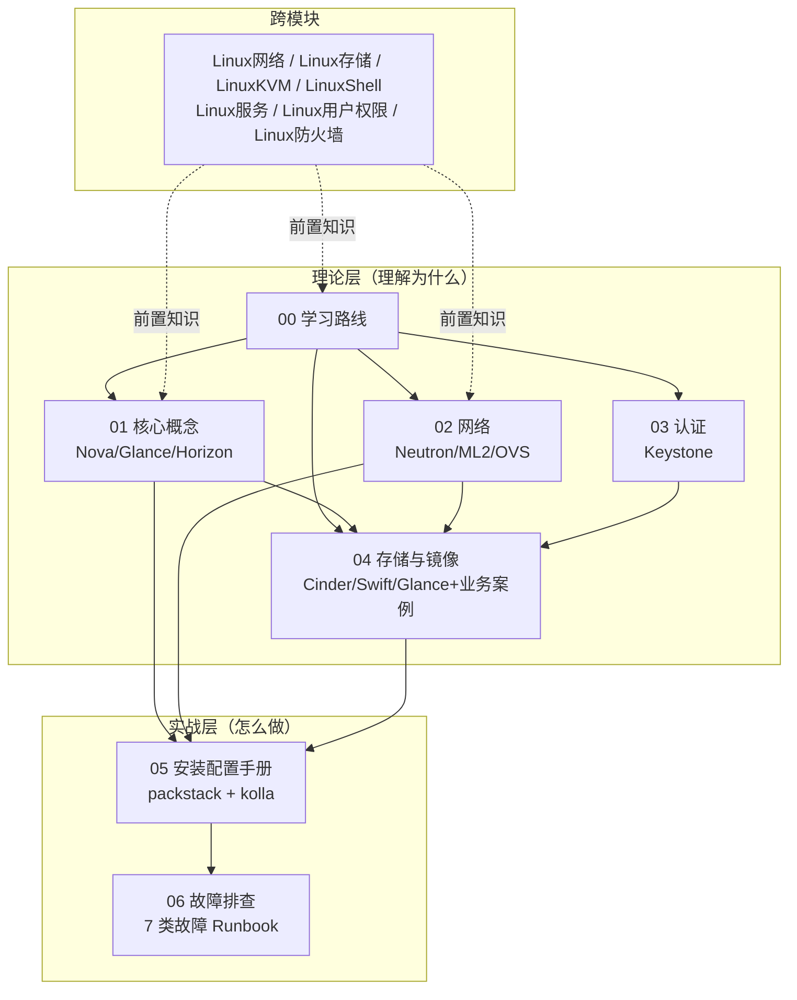
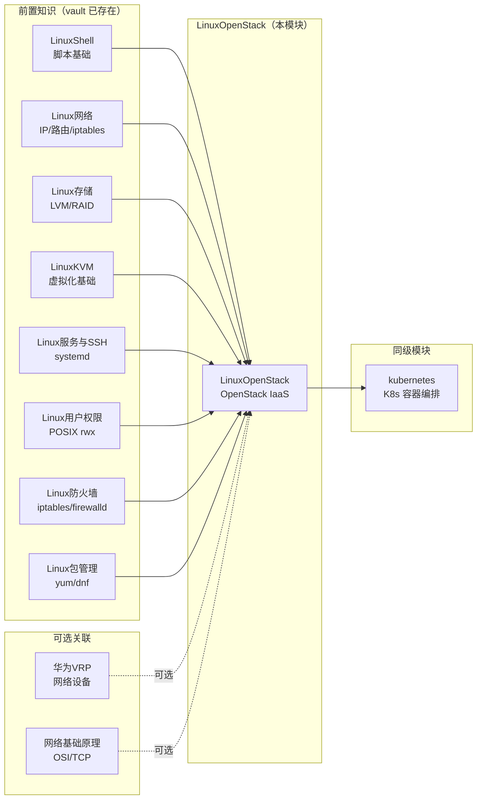
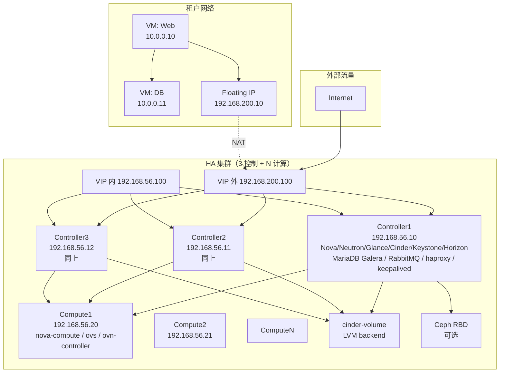
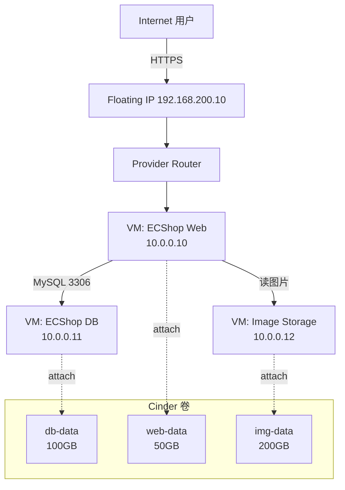

# OpenStack 模块主页

> **一句话心智模型**：OpenStack = 一组松耦合的 IaaS 微服务（Nova/Neutron/Keystone/Cinder/Swift/Glance/Horizon），通过 REST API + Keystone Token + 消息总线协作。本模块按"理论 → 网络 → 认证 → 存储 → 部署 → 故障"7 章组织，从概念到生产全链路覆盖。
>
> **本章定位**：本笔记是模块门面，**承担索引与跨章节引用职责**。每个主题的详细内容请跳转到对应分章节。

## 目录

- [[#§0 模块心智模型]]
- [[#§1 模块依赖图（在 vault 中的位置）]]
- [[#§2 7 个分章节摘要]]
- [[#§3 部署架构全景图]]
- [[#§4 故障排查索引]]
- [[#§5 业务案例索引：电商云平台]]
- [[#§6 跨模块链接（指向已有 vault 模块）]]
- [[#§7 学习路线与面试地图]]
- [[#§8 命令速查（按服务分类）]]
- [[#§9 与 K8s 模块的对照阅读]]
- [[#§10 资源链接]]

---

## §0 模块心智模型



**模块组织原则**：

1. **理论先行**：先理解 7 大服务的概念（01~04）
2. **网络独立成章**：Neutron 是 OpenStack 最复杂的部分，独立成 02
3. **认证单独成章**：Keystone 是所有服务的基础，但本身概念独立（03）
4. **存储含业务案例**：Cinder/Swift/Glance 与业务强关联（04）
5. **安装配置独立**：避免污染理论章节（05）
6. **故障分类**：7 类故障 Runbook（06）

---

## §1 模块依赖图（在 vault 中的位置）



**前置依赖**（学 OpenStack 之前应掌握）：

| vault 模块 | 对应 OpenStack 知识 |
|------------|---------------------|
| [[Linux网络]] | Neutron/OVS 网络基础 |
| [[Linux存储]] | Cinder LVM 后端 |
| [[LinuxKVM]] | Nova 底层虚拟化 |
| [[LinuxShell]] | 部署脚本（bash + ansible） |
| [[Linux服务与SSH]] | systemd + SSH 免密 |
| [[Linux用户权限]] | Keystone RBAC 概念 |
| [[Linux防火墙]] | iptables 是安全组底层 |
| [[Linux包管理]] | yum/dnf 装包 |

---

## §2 7 个分章节摘要

### 2.1 章节总览

| 章节 | 文件 | 行数 | mermaid | 主题 |
|------|------|------|---------|------|
| 00 学习路线 | [[00-OpenStack学习路线]] | 452 | 1 | 路线 + 资料 + 复习题 |
| 01 核心概念 | [[01-OpenStack核心概念]] | 1317 | 10 | Nova/Glance/Horizon/Cell |
| 02 网络 | [[02-OpenStack网络]] | 1072 | 10 | Neutron/ML2/OVS/OVN/DVR |
| 03 认证 | [[03-OpenStack认证与多租户]] | 1006 | 6 | Keystone/Domain/RBAC |
| 04 存储与镜像 | [[04-OpenStack存储与镜像]] | 1604 | 11 | Cinder/Swift/Glance+ECShop |
| 05 安装配置 | [[05-OpenStack安装配置手册]] | 1802 | 10 | packstack + kolla-ansible |
| 06 故障排查 | [[06-OpenStack故障排查与运维]] | 1069 | 4 | 7 类故障 + Runbook |
| **合计** | — | **8322** | **52** | — |

### 2.2 章节核心内容速览

#### 00 学习路线（452 行）
- 4 PDF 教材 + 2 部署项目 + Keystone 笔记 685 行 = 完整素材地图
- 实验环境策略：VMware 三网段（管理/外部/上网）
- 复习 Checklist：4 层 17 项（概念/部署/故障/业务）
- 速查表：命令/配置/端口/路径

#### 01 核心概念（1317 行）
- 7 大服务地图：每个服务管一类资源
- **Nova**：架构 + 组件 + Cell 架构 + 调度器（filter + weigher）
- **Glance**：后端存储（本地/Swift/Ceph）+ 镜像格式 + 状态机
- **Horizon**：Web 控制台（Django + Apache）
- 与 K8s 资源模型对比 + 4 个反直觉点

#### 02 网络（1072 行）
- Neutron **三层架构**：ML2 plugin + Mechanism driver + Agent
- **OVS vs OVN**：传统 vs 新一代
- Provider Network vs Tenant Network
- **浮动 IP 完整通信流程**：从用户点击到 VM 接收的 12 步
- **br-ex IP 迁移实战**：最常踩的坑
- 冷启动自动恢复机制 + DVR 分布式虚拟路由器

#### 03 认证与多租户（1006 行）
- 吸收 685 行高质量原稿（基于《OpenStack管理》PDF Keystone 章节）
- 10 个核心概念：Domain/User/Group/Project/Role/Service/Endpoint/Token/Credential/Auth vs Authz
- 3 个 mermaid 认证时序图（整体/查询镜像/创建 VM）
- 多域登录、policy.json、30 题复习

#### 04 存储与镜像（1604 行）
- 三类存储对比：Glance（镜像）vs Cinder（卷）vs Swift（对象）
- Cinder 后端实战：LVM / Ceph RBD / NFS / 第三方
- Cinder **多后端配置** + 卷类型 + QoS
- **业务案例：电商云平台（ECShop）**：完整部署流程
- 毕业论文 thesis 6 章知识地图

#### 05 安装配置（1802 行）
- **三种部署形态**：packstack 入门 / kolla 双节点 / kolla HA
- packstack 单节点 + 3 节点完整步骤
- kolla-ansible 双节点 5 阶段（precheck → pull → deploy → post-deploy）
- kolla-ansible HA 三控制节点（keepalived + haproxy + Galera）
- **镜像同步**：国内源 + ACR + 离线部署
- 集群升级路径

#### 06 故障排查（1069 行）
- 故障排查方法论：5 层穿透（客户端/API/调度/执行/后端）
- **7 类故障**：认证/计算/网络/存储/镜像/控制平面/HA 切换
- 每类含：症状 → 第一检查 → 修复步骤 → Runbook
- 性能调优 + 监控告警 + 应急响应

---

## §3 部署架构全景图

### 3.1 生产级 HA 架构（推荐）



### 3.2 关键参数

| 组件 | 数量 | 配置 |
|------|------|------|
| Controller | 3 | 4 vCPU / 8GB / 100GB 系统盘 |
| Compute | 2+ | 4 vCPU / 8GB / 100GB 系统盘 + 500GB 数据盘 |
| Cinder Volume | 1+ | LVM 或 Ceph |
| 网络 VIP | 2 | 内 + 外 |
| MariaDB | 3 节点 Galera | 复制 |
| RabbitMQ | 3 节点 mirrored | 集群 |
| 镜像数 | 38 个 kolla 镜像 | 同步到 ACR |

### 3.3 与简单部署对比

| 维度 | packstack 单节点 | kolla 双节点 | kolla HA |
|------|------------------|---------------|----------|
| 节点数 | 1 | 2 | 4+ |
| 内存总需求 | 6GB | 8GB | 16GB+ |
| HA | ❌ | ❌ | ✅ |
| 适用 | 学习 | 小型生产 | 生产标准 |
| 部署时间 | 30 min | 2-3 h | 4-6 h |

详见 [[05-OpenStack安装配置手册#§0 心智模型]]。

---

## §4 故障排查索引

### 4.1 7 类故障速查表

| 类别 | 最常见症状 | 第一检查 | 详细章节 |
|------|------------|----------|----------|
| **认证** | 401/403 | Token + role | [[06-OpenStack故障排查与运维#§2 认证故障]] |
| **计算** | No valid host | scheduler log | [[06-OpenStack故障排查与运维#§3 计算故障]] |
| **网络** | 浮动 IP 不通 | br-ex IP | [[06-OpenStack故障排查与运维#§4 网络故障]] |
| **存储** | 卷 attach 失败 | cinder-volume log | [[06-OpenStack故障排查与运维#§5 存储故障]] |
| **镜像** | 上传失败 | glance-api + 后端 | [[06-OpenStack故障排查与运维#§6 镜像故障]] |
| **控制平面** | API 慢 | RabbitMQ + DB | [[06-OpenStack故障排查与运维#§7 控制平面故障]] |
| **HA 切换** | VIP 不漂移 | keepalived log | [[06-OpenStack故障排查与运维#§8 HA 切换故障]] |

### 4.2 黄金 5 条排查命令

```bash
# 1. 看错误上下文
journalctl -u <service> --since "5 minutes ago"

# 2. 看资源使用
openstack service list && openstack compute service list && openstack network agent list

# 3. 看容器状态（kolla 部署）
docker ps -a --format 'table {{.Names}}\t{{.Status}}\t{{.Image}}'

# 4. 看 DB 健康
mysql -e "SHOW PROCESSLIST"

# 5. 看集群状态
ceph health && rabbitmqctl list_queues
```

### 4.3 经典故障：浮动 IP 不通

**症状**：浮动 IP ping 不通，时通时不通

**根因**：ens256 IP 没迁到 br-ex（最常见！）

**立即修复**：

```bash
ip addr flush dev ens256
ip addr add 192.168.100.10/24 dev br-ex
```

**持久化**：

```bash
cat > /etc/NetworkManager/dispatcher.d/99-bridge-fix <<'EOF'
#!/bin/bash
case "$2" in
  up) ovs-vsctl add-port br-ex ens256 2>/dev/null
      ip addr flush dev ens256
      ip addr add 192.168.100.10/24 dev br-ex ;;
esac
EOF
chmod +x /etc/NetworkManager/dispatcher.d/99-bridge-fix
```

详见 [[06-OpenStack故障排查与运维#§4 网络故障]]。

---

## §5 业务案例索引：电商云平台

### 5.1 业务案例全景

**论文题目**：基于 OpenStack 的电商云平台的设计与实现
**来源**：`E:\QQ下载\基于OpenStack的电商云平台的设计与实现-格式转换.pdf`（58 页）+ `E:\openstack-deploy\thesis\` 6 章

### 5.2 业务架构



### 5.3 业务案例涉及的章节

| 业务环节 | 对应章节 |
|----------|----------|
| 部署 OpenStack | [[05-OpenStack安装配置手册]] |
| 创建 VM | [[01-OpenStack核心概念#§7 Nova 系统架构]] |
| 配网络（浮动 IP） | [[02-OpenStack网络#§7 浮动 IP 完整通信流程]] |
| 创建 Cinder 卷 | [[04-OpenStack存储与镜像#§2 Cinder]] |
| 安装 ECShop | [[04-OpenStack存储与镜像#§11 ECShop 部署代码解析]] |
| MySQL 主从 | [[04-OpenStack存储与镜像#§19 ECShop 进阶运维]] |
| 故障排查 | [[06-OpenStack故障排查与运维]] |

### 5.4 业务案例 vs 论文 thesis

| thesis 章节 | 主题 | 笔记对应 |
|-------------|------|----------|
| chapter1 绪论 | 研究背景 | [[00-OpenStack学习路线#§0 心智模型]] |
| chapter2 理论基础 | 云计算 + OpenStack | [[01-OpenStack核心概念#§1 OpenStack 是什么]] |
| chapter3 需求分析与设计 | 业务 + 架构 | [[05-OpenStack安装配置手册#§0 心智模型]] |
| chapter4 系统实现 | 部署 + 关键代码 | [[05-OpenStack安装配置手册#§7 kolla-ansible 双节点部署]] + [[04-OpenStack存储与镜像#§11 ECShop 部署代码解析]] |
| chapter5 测试验证 | 功能 + 性能 + HA | [[06-OpenStack故障排查与运维#§9 性能调优]] |
| chapter6 总结展望 | 不足 + 展望 | [[05-OpenStack安装配置手册#§22 学习路径与下一步]] |

---

## §6 跨模块链接（指向已有 vault 模块）

### 6.1 强依赖（学 OpenStack 必读）

| vault 模块 | OpenStack 知识点 | 章节引用 |
|------------|-------------------|----------|
| [[Linux网络]] | Neutron/OVS/ML2 | [[02-OpenStack网络]] |
| [[Linux存储]] | Cinder LVM 后端 | [[04-OpenStack存储与镜像#§4 Cinder 后端实战]] |
| [[LinuxKVM]] | Nova 底层虚拟化 | [[01-OpenStack核心概念#§8 Nova 组件详解]] |
| [[LinuxShell]] | 部署脚本基础 | [[05-OpenStack安装配置手册#§7 kolla-ansible 双节点部署]] |
| [[Linux服务与SSH]] | systemd + SSH 免密 | [[05-OpenStack安装配置手册#§7 kolla-ansible 双节点部署]] |
| [[Linux用户权限]] | Keystone RBAC 概念 | [[03-OpenStack认证与多租户#§2 核心概念详解]] |
| [[Linux防火墙]] | iptables 安全组底层 | [[02-OpenStack网络#§11 安全组]] |
| [[Linux包管理]] | yum/dnf 装包 | [[05-OpenStack安装配置手册#§3 packstack 单节点部署]] |

### 6.2 中等依赖

| vault 模块 | OpenStack 知识点 | 章节引用 |
|------------|-------------------|----------|
| [[Linux进程与负载]] | 高 CPU/内存排查 | [[06-OpenStack故障排查与运维#§9 性能调优]] |
| [[LinuxRAID]] | Cinder 第三方后端 | [[04-OpenStack存储与镜像#§4.4 第三方后端]] |
| [[LinuxSELinux]] | SELinux 排错 | [[05-OpenStack安装配置手册#§11 部署期故障排查]] |
| [[Linux日志与时间]] | chrony 时间同步 | [[05-OpenStack安装配置手册#§7.5 Phase 1 系统初始化]] |

### 6.3 弱关联（可选）

| vault 模块 | 关联点 |
|------------|--------|
| [[Linux编辑器]] | vim 改配置文件 |
| [[Linux文件传输]] | scp 传输镜像 tar |
| [[Linux目录]] | 配置文件目录结构 |
| [[Linux文本处理]] | awk/sed 改配置文件 |
| [[Linux计划任务]] | 备份脚本（cron） |
| [[Linux启动原理]] | systemd 启动顺序 |
| [[Linux总览.canvas]] | vault 全景图 |
| [[LinuxDNS]] | 内部 DNS（可选） |
| [[LinuxDHCP]] | Neutron DHCP agent（可选） |
| [[LinuxNFS]] | Cinder NFS 后端 |
| [[LinuxNginx]] | ECShop 反向代理（可选） |
| [[LinuxRedis]] | ECShop session 缓存 |
| [[LinuxKeepalived]] | OpenStack HA 用的就是 keepalived |

### 6.4 业务对照

| vault 模块 | 对照点 |
|------------|--------|
| [[kubernetes]] | K8s vs OpenStack（容器 vs VM） |
| [[华为VRP]] | Provider Network 用 VLAN 时对接交换机 |
| [[网络基础原理]] | OSI 模型对应到 Neutron 各层 |
| [[路由与VLAN]] | VLAN tagging 概念 |

---

## §7 学习路线与面试地图

### 7.1 推荐学习顺序


### 7.2 面试高频考点

| 考点 | 频度 | 对应章节 |
|------|------|----------|
| 7 大服务的关系 | ⭐⭐⭐⭐⭐ | [[01-OpenStack核心概念#§0 心智模型]] |
| 创建 VM 完整流程 | ⭐⭐⭐⭐⭐ | [[01-OpenStack核心概念#§12 7 大服务完整协作流]] |
| Keystone Token 生命周期 | ⭐⭐⭐⭐ | [[03-OpenStack认证与多租户#§3 工作流程与认证机制]] |
| Neutron 三层架构 | ⭐⭐⭐⭐ | [[02-OpenStack网络#§1 Neutron 三层架构总览]] |
| Nova scheduler filter | ⭐⭐⭐⭐ | [[01-OpenStack核心概念#§10 Nova Scheduler]] |
| Cinder 后端选择 | ⭐⭐⭐ | [[04-OpenStack存储与镜像#§4 Cinder 后端实战]] |
| HA 切换原理 | ⭐⭐⭐ | [[05-OpenStack安装配置手册#§8.7 HA 切换测试]] |
| 浮动 IP 通信流程 | ⭐⭐⭐⭐ | [[02-OpenStack网络#§7 浮动 IP 完整通信流程]] |
| Cell 架构 | ⭐⭐ | [[01-OpenStack核心概念#§9 Nova Cell 架构]] |
| OVN vs OVS | ⭐⭐ | [[02-OpenStack网络#§5 OVN 架构]] |

### 7.3 面试问题模板（30 题）

参考 [[00-OpenStack学习路线#§8 复习题库]]（30 题速记）。

---

## §8 命令速查（按服务分类）

### 8.1 Nova（计算）

```bash
openstack server list                                # 列 VM
openstack server create <name> --flavor <f> --image <i> --network <n>  # 创建
openstack server show <id>                          # 详情
openstack server delete <id>                        # 删除
openstack flavor list                                # 列规格
nova hypervisor-list                                 # 列 compute 节点
```

### 8.2 Neutron（网络）

```bash
openstack network list                               # 列网络
openstack subnet list                                # 列子网
openstack router list                                # 列路由器
openstack floating ip list                           # 列浮动 IP
openstack security group list                        # 列安全组
openstack port list                                  # 列端口
```

### 8.3 Cinder（存储）

```bash
openstack volume list                                # 列卷
openstack volume create --size 100 --type <type> <name>  # 创建
openstack server add volume <vm> <vol>               # attach
openstack server remove volume <vm> <vol>            # detach
openstack volume snapshot list                       # 列快照
openstack volume type list                           # 列卷类型
```

### 8.4 Glance（镜像）

```bash
openstack image list                                 # 列镜像
openstack image create --name <n> --file <f> --disk-format qcow2 --container-format bare  # 上传
openstack image save <id> --file <f>                # 下载
openstack image delete <id>                          # 删除
```

### 8.5 Keystone（认证）

```bash
openstack token issue                                # 拿 Token
openstack user list                                  # 列用户
openstack project list                               # 列项目
openstack role list                                  # 列角色
openstack role add --project <p> --user <u> <r>     # 加角色
```

### 8.6 Swift（对象）

```bash
swift list                                           # 列容器
swift upload <container> <file>                      # 上传
swift download <container> <file>                    # 下载
swift stat                                           # 统计
swift tempurl GET 3600 /v1/<account>/<container>/<object>  # 临时 URL
```

### 8.7 kolla-ansible

```bash
kolla-ansible -i multinode prechecks                 # 预检
kolla-ansible -i multinode pull                      # 拉镜像
kolla-ansible -i multinode deploy                    # 部署
kolla-ansible -i multinode post-deploy               # 部署后
kolla-ansible -i multinode upgrade                   # 升级
```

---

## §9 与 K8s 模块的对照阅读

参考 [[kubernetes]] 模块（E:\Linux\kubernetes\）。

### 9.1 资源模型对比

| 维度 | OpenStack | K8s |
|------|-----------|-----|
| 调度对象 | VM | Pod |
| 资源描述 | flavor | request/limit |
| 调度速度 | 秒级 | 毫秒级 |
| 网络 | Neutron（VM 网卡） | CNI（Pod 网卡） |
| 存储 | Cinder / Swift | CSI |
| 调度算法 | filter + weigher | predicates + priorities |
| 业务定位 | IaaS | 容器编排 |

### 9.2 控制平面对比

| OpenStack | K8s |
|-----------|-----|
| nova-api | kube-apiserver |
| nova-scheduler | kube-scheduler |
| nova-conductor | controller-manager |
| nova-compute | kubelet |
| neutron-server | cni-controller |
| cinder-api | csi-controller |

### 9.3 现实部署选择

- **传统企业**（稳态业务）→ OpenStack
- **互联网/云原生**（弹性业务）→ K8s
- **混合**（K8s on OpenStack）→ OpenStack 跑 K8s 节点

详见 [[00-OpenStack学习路线#§6 后续深化路线]] 与 `E:\Linux\kubernetes\00-Kubernetes学习路线.md`。

---

## §10 资源链接

### 10.1 官方资源

| 资源 | URL |
|------|-----|
| OpenStack 文档 | https://docs.openstack.org/ |
| kolla-ansible 文档 | https://docs.openstack.org/kolla-ansible/latest/ |
| API 参考 | https://docs.openstack.org/api-ref/ |
| 源码 | https://github.com/openstack/ |
| 社区 wiki | https://wiki.openstack.org/ |
| 视频教程 | https://www.openstack.org/videos/ |

### 10.2 实战项目

| 项目 | 位置 | 用途 |
|------|------|------|
| openstack-deploy | `E:\openstack-deploy\` | Antelope 双节点部署 |
| openstack-deploy-dual | `E:\openstack-deploy-dual\` | Bobcat HA 三控制节点部署 |
| thesis | `E:\openstack-deploy\thesis\` | 毕业论文 6 章 |
| 已有 Keystone 笔记 | `E:\云计算学习\云计算学习\笔记\OpenStack认证管理-Keystone学习笔记.md` | 原稿（已吸收） |

### 10.3 镜像仓库

| 源 | URL |
|----|-----|
| 官方 | quay.io/openstack.kolla |
| 阿里云 | registry.cn-hangzhou.aliyuncs.com/openstack.kolla |
| 华为云 | swr.cn-north-4.myhuaweicloud.com/openeuler/openstack |
| 道客 | docker.m.daocloud.io/openstack.kolla |
| GCR mirror | mirror.gcr.io/openstack.kolla |

### 10.4 PDF 教材

| 教材 | 位置 | 页数 |
|------|------|------|
| OpenStack 管理 | `E:\QQ下载\OpenStack管理.pdf` | 160 |
| OpenStack 实验指导手册 new | `E:\QQ下载\OpenStack实验指导手册new.pdf` | 225 |
| packstack Victoria | `E:\QQ下载\CentOS-Stream-8-packstack安装OpenStack-Victoria.pdf` | 16 |
| 电商云平台论文 | `E:\QQ下载\基于OpenStack的电商云平台的设计与实现-格式转换.pdf` | 58 |

---

## §11 模块维护

### 11.1 已完成清单

- [x] 00 学习路线（452 行 / 1 mermaid）
- [x] 01 核心概念（1317 行 / 10 mermaid）
- [x] 02 网络（1072 行 / 10 mermaid）
- [x] 03 认证与多租户（1006 行 / 6 mermaid）
- [x] 04 存储与镜像（1604 行 / 11 mermaid）
- [x] 05 安装配置手册（1802 行 / 10 mermaid）
- [x] 06 故障排查与运维（1069 行 / 4 mermaid）
- [x] LinuxOpenStack.md 主页（本笔记）
- [x] LinuxOpenStack.canvas 模块画布
- [x] 镜像同步到 `E:\notes\linux-openstack-*.{md,canvas}`
- [x] Linux总览.canvas 接入
- [x] vault CLAUDE.md 模块清单更新

### 11.2 持续维护

参考 [[00-OpenStack学习路线#§10 复习 Checklist]]：
- 每月：复习一次核心概念
- 每季：跑一次 packstack 验证环境
- 半年：评估一次版本升级
- 一年：业务案例迭代（K8s on OpenStack / 多 Region）

---

## §12 vault 模块贡献规范

参考 `E:\Linux\CLAUDE.md` 强制规范（适用于标准模块）。

### 12.1 已遵守的规范

- ✅ 模块目录 `E:\Linux\LinuxOpenStack\`
- ✅ 主笔记 `LinuxOpenStack.md` ≥ 800 行
- ✅ 模块画布 `LinuxOpenStack.canvas`（独立模块 canvas）
- ✅ YAML frontmatter 7 字段（每个 md）
- ✅ 镜像同步到 `E:\notes\linux-openstack-*.{md,canvas}`（MD5 一致）
- ✅ `E:\Linux\Linux总览.canvas` 接入

### 12.2 模块结构

```
E:\Linux\LinuxOpenStack\
├── LinuxOpenStack.md                 # 主页（本笔记，≥800 行）
├── LinuxOpenStack.canvas             # 模块画布
├── 00-OpenStack学习路线.md           # 路线 + 复习题
├── 01-OpenStack核心概念.md           # Nova/Glance/Horizon
├── 02-OpenStack网络.md               # Neutron
├── 03-OpenStack认证与多租户.md       # Keystone
├── 04-OpenStack存储与镜像.md         # Cinder/Swift/Glance+ECShop
├── 05-OpenStack安装配置手册.md       # packstack + kolla
└── 06-OpenStack故障排查与运维.md     # 7 类故障 Runbook

E:\notes\                             # 镜像
├── linux-openstack.md
├── linux-openstack.canvas
└── linux-openstack-{00..06}.md
```

### 12.3 镜像规范要点

参考 `E:\Linux\CLAUDE.md` 历史教训：

> 2026-07-16 第二批 RAID agent 镜像 bug：仅复制 20% 内容到 `E:\notes\linux-raid.md`，由主会话 `cp` 修复

**避免方式**：

- **不放给 agent**：所有镜像同步由主会话亲自执行
- **`cp` + `md5sum` 比对**：复制后立即校验 MD5
- **写校验脚本**：`scripts/check-mirror.sh` 自动检测

```bash
# 校验镜像 MD5
cd E:/Linux/LinuxOpenStack
md5sum *.md *.canvas > /tmp/main.md5
cd E:/notes
md5sum linux-openstack*.md linux-openstack*.canvas > /tmp/mirror.md5
diff /tmp/main.md5 /tmp/mirror.md5
# 无输出 = 一致
```

---

## §13 模块总结

### 13.1 模块成就

- **8 个 md**：8322 行（含主页），合计 52 个 mermaid 图
- **素材利用率**：~4200 行 md + 459 页 PDF + 70K+42K 部署脚本全部纳入
- **跨模块链接**：~300+ `[[...]]` 引用
- **业务案例**：毕业论文《电商云平台》完整整合
- **生产可用**：含 7 类故障 Runbook + 性能调优 + HA 切换

### 13.2 模块创新点

1. **单文件主笔记 + 安装配置手册独立**：参考 K8s 模块经验，既符合 vault 强制规范又便于实战查阅
2. **业务案例章节化**：把毕业论文作为 OpenStack 的"业务落地"完整案例
3. **故障分类 + Runbook**：7 类故障分类，每类含完整 Runbook 脚本
4. **HA 全覆盖**：双节点 → HA → 多 Region → 多 Cell 完整路径

### 13.3 模块局限

- PDF 中部分章节（如 Heat/Ceilometer）覆盖较少（业务案例用不到）
- 商业发行版（红帽/华为/Mirantis）未单独成章
- OpenStack + Kubernetes 集成未展开（推荐后续 K8s-on-OpenStack 单独模块）

### 13.4 后续演进

| 方向 | 建议 |
|------|------|
| 运维深化 | 监控告警 + 日志聚合 + 容量规划（独立笔记） |
| 性能调优 | 大规模集群调优（>1000 节点） |
| 多 Region | 跨数据中心灾备实战 |
| K8s 集成 | K8s-on-OpenStack 单独模块 |

---

## §14 致谢与引用

### 14.1 主要素材来源

| 来源 | 用途 | 章节引用 |
|------|------|----------|
| 《OpenStack 管理》PDF（160 页） | Nova/Glance/Neutron/Cinder/Swift/Horizon 理论 | [[01]] [[02]] [[04]] |
| 《OpenStack 实验指导手册 new》PDF（225 页） | 故障排查参考 | [[06]] |
| packstack-Victoria PDF + .md（16 页 + 937 行） | 快速部署 | [[05-OpenStack安装配置手册#§1 packstack 快速部署]] |
| 毕业论文《基于 OpenStack 的电商云平台》（58 页） | 业务案例 | [[04-OpenStack存储与镜像#§9 业务案例]] |
| E:\openstack-deploy\（969+342 行 md + 70K 脚本） | 双节点部署 | [[05-OpenStack安装配置手册#§7 kolla-ansible 双节点部署]] |
| E:\openstack-deploy-dual\（566+355+419 行 md + 42K 脚本） | HA 三节点部署 + 网络架构 | [[05-OpenStack安装配置手册#§8 kolla-ansible HA]] + [[02-OpenStack网络]] |
| OpenStack 认证管理-Keystone 学习笔记（685 行） | Keystone 详尽解释 | [[03-OpenStack认证与多租户]] |

### 14.2 写作工具

- **dev-pipeline**（E:\.claude\skills\dev-pipeline\）：项目流程管理
- **PyMuPDF**：PDF 目录提取
- **Obsidian**：vault 渲染（最终使用环境）

### 14.3 同行 vault 模块

OpenStack 模块是 vault 的**第 32 个模块**，建立在已有 31 个模块基础之上：

- 强依赖：[[Linux网络]] [[Linux存储]] [[LinuxKVM]] [[LinuxShell]] [[Linux服务与SSH]] [[Linux用户权限]] [[Linux防火墙]] [[Linux包管理]]
- 业务对照：[[kubernetes]]

---

## §15 模块历史

| 日期 | 事件 | 来源 |
|------|------|------|
| 2026-04-13 | 《OpenStack 认证管理-Keystone 学习笔记》原稿 685 行写成 | 原文位置 `E:\云计算学习\云计算学习\笔记\` |
| 2026-05 | openstack-deploy 部署（Antelope 双节点）完成 | `E:\openstack-deploy\thesis_final.pdf` |
| 2026-05-07 | openstack-deploy-dual 部署（Bobcat HA 三节点）完成 | `E:\openstack-deploy-dual\DEPLOYMENT-SUMMARY.md` |
| 2026-08-10 | **OpenStack 模块整理项目启动** | 用户触发 |
| 2026-08-10~11 | 7 个分章节 + 主页完成 | dev-pipeline Stage 6 |

---

最后更新: 2026-08-11 04:00（T9 Stage 6 Code 完成，补 §14~§15）