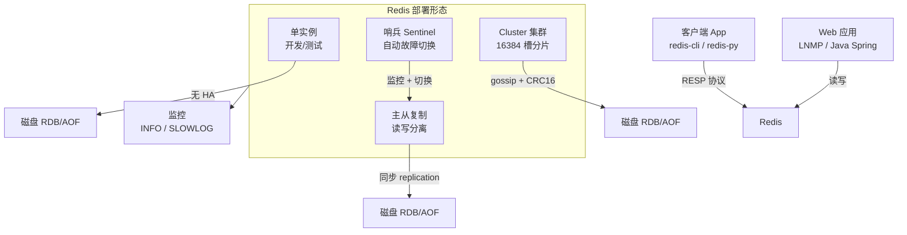
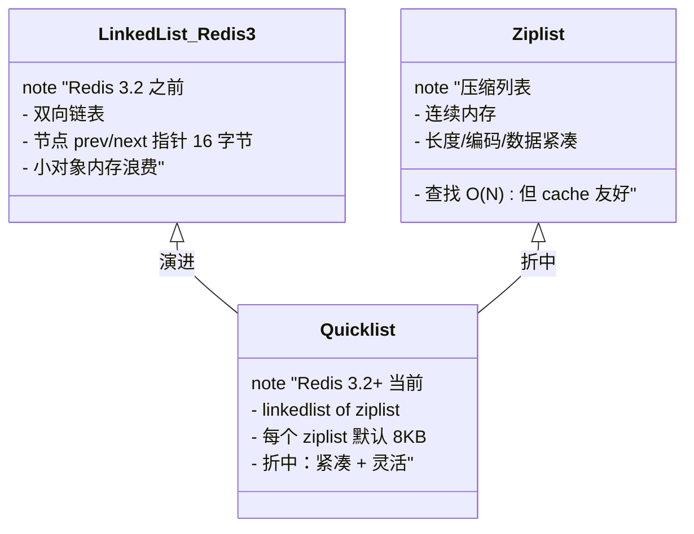
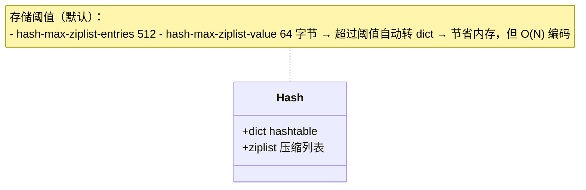
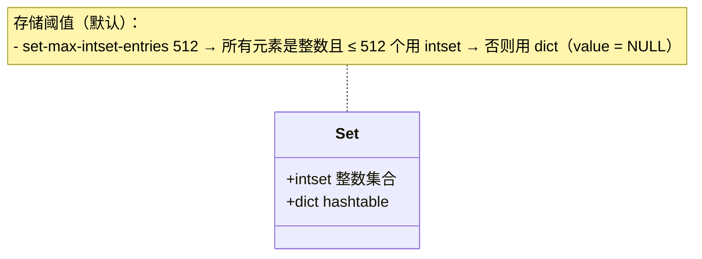
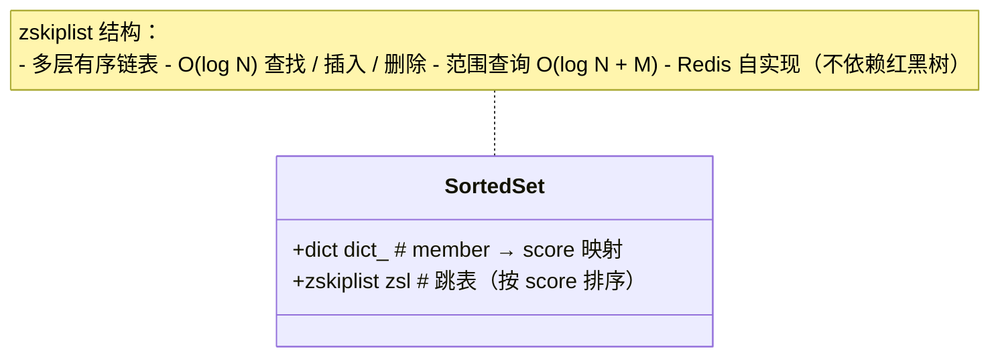
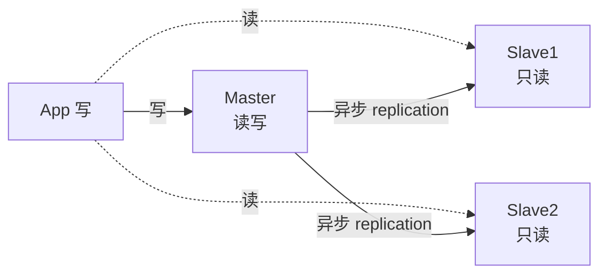
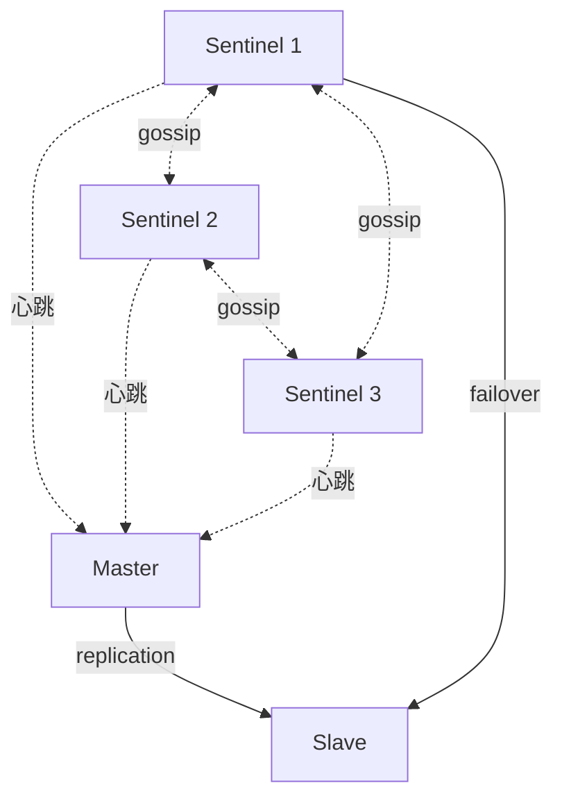
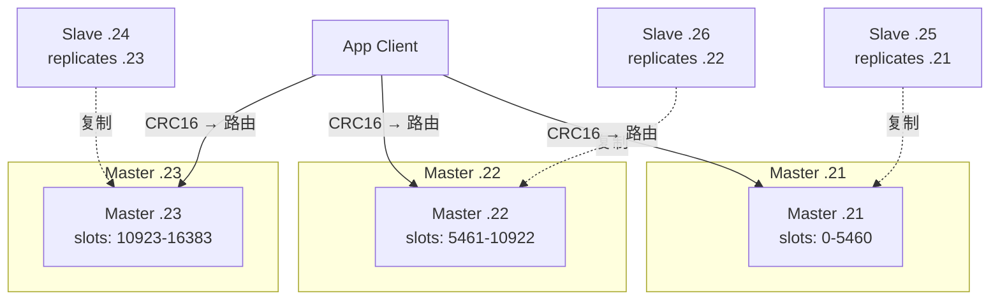

# Linux Redis 全面指南

> **范围**：基于《Redis.pdf》（99 页 / 17 MB / Typora 导出）整理。覆盖 **Redis 起源与特性**（BSD / 10 万 + QPS / 9 种数据结构）+ **部署架构全景**（目录树 + 端口 6379 由来 MERZ）+ **3 种安装方式**（yum / apt / 源码编译）+ **redis.conf 11 大模块详解**（GENERAL / NETWORK / SECURITY / CLIENT / MEMORY / SNAPSHOT / AOF / REPLICATION / CLUSTER / KEYS / COMMANDLOG）+ **5 大核心数据结构**（String SDS / List quicklist / Hash dict+ziplist / Set intset+dict / Sorted Set zskiplist+dict）+ **4 种扩展数据结构**（Stream / Bitmap / HyperLogLog / GEO）+ **持久化双雄**（RDB 快照 + AOF 日志 + 混合模式）+ **主从复制**（replicaof + 全量/增量同步）+ **哨兵 Sentinel**（监控 + 选举 + 自动故障切换）+ **Cluster 集群**（16384 槽位 + CRC16 + gossip）+ **缓存设计 4 大难题**（旁路缓存 / 穿透 / 雪崩 / 击穿）+ **redis-cli 工具** + **Python redis-py 实战**。
>
> **视角**：运维部署架构（部署目录树 + redis.conf + 集群拓扑），非源码级剖析。CentOS-7 / RHEL 系，Redis 5.0 / 6.2 双版本兼容（教材混合提及 5.0.3 + 6.2.14）。

## 目录

- [[#§0 心智模型：Redis = 内存键值数据库 + 多种数据结构 + 持久化]]
- [[#§1 Redis 是什么：BSD / 高性能 / k-v / 9 数据结构 / 单线程]]
- [[#§2 部署架构全景：单实例 + 主从 + 哨兵 + Cluster + 客户端]]
- [[#§3 安装：yum / apt / 源码编译 3 种方式]]
- [[#§4 redis.conf 详解：11 大模块]]
- [[#§5 数据结构 1：String（SDS 简单动态字符串）]]
- [[#§6 数据结构 2：List（linkedlist + ziplist + quicklist）]]
- [[#§7 数据结构 3：Hash（dict + ziplist）]]
- [[#§8 数据结构 4：Set（intset + dict）]]
- [[#§9 数据结构 5：Sorted Set（zskiplist + dict）]]
- [[#§10 数据结构 6-9：Stream / Bitmap / HyperLogLog / GEO]]
- [[#§11 持久化：RDB + AOF + 混合模式]]
- [[#§12 主从复制：replicaof + 全量/增量同步]]
- [[#§13 哨兵 Sentinel：监控 + 选举 + 故障切换]]
- [[#§14 Cluster 集群：16384 槽位 + CRC16 + gossip]]
- [[#§15 缓存设计模式：旁路 / 穿透 / 雪崩 / 击穿]]
- [[#§16 redis-cli 工具 + Python redis-py 实战]]
- [[#§17 易错 ×10 + 速查表 + 面试 6 大追问 + 跨模块链接]]

---

## §0 心智模型：Redis = 内存键值数据库 + 多种数据结构 + 持久化

```
            客户端 (App / redis-cli / Python redis-py)
                          │
                          │ RESP 协议 (6379)
                          ▼
                ┌─────────────────────┐
                │      Redis 服务      │
                │  ┌───────────────┐  │
                │  │  内存数据字典  │  │
                │  │  String       │  │
                │  │  List/Set/Hash│  │
                │  │  ZSet/Stream  │  │
                │  │  Bitmap/GEO   │  │
                │  └───────┬───────┘  │
                │          │ 持久化    │
                │    ┌─────┴─────┐    │
                │    ▼           ▼    │
                │   RDB         AOF   │  ← 磁盘快照 / 追加日志
                └─────────────────────┘
                          │
            ┌─────────────┼─────────────┐
            ▼             ▼             ▼
        主从复制      Sentinel 哨兵    Cluster 集群
        (读写分离)   (高可用自动切换)  (16384 槽分片)
```

**Redis 核心定位**：
- **内存键值数据库**：所有数据驻留内存，QPS 10 万 ~100 万 +，微秒级响应
- **9 种数据结构**：String / List / Hash / Set / ZSet / Stream / Bitmap / HyperLogLog / GEO
- **持久化可选**：RDB 快照 + AOF 追加日志 + 混合模式（默认 RDB）
- **原子操作**：单命令原子，事务 MULTI/EXEC 也原子（Lua 脚本更强）
- **多语言客户端**：Java / Python / Go / Node.js / PHP 主流语言全覆盖
- **生态丰富**：Lua 脚本 / 发布订阅 / 事务 / Pipeline / 慢查询 / 监控

**与 MySQL/Memcached 对比**：

| 维度 | **MySQL** | **Memcached** | **Redis** |
|---|---|---|---|
| 存储位置 | 磁盘（B+Tree） | 内存 | 内存（+ 可选磁盘持久化）|
| QPS | 几千 ~几万 | 10 万 + | **10 万 ~100 万 +** |
| 响应延迟 | 毫秒级（依赖索引）| 微秒级 | **微秒级** |
| 数据结构 | 表（关系模型）| 仅 String | **9 种**（String/List/Hash/Set/ZSet/...）|
| 持久化 | ACID 强一致 | 无 | **RDB + AOF** |
| 适用场景 | 主数据存储 | 简单缓存 | **缓存 + 计数器 + 分布式锁 + 排行榜** |

> 💡 一句话：**Redis = 内存中的数据结构服务器（Data Structure Server）+ 持久化 + 多副本 + 集群分片。**

**关键特性速记**：
- **快**：基于内存 + C 语言 + 单线程（避免锁竞争 + 上下文切换）
- **持久化**：RDB 全量快照 + AOF 增量追加
- **数据结构丰富**：String 之外的 8 种专为业务场景设计
- **主从 + 哨兵 + Cluster**：覆盖读写分离 / 自动故障切换 / 水平扩展
- **代码精悍**：核心代码约 **2.3 万行**（单线程开发容易理解）

---

## §1 Redis 是什么：BSD / 高性能 / k-v / 9 数据结构 / 单线程

### 1.1 简介与协议

**Redis 定义**：
- **全称**：REmote DIctionary Server（远程字典服务）
- **协议**：**BSD 协议**（Berkeley Software Distribution），完全开源免费，可商用
- **作者**：**Salvatore Sanfilippo**（网名 antirez），意大利人
- **诞生**：2009 年发布，当前主流版本 5.0.x / 6.2.x / 7.0.x
- **官网**：`https://redis.io`，中文社区 `http://www.redis.cn`

**三大核心特点**：
1. **持久化**：可将内存数据保存到磁盘，重启后再次加载
2. **多数据结构**：不仅 k-v，还支持 list / set / zset / hash 等
3. **主从备份**：master-slave 模式天然支持数据备份

### 1.2 Redis 优势

| 维度 | 说明 |
|---|---|
| **性能极高** | 10 万 ~100 万 + QPS，**微秒级**响应；MySQL 几千 ~几万 QPS，毫秒级 |
| **丰富数据类型** | String / List / Hash / Set / ZSet / Stream / Bitmap / HyperLogLog / GEO |
| **原子性** | 单命令原子 + 事务（MULTI/EXEC）+ Lua 脚本（更强原子）|
| **丰富特性** | publish/subscribe（发布订阅）+ 通知 + key 过期 + 慢查询 |
| **多语言** | Java(Jedis/Lettuce) / Python(redis-py) / Go(go-redis) / PHP(phpredis) |

### 1.3 Redis 与其他 k-v 存储的不同

**核心差异**：
- **复杂数据结构**：不仅 String，还提供 List/Set/ZSet/Hash 等"开箱即用"的数据结构
- **原子性操作**：对复杂数据结构本身提供原子操作（如 LPUSH / SADD / ZADD），无需应用层加锁
- **数据透明**：底层数据结构（SDS / dict / zskiplist）对程序员透明，无需额外抽象
- **内存 + 持久化**：运行在内存但可持久化到磁盘（紧凑追加格式）

> 内存数据库优势：**相同复杂数据结构**在内存中操作比磁盘**简单得多**，Redis 可做很多内部复杂性很强的事情。

### 1.4 Redis 数据类型（5 基础 + 4 扩展 = 9 种）

**5 种基础数据类型**（教材 §1.4 重点）：

| 类型 | 关键字 | 典型场景 |
|---|---|---|
| **String** | string | 缓存 / 计数器 / 分布式锁 |
| **Hash** | hash | 对象属性存储（用户信息）|
| **List** | list | 消息队列 / 最新列表 |
| **Set** | set | 标签 / 共同好友 / 去重 |
| **Sorted Set** | zset | 排行榜 / 延迟队列 |

**4 种扩展数据类型**（进阶）：

| 类型 | 关键字 | 典型场景 |
|---|---|---|
| **Stream** | stream | 消息流（5.0+ 引入，类 Kafka）|
| **Bitmap** | bitmap | 签到 / 活跃用户统计 |
| **HyperLogLog** | hyperloglog | UV 统计（基数估算）|
| **GEO** | geo | 附近的人 / 地理位置 |

### 1.5 哈希槽基本概念（Cluster 核心）

**槽的数量**：
- Redis Cluster 将整个键空间划分为 **16384 个哈希槽**（0-16383）
- 这是经过权衡后确定的固定数量（2^14，权衡：**足够细粒度分片 + 心跳包不致过大**）

**数据映射规则**：
```
HASH_SLOT = CRC16(key) mod 16384
```
- 确保相同 key 始终映射到同一槽
- CRC16 算法：基于 key 的字节序列计算 16 位 CRC

**节点分配机制**：
- 每个集群节点负责部分槽的集合
- 例：节点 A 负责 0-5000，节点 B 负责 5001-10000
- **动态迁移**：槽支持在线调整，相比传统 hash 取余算法迁移数据量更可控

### 1.6 Redis 常见应用场景

| 场景 | 数据结构 | 关键命令 | 业务示例 |
|---|---|---|---|
| **热点数据缓存** | String/Hash | GET / SET / EXPIRE | 商品详情 / 用户信息 |
| **分布式锁** | String | `SET key val NX PX 30000` | 秒杀 / 抢红包 |
| **计数器 / 限流** | String | `INCR` / `DECR` / `INCRBY` | 文章阅读量 / 接口 QPS 限制 |
| **排行榜系统** | Sorted Set | `ZADD` / `ZRANGE` / `ZREVRANGE` | 销量榜 / 游戏分数榜 |
| **分布式会话** | Hash | `HSET` / `HGETALL` | Web Session 共享 |
| **消息队列** | List | `LPUSH` / `BRPOP` | 异步任务 / 日志收集 |
| **签到 / 活跃** | Bitmap | `SETBIT` / `BITCOUNT` | 连续签到 / 7 日活跃 |
| **UV 统计** | HyperLogLog | `PFADD` / `PFCOUNT` | 页面 UV（误差 < 1%）|
| **附近的人** | GEO | `GEOADD` / `GEORADIUS` | LBS 服务 |

### 1.7 Redis 特性清单（教材总结）

```
1. 速度快：10W+ QPS，基于内存，C 语言实现
2. 单线程（核心命令处理，避免锁竞争）
3. 持久化（RDB + AOF）
4. 支持多种数据结构（9 种）
5. 支持多种编程语言（Java / Python / Go / PHP / Node.js）
6. 功能丰富：Lua 脚本、发布订阅、事务、Pipeline、慢查询
7. 简单：代码短小精悍（单机核心约 2.3 万行），单线程开发容易
8. 主从复制（master-slave）
9. 支持高可用和分布式（Sentinel + Cluster）
```

### 1.8 单线程模型深入

**为什么单线程还能这么快？**
- **内存操作**：无磁盘 IO 瓶颈
- **C 语言实现**：距硬件近，开销小
- **I/O 多路复用**：epoll 监听多连接（Linux）/ kqueue（BSD）
- **单线程避免**：锁竞争 + 上下文切换 + 线程创建销毁开销

**⚠️ 注意**：Redis 4.0 后**部分命令异步化**（如 UNLINK / FLUSHDB ASYNC），核心命令执行仍单线程。

---

## §2 部署架构全景：单实例 + 主从 + 哨兵 + Cluster + 客户端

### 2.1 部署架构拓扑图



### 2.2 部署目录树

```
/etc/redis/
├── redis.conf                  ← 主配置文件
├── redis-sentinel.conf         ← 哨兵配置（如启用）

/var/lib/redis/                 ← 数据目录（RDB/AOF）
├── dump.rdb                    ← RDB 快照
└── appendonly.aof              ← AOF 日志（如启用）

/var/log/redis/                 ← 日志目录
└── redis.log

/usr/bin/                       ← 可执行文件
├── redis-server                ← 服务端主程序（1.8 MB）
├── redis-cli                   ← 客户端程序（827 KB）
├── redis-benchmark             ← 性能测试程序（656 KB）
├── redis-check-aof             ← AOF 文件检查（→ redis-server 软链）
├── redis-check-rdb             ← RDB 文件检查（→ redis-server 软链）
└── redis-sentinel              ← 哨兵程序（→ redis-server 软链）

/usr/lib/systemd/system/
└── redis.service               ← systemd unit 文件

源码编译额外目录：
/usr/local/redis/
├── bin/                        ← 编译产物（redis-server 等）
└── src/                        ← 源码
```

**关键路径对照表**：

| 路径 | 内容 | 备注 |
|---|---|---|
| `/etc/redis.conf` | 主配置 | yum/apt 默认路径 |
| `/etc/redis/redis.conf` | 主配置 | 源码编译推荐路径 |
| `/var/lib/redis/` | 数据目录 | RDB/AOF 存储位置 |
| `/var/log/redis/` | 日志目录 | `logfile /var/log/redis/redis.log` |
| `/usr/bin/redis-*` | 可执行文件 | yum/apt 安装 |
| `/usr/local/redis/bin/` | 可执行文件 | 源码编译安装 |
| `/etc/systemd/system/redis.service` | systemd unit | 服务管理 |

### 2.3 端口 6379 由来：MERZ 趣闻

**为什么 Redis 默认 6379？**

> 来源：作者 Salvatore Sanfilippo（antirez）的个人趣闻。

- **MERZ**：意大利女演员 **Alessia Merz** 在电视节目中的表现被作者认为很"愚蠢"
- antirez 与朋友用 "MERZ" 作为俚语形容"愚蠢"
- 手机键盘上 "MERZ" 对应数字：**M=6 / E=3 / R=7 / Z=9** → **6379**
- antirez 选端口时没多思考，直接用了这个数字

**多实例端口规划**：
```bash
# 启动第二实例（端口 6380）
[root@localhost ~]# redis-server --port 6380
[root@localhost ~]# ss -ntl
State  Recv-Q  Send-Q  Local Address:Port   Peer Address:Port
LISTEN 0       128     0.0.0.0:22          0.0.0.0:*
LISTEN 0       511     127.0.0.1:6379      0.0.0.0:*
LISTEN 0       511     0.0.0.0:6380        0.0.0.0:*    ← 新实例

# 连接第二实例
[root@localhost ~]# redis-cli -p 6380
127.0.0.1:6380> ping
PONG
```

**Cluster 额外端口**：
- **16379**：每个 Redis Cluster 节点除 6379 外还开启 16379（客户端端口 + 集群总线端口）
- 集群总线（gossip 协议）通信专用

### 2.4 配置文件说明（why 6379 完结后）

教材 §"Redis 配置文件说明" 主要展开：
1. **why 6379**（已上）
2. **多实例启动方式**：`redis-server --port 6380`（已上）
3. **CONFIG SET 动态配置**：5.0 部分参数不可改，**6.2.14 起支持 CONFIG SET bind**（详见 §4）

### 2.5 单实例部署模式（最小化）

```bash
# yum 安装（CentOS 7）
yum install -y epel-release yum-utils
yum install -y http://rpms.remirepo.net/enterprise/remi-release-7.rpm
yum-config-manager --enable remi
yum install -y redis

# 启动
systemctl start redis
systemctl enable redis

# 验证
redis-cli ping
# PONG

# 查看版本
redis-cli info Server | grep redis_version
# redis_version:5.0.3
```

---

## §3 安装：yum / apt / 源码编译 3 种方式

### 3.1 yum 安装（CentOS 7 推荐）

```bash
# 1. 添加 EPEL + Remi 源（Redis 在 EPEL 中较旧，Remi 提供新版）
yum install -y epel-release yum-utils
yum install -y http://rpms.remirepo.net/enterprise/remi-release-7.rpm

# 2. 启用 Remi 仓库（默认禁用，需手动启用）
yum-config-manager --enable remi

# 3. 安装 Redis
yum install -y redis

# 4. 验证
rpm -qa redis
redis-cli --version
# redis-cli 5.0.3

# 5. 启动并设置开机自启
systemctl start redis
systemctl enable redis
systemctl status redis
```

**yum 安装路径**（默认）：
- 配置：`/etc/redis.conf`
- 数据：`/var/lib/redis/`
- 日志：`/var/log/redis/redis.log`
- 可执行：`/usr/bin/redis-*`

### 3.2 apt 安装（Ubuntu/Debian 推荐）

```bash
# 1. 更新源
apt-get update

# 2. 搜索可用版本
apt-cache policy redis-server
# Candidate: 5:6.0.16-1ubuntu1

# 3. 安装
apt-get install -y redis-server

# 4. 验证
redis-cli --version
# redis-cli 6.0.16

# 5. 启动
systemctl start redis-server
systemctl enable redis-server
```

### 3.3 源码编译安装（生产推荐，可定制）

**适用场景**：
- 需要最新版本（7.x）
- 需要自定义编译选项（如启用 jemalloc / tcmalloc）
- 需要嵌入式 ARM 平台

**步骤详解**：

```bash
# 1. 安装编译依赖
yum install -y gcc make jemalloc-devel

# 2. 下载源码
cd /usr/local/src/
wget https://download.redis.io/releases/redis-6.2.14.tar.gz
tar xzf redis-6.2.14.tar.gz
cd redis-6.2.14

# 3. 编译（启用 jemalloc 内存分配器）
make MALLOC=libc -j$(nproc)
# 注意：CentOS 7 默认 glibc，使用 MALLOC=libc
# Ubuntu/Debian 推荐 MALLOC=jemalloc

# 4. 安装到 /usr/local/redis
make PREFIX=/usr/local/redis install

# 5. 创建目录
mkdir -p /etc/redis /var/lib/redis /var/log/redis /var/run/redis

# 6. 复制配置 + systemd unit
cp redis.conf /etc/redis/
cp utils/systemd-redis_server.service /usr/lib/systemd/system/redis.service

# 7. 修改配置路径
sed -i 's|^pidfile.*|pidfile /var/run/redis/redis-server.pid|' /etc/redis/redis.conf
sed -i 's|^logfile.*|logfile /var/log/redis/redis.log|' /etc/redis/redis.conf
sed -i 's|^dir.*|dir /var/lib/redis|' /etc/redis/redis.conf

# 8. 创建 redis 用户
useradd -r -s /sbin/nologin redis
chown -R redis:redis /var/lib/redis /var/log/redis /etc/redis

# 9. 启动
systemctl daemon-reload
systemctl start redis
systemctl enable redis
```

### 3.4 验证安装（3 种通用）

```bash
# 1. ping 命令（最简验证）
redis-cli ping
# PONG

# 2. INFO Server（版本 + 模式）
redis-cli INFO Server
# redis_version:5.0.3
# redis_mode:standalone
# os:Linux 4.18.0-553.el8.x86_64 x86_64
# arch_bits:64
# ...

# 3. redis-cli --version
redis-cli --version
# redis-cli 5.0.3

# 4. CONFIG GET maxmemory（动态配置）
redis-cli CONFIG GET maxmemory
# 1) "maxmemory"
# 2) "0"   ← 默认 0 = 无限制
```

### 3.5 多实例部署（端口规划）

```bash
# 实例规划
# redis-6379：默认实例
# redis-6380：第二实例
# redis-6381：第三实例

# 复制配置
cp /etc/redis.conf /etc/redis-6380.conf
sed -i 's/6379/6380/g' /etc/redis-6380.conf
sed -i 's|^pidfile.*|pidfile /var/run/redis/redis-6380.pid|' /etc/redis-6380.conf
sed -i 's|^logfile.*|logfile /var/log/redis/redis-6380.log|' /etc/redis-6380.conf

# 启动第二实例
redis-server /etc/redis-6380.conf --daemonize yes

# 查看监听
ss -ntl | grep redis
# LISTEN 0 511 127.0.0.1:6379 0.0.0.0:*
# LISTEN 0 511 0.0.0.0:6380   0.0.0.0:*

# 验证
redis-cli -p 6380 ping
# PONG
```

> 📌 **提示**：单台机器跑多实例可充分利用多核 CPU，但**主从复制建议跨机器部署**（避免单点故障）。

---

## §4 redis.conf 详解：11 大模块

redis.conf 默认约 **1500 行**，按功能划分为 **11 大模块**。本节按重要性展开。

### 4.1 模块总览（11 大模块）

```
┌────────────────────────────────────────────────────┐
│ 1.  INCLUDES（包含其他配置文件）                    │
│ 2.  MODULES（动态加载模块）                         │
│ 3.  NETWORK（网络：bind / port / tcp-keepalive）   │
│ 4.  GENERAL（通用：daemonize / pidfile / loglevel） │
│ 5.  SECURITY（安全：requirepass / rename-command）  │
│ 6.  CLIENT（客户端：maxclients / timeout）          │
│ 7.  MEMORY MANAGEMENT（内存：maxmemory / policy）  │
│ 8.  LAZY FREEING（惰性删除：lazyfree）              │
│ 9.  THREADED I/O（线程 I/O：io-threads）  6.0+     │
│ 10. SNAPSHOTTING（快照：save / stop-writes-on-bgsave-error）│
│ 11. APPEND ONLY MODE（AOF：appendonly / appendfsync）│
│ 12. REPLICATION（复制：replicaof / replica-serve-stale-data）│
│ 13. CLUSTER（集群：cluster-enabled / cluster-config-file）│
│ 14. KEYS TRACKING / COMMANDLOG（慢查询）/ LATENCY MONITOR │
└────────────────────────────────────────────────────┘
```

### 4.2 GENERAL 模块（基础必改）

```ini
# 75 bind
bind 127.0.0.1 -::1                    # 默认仅本机，生产改为 0.0.0.0
# daemonize
daemonize yes                          # 后台运行（systemd 模式设为 no）
# supervised
supervised no                          # systemd 管理时改为 systemd
# pidfile
pidfile /var/run/redis_6379.pid        # PID 文件
# loglevel
loglevel notice                        # debug/verbose/notice/warning
# logfile
logfile /var/log/redis/redis.log       # 日志文件路径
# databases
databases 16                           # 默认 16 个 DB（0-15）
```

**生产推荐配置**：
```ini
bind 0.0.0.0                           # 监听所有网卡（注意防火墙）
daemonize no                           # systemd 接管前台运行
supervised systemd                     # systemd 模式
pidfile /var/run/redis/redis-server.pid
loglevel notice
logfile /var/log/redis/redis.log
```

### 4.3 NETWORK 模块

```ini
# port
port 6379                              # 默认端口
# tcp-backlog
tcp-backlog 511                        # TCP 监听 backlog（高并发调大）
# timeout
timeout 0                              # 客户端空闲超时（0 = 不超时）
# tcp-keepalive
tcp-keepalive 300                      # TCP 心跳检测（秒）
```

**⚠️ 5.0 vs 6.2 差异**：
- Redis **5.0.3**：`CONFIG SET bind` **不支持**（CONFIG GET 可用）
  ```bash
  127.0.0.1:6379> CONFIG SET BIND 0.0.0.0
  (error) ERR Unsupported CONFIG parameter: BIND
  ```
- Redis **6.2.14**：`CONFIG SET bind` **支持**动态修改
  ```bash
  127.0.0.1:6379> config set bind 0.0.0.0
  OK
  ```

### 4.4 SECURITY 模块（生产必配）

```ini
# requirepass
requirepass yourStrongPassword123      # 设置密码
# rename-command
rename-command FLUSHALL ""             # 禁用危险命令（重命名为空 = 禁用）
rename-command CONFIG ""               # 禁用远程 CONFIG
rename-command KEYS ""                 # 禁用 KEYS（防 O(N) 阻塞）
```

**启用密码后的连接**：
```bash
# 方式 1：连接时指定
redis-cli -a yourStrongPassword123

# 方式 2：先连接再认证
redis-cli
127.0.0.1:6379> AUTH yourStrongPassword123
OK

# 方式 3：隐藏密码警告（生产推荐）
redis-cli -a yourStrongPassword123 --no-auth-warning
```

### 4.5 CLIENT 模块

```ini
# maxclients
maxclients 10000                       # 最大客户端连接数
# maxmemory-policy
maxmemory-policy noeviction            # 内存满时策略（见下表）
# maxmemory-samples
maxmemory-samples 5                    # LRU/LFU 采样数
```

**maxmemory-policy 6 种策略**：

| 策略 | 行为 | 适用场景 |
|---|---|---|
| **noeviction** | 不淘汰，写报错（默认）| 数据不能丢 |
| **allkeys-lru** | 所有 key 中 LRU 淘汰 | 缓存 |
| **volatile-lru** | 仅过期 key 中 LRU 淘汰 | 缓存 + 持久化混合 |
| **allkeys-lfu** | 所有 key 中 LFU 淘汰（Redis 4.0+）| 热点缓存 |
| **volatile-lfu** | 仅过期 key 中 LFU 淘汰 | 热点 + 持久 |
| **allkeys-random** | 随机淘汰 | 通用 |
| **volatile-random** | 过期 key 随机淘汰 | 通用 |
| **volatile-ttl** | 淘汰 TTL 最短的 | 短期缓存 |

### 4.6 MEMORY MANAGEMENT 模块

```bash
# 动态查看
127.0.0.1:6379> CONFIG GET maxmemory
1) "maxmemory"
2) "0"   ← 默认 0 = 无限制

# 动态修改
127.0.0.1:6379> CONFIG SET maxmemory 10086
OK
127.0.0.1:6379> CONFIG GET maxmemory
1) "maxmemory"
2) "10086"

# 支持单位
127.0.0.1:6379> CONFIG SET maxmemory 1G
OK
127.0.0.1:6379> CONFIG GET maxmemory
1) "maxmemory"
2) "1000000000"  ← 1G = 10^9 字节（GiB 精度）
```

**生产推荐**：
```ini
maxmemory 4gb                          # 物理内存 60-70%
maxmemory-policy allkeys-lru           # 缓存场景
maxmemory-samples 10                   # 提高精度
```

### 4.7 SNAPSHOTTING 模块（RDB 触发条件）

```ini
# 218-220 save 触发规则（默认）
save 900 1                             # 900 秒内至少 1 个 key 修改 → RDB
save 300 10                            # 300 秒内至少 10 个 key 修改
save 60 10000                          # 60 秒内至少 10000 个 key 修改

# 关闭自动 RDB（如启用 AOF）
save ""

# stop-writes-on-bgsave-error
stop-writes-on-bgsave-error yes        # bgsave 失败时停止写入

# rdbcompression
rdbcompression yes                     # RDB 文件 LZF 压缩

# rdbchecksum
rdbchecksum yes                        # RDB 文件 CRC64 校验

# dbfilename
dbfilename dump.rdb                    # RDB 文件名

# dir
dir /var/lib/redis/                    # RDB 文件目录
```

### 4.8 APPEND ONLY MODE（AOF）

```ini
# appendonly
appendonly no                          # 默认关闭（yes = 启用 AOF）

# appendfilename
appendfilename "appendonly.aof"        # AOF 文件名

# appendfsync
# always    ← 每条命令 fsync（最安全，最慢）
# everysec  ← 每秒 fsync（默认，丢 1 秒数据）
# no        ← 由 OS 控制（最快，最不安全）
appendfsync everysec

# no-appendfsync-on-rewrite
no-appendfsync-on-rewrite no           # 重写时不 fsync

# auto-aof-rewrite-percentage
auto-aof-rewrite-percentage 100       # AOF 文件比上次重写增长 100% 触发重写

# auto-aof-rewrite-min-size
auto-aof-rewrite-min-size 64mb         # AOF 最小 64MB 才触发重写
```

### 4.9 REPLICATION 模块（主从复制）

```ini
# replicaof <masterip> <masterport>
# 旧版：slaveof <masterip> <masterport>
replicaof 192.168.108.10 6379          # 当前节点作为 master 192.168.108.10 的从

# masterauth
masterauth yourPassword                # master 密码（如有）

# replica-serve-stale-data
replica-serve-stale-data yes           # 与 master 断开时是否继续服务（建议 no）

# replica-read-only
replica-read-only yes                  # 从节点只读

# repl-backlog-size
repl-backlog-size 1mb                  # 复制积压缓冲（部分重同步用）

# repl-backlog-ttl
repl-backlog-ttl 3600                  # master 无 slave 时 backlog 保留时间
```

### 4.10 CLUSTER 模块

```ini
# cluster-enabled
cluster-enabled yes                    # 启用集群模式

# cluster-config-file
cluster-config-file nodes-6379.conf    # 集群节点配置文件（自动生成）

# cluster-node-timeout
cluster-node-timeout 15000             # 节点超时（毫秒）

# cluster-replica-validity-factor
cluster-replica-validity-factor 10     # 故障切换有效性因子

# cluster-migration-barrier
cluster-migration-barrier 1            # 主从迁移最少从节点数

# cluster-require-full-coverage
cluster-require-full-coverage yes      # 任一槽未覆盖就停止服务
```

### 4.11 COMMANDLOG 模块（慢查询）

**慢查询原理**：
```
客户端命令生命周期：
1）发送命令
2）命令排队
3）命令执行  ← 慢查询发生在这阶段
4）返回结果

两点说明：
1. 慢查询发生在第三阶段
2. 客户端超时不一定慢查询，但慢查询是客户端超时的可能因素之一
```

```ini
# slowlog-log-slower-than
slowlog-log-slower-than 10000          # 超过 10ms 记录（单位微秒，10000 = 10ms）

# slowlog-max-len
slowlog-max-len 128                    # 最多保留 128 条慢查询
```

**慢查询命令**：
```bash
127.0.0.1:6379> SLOWLOG GET           # 获取最近慢查询
127.0.0.1:6379> SLOWLOG LEN           # 慢查询数量
127.0.0.1:6379> SLOWLOG RESET         # 清空慢查询
```

### 4.12 完整 redis.conf 推荐配置（生产）

```ini
# 1. GENERAL
bind 0.0.0.0
protected-mode no
port 6379
daemonize no
supervised systemd
pidfile /var/run/redis/redis-server.pid
loglevel notice
logfile /var/log/redis/redis.log
databases 16

# 2. NETWORK
tcp-backlog 511
timeout 300
tcp-keepalive 300

# 3. SECURITY
requirepass YourStrongP@ssw0rd
rename-command FLUSHALL ""
rename-command KEYS ""

# 4. CLIENT
maxclients 10000

# 5. MEMORY
maxmemory 4gb
maxmemory-policy allkeys-lru
maxmemory-samples 10

# 6. SNAPSHOTTING
save 900 1
save 300 10
save 60 10000
stop-writes-on-bgsave-error yes
rdbcompression yes
rdbchecksum yes
dbfilename dump.rdb
dir /var/lib/redis/

# 7. APPEND ONLY
appendonly yes
appendfilename "appendonly.aof"
appendfsync everysec
auto-aof-rewrite-percentage 100
auto-aof-rewrite-min-size 64mb
aof-use-rdb-preamble yes              # 混合模式（RDB+AOF）

# 8. SLOWLOG
slowlog-log-slower-than 10000
slowlog-max-len 128

# 9. LATENCY MONITOR
latency-monitor-threshold 100         # 启用延迟监控（毫秒）
```

---

## §5 数据结构 1：String（SDS 简单动态字符串）

### 5.1 内存布局：SDS 结构


### 5.2 SDS 优势（vs C 原生字符串）

| 维度 | C 字符串 | SDS |
|---|---|---|
| **长度计算** | O(N) 遍历 | **O(1)** 直接读 len |
| **缓冲区溢出** | 拼接易溢出 | **自动扩容**（alloc 检查）|
| **内存分配** | 每次必重分配 | **预分配 + 惰性释放** |
| **二进制安全** | 不能含 `\0` | **二进制安全**（按 len 判终止）|
| **兼容 C 字符串** | - | 末尾保留 `\0`，可直接复用 `<string.h>` 函数 |

### 5.3 预分配与惰性释放策略

**预分配（扩容时）**：
- 修改后 len < 1MB：alloc = len + len + 1byte（加倍预留）
- 修改后 len >= 1MB：alloc = len + 1MB + 1byte（每次 +1MB）

**惰性释放（缩短时）**：
- 不立即释放多余空间，保留在 alloc 中供下次使用
- 防止频繁修改字符串时反复重分配

### 5.4 String 命令大全

**基本 SET/GET**：
```bash
SET mykey "Hello"
GET mykey
# "Hello"

SET mykey "World" EX 60              # 60 秒过期
SET mykey "Lock" NX PX 30000         # 分布式锁（NX 不存在 + PX 30 秒）

MSET k1 v1 k2 v2 k3 v3                # 批量设置
MGET k1 k2 k3                         # 批量获取
# 1) "v1"
# 2) "v2"
# 3) "v3"

APPEND mykey " Redis"                 # 追加
STRLEN mykey                          # 字符串长度
GETRANGE mykey 0 4                    # 子串（闭区间）
SETRANGE mykey 0 "Hi"                 # 覆盖部分
```

**原子计数**：
```bash
SET counter 0
INCR counter                          # +1，返回新值
# (integer) 1
INCR counter
# (integer) 2
INCRBY counter 10                     # +10
# (integer) 12
DECR counter                          # -1
# (integer) 11
DECRBY counter 3                      # -3
# (integer) 8

# 注意：key 不存在时自动初始化为 0
INCRBY nokey2 3                       # nokey2 不存在
# (integer) -3                       ← 先 SET nokey2 0，再 +3 → -3？错！自动 +3 后是 3
```

**浮点数**：
```bash
SET price 9.99
INCRBYFLOAT price 0.01                # +0.01
# "10.0"
```

**位操作**：
```bash
SETBIT bits 0 1                       # 设置 bit 0 = 1
SETBIT bits 7 1                       # 设置 bit 7 = 1
GETBIT bits 0                         # 获取 bit 0
# (integer) 1
BITCOUNT bits                         # 统计 1 的个数
# (integer) 2
```

**键管理**：
```bash
EXISTS mykey                          # key 是否存在
# (integer) 1
DEL mykey                             # 删除
# (integer) 1
GET mykey                             # 已删除
# (nil)
TYPE mykey                            # 类型
# string
EXPIRE mykey 60                       # 60 秒过期
TTL mykey                             # 剩余生存时间
RENAME mykey newkey                   # 重命名
```

### 5.5 应用场景

| 场景 | 实现 | 关键命令 |
|---|---|---|
| **缓存** | JSON 序列化对象 | `SET key value EX 300` |
| **分布式锁** | `SET key val NX PX 30000` | NX + PX |
| **计数器** | 文章阅读量 / 视频播放 | `INCR` / `DECR` |
| **限流** | 接口 QPS 限制 | `INCR` + EXPIRE |
| **共享 Session** | SessionID → userInfo | `SET session:xxx EX 1800` |
| **位图统计** | 用户签到 / 活跃 | `SETBIT` / `BITCOUNT` |

### 5.6 分布式锁完整示例

```bash
# 加锁（不存在则设置 + 30 秒过期）
SET lock:order:1001 "uuid-12345" NX PX 30000
# OK

# 错误示例（NX + EX 单独使用不安全）
SETNX lock:order:1001 "uuid-12345"   # 仅设不过期 → 死锁风险
EXPIRE lock:order:1001 30            # 两条命令非原子

# 解锁（必须 Lua 脚本原子判断 + 删除，防误删）
EVAL "
if redis.call('get', KEYS[1]) == ARGV[1] then
  return redis.call('del', KEYS[1])
else
  return 0
end
" 1 lock:order:1001 "uuid-12345"
```

---

## §6 数据结构 2：List（linkedlist + ziplist + quicklist）

### 6.1 内存布局演进



### 6.2 三种底层实现对比

| 实现             | 版本   | 优点              | 缺点                  |
| -------------- | ---- | --------------- | ------------------- |
| **linkedlist** | ≤3.2 | 简单 / 双向         | 指针开销大（每个节点 16 字节指针） |
| **ziplist**    | 一直存在 | 连续内存 / cache 友好 | 查找 O(N) / 修改可能级联更新  |
| **quicklist**  | 3.2+ | 紧凑 + 折中         | 实现复杂                |

**quicklist 配置**：
```ini
list-max-ziplist-size -2              # 每个 ziplist ≤ 8KB（-2 = 8KB）
list-compress-depth 0                 # 压缩深度（0 = 不压缩）
```

### 6.3 List 命令大全

```bash
# 插入
LPUSH mylist "a"                      # 左侧插入
LPUSH mylist "b" "c"                  # 批量插入（c 是最新）
# 列表：[c, b, a]
RPUSH mylist "d"                      # 右侧插入
# 列表：[c, b, a, d]

# 弹出（阻塞 / 非阻塞）
LPOP mylist                           # 左侧弹出
# "c"
RPOP mylist                           # 右侧弹出
# "d"
BLPOP mylist 5                        # 阻塞弹出（5 秒超时）
BRPOP mylist 5

# 查询
LRANGE mylist 0 -1                    # 全部元素
# 1) "b"
# 2) "a"
LRANGE mylist 0 1                     # 前 2 个
LLEN mylist                           # 长度
# (integer) 2
LINDEX mylist 0                       # 指定索引
# "b"
LINDEX mylist -1                      # 最后一个
# "a"

# 修改
LSET mylist 0 "newB"                  # 设置索引 0
LINSERT mylist BEFORE "a" "X"         # 在 a 前插入 X
LREM mylist 1 "a"                     # 删除 1 个 a

# 阻塞队列（消息队列核心）
BRPOPLPUSH src dst 5                  # 从 src 阻塞弹出，推入 dst
```

### 6.4 应用场景

| 场景 | 实现 | 关键命令 |
|---|---|---|
| **消息队列** | `LPUSH` 生产 + `BRPOP` 消费 | 阻塞避免轮询 |
| **最新列表** | 朋友圈 / 文章评论 | `LPUSH` + `LTRIM 0 99`（只留 100 条）|
| **栈 / 队列** | LPUSH+LPOP = 栈；RPUSH+LPOP = 队列 | 单端操作 |
| **异步任务队列** | `LPUSH` 入队 + `BRPOP` 出队 | 阻塞等待 |

### 6.5 消息队列实战示例

```bash
# 生产者
LPUSH task:queue "{'action':'send_email','user_id':1001}"

# 消费者（阻塞等待 10 秒）
BRPOP task:queue 10
# 1) "task:queue"
# 2) "{'action':'send_email','user_id':1001}"

# 多消费者负载均衡（每个消息只被一个消费者处理）
# 消费者 A：
BRPOP task:queue 10
# 消费者 B：
BRPOP task:queue 10
# → 队列中的消息轮流被 A/B 处理
```

### 6.6 注意事项

- **大 Key 问题**：List 元素过多（> 万级）时 `LRANGE 0 -1` 会阻塞
- **删除复杂度**：`LREM key count value` 是 O(N)
- **内存占用**：每个 List 元素都有独立 quicklistNode 包装（包含 ziplist）

---

## §7 数据结构 3：Hash（dict + ziplist）

### 7.1 内存布局



### 7.2 两种编码转换

**默认配置**：
```ini
hash-max-ziplist-entries 512           # 字段数 ≤ 512 用 ziplist
hash-max-ziplist-value 64             # 单 value 长度 ≤ 64 字节用 ziplist
```

**转换规则**：
- 字段数 ≤ 512 **且** 所有 value ≤ 64 字节 → **ziplist**（省内存）
- 超过任一阈值 → 自动转 **dict**（O(1) 查询）

### 7.3 Hash 命令大全

```bash
# 单字段
HSET user:1001 name "Alice" age 30
HGET user:1001 name
# "Alice"
HEXISTS user:1001 name
# (integer) 1
HDEL user:1001 age                    # 删除字段
HGETALL user:1001                     # 所有字段 + 值

# 多字段（Redis 4.0+ 推荐 HSET）
HMSET user:1002 name "Bob" age 25     # 旧版，仍可用
HMGET user:1002 name age

# 其他
HKEYS user:1001                       # 所有字段名
HVALS user:1001                       # 所有值
HLEN user:1001                        # 字段数
HINCRBY user:1001 score 10            # 字段值 +10（原子）
HINCRBYFLOAT user:1001 score 0.5      # 浮点 +0.5
```

### 7.4 应用场景

| 场景 | 实现 | 关键命令 |
|---|---|---|
| **对象存储** | user:1001 → {name, age, email} | `HSET` / `HGET` |
| **用户 Profile** | 避免 JSON 序列化开销 | 部分字段更新用 `HINCRBY` |
| **购物车** | cart:user:1001 → {itemId: qty} | `HINCRBY` 增减 |
| **配置存储** | config:app → {key: value} | 整体读取 |

### 7.5 用户对象示例

```bash
# 存储用户（4 个字段）
HSET user:1001 name "Alice" age 30 city "Beijing" email "alice@example.com"

# 查询单个字段（避免 HGETALL 全字段传输）
HGET user:1001 name
# "Alice"

# 部分更新（仅修改 age，不影响其他字段）
HINCRBY user:1001 age 1
# (integer) 31

# 查询所有字段（运维调试）
HGETALL user:1001
# 1) "name"
# 2) "Alice"
# 3) "age"
# 4) "31"
# 5) "city"
# 6) "Beijing"
# 7) "email"
# 8) "alice@example.com"
```

---

## §8 数据结构 4：Set（intset + dict）

### 8.1 内存布局



### 8.2 intset 编码

**intset 结构**：
```
typedef struct intset {
    uint32_t encoding;    // INTSET_ENC_INT16/32/64
    uint32_t length;      // 元素数量
    int8_t contents[];    // 有序数组
} intset;
```

**特点**：
- 元素按数值**升序排列**
- 自适应编码（int16 → int32 → int64）
- 二分查找 O(log N)
- **修改时升级编码**（不可逆）

### 8.3 Set 命令大全

```bash
# 添加 / 删除
SADD tags:article:1001 "redis" "cache" "nosql"
SREM tags:article:1001 "nosql"        # 删除

# 查询
SMEMBERS tags:article:1001            # 所有元素
SISMEMBER tags:article:1001 "redis"   # 是否存在
# (integer) 1
SCARD tags:article:1001               # 元素个数

# 集合运算
SINTER tag:a tag:b                     # 交集（共同好友）
SUNION tag:a tag:b                     # 并集
SDIFF tag:a tag:b                      # 差集（a 有 b 无）

# 随机
SRANDMEMBER tags:article:1001 3       # 随机 3 个（不删除）
SPOP tags:article:1001 2              # 随机弹出 2 个（删除）

# 移动
SMOVE source dest member              # 元素从 source 移到 dest
```

### 8.4 应用场景

| 场景 | 实现 | 关键命令 |
|---|---|---|
| **标签** | 文章标签 / 用户兴趣 | `SADD` / `SMEMBERS` |
| **共同好友** | 社交网络 | `SINTER` |
| **去重** | UV 统计（精确版）| `SADD` / `SCARD` |
| **抽奖** | 随机中奖 | `SRANDMEMBER` / `SPOP` |
| **黑白名单** | IP / 用户封禁 | `SADD` / `SISMEMBER` |

### 8.5 共同好友示例

```bash
# Alice 的好友
SADD friends:Alice "Bob" "Charlie" "David" "Eve"
# Bob 的好友
SADD friends:Bob "Alice" "Charlie" "Frank" "Grace"

# 共同好友
SINTER friends:Alice friends:Bob
# 1) "Charlie"

# 我关注的人也关注他（差集）
SDIFF friends:Alice friends:Bob
# 1) "David"
# 2) "Eve"

# 全部可能认识的人（并集）
SUNION friends:Alice friends:Bob
```

---

## §9 数据结构 5：Sorted Set（zskiplist + dict）

### 9.1 内存布局（最复杂）



**双结构原因**：
- **dict**：实现 `ZSCORE` 命令 O(1)（按 member 查 score）
- **zskiplist**：实现 `ZRANGE` / `ZADD` O(log N)（按 score 排序）

### 9.2 zskiplist 跳表演化

```
Level 4:  head ------------------------------> tail
Level 3:  head --------> n3 ---------------> tail
Level 2:  head -----> n2 ----> n4 ---------> tail
Level 1:  head --> n1 -> n2 -> n3 -> n4 -> n5 -> tail
```

- 每个节点随机层数（幂次分布，p = 0.25）
- 查找：从最高层向右/向下，类似二分
- 范围查询：定位起点后顺序遍历

### 9.3 Sorted Set 命令大全

```bash
# 添加
ZADD course 90 "linux" 85 "python" 50 "cloud" 70 "go"
ZRANGE course 0 -1
# 1) "cloud"
# 2) "python"
# 3) "linux"
# 4) "go"

# 排名 / 分数
ZRANK course go                       # 升序排名（0 开始）
# (integer) 3
ZREVRANK course go                    # 降序排名
ZSCORE course cloud                   # 分数
# "50"

# 删除
ZREM course python go                 # 删除 2 个
# (integer) 2
ZRANGE course 0 -1
# 1) "cloud"
# 2) "linux"

# 范围查询
ZRANGEBYSCORE course 50 80            # score 在 [50,80]
# 1) "cloud"
# 2) "linux"
ZCOUNT course 50 80                   # 范围内元素数
# (integer) 2

# 增减 score
ZINCRBY course 10 "linux"             # +10
# "80"

# Top N（排行榜核心）
ZREVRANGE course 0 2 WITHSCORES        # 降序前 3 名
# 1) "linux"
# 2) "80"
# 3) "cloud"
# 4) "50"
```

### 9.4 应用场景

| 场景 | 实现 | 关键命令 |
|---|---|---|
| **排行榜** | 销量榜 / 积分榜 / 游戏分数榜 | `ZADD` + `ZREVRANGE 0 9` |
| **延迟队列** | score = 执行时间戳 | `ZRANGEBYSCORE 0 now` 取到期任务 |
| **滑动窗口限流** | 记录请求时间戳 | `ZREMRANGEBYSCORE` 清旧 + `ZCARD` |
| **优先级队列** | score = 优先级 | `ZADD` + `ZRANGE 0 0` 取最高优先级 |

### 9.5 排行榜实战

```bash
# 添加商品销量
ZADD sales:2026:Q3 1500 "iPhone15" 800 "MacBook" 2200 "AirPods"

# Top 10 销量榜
ZREVRANGE sales:2026:Q3 0 9 WITHSCORES
# 1) "AirPods"
# 2) "2200"
# 3) "iPhone15"
# 4) "1500"
# 5) "MacBook"
# 6) "800"

# 商品销量 +100
ZINCRBY sales:2026:Q3 100 "MacBook"
# "900"

# 查询某商品排名
ZREVRANK sales:2026:Q3 "iPhone15"
# (integer) 1   ← 第 2 名

# 删除下架商品
ZREM sales:2026:Q3 "iPhone15"
```

### 9.6 延迟队列实战

```bash
# 添加延迟任务（score = 执行时间戳）
ZADD delay:tasks $(($(date +%s) + 60)) "task:send_email:user_1001"

# 消费者：取出到期任务
ZRANGEBYSCORE delay:tasks -inf $(date +%s) LIMIT 0 10

# 执行后删除
ZREM delay:tasks "task:send_email:user_1001"
```

---

## §10 数据结构 6-9：Stream / Bitmap / HyperLogLog / GEO

### 10.1 Stream（5.0+ 引入，类 Kafka）

**核心特性**：
- 持久化的消息流
- 支持消费者组（Consumer Group）
- 消息 ID 单调递增
- 类似 Kafka 但更轻量

```bash
# 生产消息
XADD mystream * name "Alice" age 30
# 自动生成 ID "1689123456789-0"

XADD mystream * name "Bob" age 25
# "1689123456790-0"

# 读取
XRANGE mystream - +
# 1) 1) "1689123456789-0"
#    2) 1) "name"
#       2) "Alice"
#       3) "age"
#       4) "30"

# 消费者组
XGROUP CREATE mystream group1 0
XREADGROUP GROUP group1 consumer1 COUNT 2 STREAMS mystream >
```

### 10.2 Bitmap（位图）

**核心特性**：
- 位级别的字符串（String 的特殊形式）
- 最大 512 MB（2^32 bits）
- O(1) 单位操作

```bash
# 用户签到（每天 1 bit）
# user:1001 在 2026-07-26 签到（key = sign:2026:07:user:1001，offset = 26）
SETBIT sign:2026:07:user:1001 26 1

# 查询某天是否签到
GETBIT sign:2026:07:user:1001 26
# (integer) 1

# 统计本月签到天数
BITCOUNT sign:2026:07:user:1001
# (integer) 1

# 活跃用户（按位与/或/异或）
# 多个用户的 key 做 BITOP
BITOP AND active:2026:07:week1 sign:user:1001 sign:user:1002 ...
```

**应用场景**：
- 用户签到（365 天 = 365 bits ≈ 46 bytes/user）
- 活跃用户统计（最近 7 天 = 7 bits）
- 权限标记（每权限 1 bit）

### 10.3 HyperLogLog（基数估算）

**核心特性**：
- 基数统计（去重计数）
- 误差 < 1%
- 内存极小（**12 KB / key**，无论基数大小）
- 非精确，但工程够用

```bash
# 添加
PFADD uv:2026:07:26 "user:1001" "user:1002" "user:1001"   # user:1001 去重
# (integer) 1

PFADD uv:2026:07:26 "user:1003"
# (integer) 1

# 统计 UV
PFCOUNT uv:2026:07:26
# (integer) 3   ← 实际是 3 个不同 user

# 合并多天
PFMERGE uv:2026:07 uv:2026:07:25 uv:2026:07:26
PFCOUNT uv:2026:07
# (integer) 5
```

**应用场景**：
- 页面 UV（去重访问用户数）
- 搜索词去重统计
- 大规模基数估算（百万 / 千万级）

### 10.4 GEO（地理位置）

**核心特性**：
- 存储经纬度
- 计算距离 / 范围查询
- 底层实现 = Sorted Set（score = geohash）

```bash
# 添加位置
GEOADD cities 116.4074 39.9042 "Beijing"   # 北京
GEOADD cities 121.4737 31.2304 "Shanghai"  # 上海
GEOADD cities 113.2644 23.1291 "Guangzhou" # 广州

# 查询经纬度
GEOPOS cities Beijing
# 1) 1) "116.40739899873733521"
#    2) "39.90419942207568348"

# 计算距离（米）
GEODIST cities Beijing Shanghai km
# "1067.4563"

# 范围查询（半径 1500 km 内的城市）
GEORADIUS cities 116.4074 39.9042 1500 km
# 1) "Beijing"
# 2) "Shanghai"

# 范围查询（含距离 + 坐标）
GEORADIUS cities 116.4074 39.9042 1500 km WITHDIST WITHCOORD
```

**应用场景**：
- 附近的人（社交）
- 附近的店铺（外卖）
- 区域内的实体搜索
- 打车派单范围

### 10.5 9 种数据结构速查

| 类型 | 底层结构 | 时间复杂度 | 典型场景 |
|---|---|---|---|
| String | SDS | O(1) | 缓存 / 计数器 |
| List | quicklist | 头尾 O(1)，其他 O(N) | 队列 / 最新列表 |
| Hash | dict + ziplist | O(1) | 对象存储 |
| Set | intset + dict | O(1) | 标签 / 去重 |
| Sorted Set | zskiplist + dict | O(log N) | 排行榜 |
| Stream | listpack + rax | O(1) 追加 | 消息流 |
| Bitmap | SDS 位操作 | O(1) | 签到 / 活跃 |
| HyperLogLog | 概率算法 | O(1) | UV 估算 |
| GEO | Sorted Set | O(log N) | LBS |

---

## §11 持久化：RDB + AOF + 混合模式

### 11.1 RDB（Redis Database）快照

**核心思想**：在某个时间点**全量备份**内存数据到 RDB 文件。

#### 11.1.1 触发方式（4 种）

**1. 客户端 SAVE（同步阻塞）**
```bash
127.0.0.1:6379> SAVE
OK
# 主进程同步，**阻塞所有客户端请求**
# 适合：维护窗口 / 极少用
```

**2. 客户端 BGSAVE（异步 Fork）**
```bash
127.0.0.1:6379> BGSAVE
Background saving started
# 主进程 Forks 子进程进行数据同步
# 主进程仍接收请求（但 Fork 期间阻塞）
```

**3. 配置文件自动触发（默认）**
```ini
save 900 1       # 900 秒内至少 1 个 key 修改 → RDB
save 300 10      # 300 秒内至少 10 个 key 修改
save 60 10000    # 60 秒内至少 10000 个 key 修改
```

**4. 主从同步触发**
- 从节点首次连接 → master 自动 BGSAVE
- 主动 `SHUTDOWN` 时也会触发

#### 11.1.2 BGSAVE 流程

```
客户端 BGSAVE
     │
     ▼
主进程 fork() 子进程  ← 同步阻塞（拷贝页表，非全量内存）
     │
     ├────→ 子进程：遍历内存，写入 RDB 文件
     │                │
     │                ▼
     │           dump.rdb 完成
     │                │
     │                ▼
     │           子进程退出
     │
     ▼
主进程继续接收请求
```

#### 11.1.3 RDB 优缺点

| 优点 | 缺点 |
|---|---|
| **全量备份**，单文件便于备份 | **数据丢失风险**（最后一次 BGSAVE 之后的数据）|
| **恢复速度快**（直接加载） | **Fork 阻塞**（大内存时 Fork 耗时）|
| **压缩存储**（LZF） | 老版本格式兼容问题 |
| **适合备份** + **灾难恢复** | 不适合高频持久化场景 |

### 11.2 AOF（Append Only File）日志

**核心思想**：**追加记录**所有写命令到 AOF 文件，重启时按顺序回放。

#### 11.2.1 三种 fsync 策略

| 策略 | 行为 | 性能 | 数据安全 |
|---|---|---|---|
| `always` | 每条命令 fsync | 最差 | **最强**（最多丢 1 条）|
| `everysec` | 每秒 fsync（**默认**）| 良好 | 良好（最多丢 1 秒）|
| `no` | 由 OS 控制 | 最优 | 最差（可能丢大量数据）|

#### 11.2.2 AOF 重写（Rewrite）

**为什么需要重写？**
- AOF 文件会无限增长（如 `INCR` 一百万次）
- 重写 = 合并冗余命令（`SET counter 1000000` 代替 100 万次 `INCR`）

**触发条件**：
```ini
auto-aof-rewrite-percentage 100    # AOF 文件比上次重写增长 100% 触发
auto-aof-rewrite-min-size 64mb    # AOF 文件最小 64MB 才触发
```

**重写流程**（子进程，无阻塞）：
```
触发重写
   │
   ▼
主进程 fork() 子进程
   │
   ├────→ 子进程：遍历内存，生成新 AOF（只含最终状态命令）
   │                │
   │                ▼
   │           new-aof.tmp 完成
   │                │
   │                ▼
   │           子进程通知主进程
   │
   ▼
主进程：将增量写命令追加到 new-aof.tmp
   │
   ▼
主进程：rename new-aof.tmp → appendonly.aof
```

#### 11.2.3 AOF 优缺点

| 优点 | 缺点 |
|---|---|
| **数据更安全**（最多丢 1 秒）| 文件体积大 |
| **可读性强**（文本格式）| 恢复速度慢（回放命令）|
| **重写机制** 控制文件大小 | 写 QPS 高时 fsync 可能阻塞 |
| **追加写** 性能好 | 不适合极端高写入场景 |

### 11.3 混合模式（Redis 4.0+，推荐）

**核心思想**：AOF 文件 = **RDB 快照 + 增量 AOF**。

```ini
aof-use-rdb-preamble yes
```

**混合模式 AOF 文件结构**：
```
┌─────────────────────────────────────┐
│  RDB 快照（前半部分）               │  ← 定期快照
│  - 完整内存数据二进制              │
├─────────────────────────────────────┤
│  AOF 增量（后半部分）              │  ← 快照之后的写命令
│  *2\r\n$6\r\nSELECT\r\n$1\r\n0\r\n │  ← RESP 文本格式
│  ...                                │
└─────────────────────────────────────┘
```

**混合模式优势**：
- **加载快**：RDB 部分直接加载（二进制高效）
- **数据全**：AOF 部分保证不丢
- **文件可控**：避免纯 AOF 文件过大

### 11.4 RDB vs AOF 决策表

| 维度 | RDB | AOF | 混合模式 |
|---|---|---|---|
| 数据安全 | 最低（丢分钟级）| 高（丢 ≤ 1 秒）| **高** |
| 恢复速度 | **最快** | 慢（回放）| 快（RDB 部分）|
| 文件大小 | 小（压缩）| 大 | **可控** |
| 写性能影响 | 低（异步）| 中（fsync）| 中 |
| 适用场景 | 备份 / 灾难恢复 | 高数据安全 | **生产首选** |

**生产推荐**：
```ini
# RDB：基础备份
save 3600 1
save 300 100

# AOF：主持久化
appendonly yes
appendfsync everysec

# 混合模式
aof-use-rdb-preamble yes
```

### 11.5 持久化验证命令

```bash
# 手动 RDB 备份
127.0.0.1:6379> BGSAVE
Background saving started

# 查看持久化信息
127.0.0.1:6379> INFO Persistence
# loading:0
# rdb_changes_since_last_save:0
# rdb_last_save_time:1689123456
# rdb_last_bgsave_status:ok
# rdb_last_bgsave_time_sec:0
# aof_enabled:1
# aof_rewrite_in_progress:0

# AOF 重写
127.0.0.1:6379> BGREWRITEAOF
Background append only file rewriting started

# 验证 RDB 文件
redis-check-rdb /var/lib/redis/dump.rdb

# 验证 AOF 文件
redis-check-aof /var/lib/redis/appendonly.aof --fix
```

---

## §12 主从复制：replicaof + 全量/增量同步

### 12.1 主从架构



### 12.2 配置主从（2 种方式）

**方式 1：配置文件永久**
```bash
# slave01, slave02 上修改 redis.conf
vim /usr/local/redis-6.2.14/redis.conf
  75 bind 0.0.0.0 -::1
  480 replicaof 192.168.108.10 6379    # 指向 master IP
  481 masterauth YourPassword            # master 密码（如有）

# 重启
redis-cli shutdown
redis-server redis.conf &
```

**方式 2：命令动态（临时）**
```bash
# 5.0+ 推荐 REPLICAOF（旧版 SLAVEOF 即将淘汰）
127.0.0.1:6379> REPLICAOF MASTER_IP PORT
# 新版推荐
127.0.0.1:6379> SLAVEOF MASTER_IP PORT
# 旧版，将被淘汰

# 取消复制（升级为主）
127.0.0.1:6379> REPLICAOF NO ONE
```

### 12.3 验证主从状态

```bash
# Master 端查看
127.0.0.1:6379> INFO replication
# Replication
role:master
connected_slaves:2
slave0:ip=192.168.108.12,port=6379,state=online,offset=280,lag=0
slave1:ip=192.168.108.11,port=6379,state=online,offset=280,lag=0
master_failover_state:no-failover
master_replid:9abdc709c2e13658f9fe30908d53b7fd2ddd8e29
master_repl_offset:280
repl_backlog_active:1
repl_backlog_size:1048576
repl_backlog_histlen:280

# Slave 端查看
127.0.0.1:6379> INFO replication
# Replication
role:slave
master_host:192.168.108.10
master_port:6379
master_link_status:up
master_last_io_seconds_ago:7
master_sync_in_progress:0
slave_read_repl_offset:280
slave_repl_offset:280
```

### 12.4 同步流程（首次全量 + 后续增量）

**首次连接（全量同步 SYNC）**：
```
Slave                       Master
  │                          │
  │──── PSYNC ? -1 ────────→│  1. slave 发起同步请求
  │                          │
  │←──── FULLRESYNC ───────│  2. master 返回 FULLRESYNC + runid + offset
  │                          │
  │                          │  3. master BGSAVE 生成 RDB
  │                          │     同时写入 repl_backlog
  │←────── RDB 文件 ────────│  4. 发送 RDB 给 slave
  │                          │
  │  5. slave 加载 RDB       │  5. slave 加载到内存
  │                          │
  │←──── 增量命令 ──────────│  6. master 发送 backlog 中的写命令
  │                          │
```

**断线重连（增量同步）**：
- master 在 `repl_backlog` 中保留最近写命令
- slave 重连后发送 offset，master 发送 offset 之后的命令

### 12.5 复制积压缓冲区

```ini
# repl-backlog-size
repl-backlog-size 1mb                # 复制积压缓冲大小（默认 1MB）
# 生产建议：足够大，避免频繁全量同步
repl-backlog-size 64mb

# repl-backlog-ttl
repl-backlog-ttl 3600                # master 无 slave 时 backlog 保留时间（秒）
```

### 12.6 主从复制注意事项

| 风险 | 解决方案 |
|---|---|
| **从节点短暂不可用** | 增大 `repl-backlog-size`，避免全量同步 |
| **master 单点故障** | 引入 Sentinel（§13）|
| **主从延迟** | 监控 `master_repl_offset - slave_repl_offset`，考虑读写分离（写在主、读在从）|
| **从节点写入** | 禁止 `replica-read-only no`（保持只读防误写）|

### 12.7 应用场景

- **读写分离**：主写从读，分摊读压力
- **数据备份**：从节点作为热备
- **故障恢复**：Sentinel 自动切换（§13）
- **数据分析**：在从节点做 OLAP，不影响主节点

---

## §13 哨兵 Sentinel：监控 + 选举 + 故障切换

### 13.1 Sentinel 架构



**关键点**：
- Sentinel 是**独立的进程**（`redis-sentinel` → 软链到 `redis-server`）
- 至少 **3 个 Sentinel** 部署（多数派选举）
- Sentinel 之间通过 **gossip 协议**通信
- 客户端通过 Sentinel 知道当前 master

### 13.2 Sentinel 配置

```ini
# /etc/redis/sentinel.conf
port 26379
daemonize yes
pidfile /var/run/redis/sentinel.pid
logfile /var/log/redis/sentinel.log

# 监控 master
sentinel monitor mymaster 192.168.108.10 6379 2
# 名字: mymaster
# IP: 192.168.108.10
# 端口: 6379
# quorum: 2（至少 2 个 Sentinel 认为 master 死了才触发 failover）

# master 密码（如有）
sentinel auth-pass mymaster YourPassword

# master 多少毫秒无响应算"主观下线"
sentinel down-after-milliseconds mymaster 5000

# failover 超时时间
sentinel failover-timeout mymaster 60000

# 同步复制数（从节点至少多少个同步完成才算 OK）
sentinel parallel-syncs mymaster 1
```

### 13.3 启动 Sentinel

```bash
# 启动
redis-server /etc/redis/sentinel.conf --sentinel &
# 或
redis-sentinel /etc/redis/sentinel.conf &

# 查看 Sentinel 状态
redis-cli -p 26379 INFO Sentinel
# sentinel_masters:1
# sentinel_tilt:0
# sentinel_running_scripts:0
# sentinel_scripts_queue_length:0

# 查看 master 详细信息
redis-cli -p 26379 sentinel master mymaster

# 查看 slave 列表
redis-cli -p 26379 sentinel slaves mymaster
```

### 13.4 故障切换流程

```
1. 主观下线（SDOWN）
   - 单个 Sentinel 检测到 master 5 秒（默认）无响应
   - 标记为 s_down

2. 客观下线（ODOWN）
   - 多数 Sentinel（quorum=2）认为 master 主观下线
   - 标记为 o_down

3. 选举 Leader Sentinel
   - Raft 算法选出一个 Leader
   - 负责执行 failover

4. 选主（Promotion）
   - Leader 在 slave 中按规则选出新 master：
     a. replica-priority（优先级，默认 100）
     b. replication offset（最大的优先）
     c. run ID（最小的优先）

5. 切换
   - SLAVEOF NO ONE（新 master 升级）
   - 其他 slave REPLICAOF 新 master
   - 旧 master 重启后自动成为新 master 的 slave
```

### 13.5 故障恢复实战

```bash
# 1. 模拟 master 故障
[root@master ~]# redis-cli shutdown

# 2. Sentinel 自动 failover（< 30 秒）
# 日志会看到：
# +switch-master mymaster 192.168.108.10 6379 192.168.108.11 6379

# 3. 验证
redis-cli -p 26399 sentinel master mymaster
# → 新 master IP 192.168.108.11

# 4. 重启旧 master（自动成为新 master 的 slave）
[root@master ~]# cd /usr/local/redis-6.2.14/
[root@master redis-6.2.14]# redis-server redis.conf &
[root@master redis-6.2.14]# redis-sentinel sentinel.conf &

# 5. 验证旧 master 状态
127.0.0.1:6379> INFO replication
role:slave
master_host:192.168.108.11   ← 自动成为新 master 的 slave
master_port:6379
```

### 13.6 客户端接入 Sentinel

```python
# Python redis-py 客户端
from redis.sentinel import Sentinel

sentinel = Sentinel(
    [('192.168.108.10', 26379),
     ('192.168.108.11', 26379),
     ('192.168.108.12', 26379)],
    socket_timeout=0.5
)

# 获取当前 master
master = sentinel.master_for('mymaster', password='YourPassword')
master.set('test_key', 'hello')

# 获取 slave（只读）
slave = sentinel.slave_for('mymaster', password='YourPassword')
slave.get('test_key')
```

### 13.7 Sentinel 局限性

- **数据未分片**：所有 master 数据全量
- **容量瓶颈**：单 master 内存有限
- **写仍单点**：master 只有一个

> 解决：引入 Cluster 集群（§14）

---

## §14 Cluster 集群：16384 槽位 + CRC16 + gossip

### 14.1 Cluster 拓扑



### 14.2 创建 Cluster（3 主 3 从）

```bash
# 启动 6 个 Redis 实例（.21, .22, .23, .24, .25, .26）
# 修改 redis.conf
bind 0.0.0.0 -::1
cluster-enabled yes
cluster-config-file nodes-6379.conf
cluster-node-timeout 15000
appendonly yes

# 启动每个实例
[root@redis1 redis-6.2.14]# redis-server redis.conf &

# 查看端口（注意 16379 集群总线）
netstat -anpt | grep redis
tcp  0  0 0.0.0.0:6379   0.0.0.0:*  LISTEN  55036/redis-server
tcp  0  0 0.0.0.0:16379  0.0.0.0:*  LISTEN  55036/redis-server

# 创建集群（3 主 3 从，--cluster-replicas 1 表示每个 master 1 个 slave）
redis-cli --cluster create \
  192.168.108.21:6379 \
  192.168.108.22:6379 \
  192.168.108.23:6379 \
  192.168.108.24:6379 \
  192.168.108.25:6379 \
  192.168.108.26:6379 \
  --cluster-replicas 1

>>> Performing hash slots allocation on 6 nodes...
Master[0] -> Slots 0 - 5460        # 主 1: 槽 0-5460（5461 个）
Master[1] -> Slots 5461 - 10922    # 主 2: 槽 5461-10922（5462 个）
Master[2] -> Slots 10923 - 16383   # 主 3: 槽 10923-16383（5461 个）

Adding replica 192.168.108.25:6379 to 192.168.108.21:6379
Adding replica 192.168.108.26:6379 to 192.168.108.22:6379
Adding replica 192.168.108.24:6379 to 192.168.108.23:6379

M: fcbf04a3649f4e9e6b381861a94393c31eb67e67 192.168.108.21:6379
   slots:[0-5460] (5461 slots) master
M: f3cb00b07a7836666bd3fd391040ff308ad35685 192.168.108.22:6379
   slots:[5461-10922] (5462 slots) master
M: 90507dea1ca425cfe6ca993f8c453b2377ded5f0 192.168.108.23:6379
   slots:[10923-16383] (5461 slots) master
S: 95fd02ecaf3fb34822fd56ed7ae61b05d782d892 192.168.108.24:6379
   replicates 90507dea1ca425cfe6ca993f8c453b2377ded5f0
S: 18b45e542ebbf318fd9a92cfe2adcde4c255c72b 192.168.108.25:6379
   replicates fcbf04a3649f4e9e6b381861a94393c31eb67e67
S: 8f5e04a03ae0984d843dab8fb9cd0cc4c4537624 192.168.108.26:6379
   replicates f3cb00b07a7836666bd3fd391040ff308ad35685

Can I set the above configuration? (type 'yes' to accept): yes
```

### 14.3 数据路由（CRC16 → 槽位 → 节点）

```bash
# 查看 key 属于哪个槽
redis-cli -c CLUSTER KEYSLOT "user:1001"
# (integer) 4768

# 公式
HASH_SLOT = CRC16(key) mod 16384
```

**自动重定向**（MOVED 错误）：
```bash
# 客户端连接 .21，SET key "value" 但 key 属于 .22
127.0.0.1:6379> SET user:2001 "Bob"
# → Redirected to slot [4256] located at 192.168.108.22:6379
# OK

# 客户端使用 -c 自动重定向
redis-cli -c -h 192.168.108.21 -p 6379
```

### 14.4 故障自动切换

```
项目               故障前           故障后（.21 挂）
─────────────────────────────────────────────────
Master 节点        .21, .22, .23    .25, .22, .23   ← .25 晋升
Slave 节点         .25, .26, .24    .26, .24        ← .25 离开 slave
槽覆盖             0–16383          0–16383         ← 完整
集群状态           ok               短暂 fail → ok
数据完整性         完整             完整（无丢失）
客户端影响         -                写入 0–5460 槽暂时失败（< 30 秒）→ 自动恢复

操作示例：
客户端再次写入 key（SET user:1001 "Alice"，假设其槽在 0–5460）：
自动重定向到 192.168.108.25:6379
操作成功！
```

**验证步骤**：
```bash
# 1. 在 redis1 (.21) 上停止 Redis
systemctl stop redis

# 2. 在 redis2 (.22) 上观察集群状态
redis-cli -c -h 192.168.108.22 -p 6379 cluster nodes

# 观察：
# .21 状态变为 fail? → fail           # fail? 状态停留很短暂
# .25 角色从 slave 变为 master，并拥有 0-5460 槽
# cluster_state: ok
# cluster_state: fail
# cluster_slots_fail: 5461
```

### 14.5 极限场景

> **❗ 极端情况：如果 .21 和 .25 同时挂掉？**
> - 槽 0–5460 将无人负责
> - 集群状态：`fail`
> - 所有涉及这些槽的读写都会失败
> - `CLUSTERDOWN The cluster is down`
> - 必须手动恢复 .21 或 .25

🔒 **这就是为什么主从节点必须部署在不同物理机 / 可用区！**

### 14.6 Cluster 集群扩容（添加新节点）

```bash
# 1. 启动新节点（.27, .28）
# 2. 加入集群
redis-cli --cluster add-node 192.168.108.27:6379 192.168.108.21:6379

# 3. 重分片（reshard）
redis-cli --cluster reshard 192.168.108.21:6379
# → 输入迁移槽数 → 源节点 → 目标节点

# 4. 添加从节点
redis-cli --cluster add-node 192.168.108.28:6379 192.168.108.21:6379 --cluster-slave --cluster-master-id <master-id>
```

### 14.7 Cluster 配置参数详解

```ini
# cluster-enabled
cluster-enabled yes                    # 启用集群模式

# cluster-config-file
cluster-config-file nodes-6379.conf    # 集群节点配置（自动生成，含节点 ID + 槽位映射）

# cluster-node-timeout
cluster-node-timeout 15000             # 节点超时（毫秒），超时触发故障切换

# cluster-replica-validity-factor
cluster-replica-validity-factor 10     # 故障切换有效性因子（避免不健康的从被晋升）

# cluster-migration-barrier
cluster-migration-barrier 1            # 至少保留 1 个从节点（防止 master 变孤立）

# cluster-require-full-coverage
cluster-require-full-coverage yes      # 任一槽未覆盖 → 集群不可用

# cluster-announce-ip
cluster-announce-ip 192.168.108.21     # 节点对外 IP（NAT 场景必须配置）

# cluster-announce-port
cluster-announce-port 6379             # 节点对外端口
```

### 14.8 Cluster 客户端接入

```python
# Python redis-py Cluster 客户端
from rediscluster import RedisCluster

startup_nodes = [
    {"host": "192.168.108.21", "port": "6379"},
    {"host": "192.168.108.22", "port": "6379"},
    {"host": "192.168.108.23", "port": "6379"},
]

rc = RedisCluster(
    startup_nodes=startup_nodes,
    password='YourPassword',
    decode_responses=True
)

# 自动路由到正确节点
rc.set('user:1001', 'Alice')
rc.set('user:1002', 'Bob')

# 跨槽操作需使用 hash tag
# {user}:1001 和 {user}:1002 都在同一槽
rc.set('{user}:1001', 'Alice')
rc.set('{user}:1002', 'Bob')
```

### 14.9 Cluster vs Sentinel vs 主从

| 特性 | 主从 | Sentinel | Cluster |
|---|---|---|---|
| **数据分片** | 无 | 无 | **16384 槽** |
| **自动故障切换** | 无 | **有** | **有** |
| **水平扩展** | 无 | 无 | **有**（加节点）|
| **写性能** | 单点 | 单点 | **多 master 并行写** |
| **复杂度** | 低 | 中 | 高 |
| **适用规模** | 读多写少 | 中小规模 | **大规模** |

---

## §15 缓存设计模式：旁路 / 穿透 / 雪崩 / 击穿

### 15.1 缓存的两个基本类型

#### 15.1.1 只读缓存（Cache-Aside / Lazy Loading）

**操作流程**：
```
读请求：
  1. 查 Redis → 命中 → 返回
  2. 查 Redis → 未命中 → 查 DB → 写回 Redis → 返回

写请求：
  1. 直接写 DB
  2. 删除 Redis 中对应数据（不是更新！）
  3. 下次读请求会触发"未命中 → 加载"流程
```

**特点**：
- **数据可靠性**：DB 是权威，Redis 仅加速
- **缓存可能过期**：依赖 TTL 或 DB 写时删除
- **适用场景**：90% 的缓存场景

#### 15.1.2 读写缓存（Read/Write Through）

**操作流程**：
```
读请求：直接查 Redis
写请求：写 Redis + 写 DB（同步直写 / 异步写回）
```

**两种策略**：

| 策略 | 行为 | 数据可靠性 | 响应延迟 |
|---|---|---|---|
| **同步直写** | 写缓存 + 写 DB 都成功才返回 | **高** | 慢 |
| **异步写回** | 写缓存即返回，淘汰时写 DB | 低（可能丢数据）| **快** |

### 15.2 旁路缓存（Cache-Aside）原理

**为什么叫"旁路"？**
```
应用程序 ──→ Redis 缓存（旁路等待）
   │
   └──────→ 数据库（穿透时查询）
```

- Redis 是**独立系统**，不主动推送数据
- 应用程序必须**显式调用** GET / SET 接口
- 所有缓存逻辑都在**应用程序代码**中

**需要增加的三方面代码**：
1. 读数据时调用 Redis GET
2. 缓存缺失时查数据库
3. 更新缓存时调用 Redis SET

### 15.3 缓存穿透（Cache Penetration）

**定义**：查询**不存在的数据**，缓存和数据库都查不到，每次都穿透到数据库。

**通俗理解**：
```
你拿着一张假身份证去游乐场检票
检票员（Redis）看了一眼说没这张票，就让你去后台查（数据库）
后台查了半天也没有，就让你回去了
结果来了一万个拿着假身份证的人，都去后台折腾
后台累坏了
```

**发生场景**：
- 攻击者恶意查询 `user_id = -1` 或不存在的商品 ID
- 业务代码 Bug 导致反复查无效 Key

**后果**：
- 无效请求反复打击数据库 → DB 资源浪费，甚至被 DOS 攻击打挂

**解决方案（4 种）**：

```bash
# 1. 接口层校验（如 ID 基础校验）
if (id <= 0) return error;

# 2. 缓存空值（最常用）
# 即使查不到也缓存 NULL（短 TTL）
SET cache:user:""-1 1 EX 60

# 3. 布隆过滤器（高级）
# 将所有可能的 key 哈希到位图，预先拦截不存在 key
BF.ADD user_ids "user:1001"
BF.EXISTS user_ids "user:9999"   # false → 直接拦截

# 4. 业务层防爬（验证码 / 限流）
```

### 15.4 缓存击穿（Cache Breakdown）

**定义**：**热点 Key** 过期瞬间，大量并发请求同时穿透到数据库。

**通俗理解**：
```
游乐场只有一个 VIP 通道（热点 Key）
这个通道刚好关闭了（过期了）
但此时有一万人正排队等着通过
结果大家一拥而上，把通道旁边的闸机（数据库）挤坏了
```

**发生场景**：
- 秒杀活动、热点新闻爆发
- 某个商品缓存刚好过期，瞬间 10w QPS 涌入

**与穿透区别**：
- **穿透**：查询**不存在**的数据
- **击穿**：查询**存在但过期**的热点数据

**解决方案（4 种）**：

```bash
# 1. 互斥锁（Mutex Lock）
# 只让一个请求去查 DB，其他等待
SET lock:user:1001 "1" NX PX 5000
# 查 DB → 写缓存 → DEL lock

# 2. 热点 Key 永不过期
# 不设置 TTL，后台异步更新缓存
SET cache:hot:item "value"   # 不设 EX

# 3. 逻辑过期
# 缓存带逻辑过期时间，由后台异步刷新
HSET item:1001 data "{...}" expire_at 1925000000

# 4. 预热缓存
# 大促前主动加载热点数据到 Redis
```

### 15.5 缓存雪崩（Cache Avalanche）

**定义**：**大量 Key 同时过期** 或 **Redis 整体宕机**，请求全部打到数据库。

**通俗理解**：
```
所有 VIP 通道（多个热点 Key）同时关闭（过期）
结果一万人全部涌向闸机（数据库），闸机彻底崩溃
```

**发生场景**：
- 大量 Key 设置了相同 TTL（如凌晨过期）
- Redis 集群宕机 / 网络故障

**与击穿区别**：
- **击穿**：单个热点 Key 过期
- **雪崩**：大量 Key 同时过期 或 整体故障

**解决方案（5 种）**：

```bash
# 1. TTL 错开（避免同时过期）
SET cache:item:1 "..." EX 300    # 5 分钟
SET cache:item:2 "..." EX 360    # 6 分钟（+ 随机）
SET cache:item:3 "..." EX 420    # 7 分钟（+ 随机）

# 2. 多级缓存（Redis + 本地缓存）
# Redis 失效 → 本地 Caffeine → DB

# 3. 熔断降级（Hystrix / Sentinel）
# 数据库压力过大时直接返回默认值

# 4. Redis 高可用（Sentinel + Cluster）
# 避免单点故障

# 5. 持久化 + 快速重启
# 启用 AOF，重启后快速恢复数据
```

### 15.6 三种异常对比表

| 异常 | 数据状态 | 流量来源 | 解决方案 |
|---|---|---|---|
| **穿透** | 不存在 | 攻击 / Bug | 缓存空值 / 布隆过滤器 |
| **击穿** | 过期热点 | 正常用户 | 互斥锁 / 永不过期 |
| **雪崩** | 大量过期 / 整体宕机 | 正常用户 | TTL 错开 / 多级缓存 / 高可用 |

### 15.7 分布式锁完整方案

```bash
# 1. 加锁（原子：NX 不存在 + PX 过期）
SET lock:order:1001 "uuid-12345" NX PX 30000
OK

# 2. 业务处理...

# 3. 释放锁（Lua 脚本：判断 UUID 防误删）
EVAL "
if redis.call('get', KEYS[1]) == ARGV[1] then
    return redis.call('del', KEYS[1])
else
    return 0
end
" 1 lock:order:1001 "uuid-12345"
```

**Redlock 算法（多 Redis 实例分布式锁）**：
- 5 个独立 Redis 实例
- 在多数（N/2+1）上加锁成功才算成功
- 解决单实例 Redis 主从切换时锁丢失问题

---

## §16 redis-cli 工具 + Python redis-py 实战

### 16.1 redis-cli 常用命令（10 大类）

#### 16.1.1 连接类

```bash
# 默认连接（本机 6379）
redis-cli

# 远程连接
redis-cli -h 192.168.108.10 -p 6379

# 带密码
redis-cli -h 192.168.108.10 -p 6379 -a YourPassword --no-auth-warning

# 指定 DB（0-15）
redis-cli -n 1                       # 连接 DB 1
```

#### 16.1.2 信息查看

```bash
redis-cli ping                        # 联通测试
# PONG

redis-cli INFO                        # 全部信息
redis-cli INFO Server                 # 仅 Server 段
redis-cli INFO Replication            # 主从信息
redis-cli INFO Persistence            # 持久化信息
redis-cli INFO Cluster                # 集群信息
redis-cli INFO Stats                  # 统计信息
```

#### 16.1.3 键管理

```bash
KEYS pattern                          # 查找 keys（O(N)，慎用）
DBSIZE                                # 当前 DB key 数量
EXISTS key                            # key 是否存在
DEL key [key ...]                     # 删除
EXPIRE key seconds                    # 设置过期
TTL key                               # 剩余 TTL（-1 = 永不过期，-2 = 已过期）
TYPE key                              # 数据类型
RENAME key newkey
RANDOMKEY                             # 随机返回 key
```

#### 16.1.4 字符串操作

```bash
SET key value [EX seconds] [PX ms] [NX|XX]
GET key
MSET k1 v1 k2 v2
MGET k1 k2 k3
INCR key
DECR key
INCRBY key 10
APPEND key "more"
STRLEN key
```

#### 16.1.5 列表操作

```bash
LPUSH key value                       # 左插
RPUSH key value                       # 右插
LPOP key
RPOP key
LRANGE key 0 -1                       # 全列表
LLEN key
LINDEX key 0
LREM key 0 value                      # 删除所有 value
```

#### 16.1.6 哈希操作

```bash
HSET key field value
HGET key field
HGETALL key                           # 全字段
HDEL key field
HKEYS key
HVALS key
HLEN key
HINCRBY key field 5
```

#### 16.1.7 集合操作

```bash
SADD key member
SMEMBERS key
SISMEMBER key member
SCARD key                             # 元素数
SINTER key1 key2                      # 交集
SUNION key1 key2                      # 并集
SDIFF key1 key2                       # 差集
SPOP key                              # 随机弹出一个
```

#### 16.1.8 有序集合操作

```bash
ZADD key score member
ZRANGE key 0 -1 WITHSCORES            # 按 score 升序
ZREVRANGE key 0 -1 WITHSCORES         # 按 score 降序
ZSCORE key member
ZRANK key member                      # 排名（升序）
ZREM key member
ZRANGEBYSCORE key 50 100              # score 范围
```

#### 16.1.9 持久化命令

```bash
SAVE                                  # 同步 RDB
BGSAVE                                # 异步 RDB
BGREWRITEAOF                          # 异步 AOF 重写
LASTSAVE                              # 上次 BGSAVE 时间戳
```

#### 16.1.10 集群管理

```bash
CLUSTER INFO                          # 集群状态
CLUSTER NODES                         # 节点列表
CLUSTER SLOTS                         # 槽位映射
CLUSTER KEYSLOT key                   # key 对应槽
CLUSTER COUNTKEYSINSLOT slot          # 槽中 key 数
CLUSTER FORGET node-id                # 移除节点
CLUSTER REPLICATE node-id             # 当前节点成为 node-id 的 slave
CLUSTER FAILOVER [force/takeover]     # 手动 failover
```

### 16.2 redis-benchmark 性能测试

```bash
# 100 个并发，10 万请求
redis-benchmark -h 127.0.0.1 -p 6379 -c 100 -n 100000

# 仅测试 SET / GET
redis-benchmark -t set,get -n 100000 -q

# 测试 pipeline
redis-benchmark -t set -P 100 -n 100000

# 输出示例
====== SET ======
  100000 requests completed in 1.23 seconds
  50 parallel clients
  3 bytes payload
  keep alive: 1

100.00% <= 0 milliseconds
81300.81 requests per second

====== GET ======
  100000 requests completed in 0.95 seconds
  50 parallel clients
  3 bytes payload
  keep alive: 1

100.00% <= 0 milliseconds
105263.16 requests per second
```

### 16.3 GUI 客户端

- **AnotherRedisDesktopManager**：开源、跨平台、`https://github.com/qishibo/AnotherRedisDesktopManager`
- **Redis Desktop Manager**（RedisInsight）：IBM 出品，官方推荐
- **Medis**：Mac 平台
- **Redis CLI**（命令行，运维必备）

**使用前提**：
- Redis 服务器配置密码
- 关闭防火墙或放行 6379
- 修改 bind 地址（接受远程连接）

### 16.4 Python redis-py 实战

#### 16.4.1 安装与连接

```bash
pip install redis
```

```python
import redis

# 基本连接
r = redis.Redis(
    host='127.0.0.1',
    port=6379,
    password='YourPassword',
    db=0,
    decode_responses=True  # 自动 decode bytes → str
)

# 测试
r.ping()
# True
```

#### 16.4.2 字符串操作

```python
# 设置
r.set('name', 'Alice', ex=60)
# True

# 获取
name = r.get('name')
# 'Alice'

# 分布式锁
acquired = r.set('lock:order:1001', 'uuid', nx=True, px=30000)
if acquired:
    try:
        # 业务逻辑
        process_order(1001)
    finally:
        # Lua 脚本释放锁
        r.eval("""
            if redis.call('get', KEYS[1]) == ARGV[1] then
                return redis.call('del', KEYS[1])
            else
                return 0
            end
        """, 1, 'lock:order:1001', 'uuid')

# 计数器
r.incr('counter')
# 1
r.incrby('counter', 10)
# 11
r.decr('counter')
# 10

# 批量
r.mset({'k1': 'v1', 'k2': 'v2'})
values = r.mget(['k1', 'k2'])
# ['v1', 'v2']
```

#### 16.4.3 哈希操作

```python
# 设置字段
r.hset('user:1001', mapping={'name': 'Alice', 'age': 30, 'city': 'Beijing'})

# 获取单字段
r.hget('user:1001', 'name')
# 'Alice'

# 获取全部
user = r.hgetall('user:1001')
# {'name': 'Alice', 'age': '30', 'city': 'Beijing'}

# 字段数
r.hlen('user:1001')
# 3

# 增减字段
r.hincrby('user:1001', 'age', 1)
# 31
```

#### 16.4.4 列表操作

```python
# 推入
r.lpush('tasks', 'task1', 'task2', 'task3')

# 弹出（阻塞）
task = r.brpop('tasks', timeout=5)
# ('tasks', 'task3')

# 范围
r.lrange('tasks', 0, -1)
# ['task3', 'task2', 'task1']
```

#### 16.4.5 集合操作

```python
# 添加
r.sadd('tags:article:1', 'redis', 'cache', 'nosql')

# 成员
r.smembers('tags:article:1')
# {'redis', 'cache', 'nosql'}

# 共同好友
r.sinter('friends:Alice', 'friends:Bob')
```

#### 16.4.6 Sorted Set 排行榜

```python
# 添加（带 score）
r.zadd('sales:2026:Q3', {
    'iPhone15': 1500,
    'MacBook': 800,
    'AirPods': 2200
})

# Top 10
top10 = r.zrevrange('sales:2026:Q3', 0, 9, withscores=True)
# [('AirPods', 2200.0), ('iPhone15', 1500.0), ('MacBook', 800.0)]

# 商品销量 +100
r.zincrby('sales:2026:Q3', 100, 'MacBook')
```

#### 16.4.7 连接池（生产推荐）

```python
import redis

# 创建连接池（单例）
pool = redis.ConnectionPool(
    host='127.0.0.1',
    port=6379,
    password='YourPassword',
    db=0,
    max_connections=50,
    decode_responses=True
)

# 多线程共享
r1 = redis.Redis(connection_pool=pool)
r2 = redis.Redis(connection_pool=pool)
```

#### 16.4.8 Pipeline 管道（批量提交）

```python
# 单条命令 RTT ≈ 0.1ms → 1000 条 = 100ms
# Pipeline 批量提交：1 次 RTT 即可

pipe = r.pipeline()
for i in range(1000):
    pipe.set(f'key:{i}', f'value:{i}')
results = pipe.execute()  # 1 次网络往返
```

---

## §17 易错 ×10 + 速查表 + 面试 6 大追问 + 跨模块链接

### 17.1 易错点 ×10

| # | 易错 | 正确做法 |
|---|---|---|
| 1 | `KEYS pattern` 用于生产（O(N) 阻塞） | 用 `SCAN` 命令迭代（O(1) 每步） |
| 2 | `FLUSHDB` / `FLUSHALL` 未禁用 | `rename-command FLUSHALL ""` + `rename-command FLUSHDB ""` |
| 3 | 大 Key（List 万级 / Hash 大对象）`LRANGE 0 -1` 阻塞 | 控制单 key 大小 < 10KB / < 10000 元素 |
| 4 | `SETNX` + `EXPIRE` 两条命令做分布式锁（非原子） | 单条 `SET key val NX PX 30000` |
| 5 | 分布式锁无 UUID 释放（误删别人的锁） | Lua 脚本判断 UUID 后再 DEL |
| 6 | AOF 与 RDB 同时关闭（重启数据全丢） | 至少开启一种（推荐 AOF + RDB 混合）|
| 7 | 主从复制 `bind 127.0.0.1`（slave 连不上） | `bind 0.0.0.0` 或指定 slave IP |
| 8 | Cluster `cluster-require-full-coverage no`（生产禁止） | 保持 `yes`，单槽不可用立即报警 |
| 9 | `SELECT dbnum` 切换 DB（生产应只用 0） | 多业务用 key 前缀隔离（`user:1001`）|
| 10 | `DEBUG SLEEP` / `DEBUG SEGFAULT` 在生产执行 | 严禁，仅限测试环境排查 |

### 17.2 速查表（Cheat Sheet）

```
┌──────────────────────────────────────────────────────────────┐
│  Redis 速查表                                                 │
├──────────────────────────────────────────────────────────────┤
│  启动     │ systemctl start redis                             │
│  停止     │ redis-cli shutdown                                │
│  客户端   │ redis-cli [-h host] [-p port] [-a pass]          │
│  集群创建 │ redis-cli --cluster create ... --cluster-replicas 1│
│  集群状态 │ redis-cli -c CLUSTER INFO                         │
│  RDB      │ BGSAVE  /  save 900 1                             │
│  AOF      │ BGREWRITEAOF  /  appendonly yes                   │
│  分布式锁 │ SET key val NX PX 30000                           │
│  慢查询   │ SLOWLOG GET  /  SLOWLOG LEN                       │
│  监控     │ INFO  /  redis-cli --stat                         │
│  客户端   │ pip install redis                                  │
└──────────────────────────────────────────────────────────────┘

数据结构命令：
  String   SET/GET/INCR/INCRBY/MSET/MGET
  List     LPUSH/RPUSH/LPOP/RPOP/LRANGE/LLEN
  Hash     HSET/HGET/HGETALL/HMSET/HMGET/HINCRBY
  Set      SADD/SMEMBERS/SISMEMBER/SINTER/SUNION
  ZSet     ZADD/ZRANGE/ZREVRANGE/ZSCORE/ZRANK/ZINCRBY
  Stream   XADD/XREAD/XGROUP CREATE/XREADGROUP
  Bitmap   SETBIT/GETBIT/BITCOUNT/BITOP
  HLL      PFADD/PFCOUNT/PFMERGE
  GEO      GEOADD/GEOPOS/GEODIST/GEORADIUS
```

### 17.3 面试 6 大追问

#### Q1：Redis 为什么这么快？

```
答：6 大原因
1. 基于内存（无磁盘 IO）
2. C 语言实现（距硬件近）
3. 单线程（避免锁竞争 / 上下文切换）
4. I/O 多路复用（epoll / kqueue）
5. 高效数据结构（SDS / dict / zskiplist）
6. RESP 协议简单（解析快）
```

#### Q2：Redis 单线程为什么能处理高并发？

```
答：
1. 纯内存操作（无 IO 瓶颈）
2. epoll 多路复用监听多客户端连接
3. 单线程避免锁开销
4. Redis 4.0 后部分命令异步化（UNLINK / FLUSHDB ASYNC）
```

#### Q3：Redis 内存淘汰策略有哪些？

```
答：6 种（默认 noeviction）
1. noeviction         不淘汰（写报错）
2. allkeys-lru        所有 key 中 LRU 淘汰
3. volatile-lru       仅过期 key 中 LRU
4. allkeys-lfu        所有 key 中 LFU 淘汰（4.0+）
5. volatile-lfu       仅过期 key 中 LFU
6. allkeys-random     随机淘汰
7. volatile-random    过期 key 随机
8. volatile-ttl       淘汰 TTL 最短

推荐：缓存场景 → allkeys-lru
```

#### Q4：Redis 和 Memcached 区别？

```
答：8 大维度
                Redis             Memcached
1. 数据结构  9 种             仅 String
2. 持久化    RDB + AOF       无
3. 集群      原生 Cluster    客户端分片
4. 线程      单线程          多线程
5. 内存管理  自定义 + LRU    Slab Allocator
6. 复制      主从 + Sentinel 无
7. 部署      复杂            简单
8. 适用      复杂业务        简单缓存
```

#### Q5：缓存穿透 / 击穿 / 雪崩区别？

```
答：
穿透：不存在数据穿透（攻击 / Bug）
  → 缓存空值 / 布隆过滤器

击穿：单个热点 Key 过期
  → 互斥锁 / 永不过期

雪崩：大量 Key 同时过期 或 Redis 整体宕机
  → TTL 错开 / 多级缓存 / 高可用
```

#### Q6：Redis Cluster 为什么是 16384 槽？

```
答：3 大原因
1. 心跳包大小可控（每个 slot 1 bit = 16384 bits = 2KB）
2. 槽数量足够多（可支持 1000+ 节点）
3. 不易过大（避免映射表爆炸）

公式：HASH_SLOT = CRC16(key) mod 16384
```

### 17.4 跨模块链接

| 引用 | 关联点 |
|---|---|
| [[LinuxWeb实战#Redis 缓存]] | LNMP/LAMP 架构中 Redis 作为中间件缓存 MySQL 查询 |
| [[LinuxKeepalived#主主复制]] | Sentinel 概念类比 Keepalived 双主热备 |
| [[LinuxLVS#ipvsadm]] | Cluster vs LVS 集群对比（应用层 vs 传输层）|
| [[Linux服务与SSH#systemd]] | redis.service 由 systemd 管理（systemctl start redis）|
| [[Linux防火墙#Redis 端口]] | 6379 端口放行（firewall-cmd --add-port=6379/tcp）|
| [[Linux存储#挂载点]] | AOF/RDB 文件磁盘选择（高 IOPS SSD 推荐）|
| [[Linux文件传输#scp-rsync]] | Cluster 扩容时数据迁移（节点间文件传输）|
| [[LinuxShell#expect]] | Redis 多实例批量部署（expect 自动应答）|
| [[Linux包管理#yum 源]] | EPEL + Remi 源配置 Redis 新版 |
| [[Linux日志与时间#logrotate]] | redis.log 日志切割（避免单文件过大）|

### 17.5 完整 redis.conf 片段汇总（5 大常用）

```ini
# 1. GENERAL 基础
bind 0.0.0.0
protected-mode no
port 6379
daemonize no
supervised systemd
pidfile /var/run/redis/redis-server.pid
loglevel notice
logfile /var/log/redis/redis.log
databases 16

# 2. SECURITY 安全
requirepass YourStrongP@ssw0rd
rename-command FLUSHALL ""
rename-command FLUSHDB ""
rename-command CONFIG ""
rename-command KEYS ""

# 3. MEMORY 内存
maxmemory 4gb
maxmemory-policy allkeys-lru
maxmemory-samples 10

# 4. SNAPSHOTTING 快照
save 900 1
save 300 10
save 60 10000
stop-writes-on-bgsave-error yes
rdbcompression yes
rdbchecksum yes
dbfilename dump.rdb
dir /var/lib/redis/

# 5. AOF + 混合模式
appendonly yes
appendfilename "appendonly.aof"
appendfsync everysec
auto-aof-rewrite-percentage 100
auto-aof-rewrite-min-size 64mb
aof-use-rdb-preamble yes
```

### 17.6 10 大 redis-cli 实战命令

```bash
# 1. 连接与认证
redis-cli -h 192.168.108.10 -p 6379 -a YourPassword --no-auth-warning

# 2. 字符串 + 过期
SET user:1001 "Alice" EX 3600
GET user:1001

# 3. 分布式锁
SET lock:order:1001 "uuid-123" NX PX 30000

# 4. 哈希对象
HSET user:1001 name "Alice" age 30
HGETALL user:1001

# 5. 列表队列
LPUSH task:queue "{'action':'send_email'}"
BRPOP task:queue 10

# 6. 集合标签
SADD tags:article:1 "redis" "cache"
SMEMBERS tags:article:1

# 7. 排行榜
ZADD sales:2026 1500 "iPhone" 800 "MacBook"
ZREVRANGE sales:2026 0 9 WITHSCORES

# 8. 持久化
BGSAVE
BGREWRITEAOF

# 9. 主从
INFO replication
REPLICAOF 192.168.108.10 6379

# 10. 集群
CLUSTER INFO
CLUSTER NODES
CLUSTER KEYSLOT "user:1001"
```

### 17.7 总结

**Redis 学习路径**：
1. **基础**：String / Hash / List / Set / ZSet + 常用命令
2. **进阶**：持久化（RDB / AOF / 混合）+ 主从复制
3. **高级**：Sentinel（自动故障切换）+ Cluster（水平扩展）
4. **实战**：缓存设计模式（穿透 / 击穿 / 雪崩）+ 客户端集成（redis-py）

**Redis 适用场景**：
- 缓存（90% 场景）
- 分布式锁
- 排行榜
- 计数器 / 限流
- 消息队列
- 分布式 Session
- 地理位置

**Redis 不适用场景**：
- 大数据查询（HBase / ES）
- 关系复杂查询（MySQL）
- 强事务（MySQL / PostgreSQL）
- 大 Value（> 10 MB，阻塞风险）

---

## 附录：参考资料

- Redis 官方文档：`https://redis.io/docs/`
- Redis 中文社区：`http://www.redis.cn`
- Redis 源码：`https://github.com/redis/redis`
- AnotherRedisDesktopManager：`https://github.com/qishibo/AnotherRedisDesktopManager`
- Python redis-py：`https://github.com/redis/redis-py`