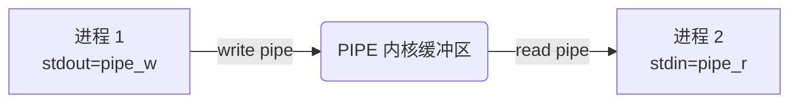

# Linux 输入输出重定向与管道（面试强化版）

> 本篇系统讲解 Linux **I/O 重定向**（redirection）和 **管道**（pipeline）——所有命令组合的"粘合剂"。
>
> **核心定位**：理解 I/O 重定向 = 理解**一切命令协作的底层原理**。`grep` / `awk` / `find` 这些命令之所以能"串"起来，靠的就是它。
>
> **链路呼应**：
> - → [[目录的操作]]：`cp` / `mv` 重定向输出到文件
> - → [[Linux目录导航]]：`stdin` 与 `cd` / `exec` 的关系
> - → [[linux文件查询]]：`grep` / `find` / `sort` / `uniq` 全部靠管道串联
> - → [[Linux vfs虚拟文件系统|VFS]]：所有 fd 背后的 `struct file`
> - → [[目录的权限]]：管道与 FIFO 的权限模型
> - → [[linux-getting-help|linux获取帮助]]：`man bash` 的 REDIRECTION 章节
>
> 备注：编写时网络访问受限，所有结论以本地 man 手册语义为准。

---

## §0. 心智模型：水管 + 邮局

> 想要理解 I/O 重定向，请先在脑子里装两套"比喻系统"——它们能解释 90% 的反直觉行为。

### 0.1 水管系统（用来理解文件描述符）

| 水管比喻 | Linux 对应 | 说明 |
|---|---|---|
| **进水口** | **`stdin`**（fd 0） | 程序"喝水"的地方 |
| **正常出水口** | **`stdout`**（fd 1） | 程序正常"吐水"的地方 |
| **漏水口** | **`stderr`**（fd 2） | 程序"出错"时吐水的地方，**不进管道** |
| **三通阀** | **`tee`** | 一路继续往后流，一路存盘 |
| **水龙头改装** | **`>`** | 把正常出水口接到文件 |
| **流量计改装** | **`xargs`** | 收集水流，自动拆成"小瓶" |

> **关键**：`stdout` 和 `stderr` 是 **两条独立的水管**——重定向 `>` 只改正常出水口，**不动漏水口**。这是反直觉的源头。

### 0.2 邮局系统（用来理解流的方向）

| 邮局比喻 | Linux 对应 | 说明 |
|---|---|---|
| **收件箱** | **stdin**（fd 0） | 程序"读"的地方 |
| **平信邮筒** | **stdout**（fd 1） | 正常输出，重定向它用 `>` |
| **加急件专线** | **stderr**（fd 2） | 紧急/重要输出，重定向它用 `2>` |
| **定时投递箱** | **文件** | 任何带路径的对象 |
| **邮递员绕道** | **管道 `|`** | 把一个程序的"平信"塞进下一个程序的"收件箱" |
| **印章 / 翻面** | **`tee`** | 平信复印一份，原件继续传递 |

### 0.3 用水管理解"`2>&1`"

```bash
cmd > file.log 2>&1
# 1. cmd 的 stdout (fd 1) 接向 file.log
# 2. 然后把 fd 2 指向"fd 1 指向的东西"——也就是 file.log
# 报错和正常都进 file.log
```

反过来：

```bash
cmd 2>&1 > file.log
# 1. 先把 fd 2 指向 fd 1（终端）
# 2. 再把 fd 1 指向 file.log
# 结果：fd 2 还是终端，fd 1 是 file.log
# 报错去终端，正常输出进文件
```

**顺序很关键！**这是面试最爱挖的坑。

---

## §1. 文件描述符（fd）基础

### 1.1 三个默认流

每个进程启动时自动打开三个文件描述符：

| fd | 名称 | 默认 | 默认设备 | POSIX 常量 |
|---|---|---|---|---|
| 0 | stdin | 输入流 | 终端键盘 | `STDIN_FILENO` |
| 1 | stdout | 输出流 | 终端屏幕 | `STDOUT_FILENO` |
| 2 | stderr | 错误流 | 终端屏幕 | `STDERR_FILENO` |

> **关键洞察**：fd 0/1/2 不是规定死的——它们是进程表里的 **前三个槽位**，谁先抢到谁当。

### 1.2 用文件描述符的角度看进程

```c
// /proc/<pid>/fd/ 是 fd 的实际指向
$ ls -l /proc/$$/fd
lrwx------ 1 alice alice 64 Jun 10 09:11 0 -> /dev/pts/0
lrwx------ 1 alice alice 64 Jun 10 09:11 1 -> /dev/pts/0
lrwx------ 1 alice alice 64 Jun 10 09:11 2 -> /dev/pts/0
```

- `$$` = 当前 shell 的 PID
- `0/1/2` 都是 `/dev/pts/0`——你当前的伪终端
- 每个 fd 都是一个指向 `struct file` 的链接

### 1.3 fd 在 VFS 视角

fd → struct file → struct dentry → struct inode → 块设备 / page cache  
                ↑  
         一次 open() 一个，close() 一个

- `dup()` 复制 fd：两个 fd 指向同一个 `struct file`（共享 offset）
- `>` 重定向：新 `struct file` 替换 fd 指向（不修改原 fd 表）
- 关闭原 fd 时，**重定向后的 fd 不受影响**（已经在内核"持有"了它）
- 详细见 [[Linux vfs虚拟文件系统|VFS]] §1, §3, §8

---

## §2. 输出重定向（`>` 和 `>|`）

### 2.1 基本语法

```bash
cmd > file        # stdout 写入 file（覆盖）
cmd >| file       # 同上，但强制（绕过 noclobber，见 §2.4）
cmd > file 2>&1   # stdout + stderr 都写入 file
```

### 2.2 关键行为

| 场景 | 行为 | 关键点 |
|---|---|---|
| `cmd > file` | 启动 cmd 时打开 file（**O_WRONLY \| O_CREAT \| O_TRUNC**），fd 1 指过去 | 文件不存在则创建；存在则清空 |
| `cmd >> file` | 打开 file（**O_APPEND**） | 永远写到末尾 |
| `cmd > file` 失败 | fd 1 不动（保留原终端） | shell 默认行为，安全 |
| `cmd &> file` | `cmd > file 2>&1` 的简写 | bash 扩展 |

### 2.3 经典陷阱：清空文件

```bash
$ > file.log         # 不需要 cmd——直接清空 file.log
# 这是 >file 的简写（fd 1 = file，但程序没输出，结果是清空）
```

**实战**：创建空文件或清空现有文件，不必用 `rm` 或 `touch`：

```bash
> debug.log          # 立刻清空日志（最干净的写法）
: > debug.log        # 同上（`: 是 no-op 内置`）
truncate -s 0 debug.log  # 第三种写法
```

### 2.4 `noclobber` 防止意外覆盖

```bash
set -o noclobber     # 开启 noclobber
cmd > existing_file  # 报错：file 已存在
cmd >| existing_file # 用 >| 强制覆盖

set +o noclobber     # 关闭
```

**为什么有这个**：防止 `>` 误覆盖重要文件。**强烈推荐脚本里开启**。

### 2.5 写入失败时的几个状态

| 情况 | shell 默认行为 | 现代 bash 选项 |
|---|---|---|
| 文件不存在 | 创建 | 同 |
| 文件存在（普通） | 覆盖 | 同 |
| 文件是 FIFO | 阻塞直到对方打开 | 同（取决于 open 模式） |
| 文件是目录 | **报错** | `set -C` 默认行为 |
| 无权限写 | **报错** | fd 不被替换 |

---

## §3. 追加重定向（`>>`）

```bash
cmd >> file         # stdout 追加到 file 末尾（fd = open(O_APPEND)）
cmd >>| file        # 强制（noclobber 不影响 >>）
cmd 2>> file        # stderr 追加
cmd &>> file        # stdout + stderr 都追加
```

**与 `>` 的对比**：

```bash
echo "old" > a.txt        # 创建/覆盖
echo "new" > a.txt        # 文件内容只剩 "new"
echo "again" >> a.txt     # 内容：new\nagain
```

**关键**：每次 `>` 都是一个**新的 open + truncate**；每次 `>>` 都是一次 `lseek` 到末尾再写（原子）。

---

## §4. 输入重定向（`<`）

```bash
cmd < file        # cmd 从 file 读 stdin
cmd <<< "$var"    # here-string（见 §6）
cmd << EOF        # here-document（见 §5）
```

**与 `cat file | cmd` 的对比**：

| 写法 | shell 开子 shell？ | 进程数 | 适用场景 |
|---|---|---|---|
| `cmd < file` | ❌（直接 open file 给 stdin） | 1 | 最常用 |
| `cat file \| cmd` | ✅（cat 在子 shell） | 2 | 文件内容要预处理 |

```bash
# 同效：
wc -l < /etc/passwd
cat /etc/passwd | wc -l
# 但后者多一个 cat 进程，UUOC（Useless Use of Cat）
```

---

## §5. here-document（`<<` / `<<-`）

### 5.1 基本语法

```bash
cmd << 'EOF'
... 多行内容 ...
EOF
```

- shell 把 `'EOF'` 标记之间的内容作为 cmd 的 stdin。
- `'EOF'` 加引号：**禁止变量展开**和命令替换。
- `EOF` 不加引号：**会展开** `$var`、`` `cmd` `` 等。

### 5.2 三种用法对比

```bash
# 1) 带引号（推荐，最安全）
cat << 'EOF' > /etc/myapp.conf
# 这是配置
listen=$PORT      # 字面输出 listen=$PORT
EOF

# 2) 不带引号（会展开）
cat << EOF > /etc/myapp.conf
listen=$PORT      # 展开成 listen=8080
EOF

# 3) <<- （去前导 tab）
cat <<- EOF
        hello
    world
        EOF
# 移除行首的 tab（不是空格！）
```

### 5.3 实战案例

**生成配置文件**：

```bash
cat << EOF > /etc/myapp.conf
server {
    listen $PORT;
    server_name $HOST;
}
EOF
```

**写 SQL 块**：

```bash
mysql -u root <<EOF
USE mydb;
SELECT * FROM users LIMIT 10;
EOF
```

**期望你写 fragment of shell script**：

```bash
#!/bin/bash
read -p "Name: " name
cat << EOF | mail -s "hi" admin@example.com
Hello,
$name is here.
EOF
```

### 5.4 heredoc 的陷阱

| 陷阱 | 错误示例 | 正确 |
|---|---|---|
| 空格会被保留 | `   cat << EOF` | 写成 `<<EOF`（无空格）或 `<<-` 去 tab |
| 缩进的 `EOF` 不认 | `    EOF` | `<<-` 去掉缩进 tab |
| `'EOF'` 不展开 | `$VAR` 字面输出 | 不加引号会展开 |
| 末尾的分隔符必须是独占一行 | `EOF # comment` 不行 | 必须 EOF 单独一行 |
| 命令在管道里时 heredoc 是 stdin 吗 | `cat \| grep "^#" << EOF` | grep 拿的是 heredoc 不是 cat 输出 |

---

## §6. here-string（`<<<`）

```bash
cmd <<< "$var"        # $var 作为 stdin 的一行
grep "pattern" <<< "hello world"     # 输出：hello world
```

**与 here-doc 的区别**：
- `<<` 多行；`<<<` 单行。
- `<<<` 自动不展开反斜杠（`$'...'` 用法保留）。
- bash 4+ 支持。

**实战**：

```bash
# 给命令送一个字面字符串（不需要 echo |）
mail -s "alert" admin@example.com <<< "Disk usage > 90%"

# 与变量配合
grep "$USER" <<< "$(who)"          # 用 who 的输出查当前用户
```

---

## §7. 错误流重定向（`2>` / `2>&1`）

### 7.1 单独重定向 stderr

```bash
cmd 2> err.log       # stderr 写到 err.log
cmd 2>> err.log      # stderr 追加到 err.log
cmd 2>| err.log      # 强制覆盖
```

### 7.2 `2>&1` 的精妙——顺序决定一切

```bash
# 顺序 A：先 2>&1，再 > file
cmd > file 2>&1
# 1. fd 2 → fd 1 当时指向（终端）
# 2. fd 1 → file
# 结果：fd 2 也指向 file ✅

# 顺序 B：先 > file，再 2>&1
cmd 2>&1 > file
# 1. fd 2 → fd 1 当时指向（终端）
# 2. fd 1 → file
# 结果：fd 2 还是终端 ❌
```

> **关键**：每个重定向只是**修改 fd 表的一项**，**不是立即生效**。`2>&1` 是"fd 2 也指向 fd 1 当前指向的东西"——**当前**是关键。

### 7.3 等价写法速查

```bash
# 下面三行等价（重定向 stdout+stderr）
cmd > file 2>&1
cmd &> file              # bash 简写
cmd >& file              # bash 4+ 简写（顺序：>& = 2>&1 + >）

# 下面三行等价（> 和 >>）
cmd > file               # 覆盖
cmd 1> file              # 同（fd 1 是默认）
cmd 1>> file             # 追加

# stdin 重定向
cmd < file
cmd 0< file
```

### 7.4 实战：分离 stdout 和 stderr

```bash
# 让标准输出进 out.log，错误进 err.log
cmd > out.log 2> err.log

# 错误吞掉，正常输出给真终端
cmd 2>/dev/null

# 错误也吞掉
cmd &>/dev/null

# 错误和正常都进同一文件（追加）
cmd &>> all.log
```

---

## §8. 复合重定向（`&>` / `&>>`）

`&>` 和 `&>>` 是 bash 的快捷写法：

```bash
cmd &> file       # 等价 cmd > file 2>&1
cmd &>> file      # 等价 cmd >> file 2>&1
```

**注意点**：
- 是 bash 扩展，POSIX `sh` 不支持。
- 写跨 shell 脚本要换成 `cmd > file 2>&1`。

---

## §9. 文件描述符进阶（自定义 fd）

### 9.1 打开自定义 fd

```bash
exec 3> file.log       # 打开 fd 3 指向 file.log（写）
exec 3< input.txt      # 打开 fd 3 指向 input.txt（读）
exec 3<> data.txt      # 打开 fd 3 双向读写
```

### 9.2 用自定义 fd 重定向

```bash
echo "to fd 3" >&3     # 写入 fd 3（file.log）
echo "to default" >&2   # 写入 fd 2（stderr）

read line <&3           # 从 fd 3 读
cat <&3                 # 显示 fd 3 文件内容
```

### 9.3 关闭 fd

```bash
exec 3>&-       # 关闭写端
exec 3<&-       # 关闭读端
exec 3>&1       # 把 fd 3 指向 stdout（暂时）
```

### 9.4 实战：日志文件句柄

```bash
exec 3>> /var/log/myapp.log          # 打开全局日志文件

log() {
    echo "[$(date '+%F %T')] $*" >&3   # 用 fd 3 写日志
}

log "服务启动"                       # 实际写到 /var/log/myapp.log
log "用户登录: $USER"

exec 3>&-                            # 关闭 fd
```

---

## §10. `exec` 与文件描述符

`exec` 在 shell 里有两个角色：

| 用途 | 语法 | 行为 |
|---|---|---|
| **替换 shell 进程** | `exec cmd` | shell 自己被 cmd 替换（不返回） |
| **修改 fd 表** | `exec N> file` / `exec N<&-` | 在**当前 shell**里改 fd 表 |

```bash
# 替换 shell：节省一个进程（不是子 shell）
exec python script.py
# 执行后 shell 退出，python 接管

# 修改 fd 表：以后所有命令都受影响
exec 3> file.log
echo "hello" >&3      # 文件里立刻有 "hello"
```

### 实战：`exec` 在初始化脚本里

```bash
#!/bin/bash
# 脚本一启动就重定向所有输出
exec > /var/log/myscript.log 2>&1

echo "step 1..."             # 进 log
echo "step 2..."             # 进 log
# 不需要每次都写重定向
```

---

## §11. 管道（`|`）

### 11.1 本质

管道 = **把前一个进程的 stdout 连到下一个进程的 stdin**。  
shell 在 fork 时建一个 pipe（pipe(2) syscall），两端各占一个 fd。



**关键事实**：
- **只传 stdout，不传 stderr**。
- 默认 64KB 缓冲区（Linux 2.6.35+ 可调）。
- **阻塞语义**：写满阻塞，读空阻塞。
- 子进程间通过 pipe 通信，**父 shell 没机会看**——这是为什么 `cmd1 | cmd2` 的错误要 `2>&1 |`。

### 11.2 实战案例

```bash
# 经典：ls + grep
ls /etc | grep "^pass"            # 输出 /etc/passwd /etc/passwd-

# 多级管道
cat /var/log/nginx/access.log | grep "GET" | awk '{print $1}' | sort | uniq -c | sort -rn | head

# 统计当前 TCP 连接数
ss -tan | grep ESTAB | wc -l

# 找最大的 10 个文件
du -ah / | sort -hr | head
```

### 11.3 管道与重定向的区别

| 维度 | `\|` | `>` |
|---|---|---|
| 数据流向 | 进程 → 进程 | 进程 → 文件 |
| 是否开子 shell | ❌（不开） | ❌ |
| 数据是否落盘 | ❌（仅在内存 pipe） | ✅（落盘） |
| 适合 | 数据流处理 | 大数据存盘 |
| 反例 | 大数据 + 管道 = 等落盘 | 大量小数据 + 重定向 = 多次 fsync |

### 11.4 `pipefail`——管道的失败语义

```bash
set -o pipefail
cmd1 | cmd2 | cmd3
# 默认：退出码 = cmd3 的
# pipefail 开启：退出码 = 第一个非零
```

**强烈推荐脚本里开启**：

```bash
#!/bin/bash
set -euo pipefail       # 包含 pipefail + errexit + nounset
```

---

## §12. `tee`——分流

```bash
cmd | tee file.log            # cmd 输出同时显示和写 file.log
cmd | tee -a file.log         # 追加
cmd | tee file1 file2         # 多个文件
cmd | tee >(gzip > log.gz)    # 写到进程替换（伪文件）
```

**本质**：`tee` 是 `read stdin + write stdout + write file`——一个**三通阀**。

### 实战

```bash
# 调试：一边看屏幕一边存日志
myapp | tee /tmp/debug.log

# 边流边压
myapp | tee >(gzip > /tmp/log.gz)

# 多目标
myapp | tee stdout.log other.log
```

---

## §13. `xargs`——给命令构造参数

### 13.1 本质

```bash
find ... | xargs rm -f
# find 输出 "file1\nfile2\n..."，xargs 把它们拼成 "rm -f file1 file2 ..."
```

**为什么需要**：`rm` 等命令不读 stdin——`rm < file_list` 不行，得 `rm file1 file2 ...`。**xargs 就是转换的桥梁**。

### 13.2 关键选项

```bash
xargs cmd                    # 默认行为，cmd 不接 stdin
xargs -n 1 cmd              # 每次最多 1 个参数（多次调用）
xargs -I {} cmd {}          # 用 {} 占位，可多次出现
xargs -0                    # 用 NUL 分隔（-print0 配合）
xargs -P 4 cmd              # 并发 4 个进程
xargs -t cmd                # 显示构造的命令（调试用）
xargs -r cmd                # 没输入时**不**执行 cmd（GNU）
xargs -d '\n' cmd           # 自定义分隔符
```

### 13.3 实战

```bash
# 删除 find 找到的所有 .log
find . -name "*.log" -print0 | xargs -0 rm -f

# 批量改所有者
find /var/log -name "*.gz" | xargs -I {} chown root {}

# 并发压缩
find . -name "*.log" -print0 | xargs -0 -P 8 gzip

# 安全的 rm：
echo "*.tmp" | xargs rm -f
# 注意：要 --null 配套或 -d '\n' 避免空格被拆
```

### 13.4 `xargs` 替代方案对比

| 写法 | 等价性 | 适用 |
|---|---|---|
| `find ... -exec rm {} \;` | 每次 fork 一次 | 命令少、文件多 |
| `find ... -exec rm {} +` | 一次 fork 多个参数 | ✅ 推荐 |
| `find ... \| xargs rm` | 类似 `+` | ✅ 推荐 |
| `while read; do cmd $REPLY; done` | bash 内置 | 复杂条件 |

```bash
# 推荐：find -exec ... +   或   find | xargs
# 不推荐：while read loop（性能差）
```

---

## §14. 命名管道（FIFO / mkfifo）

### 14.1 与匿名管道的区别

| 维度 | `\|`（匿名管道） | `mkfifo`（命名管道） |
|---|---|---|
| 文件名 | 无 | 有 |
| 生命周期 | 进程退出即销毁 | 文件存在就存在 |
| 多读者多写者 | ❌（仅 1 对 1） | ✅ |
| 跨进程 | ❌（血缘） | ✅（任何进程） |
| 创建方式 | shell 自动 | `mkfifo /tmp/myfifo` |

### 14.2 实战：进程间通信

```bash
# 终端 1：等待读
mkfifo /tmp/f
cat /tmp/f                 # 阻塞，直到有人写

# 终端 2：写入
echo "hello" > /tmp/f
```

**生产场景**：

```bash
# 备份时一边压缩一边写盘一边给监控发信号
mkfifo /tmp/p.fifo

# 写日志
myapp > >(tee /var/log/myapp.log) &

# 监听管道
while read line < /tmp/p.fifo; do
    echo "[$(date)] $line"
done
```

---

## §15. 横向对比：所有"流控制"工具

| 工具 | 方向 | 读 stdin？ | 写 stdout？ | 写文件？ | 主要场景 |
|---|---|---|---|---|---|
| `>` | → file | ❌ | ❌ | ✅ | 输出存盘 |
| `>>` | → file (append) | ❌ | ❌ | ✅ | 日志追加 |
| `<` | ← file | ✅ | ❌ | ❌ | 文件做输入 |
| `<<` | ← heredoc | ✅ | ❌ | ❌ | 配置块 |
| `<<<` | ← string | ✅ | ❌ | ❌ | 字符串输入 |
| `\|` | prog → prog | ✅（下一进程） | ✅ | ❌ | 数据流 |
| `tee` | prog → prog + file | ✅ | ✅ | ✅ | 双输出 |
| `xargs` | prog → prog（参数） | ✅ | ❌ | ❌ | 构造参数 |
| `mkfifo` | 任意 | ✅ | ✅ | 文件作中介 | 进程通信 |
| `exec N>` | 改 fd 表 | ❌ | ❌ | ✅ | 长期重定向 |

---

## §16. 面试 10 大追问

### Q1：`>` 和 `>>` 的本质区别？

**答案**：
- `>` = open with `O_WRONLY | O_CREAT | O_TRUNC`，**清空文件**再写。
- `>>` = open with `O_APPEND`，**追加**。
- 写多进程并发时，`>>` 多个 write 之间可能交错（O_APPEND 是每次 write 内原子，跨 write 不保证）。

**加分话术**：
> "严格说，O_APPEND 保证每次 write() 内是原子的（A→B 之间不写一半），但不保证多次 write 原子。如果要严格原子，得用 `O_APPEND` + `flock` 或日志文件专用工具。"

### Q2：`cmd > file 2>&1` 和 `cmd 2>&1 > file` 行为一样吗？

**答案**：**不一样**。
- `> file 2>&1`：fd 1 → file **再** fd 2 → fd 1（fd 2 也指向 file）—— 都进 file。
- `2>&1 > file`：fd 2 → fd 1 **再** fd 1 → file（fd 2 还在终端）—— 错误进终端。

**加分话术**：
> "判断技巧：把 `2>&1` 读作 'fd 2 现在指向 fd 1 当前指向的地方'。两个操作先后顺序决定 fd 1 当时指向谁。"

### Q3：管道和重定向的最大区别？

**答案**：
- **数据是否落盘**。管道数据仅在内核缓冲区（≤ 64KB），重定向数据进文件。
- **是否传 stderr**。管道只传 stdout，stderr 默认各走各的（除非 `2>&1`）。
- **能否复用数据**。管道读完就没了，重定向可反复读。

**加分话术**：
> "我的实战经验：管道适合流式数据处理（grep / sort / uniq / awk 链条），重定向适合要持久化或二次处理的数据（保存中间结果、错误日志）。"

### Q4：here-doc 和 here-string 区别？

**答案**：
- `<<` 多行内容；`<<<` 单行内容。
- `<<` 一定要分隔符标识结尾（`EOF`）；`<<<` 没有。
- `<<` 默认 `\` 转义（加引号禁止展开）；`<<<` 也按 shell 转义规则。

**加分话术**：
> "面试我会带一行例子：`grep '^#' <<<"$PATH"`，对 PATH 找含 `#` 的——here-string 最适合这种'给一个变量当输入'的场景。"

### Q5：`tee` 的工作原理是什么？

**答案**：`tee(1)` = `read(0)` + `write(1)` + `write(file)`。
- 内核 fork 一个 `tee` 进程（用户态进程），三处写。
- 数据通过 pipe 流转。

**加分话术**：
> "tee 是早期 shell 的三通阀，但本质是普通命令。它和管道的结合 `cmd1 | tee file | cmd2` 是经典的'中间留存'模式——调试脚本时超有用。"

### Q6：为什么 `find ... | xargs rm` 比 `find ... -exec rm {} \;` 快？

**答案**：
- `xargs`：find 输出 N 个文件名，xargs 攒一批，再 fork 一次 rm。
- `-exec ... \;`：每**一个**文件名都 fork 一次 rm。
- 后者：N 个文件 = N 次 fork+exec。

**加分话术**：
> "现代推荐 `find -exec ... +`（加号版本），它和 xargs 一样一批传参，但写法更简单——而且不会有 xargs 的空格引号坑。"

### Q7：管道里的子 shell 是什么？

**答案**：默认**不开**子 shell——管道左右是**两个独立子进程**，由父 shell fork 出来。
- 父 shell 等待所有管道右端结束。
- `cmd1 | cmd2`：左端和右端并行跑，**左端速度决定右端阻塞**。

**加分话术**：
> "误区是以为管道左右都开子 shell——其实是开了两个**对等子进程**，没有嵌套关系。`{ cmd1; cmd2; }` 和 `(cmd1; cmd2)` 才是显式子 shell。"

### Q8：怎么让管道的退出码可读？

**答案**：

```bash
cmd1 | cmd2 | cmd3
echo $?         # = cmd3 的退出码

# 加 pipefail
set -o pipefail
cmd1 | cmd2 | cmd3
echo $?         # = 第一个非零的退出码
```

**加分话术**：
> "标准做法是脚本开头 `set -euo pipefail`——errexit + nounset + pipefail 三件套，其中 pipefail 必须显式开。"

### Q9：`mkfifo` 和 socket 的区别？

**答案**：
- `mkfifo` = 命名管道（一对一、单向、内核缓冲）。
- Unix socket = 双向、字节流 / 数据报、支持多进程。
- 跨机器用 **网络 socket**（TCP/UDP）。

**加分话术**：
> "单机 FIFO 就够；多机必须 socket。Redis 早期单机 FIFO 都行，上了集群只能 socket。"

### Q10：`exec` 在脚本里能替换 shell 进程吗？

**答案**：可以——`exec cmd` 让 shell 进程本身被 cmd 替换（PID 不变）。
- 节省一个进程；
- 常用于脚本"只剩一行"时，避免浪费。

**加分话术**：
> "Dockerfile 的 `CMD` 经常 `exec /myapp` 而不是 `sh -c /myapp`——前者 PID 1 是 myapp，信号处理正确；后者多一层 sh，信号要转发。"

---

## §17. 易错点 ×15

1. **顺序很关键**：`cmd > file 2>&1` ≠ `cmd 2>&1 > file`。
2. **`>` 默认覆盖**：用错就清空文件。
3. **`>>` 不保证多次 write 原子**：多进程写同一文件要加锁。
4. **`tee` 不替代日志库**：只是简单分流，没有时间戳、轮转。
5. **`echo "x" | read line` 不生效**：管道在子 shell，外层变量没值。
6. **here-doc 的 EOF 必须独占一行**：`EOF # comment` 不行。
7. **`<<<` 是 bash 扩展**：POSIX sh 不支持。
8. **`xargs` 默认按空格切分**：文件名含空格要 `-print0` + `-0`。
9. **`fuser -k` 慎用**：会 SIGKILL，可能丢数据。
10. **`exec` 改 fd 后** `cat` 等命令都受影响——作用域是当前 shell。
11. **管道 + `set -e`** + 多管道 = 默认不报错——必须开 `pipefail`。
12. **`mkfifo` 不带阻塞 open** 默认是阻塞——读写两端都准备好才动作。
13. **`/dev/null`** 是 fd 黑洞，重定向到这里 = 数据消失，可读为"空流"。
14. **`$?` 是上一个命令**——管道里它只反映最后一段的退出码（除非 pipefail）。
15. **`xargs -I` 默认按行切** — 大文件要 `-0`。

---

## §18. 综合案例

### 案例 1：日志轮转的标准写法

```bash
# 把 stdout 进 access.log，stderr 进 error.log
myapp > /var/log/access.log 2> /var/log/error.log

# 等价：
myapp &>> /var/log/all.log
myapp > /var/log/all.log 2>&1
```

### 案例 2：调试——边看边存

```bash
# 看屏幕同时也存盘
myapp | tee /tmp/debug.log

# 边看边压
myapp | tee >(gzip > /tmp/debug.log.gz)
```

### 案例 3：批量重命名

```bash
ls *.txt | xargs -I {} mv {} {}.bak
# 所有 .txt 加 .bak 后缀

# 替代：
for f in *.txt; do mv "$f" "$f.bak"; done
# 或
rename 's/$/.bak/' *.txt    # perl rename
```

### 案例 4：找最大文件

```bash
du -ah / 2>/dev/null | sort -rh | head -20
# du 输出 (可读大小 路径)，sort -r 反序，head 前 20
# 2>/dev/null 屏蔽权限错误
```

### 案例 5：MySQL 备份 + 压缩 + 校验

```bash
mysqldump -u root db1 | gzip | tee /backup/db1-$(date +%F).sql.gz | sha256sum > /backup/SHA256
# 多目标：一行完成 dump → gzip → 双目标（文件 + sha256）
```

### 案例 6：内存只有 1GB 的大文件去重排序

```bash
sort -u huge.txt > sorted.txt
# 大文件排序不能放管道——会爆内存
```

### 案例 7：进程替换（process substitution）

```bash
# diff 两个进程的输出
diff <(ls /etc) <(ls /usr)

# paste 多源
paste <(cut -f1 file1) <(cut -f1 file2)

# while 读 cmd 输出
while read line; do
    echo "got: $line"
done < <(myapp --verbose)        # 注意空格！
```

### 案例 8：`/dev/tcp` 调试网络

```bash
# bash 内置 TCP 客户端
exec 3<>/dev/tcp/example.com/80
echo "GET / HTTP/1.0" >&3
echo "" >&3
cat <&3
```

---

## §19. 与其他笔记的链路

| 主题 | 链接 | 关联点 |
|---|---|---|
| **目录的操作** | [[目录的操作]] | 输出重定向常用来"保存操作结果" |
| **Linux目录导航** | [[Linux目录导航]] | `cd < /dev/null` 测试 shell 是否正常 |
| **目录的权限** | [[目录的权限]] | FIFO/mkfifo 的权限模型与目录一样 |
| **VFS** | [[Linux vfs虚拟文件系统]] | 文件描述符 = fd → file → inode |
| **文件查询** | [[linux文件查询]] | grep / sort / uniq 全靠管道 |
| **获取帮助** | [[linux获取帮助]] | `man bash` REDIRECTION / PIPELINE 章节 |

---

## §20. 进一步阅读（权威参考）

### 20.1 man 手册（必看）

- `man 1 bash` —— REDIRECTION、PIPELINES、PROCESS SUBSTITUTION 章节
- `man 3 pipe` —— pipe(2) 系统调用
- `man 3 mkfifo` —— 命名管道
- `man 1 tee` —— 分流
- `man 1 xargs` —— 参数构造
- `man 7 pipe` —— pipe(7) 内核视角

### 20.2 在线资源

- Bash 官方：https://www.gnu.org/software/bash/manual/html_node/Redirections.html
- Linux Documentation：https://tldp.org/LDP/abs/html/io-redirection.html
- TLDP 高级 Bash 指南：https://tldp.org/LDP/abs/html/

### 20.3 推荐书

- **《Classic Shell Scripting》** —— 第 7 章"输入输出"
- **《UNIX Programming Environment》** —— 经典老书，Kernighan 写
- **《The Linux Programming Interface》** —— 第 49 章"管道与 FIFO"

---

> 复习建议：
> 1. **§0 水管比喻** + **§7.2 `2>&1` 顺序** 是面试最常考的，先背；
> 2. **§3 `>` vs `>>`** §11 管道 vs 重定向 用表格对比记忆；
> 3. **§5 here-doc / §6 here-string** 写脚本天天用，至少每个跑一次；
> 4. **§16 面试 10 问** 把 Q1/Q2/Q3 答案背熟（最容易考）；
> 5. **§18 案例 1-8** 至少跑通 3 个，建立肌肉记忆；
> 6. 用 `tracer` 或 `strace -e trace=pipe2,dup2` 看一次实际的 syscall 序列。