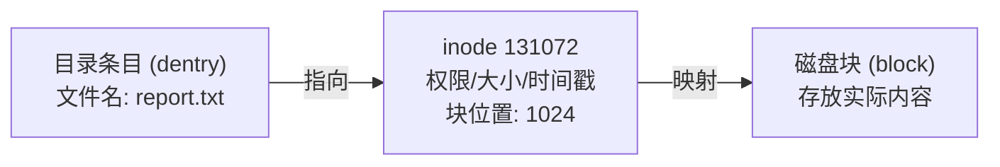
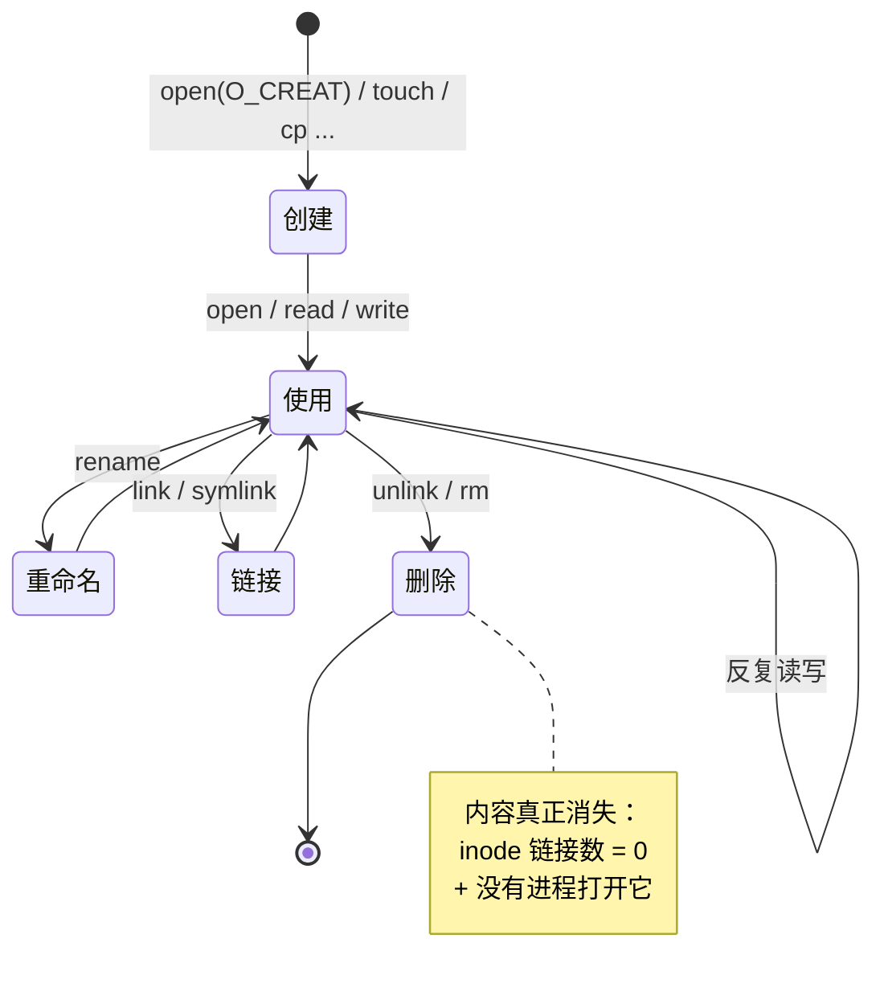
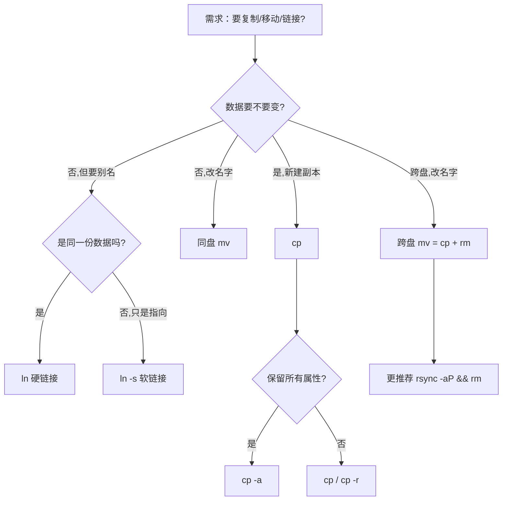

# Linux 目录的操作（创建 / 复制 / 移动 / 链接 / 删除）—— 面试导向版

> 这份笔记的定位：**面试准备 + 概念理解**。
> 1. 每个命令都从"**它到底在内核里做了什么**"开始讲，再讲怎么用；
> 2. 用**类比**把抽象概念变成"可想象"的画面；
> 3. 用**对比表**和**面试追问**来巩固；
> 4. 与前几篇 `目录的权限`、`目录导航`、`文件查询`、`VFS` 互相呼应。
>
> 适用读者：需要深入理解 Linux 文件操作、能向面试官讲清楚"为什么"的人。

---

## 0. 写在前面：所有"操作"的统一心智模型

> **类比**：把整个 Linux 文件系统想成一座**图书馆**。
> - **书（内容）** 放在**书库（块设备）** 的某个**货架位置**上；
> - **借书卡（inode）** 记录了"书名 → 货架位置 → 借阅规则（权限）"；
> - **索引目录（dentry）** 写着"哪本书在哪个架子上"；
> - **借阅证（file 描述符）** 是你"正在看这本书"的一次借阅记录。

**对应关系**：

| 文件系统术语                 | 图书馆类比                           |
| ---------------------- | ------------------------------- |
| **块设备**（如 `/dev/sda1`） | 整座图书馆（物理空间）                     |
| **inode**              | 一本书的"借书卡"：记录内容位置、大小、权限          |
| **dentry**             | 索引卡片：写着"哪个书架哪个位置"               |
| **文件名**                | 借书卡上的"书名"                       |
| **硬链接**                | 同一本书有**多张借书卡**（不同名，但指向同一本书）     |
| **软链接**                | 一张卡片写着"去 xx 室找 yy"（**指向另一张卡片**） |
| **打开文件（fd）**           | 你正拿着这本书在读（一次借阅）                 |

**所有"操作"都在改这张关系网**：
- `mkdir` / `touch` → 买一本新书入馆（建借书卡 + 索引卡）
- `cp` → **复印**一本书，馆里多一本一样的（两个 inode，两份内容）
- `mv`（同盘）→ **改借书卡的书名**（不挪书，瞬时完成）
- `mv`（跨盘）→ 复印 + 撕掉原件
- `ln`（硬）→ 复印借书卡，**内容还是同一本**
- `ln -s`（软）→ 写一张"指向某张卡"的卡片
- `rm` → **撕掉借书卡**；当所有卡片都撕了，书从馆里消失

> 有了这个图，下面所有命令都会"秒懂"。

---

## 1. 概念基础：操作对象到底是什么

### 1.1 一个文件的"双面性"

> **关键洞察**（面试必背）：**文件名 ≠ 文件**。

- 你看到的 `report.txt` 是**文件名**（一个字符串，存在 dentry 里）
- 文件的**真实内容**存在磁盘块上，由 **inode** 描述



**操作带来的影响**：

| 操作          | 文件名       | inode           | 内容       |
| ----------- | --------- | --------------- | -------- |
| `rm` 文件     | ❌ 删       | 📉 链接数-1（>0 还在） | 内容不动     |
| `cp` 文件     | ➕ 新增      | ➕ 新建 inode      | 复制数据     |
| `mv` 同盘     | 🔁 改/移目录项 | 不变              | 不动       |
| `mv` 跨盘     | 🔁 改/移    | ➕ 新 inode       | 复制+删旧    |
| `ln` 硬链接    | ➕ 新增      | 📈 链接数+1        | 共享       |
| `ln -s` 软链接 | ➕ 新增      | ➕ 新 inode（特殊类型） | 内容是路径字符串 |

### 1.2 文件的"生命周期"（面试图）



> **面试常问**：
> - Q: "rm 之后数据立刻没了？"  
>   A: 文件名没了，inode 链接数-1；**内容还在磁盘上**，直到所有硬链接都删、且没进程打开它时，块才被回收。
> - Q: "还有进程打开的文件能被 rm 吗？"  
>   A: 能。文件名没了，但**内容继续可用**（从 `/proc/<pid>/fd/N` 仍能访问到），直到进程关闭 fd。

### 1.3 "原子性"是什么

> **类比**：银行转账。转账要么 A 减 100 + B 加 100 **同时完成**，要么都不做。
> 绝对不能出现"减了 A 但没加 B"的状态。

**`rename()` 系统调用是原子的**（POSIX 保证）：
- 移动文件，要么完整成功，要么完全没动。
- 这就是为什么 `mv` 改配置文件超安全：不会出现"半截文件"。

**`rm` 不可逆**——撕掉借书卡就找不到了。

---

## 2. 创建类：`mkdir` / `touch`

### 2.1 `mkdir` —— 建空目录

**本质**：在父目录里建一个新的 dentry + 一个新 inode（类型 = 目录）。

```bash
mkdir /tmp/demo                  # 建一个
mkdir -p a/b/c                   # 递归建（父目录已存在不报错）
mkdir -m 750 secure              # 直接设权限（绕过 umask）
```

**关键选项**：
- `-p`：幂等，**已存在不报错**（脚本里建目录必备）
- `-m MODE`：显式设权限
- `-v`：显式输出
- `-Z`：设 SELinux context

**面试题**：
> Q: `mkdir a/b`，a 不存在时报什么错？怎么避免？  
> A: `No such file or directory`。用 `mkdir -p a/b`（同时建好 a）。

> Q: `mkdir -p` 已存在会报错吗？退出码？  
> A: **不会**。退出码 0。**这是脚本里"建目录"的标准动作**。

### 2.2 `touch` —— 创空文件 / 改时间戳

**本质**：双功能合一。
- 文件**不存在** → 创一个 0 字节文件（`open(O_CREAT)`）
- 文件**已存在** → 把 mtime/atime 刷到"现在"（`utimensat()`）

```bash
touch new.txt                    # 创空文件
touch existing.txt               # 刷 mtime/atime
touch -d "2024-01-01 12:00" f    # 改到指定时间
touch -r ref.txt f               # 同步另一个文件的时间
touch -m f                       # 只刷 mtime
touch -a f                       # 只刷 atime
touch -c notexist                # 不存在不创建
```

**面试题**：
> Q: `touch` 文件 → 文件大小一定是 0 吗？  
> A: **是**（因为 `O_CREAT` 不写数据）。

> Q: `touch -d` 能改 `btime`（创建时间）吗？  
> A: 大多数文件系统**不能**。`btime` 由 FS 在创建时记录，事后无法改（部分 FS 如 btrfs 支持）。

### 2.3 umask 原理（**面试重点**）

> **类比**：umask 是"**出生时就要扣掉的税**"。每个新文件/目录"出厂"时，权限被 umask 减掉。

| 类型  | 基准权限   | umask 0022 → 实际   |
| --- | ------ | ----------------- |
| 目录  | `0777` | `0755`（rwxr-xr-x） |
| 文件  | `0666` | `0644`（rw-r--r--） |

**经典面试题**：
> Q: umask = 0022，新建脚本自动可执行吗？  
> A: **不能**。文件基准是 666，umask 减 022 得 644，**没有 x 位**。要给可执行：`chmod +x file` 或 umask = 0000（但**文件 666 也无 x**）。

> Q: 改 umask = 0000 能让新文件有 x 吗？  
> A: **不能**。Linux 永远**不让新文件自动有 x**（安全设计），即便 umask 0000。

### 2.4 退出码速记

| 命令 | 成功 | 失败 |
|---|---|---|
| `mkdir` | 0 | 1（已存在/父目录缺/权限） |
| `touch` | 0 | 1（无权限/参数错） |

---

## 3. 复制类：`cp`

### 3.1 `cp` 的本质

> **类比**：`cp` = **复印机**。
> 1. 把原件**读**进内存；
> 2. 写一份**新副本**到目标；
> 3. 副本默认 **不带原件的所有属性**（除非加 `-p` / `-a`）。

```bash
cp src dst
cp src1 src2 src3 dir/           # 多源 → 目标必须是目录
cp -r src/ dst/                  # 递归
cp -a src/ dst/                  # 归档：递归 + 保留**所有**属性
cp -p src dst                    # 保留 mtime/权限
cp -l src dst                    # 建**硬链接**（不复制数据）
cp -s src dst                    # 建**软链接**
cp -u src dst                    # 源比目标新才覆盖
cp -n src dst                    # 不覆盖
cp -i src dst                    # 覆盖前问
cp -v src dst                    # 显式
```

### 3.2 必背选项对比（**面试必问**）

| 场景         | 推荐                    | 含义                                                 |
| ---------- | --------------------- | -------------------------------------------------- |
| 完整备份       | `cp -a src/ dst/`     | **递归 + 软链 + 硬链接 + 权限 + 时间 + 属主 + xattr + ACL 全保留** |
| 普通复制       | `cp -r src/ dst/`     | 递归，但**不保留属主/时间**                                   |
| 保留时间       | `cp -p src dst`       | 保留 mtime / 权限（不含属主）                                |
| 复制后查改      | `cp -v src dst`       | 显示过程                                               |
| 增量         | `cp -u src/ dst/`     | 跳过"目标比源新"的                                         |
| CoW（btrfs） | `cp --reflink=always` | 瞬间完成（不复制数据块）                                       |

> **黄金口诀**：**`cp -a` = `cp -dR --preserve=all`**，备份唯一正解。

### 3.3 `cp -a` vs `cp -r` vs `cp -rp`（**矩阵**）

| 保留属性         | `-r` | `-rp` | `-a`      |
| ------------ | ---- | ----- | --------- |
| 递归           | ✅    | ✅     | ✅         |
| mtime / mode | ❌    | ✅     | ✅         |
| 属主（uid/gid）  | ❌    | ✅     | ✅（需 root） |
| 软链保持为软链      | ❌    | ❌     | ✅         |
| 硬链接数关系       | ❌    | ❌     | ✅         |
| xattr / ACL  | ❌    | ❌     | ✅         |

> **面试话术**："我要给整个 /etc 备份，应该用 `cp -a` 还是 `cp -r`？答 `-a`，因为 `-r` 会丢时间戳和属主，相当于"复制内容不复制元数据"。

### 3.4 跨文件系统

**同盘** `cp`：源和目标在同一 FS（如都在 `/dev/sda1`）→ 正常读+写。
**跨盘** `cp`：必须**读源 → 写目标**——慢、属性可能丢（`-p` 也救不了跨 FS 的全部属性）。

> **面试题**：跨盘的 `cp -a` 能保留 100% 属性吗？  
> A: 不一定。xfs vs ext4 的 ACL 格式可能不同，xattr 命名空间可能不兼容。

### 3.5 `cp -l` vs `cp -s`（**易混淆**）

| 选项 | 实质 | 占用空间 | 源被删 |
|---|---|---|---|
| `cp -l` | **硬链接** | 不增加（共享 inode） | 不影响副本 |
| `cp -s` | **软链接** | 仅路径字符串 | 副本**变断链** |

> **面试题**：`cp -l` 和 `cp` 占用磁盘差异？  
> A: `cp -l` 不复制数据，只建硬链接。1GB 源建 100 个 `cp -l` 副本 = 仍占 1GB。`cp` 会变 100GB+。

### 3.6 退出码

| 情况 | 退出码 |
|---|---|
| 成功 | 0 |
| 源不存在 | 1 |
| 目标无写权限 | 1 |
| `-i` 拒绝覆盖 | 1 |
| 递归中部分失败 | 部分源被复制，退出码非 0 |

---

## 4. 移动/重命名类：`mv`

### 4.1 `mv` 的本质（**最重要的认知**）

> **类比**：`mv` 同盘 = 改借书卡上的书名（不挪书）；跨盘 = 复印 + 撕掉原件。

**系统调用层**：
- **同盘 `mv`** = 一次 `rename(2)` 调用 → 只改 dirent → **瞬时完成**
- **跨盘 `mv`** = `cp` + `rm`（或内核内部实现为 `renameat2` + 回滚）→ **慢**

```bash
mv a b                            # 改名字
mv a dir/                         # 移进目录
mv a b c dir/                     # 多源 → 目录
mv -i a b                         # 覆盖前问
mv -u a b                         # 源新才覆盖
mv -b a b                         # 覆盖前备份
```

### 4.2 原子性

> `rename(2)` 是 **POSIX 原子**。这就是为什么生产环境"切换配置"用 `mv` 而不是 `cp`：
>
> ```bash
> # 推荐：原子切换
> mv new.conf service.conf
> # 不推荐：可能读到半截
> cp new.conf service.conf
> ```

### 4.3 跨文件系统的"陷阱"

> 跨盘 mv 实际是**复制 + 删除**，不是原子操作。
> 风险：
> 1. 中途断电 → 出现重复文件
> 2. attributes 可能丢
> 3. 进度不可见

**更安全的跨盘 mv**：
```bash
# 推荐：rsync（支持断点续传、显示进度、attributes 完整保留）
rsync -aP src/ dst/ && rm -rf src/
# 等价于"跨盘 mv"，但可控
```

### 4.4 经典面试题

> Q: `mv` 是否改变 inode？  
> A: **同盘不变**（只改 dirent）；**跨盘变**（新建 inode）。

> Q: 移动到同一个目录、只改名，会发生什么？  
> A: 一次 `rename(2)`，inode 不变，文件名改，瞬时完成。

> Q: `mv` 改的是源还是目标？  
> A: 都改。源 dirent 删除；目标 dirent 创建。inode 本身不变（仅同盘）。

---

## 5. 链接类：`ln`

### 5.1 硬链接 vs 软链接（**面试必问**）

> **类比**：
> - **硬链接** = 同一本书有**多张借书卡**（"金庸全集" 既放在 A 区，也放在 B 区）
> - **软链接** = 一张**指路卡**（"想看金庸全集请去 A 区找"）

```bash
ln src hardlink                  # 建硬链接
ln -s target link                # 建软链接
ln -sn target existing_link      # 不"穿透"软链（目标当文件）
ln -sfn new target               # 强制替换软链目标
```

### 5.2 8 维对比表（**面试黄金表**）

| 维度      | 硬链接             | 软链接              |
| ------- | --------------- | ---------------- |
| 本质      | 同一 inode 的另一个名字 | 指向路径的"快捷方式"      |
| inode   | **相同**          | **不同**（特殊 inode） |
| 跨文件系统   | ❌               | ✅                |
| 链接到目录   | ❌（一般不允许）        | ✅                |
| 源被删     | 链接**仍可用**       | **断链**（dangling） |
| 占用空间    | 几乎为 0           | 路径字符串字节数         |
| 权限      | 文件本身权限          | 路径解析时看目标         |
| `ls` 表现 | `2 ...` 链接数     | `link -> target` |

### 5.3 软链接细节

- 软链存的是**目标路径字符串**，不是 inode
- 软链权限位 `lrwxrwxrwx`（不被解析，解析时看目标）
- 可以"断链"（指向不存在的目标，**`ln` 不报错**）
- 可以循环（`ln -s loop loop`），访问时 `ELOOP`
- **中间目录**的 `x` 位必须开放，否则追链失败

### 5.4 硬链接细节

- 源和硬链**指向同一 inode**
- 任一被改 → 数据变（因为是同一份）
- 任一被 rm → inode 链接数 -1；**链接数 = 0 才真正删除**
- `ls -l` 第二列的 "硬链接数" = 指向此 inode 的 dirent 数
- 不可跨 FS（inode 跨 FS 不唯一）
- 一般**不允许**给目录建硬链接（`.` 和 `..` 是内核特例）
- 硬链的 mtime / 权限 / 属主 = 共享的（同 inode）

### 5.5 找断链（实战）

```bash
# 找所有断链
find . -xtype l
find . -type l ! -exec test -e {} \; -print

# 批量清断链
find . -xtype l -delete       # 谨慎！
find . -xtype l -exec rm {} \;
```

### 5.6 `ln -n` 的细节（**易错**）

```bash
mkdir existing
touch existing/file
ln -s existing link-to-dir          # link-to-dir → existing

# 想给"link-to-dir"再 ln 一个 file？
ln -s new-file link-to-dir          # 错！它当成目录，会进 existing/
ln -sn new-file link-to-dir         # 强制把 link-to-dir 当成"普通路径"
# → 在当前目录建一个名为 "link-to-dir" 的软链 → new-file
```

> 关键：**`-n` = `--no-dereference`** = 目标即使是"指向目录的软链"，也当文件处理。

### 5.7 经典面试题

> Q: 删除源文件，硬链接还能访问吗？  
> A: **能**。硬链接共享 inode，源被 rm 只是 dirent 数 -1。

> Q: 为什么硬链接不能跨文件系统？  
> A: inode 在 FS 内才唯一。跨 FS 编号冲突。软链接存的是**路径字符串**，无此限制。

> Q: 软链接的权限 777 有意义吗？  
> A: **没意义**。解析时看**目标**的权限，链本身的 rwx 被忽略。

> Q: 能给目录建硬链接吗？  
> A: 一般**不能**。`ln dir hardlink-of-dir` 报 `Operation not permitted`。目的是避免目录树成环。`.` 和 `..` 是内核特例。

> Q: 软链断链后，访问会怎样？  
> A: 报 `No such file or directory`（或 `ELOOP` 如果是环）。

---

## 6. 删除类：`rm` / `rmdir`

### 6.1 系统调用层

- `rm` → `unlink(2)`（文件）/ `unlinkat(AT_REMOVEDIR)`（目录）
- `rmdir` → `rmdir(2)`（必须是空目录）
- **本质**：把 dentry 从父目录的 dirent 链表里移除，inode 链接数 -1
- 内容**不立刻删**——等链接数 = 0 且无进程打开，才回收

### 6.2 `rm` 必背选项

| 选项 | 含义 |
|---|---|
| `-f` | 强制（忽略不存在、跳过提示） |
| `-i` | 每次问 |
| `-I` | 一次问（删 ≥3 个或递归时） |
| `-r` / `-R` | 递归 |
| `-d` | 删空目录（同 rmdir） |
| `-v` | 显式 |
| `--preserve-root` | 不允许 `rm -rf /`（**默认**） |
| `--no-preserve-root` | 取消保护（**千万别手敲**） |
| `--` | 结束选项解析（路径以 `-` 开头时用） |

### 6.3 `rmdir` 必背

```bash
rmdir empty                      # 删一个空目录
rmdir -p a/b/c                   # 删 a/b/c，a/b 和 a 也空则一起删
rmdir -v dir                     # 显式
rmdir --ignore-fail-on-non-empty # 失败静默
```

> **`rmdir` 只删空目录**——刻意设计，逼你"显式决策"。

### 6.4 退出码

| 命令 | 成功 | 失败 |
|---|---|---|
| `rm` | 0 | 1（无权限/源不存在且无 -f） |
| `rmdir` | 0 | 1（非空/不存在/无权限） |

### 6.5 危险与防护

> **Linux 没有回收站**——`rm` 是**真删**。

**三大雷区**：

```bash
# 1) 变量未引号
rm -rf $dir/                     # dir 为空 → rm -rf /  （灾难）

# 2) 通配符误展开
rm -rf *                         # 当前目录错会扩散

# 3) 路径含空格
rm -rf /tmp/My Photos            # 当成两个参数
rm -rf "/tmp/My Photos"          # 正确
```

**防护**：
```bash
# 1) alias
alias rm='rm -I'                 # 比 -i 友好，删 ≥3 才问

# 2) 装 trash-cli（推荐）
sudo apt install trash-cli
alias rm='trash-put'             # 移到回收站，可恢复

# 3) safe-rm 黑名单
# /etc/safe-rm.conf 写 /, /etc, /usr, ...
```

### 6.6 误删恢复（**极少数情况**）

| 情况 | 能恢复？ | 怎么恢复 |
|---|---|---|
| 文件被某进程**打开** | ✅ | `cp /proc/<pid>/fd/<N> 恢复` |
| FS 是 btrfs / ZFS CoW | ✅ | 从快照恢复 |
| 一般 ext4 / xfs | ❌ 几乎不行 | 立刻 `umount` + `extundelete` / `photorec` / `testdisk`（仅删后立刻操作） |

> **教训**：重要数据**提前备份**，不要指望恢复。

### 6.7 经典面试题

> Q: `rm -rf /` 能跑吗？  
> A: 默认**不能**（`--preserve-root` 拦），但 `rm -rf --no-preserve-root /` 可以——**会**摧毁系统。

> Q: `rm` 一个正在运行的可执行文件，进程会怎样？  
> A: 进程**继续运行**。`rm` 只删 dirent，inode 链接数 -1；进程仍持有 inode 引用，内容**不被回收**直到进程退出。

> Q: `rmdir` 和 `rm -d` 的区别？  
> A: 几乎一样。`rmdir` 只删空目录；`rm -d` 也是只删空目录（但有 `rm` 的其他选项生态，如 `-v`）。

---

## 7. 横向对比：cp / mv / ln 的"数据流"

> **面试必看表**——讲清楚"操作 vs 数据"的关系。

| 操作 | 同 FS 速度 | 跨 FS | 复制数据？ | 修改源？ | 推荐场景 |
|---|---|---|---|---|---|
| `cp src dst` | 快 | 慢 | ✅ | ❌ | 备份、复制 |
| `mv src dst` | **极快**（改 dirent） | 慢（=cp+rm） | 仅跨 FS | ✅ | 重命名/同盘移动 |
| `ln src hardlink` | 极快 | ❌ | ❌ | ❌ | 节约空间快照 |
| `ln -s src dst` | 极快 | ✅ | ❌ | ❌ | 别名、版本切换 |

> **关键洞察**：
> - `mv` 同盘 **= 0 数据复制**
> - `cp` 和 `mv` 跨盘 **= 复制 + 删除**
> - `ln` 不论哪种 **= 0 数据复制**（硬链不复制，软链仅存路径字符串）

---

## 8. 完整实战流程图



---

## 9. 面试常见追问（建议打印背）

> 这一节按"面试题 → 答案 → 加分话术"组织，可以直接用作口头表达。

### Q1: `cp -a` 比 `cp -r` 好在哪？
**答**：
- `cp -r` 只递归，**不保留属主、不保留时间戳、不保留软链**。
- `cp -a` = `cp -dR --preserve=all`，**保留所有属性**（权限、时间、属主、xattr、ACL、软链保持为软链）。
- **生产环境备份必用 `-a`**。

### Q2: `mv` 同盘是原子操作吗？跨盘呢？
**答**：
- 同盘 `mv` = `rename(2)`，**POSIX 原子**——配置文件切换的"金标准"。
- 跨盘 `mv` = `cp + rm`（或内核级 `EXDEV` 错误 + 回退）——**不是原子**。大文件推荐用 `rsync -aP && rm` 替代。

### Q3: 软链接和硬链接的区别？（8 维简版）
**答**：
- 硬链接**共享 inode**，软链接**另起 inode 存路径**。
- 硬链接**不跨 FS**，不能给目录建；软链接**都能**。
- 源被删：硬链接**仍可用**；软链接**变断链**。

### Q4: 删除文件的能力由谁决定？
**答**：**父目录的 `w+x` 位**，**不是**文件本身。
- 文件本身只决定"内容能不能改/读"。
- 这是 `chmod 777` 不安全的根因：父目录还是 777，敏感文件仍可被删。

### Q5: `umask 022` 创建的脚本有可执行位吗？
**答**：**没有**。
- 文件基准 666，减 umask 022 = 644，**无 x**。
- Linux **永远不让新文件自动有 x**（即便 umask 0000）。
- 加可执行：`chmod +x file`。

### Q6: `rm -rf /` 能跑吗？
**答**：
- 默认**不能**（`--preserve-root` 拦），报 "dangerous to operate recursively on '/'"
- `rm -rf /*` 同样会拦
- 解除保护：`rm -rf --no-preserve-root /`——**核弹级命令**

### Q7: 中间目录的权限影响什么？
**答**：**路径解析的每一步都需要 `x` 位**。
- `cd /a/b/c` 需要 `/` `/a` `/a/b` `/a/b/c` **每层**的 `x` 位。
- 任何一层无 `x` → `Permission denied`，**即使目标本身权限全开也没用**。

### Q8: `cp` 跨盘会丢哪些属性？
**答**：
- mtime / 权限 / 属主 用 `-p` 通常能保；
- **xattr / ACL** 在跨 FS（如 ext4 → xfs）时**可能不兼容**；
- 软链追链、扩展属性命名空间都可能丢。

### Q9: 用 `mv` 实现"原子切换配置"怎么做？
**答**：
```bash
# 1. 写新文件到临时名
echo "new_config" > service.conf.new

# 2. 原子改名（rename 系统调用保证原子性）
mv service.conf.new service.conf
```
- 任何时刻读 `service.conf` 要么是旧内容要么是新内容，**不会读到半截**。
- 这是生产部署的经典模式。

### Q10: `ln -n` 用来做什么？
**答**：
- `--no-dereference`：目标即使是"指向目录的软链"也当**文件**处理。
- 用于"覆盖软链"而不是"穿透软链进入目录"。

---

## 10. 易错点速记

1. **文件名 ≠ 文件**——`rm` 删的是 dirent，不是内容。
2. **删除能力看父目录**——`chmod 777` 文件不安全，看父目录。
3. **`mv` 同盘瞬时、跨盘 = cp+rm**——别在跨盘大文件上误用。
4. **硬链接不跨 FS**——inode 编号是 FS 内唯一的。
5. **硬链接不能给目录**——只有 `.` 和 `..` 例外。
6. **软链接权限 777 无意义**——看的是目标。
7. **断链不报错**——`ln -sf /nonexistent mylink` 不会失败。
8. **路径中变量永远加引号**——`rm -rf $dir/` 是历史最大坑。
9. **umask 022 创建文件无 x**——文件基准 666 不含 x。
10. **`rm -rf /` 默认被拦**——`--preserve-root` 是默认。
11. **`-i` vs `-I`**：`-I` 删 ≥3 个或递归时**只问一次**，比 `-i` 友好。
12. **`cp -a` 是 `cp -dR --preserve=all`**——这是速记口诀。

---

## 11. 一图流：所有操作在内核里的对应系统调用

| 用户命令 | 系统调用 | VFS 操作 |
|---|---|---|
| `mkdir` | `mkdir` / `mkdirat` | `inode_operations::mkdir` |
| `touch` | `open(O_CREAT)` + `utimensat` | `inode_operations::create` + `setattr` |
| `cp` | `open(src) + open(dst,O_CREAT) + read + write` | `file_operations::read/write` |
| `mv`（同盘） | `rename` / `renameat2` | `inode_operations::rename` |
| `mv`（跨盘） | `EXDEV` 错误后 `cp + unlink` | `read/write` + `unlink` |
| `ln`（硬） | `link` / `linkat` | `inode_operations::link` |
| `ln -s`（软） | `symlink` / `symlinkat` | `inode_operations::symlink` |
| `rm` | `unlink` / `unlinkat(AT_REMOVEDIR)` | `inode_operations::unlink` |
| `rmdir` | `rmdir` | `inode_operations::rmdir` |

> **与 VFS 的呼应**（参考 `Linux vfs虚拟文件系统.md`）：
> - 创建 / 删除 / 链接 = 调 **inode_operations**
> - 读写 = 调 **file_operations**
> - VFS 不存数据，数据在具体 FS 里
> - 所有操作的"原子性"由 FS 在事务层保证

---

## 12. 速查表

| 场景 | 命令 |
|---|---|
| 递归建目录 | `mkdir -p a/b/c` |
| 创建并设权限 | `mkdir -m 750 secure` |
| 创空文件 | `touch file` |
| 改 mtime | `touch -d "2024-01-01" file` |
| 同步时间 | `touch -r ref file` |
| 完整备份 | `cp -a src/ dst/` |
| 增量复制 | `cp -au src/ dst/` |
| 同步避免大文件 | `cp -l src dst`（建硬链） |
| 同盘改名 | `mv old new` |
| 多文件移入目录 | `mv a b c dir/` |
| 原子切换配置 | `mv new.conf service.conf` |
| 建硬链接 | `ln src hardlink` |
| 建软链接 | `ln -s target link` |
| 替换软链 | `ln -sfn new-target link` |
| 删空目录 | `rmdir -p a/b/c` |
| 删文件 | `rm file` |
| 删目录 | `rm -r dir` |
| 强制删 | `rm -rf dir` |
| 安全 rm | `alias rm='rm -I'` 或 `trash-put` |
| 找断链 | `find . -xtype l` |
| 跨盘安全移动 | `rsync -aP src/ dst/ && rm -rf src/` |

---

## 13. 进一步阅读

- `man 1 mkdir` / `man 1 rmdir` / `man 1 rm` / `man 1 cp` / `man 1 mv` / `man 1 ln` / `man 1 touch`
- `man 2 link` / `man 2 symlink` / `man 2 unlink` / `man 2 rename` / `man 2 renameat2`（系统调用）
- `man 3 umask`（C 库函数）
- `info coreutils` —— 所有命令的完整索引
- `Documentation/filesystems/portability.rst`（内核）
- **与本笔记呼应**：
  - 上一块 `目录的权限.md`——"删/改"看的是父目录权限
  - 上一块 `Linux目录导航.md`——`mv` 改变 dirent
  - 上一块 `linux文件查询.md`——`cp` 内部就是 `read + write`
  - 上一块 `Linux vfs虚拟文件系统.md`——所有操作走 VFS 4 大 ops 表

---

> **复习建议（面试向）**：
> 1. 把 § 9 的 10 道面试题**用自己的话**复述一遍，每道 1 分钟内能讲清；
> 2. 构造场景：给你 1GB 源，10 份"副本"想节约空间，怎么做？（`cp -l` 10 次，1GB 空间；
>     或者 `cp --reflink=always` 在 btrfs 上）；
> 3. 故意 `rm` 一个正在运行的可执行，看 `/proc/<pid>/exe` 是否还能访问（**能**，这就是"删了文件但进程还活着"的根因）；
> 4. `mkdir -m 750 /tmp/test` 后 `chmod 777 /tmp/test` 再 `rm -rf /tmp/test/*`，验证**非空目录要 rmdir 拒绝**而 `rm -r` 接受；
> 5. `ln -s /etc/passwd /tmp/pwd_link` + `stat /tmp/pwd_link` 看 `l` 类型 + `->` 目标；
> 6. **想清楚"为什么软链能跨 FS，硬链不能"**——一句话能讲清才真的懂。
