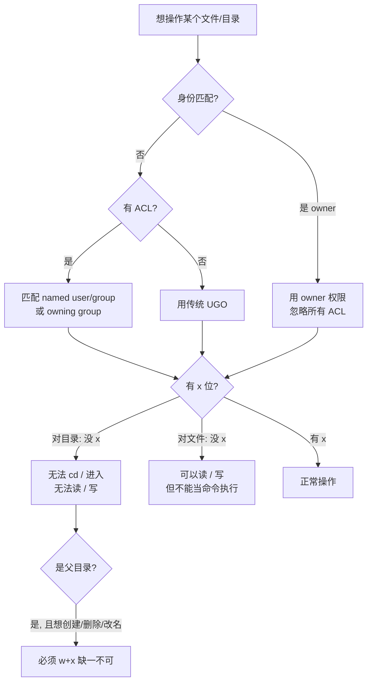
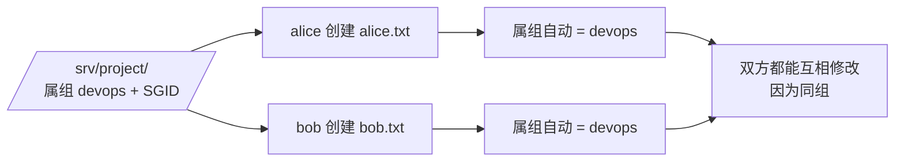
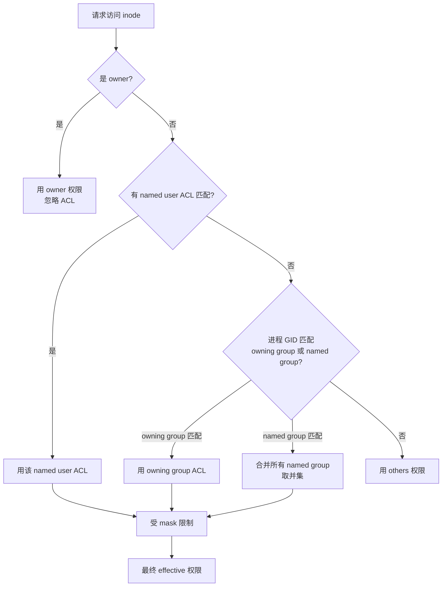

# Linux 目录权限深度复习（面试强化版）

> 本文档系统梳理 Linux **目录**相关的权限模型，按"面试准备 + 类比理解"双线组织。
>
> **核心定位**：权限是文件系统的"门禁系统"，理解它就理解了一切"为什么进不去 / 为什么删不掉 / 为什么别人能改我的文件"的根源。
>
> **链路呼应**：
> - → [[Linux vfs虚拟文件系统|VFS]]：inode.mode 的二进制真相
> - → [[目录的操作|目录的操作]]：删 / 改 看父目录权限的本质
> - → [[Linux目录导航]]：cd 进入目录的权限检查路径
> - → [[linux文件查询]]：ls 看到的权限位 + stat 的元数据
> - → [[linux-getting-help|linux获取帮助]]：`man chmod` / `man 5 acl`
>
> 备注：编写时网络访问受限，所有结论以本地 man 手册语义为准。文末给出权威参考。

---

## §0. 心智模型：图书馆比喻（先有画面，再有概念）

> **强烈建议**：把这一节背下来。后面所有 rwx / SUID / Sticky 的"为什么"，都用这个比喻解释。

### 0.1 一座图书馆 = 一个文件系统

| 图书馆概念             | Linux 对应                      | 说明                            |
| ----------------- | ----------------------------- | ----------------------------- |
| **书本身**（纸 + 内容）   | 文件**内容**                      | 在书架上、在磁盘上                     |
| **借书卡**（贴在书脊上）    | **inode**                     | 编号唯一，记录书名/作者/借出状态等**元数据**     |
| **索引卡柜**（按书名查卡片）  | **dentry / dcache**           | 名字 → 借书卡的对应表，**只在图书馆内存里**     |
| **阅览室**（开放/闭馆/限流） | **目录**                        | 决定谁能**找到**书、谁能**借走**、谁能**进入** |
| **阅览室规则**（贴在门口）   | **目录权限 rwx**                  | 馆方对所有读者公示的"准入规则"              |
| **借阅证**（读者手里的凭证）  | **fd（文件描述符）**                 | 临时借出时给读者的，唯一                  |
| **馆长权限**（紧急开放）    | **root + Linux capabilities** | 可绕过多数限制                       |

### 0.2 用图书馆解释"删除文件为什么看父目录"

> 这是 Linux 权限最反直觉、也是面试最爱问的点。

**场景**：
- 你在 `二楼阅览室`（父目录）找到一本《Linux 实战》。
- 你想把它拿走（= `rm` 删除）。

**直觉错误**：以为"能不能拿走"取决于《Linux 实战》这本书自己贴的"反盗用标签"（文件自身的权限）。

**真相**：
- 馆方借书流程 = **先在二楼登记簿上划掉《Linux 实战》这一行**（= 在父目录的目录项里去掉这个 dentry）。
- 你能不能**改二楼登记簿**，取决于 **二楼阅览室的规则**（= 父目录权限），不是这本书的标签。
- 所以：把秘密文件放在 `chmod 777` 的目录下 = 把文件放在"任何人都能改登记簿"的阅览室 = **谁都能让你的文件"消失"**。

> **核心口诀（背）**：**改文件看自己，删/改文件名看父目录。**

### 0.3 用图书馆解释 rwx

| 权限位 | 在阅览室（目录）上的含义 | 图书馆场景 |
|---|---|---|
| `r`（read） | 能 `ls` 看登记簿的**名字** | 站在门口瞥一眼登记簿，知道有哪些书名 |
| `w`（write） | 能**划掉 / 加 / 改**登记簿的条目 | 能在登记簿上新增、借出、归还 |
| `x`（execute） | 能**走进**这个阅览室 | 推门进去，能拿起书 |
| **三者必须组合** | 必须有 `x` 才能用 `r` 或 `w` | 不让进门，就别想登记或看书 |

> **关键**：`x` 是"准入位"，**没有 `x` 一切免谈**。这就是为什么 `chmod 644`（没有 x）= 你只能隔着门看一眼名字，进都进不去。

---

## §1. 为什么"目录权限"要单独讲

很多人把目录当成"特殊的文件"，直接套用 rwx 含义，结果在实际操作中踩坑：

| 操作      | 在**普通文件**上的含义            | 在**目录**上的含义                                |
| ------- | ------------------------ | ------------------------------------------ |
| `r`（读）  | 可以 `cat` / `less` 查看文件内容 | 可以执行 `ls` 列出**文件名**（但看不到元信息如大小、权限、mtime 等） |
| `w`（写）  | 可以修改文件内容                 | 可以在目录内**创建、删除、重命名**条目（前提是要有 `x`）           |
| `x`（执行） | 可以把文件当命令/脚本执行            | 可以**进入**该目录（`cd`），并把目录作为路径分量访问其中的条目        |

> **核心口诀**：对目录而言，**`r` 看得到名字、`x` 进得去摸得到、`w` 改得了条目**。三者是组合关系。

---

## §2. 基础权限模型（UGO + rwx）

### 2.1 权限位结构

`ls -l` 看到的第一列共 10 个字符：

```
- rwx r-x r--   alice devops   script.sh
↑  ↑   ↑   ↑
│  │   │   └── others (o)
│  │   └────── group  (g)
│  └────────── user   (u)
└───────────── 文件类型（d=目录，-=普通文件，l=链接，b/c=设备，p=管道，s=套接字）
```

### 2.2 数字表示法

| 权限 | 二进制 | 十进制 |
|---|---|---|
| `r` | 100 | 4 |
| `w` | 010 | 2 |
| `x` | 001 | 1 |
| `rwx` | 111 | 7 |
| `r-x` | 101 | 5 |
| `r--` | 100 | 4 |

三个数字依次对应 **u / g / o**。例如 `chmod 750 dir` = `rwxr-x---`。

### 2.3 符号表示法

```bash
chmod u=rwx,g=rx,o= dir          # 直接赋值
chmod g+w file                   # 给 group 加写
chmod o-rwx dir                  # 给 others 去掉所有权限
chmod -R u=rwX,g=rX,o= tree/     # X 表示"仅当是目录或已有执行位时给 x"，批量处理时非常有用
```

> 小技巧：`X`（大写）只对**目录**和**已有 x 位的文件**设置 x。常用于 `chmod -R` 批量修整权限，避免给所有文件加可执行位。

---

## §3. 目录上的 rwx 行为详解（含 8 个组合案例）

下表针对**目录**列出 8 种 rwx 组合的实际效果（假设当前用户是 others）：

| r   | w   | x   | 实际效果                                    | 图书馆场景                    |
| --- | --- | --- | --------------------------------------- | ------------------------ |
| 0   | 0   | 0   | 完全不可见，不可进入，不可修改                         | 这间阅览室不存在                 |
| 0   | 0   | 1   | 可 `cd` 进入，但 `ls` 看不到内容；可凭记忆访问已知文件名      | 推门进去，但登记簿是暗的；你凭脑子里的名字找到书 |
| 0   | 1   | 0   | **矛盾状态**：有 w 无 x，无法进入也就无法写；实际等同无权限      | 站在门外想改登记簿，但门进不去          |
| 0   | 1   | 1   | 可 `cd` 进入、可创建/删除文件，但 `ls` 看不到列表         | 推门进去，能借/还，但不知道架上有啥       |
| 1   | 0   | 0   | 可 `ls` 看文件名，但不能 `cd`，不能访问任何条目           | 隔着玻璃看一眼书名，不能推门           |
| 1   | 0   | 1   | 标准"只读浏览"：可 `ls`，可 `cd`，可 `cat` 已知文件名的文件 | 标准的阅览室：能看书名、能进、能读，但不能借走  |
| 1   | 1   | 0   | 矛盾：能 `ls` 但 `cd` 失败，w 因此无效              | 看得见登记簿但进不去，借还都做不到        |
| 1   | 1   | 1   | 完整权限：浏览、进入、增删改                          | 一切开放                     |

> **关键洞察**：能否**删除**一个文件，不取决于文件本身的权限，而取决于**其父目录的 w+x**。这就是为什么把敏感文件放在 `chmod 777` 的目录里仍然不安全。

### 3.1 决策流程图（Mermaid）



---

## §4. 修改属主/属组：`chown` / `chgrp`

```bash
chown alice dir/                # 改属主
chown :devops dir/              # 改属组
chown alice:devops dir/         # 同时改
chown -R alice:devops /srv/app  # 递归
chgrp devops dir/               # 仅改属组
```

### 4.1 递归 `-R` 的雷区

- `chown -R` 会顺着符号链接**指向的真实文件**修改（除非加 `-h`）。
- 与 `chmod -R` 配合时要小心，递归改完属主后，原本设的 SGID 会重置为普通目录。
- **root 才能 chown 给别人**——普通用户只能 `chgrp` 到自己所在的组。

### 4.2 `chown` 不影响 `chmod` 已知位（概念区别）

| 命令 | 改的字段 | 触发 ctime | 适用范围 |
|---|---|---|---|
| `chown` | uid/gid | ✅ | 必须 root |
| `chgrp` | gid | ✅ | 普通用户可改到自己的组 |
| `chmod` | mode（含 rwx + SUID/SGID/Sticky） | ✅ | 属主或 root |

> 三个命令**都只改 metadata，不改内容**，所以 mtime 不动。

---

## §5. 默认权限与 `umask`

新创建的目录/文件的"基准权限"：

| 类型 | 基准权限 | 受 umask 减位 |
|---|---|---|
| 目录 | `0777` (rwxrwxrwx) | `base & ~umask` |
| 文件 | `0666` (rw-rw-rw-) | `base & ~umask` |

> 创建文件时**永远不会自动获得 x 位**（即便 `umask` 是 000），这是安全设计——防止新文件被自动执行。

### 5.1 常用 `umask` 场景

| 场景 | 建议 umask | 创建的目录效果 | 创建的文件效果 |
|---|---|---|---|
| 个人单机 | `0022` | `755` | `644` |
| 同组协作 | `0002` | `775` | `664` |
| 高度敏感 | `0077` | `700` | `600` |

```bash
umask                          # 查看当前
umask 0022                     # 临时设置
# 永久设置：写入 ~/.bashrc 或 /etc/profile
```

### 5.2 "为什么新文件永远没有 x"——深度解释

> 这是 **Linux 安全模型的第一道防线**。

- 文件被创建时**内容未知**（即使你刚 `touch` 完）。
- 若默认给 `x`，意味着：**任何新文件默认都可执行**。
- 一旦某个攻击者能写文件（如上传日志、临时文件），它默认就能执行 → 灾难。
- 所以：文件基准 = `0666`（rw），目录基准 = `0777`（rwx）。
- **x 必须显式 `chmod +x` 加**——这是"白名单"思路，不是"黑名单"。

### 5.3 umask 公式记忆法

> **口诀**：umask 是"出生时扣的税"。

```
新文件权限 = 0666 & ~umask
新目录权限 = 0777 & ~umask
```

举例 `umask 0022`：
- `~0022` = `~000 010 010` = `111 101 101`
- `0666 & 111101101` = `110 100 100` = `0644` ✅

---

## §6. 特殊权限位（SUID / SGID / Sticky Bit）

> 这三位的"执行位"被替换为 `s` / `s` / `t`，且**只对可执行位为 1 的位置才显示**。

| 位 | 字符 | 数字 | 文件上的作用 | **目录上的作用** |
|---|---|---|---|---|
| SUID | `s`（user x 位） | 4000 | 进程以文件属主身份运行 | **对目录无意义**（被忽略） |
| SGID | `s`（group x 位） | 2000 | 进程以文件属组身份运行 | **目录内新建的文件/子目录自动继承该目录的属组** |
| Sticky | `t`（other x 位） | 1000 | 现代内核基本无作用 | **目录内的文件/子目录只有属主（和 root）能删除/重命名** |

### 6.1 数字模式用法

```bash
chmod 4755 /usr/bin/passwd     # SUID + 755
chmod 2755 /srv/shared         # SGID 目录
chmod 1777 /tmp                # Sticky + 777（系统 /tmp 默认就是 1777）
chmod 7755 /srv/special        # 三个都开（一般不推荐）
```

### 6.2 符号模式用法

```bash
chmod u+s file                 # 加 SUID
chmod g+s dir                  # 加 SGID（目录自动继承属组）
chmod +t dir                   # 加 Sticky
chmod u-s,g-s,-t file          # 同时去掉三个特殊位
```

### 6.3 为什么 SUID 对目录无效

SUID 的语义是"进程以文件 owner 身份运行"——而目录不是可执行进程，内核直接忽略该位。如果在目录上误设了 SUID，`ls` 会显示大写 `S`（表示"x 位为 0，不显示 s 的效果"），提醒你配置有问题。

### 6.4 SGID 目录：图书馆场景（团队借书柜）

> 图书馆有"借书柜"，所有读者把书**还回来时**，自动归入"借书柜组"，下一位读者才能找到。



### 6.5 Sticky 目录：图书馆场景（开放书架）

> 图书馆的"开放书架"：任何人能**放**、能**拿**自己的书，但**不能拿走别人的书**。

- `alice` 放《A》→ `bob` 不能 `rm`《A》但**可以覆盖**（覆盖看的是文件本身的 w + 目录的 w）。
- Sticky 只防 `unlink` / `rename`，**不防** `write`。
- 这就是为什么 `/tmp` 默认 1777：任何用户能写、能读，但**别人删不掉我的 tmp 文件**。

---

## §7. ACL：突破 UGO 三元组

UGO 模型只能"一人 + 一组 + 其他人"。ACL 可以为**任意用户/组**单独授权。

### 7.1 启用与查看

```bash
# 大多数发行版默认开启；若需手动挂载：
mount -o acl /dev/sda1 /mnt

# 查看
getfacl /srv/project

# 设置（-m 修改，-x 删除，-b 清空，-d 设默认 ACL，-R 递归，-m 配合 -d 可设目录默认 ACL）
setfacl -m u:alice:rwX /srv/project
setfacl -m g:devops:rX /srv/project
setfacl -x u:alice /srv/project
setfacl -b /srv/project          # 清空所有 ACL，回到纯 UGO
```

### 7.2 默认 ACL（Default ACL）—— 目录专属利器

默认 ACL **只对目录设置**，规定了"**此目录下未来创建的文件/子目录**自动继承的 ACL 模板"。

```bash
# 团队项目目录：alice 拥有全部权限，devops 组可读写，其他人只读
mkdir /srv/project
chown alice:devops /srv/project
chmod 2770 /srv/project
setfacl -m u:alice:rwx /srv/project
setfacl -m g:devops:rwx /srv/project
setfacl -m o::--- /srv/project
# 给目录设默认 ACL（注意 d: 前缀）
setfacl -d -m u:alice:rwx /srv/project
setfacl -d -m g:devops:rwx /srv/project
setfacl -d -m o::--- /srv/project
```

之后在 `/srv/project` 下 `touch` 出来的文件、`mkdir` 出来的子目录都会自动带上这套权限模板。

### 7.3 ACL 的判断顺序（Effective Permission）

内核判定顺序：



`getfacl` 的 `effective` 行显示"掩码过滤后真正生效的权限"。

### 7.4 mask（ACL 掩码）

mask 限制所有 **named user / named group / owning group** 的权限上限。修改 mask 会改写显示中的"group 字段"，这也是为什么设完 ACL 后 `ls -l` 看到的 group 位是"effective mask"：

```bash
setfacl -m m::rx /srv/project   # 把所有 named 条目最大限制为 r-x
```

### 7.5 UGO vs ACL 对比

| 维度 | UGO | ACL |
|---|---|---|
| 主体数 | 3 类（owner / group / others） | 任意多个 named user / group |
| 灵活度 | 一刀切 | 精细到每个用户 |
| 默认 ACL | 无 | 有（目录可设继承模板） |
| 显示位置 | `ls -l` 第一列 | `getfacl` |
| 性能开销 | 几乎无 | 几乎无（现代内核优化） |
| 推荐场景 | 简单权限、单机 | 多人协作、复杂共享 |

### 7.6 mask 计算公式（必背）

> mask 是 ACL 中所有 "named user / named group / owning group" 权限的"上限"——它本身不影响 others。

**effective 权限算法**（对每个 entry）：

```
effective = entry_permission & mask
```

**举例**：

```bash
$ getfacl /srv/project
# file: srv/project
# owner: alice
# group: devops
user::rwx                       # owner 权限（不受 mask 限制）
user:bob:rw-                    # bob 实际能 rw
group::rwx                      # owning group 基础权限
group:devops:r--                # devops 组 rw
mask::rwx                       # mask = rwx
other::---
```

如果设 `setfacl -m m::r /srv/project`：

```
user:bob:rw-      # effective = rw- & r-- = r--
group:devops:r--  # effective = r-- & r-- = r--
```

**关键记忆**：
- **owner 永远不受 mask 限制**
- **others 永远不受 mask 限制**
- mask 只影响 **named user / named group / owning group**
- 修改 mask 后 `ls -l` 看到的 group 位会变（变成 effective mask）
- `chmod g+r` 等价于收缩 mask（POSIX 行为）——这是 `chmod` 与 ACL 互相影响的隐藏雷点

**反直觉点**：

```bash
chmod g-r /srv/project
# 看起来只减 group 权限
# 实际效果：mask 也变了！
# 所以：用 setfacl 时尽量少用 chmod g=rwx，会破坏 mask
```

### 7.7 ACL 在不同文件系统的差异

| FS | ACL 支持 | 实现方式 | 备注 |
|---|---|---|---|
| ext4 | ✅（默认开启） | inode 内置 | RHEL/CentOS 默认 mount 选项 acl |
| xfs | ✅（原生） | inode 内置 | RHEL/CentOS 7+ 默认 FS |
| btrfs | ✅ | inode 内置 | 与 ext4 类似 |
| tmpfs | ❌ | —— | 内存 FS，没 ACL 概念 |
| procfs / sysfs | ❌ | —— | 内核接口，绕开权限 |
| ntfs-3g | 部分 | NTFS ACL → POSIX ACL 映射 | 与 Windows 互操作 |
| vfat / exfat | ❌ | —— | 仅 0777 模拟 |
| nfs v3 | ❌（仅模拟） | mount 选项忽略 | 客户端控 |
| nfs v4 | ✅ | NFSv4 ACE（与 POSIX 不同） | 见 §7.10 |
| cifs / smb | ✅ | Windows ACL → POSIX ACL | win 互操作 |
| overlayfs | ✅（依赖底层） | 透传 | Docker / Podman 默认 |
| fuse | 取决于实现 | 自定义 | 受 fuse mount 选项影响 |

**判断当前 FS 是否支持 ACL**：

```bash
# 1) 看 tune2fs 输出（仅 ext*）
tune2fs -l /dev/sda1 | grep -i acl

# 2) 实际试一下
getfacl /srv/project
# "Operation not supported" = 不支持

# 3) 看 mount 时是否带 acl
mount | grep -E 'acl'

# 4) 看 /proc/self/mountinfo
grep -E 'acl' /proc/self/mountinfo
```

### 7.8 ACL 与 xattr（extended attributes）的关系

> 这是面试加分题——很多面试官不知道 ACL 实际存在哪里。

**关键**：
- ACL 数据存在文件的 **xattr** 里，具体键名是：
  - `system.posix_acl_access`（访问 ACL）
  - `system.posix_acl_default`（默认 ACL，仅目录）
- `setfacl -b`（清空 ACL）= 删除这两个 xattr
- 用 `getfattr -d` 可以看到：

```bash
$ getfattr -d -m 'system' /srv/project
# file: srv/project
system.posix_acl_access="..."
system.posix_acl_default="..."

# 直接读 xattr 内容（hex 模式）
getfattr -h -e hex -n system.posix_acl_access /srv/project
```

**xattr 的限制**（影响 ACL）：
- xattr 总大小受 FS 限制（ext4 默认 4KB / 单文件）
- 超过数量 `setfacl` 会失败
- 用户 xattr 受限于 `CAP_SYS_ADMIN` 能力
- 跨 FS 移动时可能丢（cp 默认不保留，需 `--preserve=xattr`）

**面试陷阱**：
> "ACL 是 inode 的一部分吗？"  
> **答**：对 ext4/xfs/btrfs 是；通用说法要分情况——POSIX ACL 是 OS 级抽象，存哪由 FS 决定。

### 7.9 cp / mv / rsync 对 ACL 的处理

| 命令 | 保留 ACL？ | 关键选项 |
|---|---|---|
| `cp` 默认 | ❌（仅权限位） | 加 `--preserve=mode,ownership,timestamps,context,xattr,links,acl` |
| `cp -a` / `cp -dR --preserve=all` | ✅（尽量） | 等价于全保留 |
| `mv` 同盘 | ✅（inode 不变） | 元数据保留 |
| `mv` 跨盘 | ❌（实际是 cp+rm） | 等同 cp 默认 |
| `rsync` 默认 | ❌ | 加 `-A`（保留 ACL） |
| `rsync -aAX` | ✅ | `-A` ACL，`-X` xattr |
| `tar` 默认 | ❌ | 加 `--acls`（GNU tar） |
| `tar --acls --xattrs` | ✅ | 完整归档 |
| `scp` | ❌ | 不保留特殊元数据 |
| `cpio` | ✅（配合 `--rename`） | cpio 标准支持 ACL |

**实战**：

```bash
# 备份带 ACL 的目录
tar --acls --xattrs -czf backup.tar.gz /srv/project

# 同步带 ACL 的目录
rsync -aAX /src/ /dst/   # A=ACL, X=xattr

# 跨盘 cp 加 -a
cp -a /srv/project /backup/project

# 验证复制后 ACL 是否完整
getfacl /src/project
getfacl /dst/project    # 对比，必须一致
```

**踩坑案例**：

```bash
# 误操作：cp 默认丢 ACL
cp -r /srv/project /backup/
# ACL 全没了！目录继承规则也丢了
# 正确：cp -a /srv/project /backup/
```

### 7.10 NFS v4 ACL vs POSIX ACL（跨界）

> 这是面试"高级工程师"才会被问的点。

**POSIX ACL**（本节讲的）：
- 三种 entry：user / group / other（owner 特殊）
- 通过 `system.posix_acl_*` xattr 存
- bit-vector 模式（rwx 13 位）
- **Linux / BSD / macOS** 都支持

**NFSv4 ACL**（不同模型）：
- 完整的 ACE（Access Control Entry）列表
- 每条 ACE 有 `type / flags / access_mask / who`
- 支持 deny ACE 和 inheritance flag（继承规则）
- **Windows 共享**（SMB）和 **NFSv4 server** 用
- Linux 通过 `nfs4xdr` 转换

**POSIX vs NFSv4 关键差异**：

| 维度 | POSIX ACL | NFSv4 ACL |
|---|---|---|
| Entry 类型 | user / group / other | any user/group + deny + inheritance |
| 优先级 | 单 owner + 多 named | 显式 ACE 排序 |
| 拒绝支持 | ❌（只能给空位） | ✅（deny ACE） |
| 继承 | 仅默认 ACL（粗粒度） | ACE flag（autoinherit 等） |
| Linux 工具 | `setfacl` / `getfacl` | `nfs4_setfacl` / `nfs4_getfacl` |
| mount 路径 | 直接 `setfacl` | `nfs4_setfacl` + mount 选项 `acl` |

**实战场景**：
- 部署 Windows 共享给 Linux 客户端用 `cifs` 挂载 → ACL 由服务端 NT ACL 决定，POSIX ACL 是客户端模拟
- 部署 Linux NFS 给 Windows 客户端 → NFSv4 自动转 win ACL

```bash
# 看 NFS 版本
nfsstat -m | grep -i 'vers'

# 用 NFSv4 工具（需 nfs4-acl-tools 包）
nfs4_getfacl /mnt/nfs/file.txt
nfs4_setfacl -a A::alice:R /mnt/nfs/file.txt
```

---

## §8. 文件权限 vs 目录权限（黄金对比表）

> 这是面试最高频的反直觉考点。**背下来**。

| 维度 | 文件 | 目录 |
|---|---|---|
| `r` 含义 | `cat` 读内容 | `ls` 列名字（仅名字，无元信息） |
| `w` 含义 | 改文件**内容** | 增 / 删 / 改**条目**（dentry） |
| `x` 含义 | 当命令/脚本执行 | `cd` 进入 + 路径穿越 |
| 谁决定"删除"？ | **父目录的 w+x** | 自己没意义（删目录看父） |
| 谁决定"重命名"？ | **父目录的 w+x** | 同上 |
| 谁决定"读取内容"？ | 自己的 r | 无 |
| 谁决定"遍历到"？ | 父目录的 x | 自己的 x |
| 修改 mtime 的是？ | 写文件 | `mkdir`/`rmdir`/`create`/`unlink`（条目变更） |
| `chmod 777` 的意义 | 可读可写可执行 | 可列、可改条目、可进入 |

### 8.1 经典反直觉案例

**问**：`/etc/shadow` 权限是 `000`，为什么 root 还能读？

**答**：
- `/etc/shadow` 是文件，`000` 对 owner 之外的人不可读。
- 但 root 是 **超级用户**，内核直接绕过 DAC 检查（走 capability CAP_DAC_OVERRIDE）。
- 所以 root 看不到"权限不足"，但其他用户即使是 group 也没用。

**问**：为什么我把秘密文件 `chmod 600` 了，别人还能删？

**答**：
- 删除是 `unlink` 系统调用，**改的是父目录的 dentry**。
- 父目录如果是 `/srv/public`（777），别人就有父目录的 `w+x`，就能 `unlink`。
- **唯一办法**：把父目录也锁住（`chmod 700`），或加 Sticky（让别人删不掉）。

---

## §9. inode.mode 的二进制真相（呼应 VFS）

> 想在面试时显出深度，讲这个。

### 9.1 inode.mode 是 16 位

```
高 4 位（文件类型）  │  低 12 位（权限 + SUID/SGID/Sticky）
─────────────────┼────────────────────────────────────
S_IFREG 0100000   │  SUID   04000
S_IFDIR 0040000   │  SGID   02000
S_IFLNK 0120000   │  Sticky 01000
S_IFBLK 0060000   │  owner r 0400
S_IFCHR 0020000   │  owner w 0200
S_IFIFO 0010000   │  owner x 0100
S_IFSOCK 0140000  │  group r 0040
                  │  group w 0020
                  │  group x 0010
                  │  others r 0004
                  │  others w 0002
                  │  others x 0001
```

### 9.2 解读举例

`0755` = `0000 111 101 101`：
- 高 4 位 `0000` → 普通文件
- 0400+0200+0100 = `rwx` (owner)
- 040+010 = `r-x` (group)
- 04+01 = `r-x` (others)

`02755` = `0000 010 111 101 101`：
- 高 4 位 `0000` → 普通文件
- **02000 (SGID) 置位**
- 后面就是 `0755` 的权限

`01277`：
- 高 4 位 `0001` → `S_IFIFO`（命名管道）
- **01000 (Sticky) + 0200+0100+0040+0010+0004+0002+0001 = 0277**

### 9.3 与 VFS 笔记的连接

```c
// include/linux/fs.h
#define S_IRUSR 00400
#define S_IWUSR 00200
#define S_IXUSR 00100
#define S_IRGRP 00040
#define S_IWGRP 00020
#define S_IXGRP 00010
#define S_IROTH 00004
#define S_IWOTH 00002
#define S_IXOTH 00001
#define S_ISUID 04000
#define S_ISGID 02000
#define S_ISVTX 01000

#define S_IFMT  0170000   // 文件类型掩码
#define S_IFREG 0100000   // 普通文件
#define S_IFDIR 0040000   // 目录
#define S_IFLNK 0120000   // 软链接
```

> **面试加分**：
> - 知道 `S_IFMT = 0170000` 是文件类型掩码。
> - 知道 `ls` 看到的 `d/-/l/b/c/p/s` 就是从高 4 位解码出来的。
> - 知道 `inode.mode` 是 VFS 抽象的一部分，所有文件系统（ext4/xfs/btrfs）都遵守。

---

## §10. 综合案例

### 案例 1：团队项目目录（同组可协作、他人不可见）

```bash
groupadd devops
usermod -aG devops alice
usermod -aG devops bob

mkdir -p /srv/project
chown alice:devops /srv/project
chmod 2770 /srv/project
# 2770 = SGID + rwxrwx---
# SGID 让新文件继承 devops 组，于是 bob 创建的文件 alice 也能改
```

> 验证：bob 在 `/srv/project` 下创建 `bob.txt`，属组自动是 `devops`，alice 可以直接编辑。

### 案例 2：共享上传目录（每人可写、但只能删自己的文件）

```bash
mkdir -p /srv/uploads
chown :devops /srv/uploads
chmod 3775 /srv/uploads
# 3 = Sticky + SGID
# 2775 = rwxrwsr-x：devops 组可写，SGID 继承组，Sticky 防止误删
```

此时 `alice` 上传 `alice.txt` 后，`bob` 无法 `rm` 掉，但**可以覆盖**同名文件（覆盖受文件本身 w 位和目录 w 位双重控制），这是 Sticky 的一个细节：**保护的是 unlink/rename，不是写入**。

### 案例 3：Web 站点的上传目录（用 ACL 给 web 用户开"绿灯"）

```bash
# 假设 nginx 以 www-data 运行
mkdir -p /var/www/site/uploads
chown root:www-data /var/www/site/uploads
chmod 2750 /var/www/site/uploads
setfacl -m u:www-data:rwx /var/www/site/uploads
setfacl -d -m u:www-data:rwx /var/www/site/uploads
setfacl -d -m g::--- /var/www/site/uploads
# 应用：用户通过 SFTP/FTP 写入文件，PHP/Python 进程能读取；普通用户不可见
```

### 案例 4：保护敏感目录（只允许特定用户访问）

```bash
mkdir -p /srv/secrets
chown root:root /srv/secrets
chmod 700 /srv/secrets              # root 全权，其他人全部拒绝
setfacl -m u:alice:r-x /srv/secrets # 只给 alice 进入和浏览的权限
setfacl -m u:bob:r-x  /srv/secrets
# 此时 alice/bob 能 cd + ls，但读不到 /srv/secrets 之外的任何东西（不会"穿透"到上一级）
```

### 案例 5：递归改权限的"安全"姿势

```bash
# 错误示范：直接 chmod -R 777，文件系统出现一堆可执行文件
chmod -R 777 /srv/app

# 正确姿势：目录 755，文件 644，shell 单独 +x
find /srv/app -type d -exec chmod 755 {} +
find /srv/app -type f -exec chmod 644 {} +
find /srv/app -name "*.sh" -exec chmod 755 {} +
```

### 案例 6：诊断"为什么我进不去/删不掉"

排错清单（建议背下来）：

1. **进不去目录** → 检查目录的 `x` 位对当前用户/组/other 是否为 1。
2. **看不到文件列表** → 检查目录的 `r` 位。
3. **创建/删除失败** → 检查目录的 `w+x` 位（缺一不可）。
4. **能创建但打不开文件** → 检查文件本身的 rwx + 当前用户身份（owner/group/other）。
5. **能读但不能写文件** → 注意 ACL 的 mask 是否限制住。
6. **能删除别人的文件** → 检查父目录是否有 Sticky。
7. **新建文件属组不对** → 检查父目录是否设了 SGID 或默认 ACL。
8. **`permission denied` 但权限看起来够** → 父目录权限不足，或 SELinux/AppArmor 在拦。

```bash
# 一键诊断脚本
namei -l /a/b/c/d.txt
# 逐级打印路径上每个分量的权限，立刻定位卡点

# 看 ACL
getfacl /a/b/c

# 看 SELinux 上下文（如果有）
ls -lZ /a/b/c
```

### 案例 7：最小权限原则落地（生产配置）

```bash
# /etc/shadow
chmod 000 /etc/shadow
chown root:root /etc/shadow
# 只有 root 能读 → 配合 /etc/passwd 的 'x' 占位符

# SSH 私钥
chmod 600 ~/.ssh/id_rsa
# 600 = owner 可读写，其他无权限

# 网站根目录
chmod 755 /var/www/html      # 目录可遍历
chmod 644 /var/www/html/*.html  # 文件可读，不可写
```

### 案例 8：SUID 风险与替代方案

```bash
# SUID 用得最多的：/usr/bin/passwd
ls -l /usr/bin/passwd
# -rwsr-xr-x 1 root root ... /usr/bin/passwd
# 任何用户执行 → 以 root 身份修改 /etc/shadow

# 但 SUID 风险大，能不设就不设
# 替代方案：
# 1) 用 sudo 替代（更可控）
# 2) 用 capability 替代（更细粒度）
# 3) 用 daemon 替代（不依赖 SUID）

# 找系统所有 SUID 文件（安全审计）
find / -perm -4000 -type f 2>/dev/null
```

---

## §11. 面试 10 大追问（带答案 + 加分话术）

### Q1：删除文件需要什么权限？

**答案**：需要**父目录的 w+x**。文件自己的权限无关。

**加分话术**：
> "很多人以为删除看文件自己，但实际上 unlink 系统调用改的是父目录的 dentry，所以是父目录说了算。这也是为什么敏感文件必须放在父目录受限的目录里。"

### Q2：`chmod 777` 后文件就安全吗？

**答案**：**不安全**。`777` 让所有人都能读/写/执行该文件本身，但若父目录也是 `777`，别人**能删/改名**该文件；若父目录有 Sticky，别人不能删但能覆盖。

**加分话术**：
> "生产环境从来不用 777。最小权限原则是逐级检查每一层路径，从根到文件。`namei -l` 是排错神器。"

### Q3：UMASK 022 创建的文件为什么不是 755？

**答案**：文件基准权限是 `0666`（不含 x），umask 只减位不减位，所以 `0666 & ~022 = 0644`。`x` 必须显式加。

**加分话术**：
> "Linux 设计上文件永远不自动有 x——这是防止新文件被自动执行的安全策略。新建的脚本必须 `chmod +x` 显式加。"

### Q4：SUID、SGID、Sticky 各自的典型应用场景？

**答案**：
- **SUID**：`/usr/bin/passwd`（任何用户能改自己的密码 = 修改 /etc/shadow）
- **SGID**：团队项目目录（新建文件自动继承组）
- **Sticky**：`/tmp`（任何用户能写，但别人删不掉自己的）

**加分话术**：
> "SUID 只对可执行文件有效；SGID 和 Sticky 对目录的作用完全不同——SGID 影响新建文件的属组，Sticky 影响删除权限。"

### Q5：ACL 生效顺序是什么？

**答案**：owner → named user → owning group → named group → others，过程中受 mask 限制。Owner 永远只看 owner 字段，不看 ACL。

**加分话术**：
> "`getfacl` 显示的 `effective` 字段是 mask 过滤后的真正生效权限。设 ACL 后 `ls -l` 看到的 group 位是 effective mask。"

### Q6：默认 ACL 有什么用？只在目录上吗？

**答案**：默认 ACL **只对目录有效**，作用是"此目录下未来创建的文件/子目录自动继承的权限模板"。

**加分话术**：
> "等价于 UGO 里的 `setgid bit + umask`，但更精细——可以给每个用户单独设默认权限。Dockerfile 里 `COPY` 时也会继承源目录的默认 ACL。"

### Q7：为什么 SUID 在目录上无效？

**答案**：SUID 语义是"进程以文件 owner 身份运行"——目录不是可执行进程，内核直接忽略。若误设 SUID 但目录无 x，`ls` 显示大写 `S` 提醒你。

**加分话术**：
> "这是 Unix 设计上的清晰边界——SUID 是执行位（X）的变体，没有 X 就没意义。"

### Q8：`chown -R` 有什么雷区？

**答案**：
1. 默认跟符号链接，会改真实文件的属主（用 `-h` 不跟）。
2. 递归改完属主会清掉 SGID 位。
3. 只有 root 能 `chown` 给别人。

**加分话术**：
> "安全做法是 `chown` 后立刻 `chmod 2xxx` 重设 SGID，或者用 `find ... -exec` 配合。"

### Q9：怎么看一个文件被谁打开？

**答案**：`lsof <file>` 或 `fuser <file>`。

**加分话术**：
> "`lsof` 显示哪个进程打开了哪些文件；`fuser -k` 能 kill 占用文件的进程——卸载失败时常用。"

### Q10：为什么 `chmod -R 777` 是危险操作？

**答案**：
1. 给所有文件加了 `x` 位 → 可能让上传的脚本/恶意文件直接可执行。
2. 模糊了"目录 vs 文件"的权限语义。
3. 没区分 owner/group/other 的实际需要。

**加分话术**：
> "推荐 `find -type d -exec chmod 755` + `find -type f -exec chmod 644`，对脚本单独 `chmod +x`。大写 `X` 是关键。"

### Q11：`find -perm` 的 `-4000`、`-u+s`、`/u+s`、`/4000` 有什么区别？

**答案**：
| 写法 | 含义 | 含义解释 |
|---|---|---|
| `-perm 4000` | **精确匹配** mode 等于 4000 | 必须正好是 4000，没有其他位 |
| `-perm -4000` | **所有位都需匹配**（并集） | mode 含 4000 即可，可有更多位 |
| `-perm +4000` | **任一位匹配**（旧 GNU 扩展，4.x 已废弃） | 不推荐用，新脚本会报错 |
| `-perm /4000` | **任一位匹配**（GNU 4.x+ 新写法） | 推荐替代 `+4000` |
| `-perm -u+s` | 同 `-perm -4000`，人性化写法 | `u` = user 位，`s` = SUID |
| `-perm /u+s` | 同 `-perm /4000` | 推荐组合 |

**实战**：

```bash
# 找有 SUID 的文件（最常用）
find / -perm -u=s -type f 2>/dev/null
# 或
find / -perm -4000 -type f 2>/dev/null

# 找有 SUID 或 SGID 的文件
find / -perm /6000 -type f 2>/dev/null
# 或
find / \( -perm -u=s -o -perm -g=s \) -type f 2>/dev/null

# 找有 Sticky 的目录
find / -perm -a=t -type d 2>/dev/null
# 等价 find / -perm -1000 -type d
```

**加分话术**：
> "我用 `find / -perm -u=s -type f` 而不是 `-perm 4000`，因为前者涵盖了 4755、4750 等所有含 SUID 的位，可读性也好。"

### Q12：xattr 和 ACL 什么关系？是一回事吗？

**答案**：
**不是**。ACL 是 xattr 的一种特化用途。

| 维度 | xattr（扩展属性） | POSIX ACL |
|---|---|---|
| 本质 | FS 通用机制，可存任意键值 | xattr 的特化：用 `system.posix_acl_*` 键名 |
| 范围 | 所有 FS 字段之外的数据 | 权限管理的标准化 |
| 标准 | Linux FS API（`getxattr` / `setxattr`） | POSIX 1003.1e 草案 |
| 大小限制 | 4KB（ext4 默认） | 受 xattr 大小限制 |
| 工具 | `getfattr` / `setfattr` | `getfacl` / `setfacl` |
| Linux 内核调用 | `getxattr` / `setxattr` syscall | `acl_get_file` / `acl_set_file`（libc 包装） |

**反直觉点**：很多公司"用 xattr 存权限"是错的——应该用 ACL。

**加分话术**：
> "ACL 在 ext4/xfs 上是 xattr 的特化，但**逻辑概念上**是两件事：xattr 是 FS 通用扩展，ACL 是 POSIX 标准化的权限扩展。SELinux 标签、安全 module 用的都是 xattr 的不同命名空间。"

### Q13：mask 怎么算 effective？具体数字举例

**答案**：
公式：`effective = entry_permission & mask`

**例子**（背景：项目目录的 ACL 配置）：

```bash
# 现状
getfacl /srv/project
# user:alice:rwx      ← owner
# user:bob:rw-        ← named user（未受 mask 限制？错！）
# group::rwx          ← owning group
# group:devops:r--    ← named group
# mask::rwx           ← mask
# other::---
```

**逐步计算**：

| Entry | 原始权限 | & mask | effective |
|---|---|---|---|
| `user:alice:rwx` (owner) | `rwx` | — | `rwx`（不受 mask 影响） |
| `user:bob:rw-` (named user) | `rw-` | `rw- & rwx = rw-` | `rw-` |
| `group::rwx` (owning group) | `rwx` | `rwx & rwx = rwx` | `rwx` |
| `group:devops:r--` (named group) | `r--` | `r-- & rwx = r--` | `r--` |
| `other::---` | `---` | — | `---`（不受 mask 影响） |

**当 mask 改成 `r--`**（`setfacl -m m::r`）：

| Entry | 原始权限 | & mask | effective |
|---|---|---|---|
| `user:alice:rwx` | `rwx` | — | `rwx` |
| `user:bob:rw-` | `rw-` | `rw- & r-- = r--` | **`r--`**（被限） |
| `group::rwx` | `rwx` | `rwx & r-- = r--` | **`r--`**（被限） |
| `group:devops:r--` | `r--` | `r-- & r-- = r--` | `r--`（不变） |
| `other::---` | `---` | — | `---` |

**加分话术**：
> "面试时我能马上用二进制按位与算出来——实际生产改 mask 前都会先 `getfacl` 对比一下，避免改完发现 bob 写不了文件了。"

### Q14：ACL 在 NFS 上能用吗？有什么坑？

**答案**：
**取决于 NFS 版本**。

| NFS 版本 | ACL 行为 |
|---|---|
| NFSv3 | ❌ 不支持，POSIX ACL 被丢弃（mount 选项 `acl` 也无效） |
| NFSv4 | ✅ 支持，但用 NFSv4 ACE 格式，不是 POSIX ACL |
| NFSv4.1 / 4.2 | ✅ 同 v4，扩展了 pNFS |

**坑 1：客户端工具不同**。NFSv4 必须用 `nfs4_getfacl` / `nfs4_setfacl`，不能用 `setfacl`。

**坑 2：协议层权限独立**。ACL 通过 RPC（nfsd）触发，NFS server 内部会验证——即使你客户端 root 也不行（root_squash / no_root_squash）。

**坑 3：跨客户端同步问题**。NFS 不保证多客户端 ACL 同步（缓存可能短暂不一致）。

**实战**：

```bash
# 看挂载点的 NFS 版本
mount | grep nfs

# 用 NFSv4 工具（需 nfs4-acl-tools）
nfs4_getfacl /mnt/nfs/file.txt

# 若看到 "Operation not supported"，通常是 v3 或 v4 没启用 ACL
```

**加分话术**：
> "生产环境的 NFS 共享用 NFSv4 + NFSv4 ACL，因为只有 v4 才完整支持 ACL、ACL 继承、deny 等特性。v3 上要 ACL 就只能用伪装（chmod）。"

### Q15：为什么说 SUID 危险？怎么用 capability 替代？

**答案**：

**SUID 的危险**：
1. **覆盖范围粗**——给整个文件加了"以 owner 身份运行"，无法细分到操作。
2. **栈溢出/库注入风险**——攻击者利用 SUID 程序的 dlopen / 环境变量，可能执行任意代码。
3. **审计难度大**——SUID 文件散落系统各处，审计成本高。

**capability 的优势**：
- 细分到具体操作（CAP_NET_BIND_SERVICE、CAP_DAC_OVERRIDE、CAP_SYS_ADMIN 等）
- **不需要 SUID**——直接赋予进程特定权限
- 可撤销、可审计

**典型替代**：

| SUID 用途 | 经典位置 | capability 替代 |
|---|---|---|
| 绑定特权端口 (< 1024) | `/usr/bin/nc` 曾经 | `setcap cap_net_bind_service=+ep` |
| 修改网络配置 | `route` / `ifconfig` 曾经 | `setcap cap_net_admin=+ep` 或 `CAP_NET_ADMIN` |
| 改系统时间 | `date -s` 曾经 | `setcap cap_sys_time=+ep` |
| 读 raw 块设备 | `fdisk` 曾经 | `setcap cap_sys_rawio=+ep` |
| 写 shadow | `passwd` | **仍用 SUID**（复杂操作 + 受限场景） |

**实战**：

```bash
# 给 ping 绑定 raw socket 能力（替代 SUID）
setcap cap_net_raw=+ep /usr/bin/ping
# 移除 SUID
chmod u-s /usr/bin/ping

# 验证
getcap /usr/bin/ping
# /usr/bin/ping cap_net_raw=ep

# 列出所有带 capability 的文件
getcap -r / 2>/dev/null
```

**加分话术**：
> "面试问到 SUID 替代方案，我会先说 sudo（更可控），再说 capability（更细粒度），最后说 daemon（彻底不需要提权）。三层方案，根据场景选择。"

---

## §12. 易错点 ×15（升级版）

1. **删除文件 vs 改文件**：前者看父目录，后者看文件本身。**面试最高频**。
2. **`r` 不能 `cd`，`x` 不能 `ls`**：对目录而言 r 和 x 是分开的。
3. **`umask 022` 创建的文件永远是 644**：因为基准 666 减位不含 x。
4. **SGID 目录的"组继承"**：解决"跨用户创建文件共享协作"的经典方案。
5. **Sticky 不防覆盖**：只防 unlink/rename；覆盖看的是文件 w + 目录 w。
6. **ACL 改变后 `ls -l` 的 group 位是 effective mask**，不是真正的 group 权限。
7. **SUID 对目录无效**：`ls` 看到大写 `S` 是提醒你别设错。
8. **`namei -l`** 是排错神器，强烈建议熟练使用。
9. **`X`（大写）** vs **`x`（小写）**：批量处理时几乎永远用 `X`。
10. **递归 `-R` 慎用**：先 `find` 看一眼要改什么，再决定。
11. **`chown -R` 默认跟符号链接**：用 `-h` 才不跟。
12. **`umask` 是位掩码不是减法**：`022` 减的是 `022` 对应的位，不能简单 `0666 - 022 = 0644`（巧合一样而已）。
13. **`/tmp` 默认是 1777**：Sticky 是关键。
14. **ACL 文件存的是 `system.posix_acl_*` xattr**：删除 ACL（`setfacl -b`）会从 xattr 移除。
15. **root 不受 DAC 限制**：DAC = Discretionary Access Control，root 走 capability 路径。
16. **`find -perm 4000` 是精确匹配**：要找"含 SUID 的"得用 `-perm -u=s` 或 `-perm -4000`。
17. **ACL 不是 inode 字段**：POSIX ACL 逻辑上是独立概念，物理上存在 xattr；ext4/xfs 是 FS 实现选择。
18. **SUID 风险大**：能力（capability）能细粒度替代，先 `setcap` 再 `chmod u-s`。

---

## §13. 速查表（建议截图保存）

### 13.1 命令速查

| 场景 | 命令模板 |
|---|---|
| 私目录 | `chmod 700 ~/private` |
| 同组协作 | `chmod 2770 /srv/proj` |
| 共享上传 | `chmod 3775 /srv/uploads` |
| 团队项目 + 默认 ACL | 见 案例 1 + §7.2 |
| 给特定用户开权限 | `setfacl -m u:alice:rwx /path` |
| 查看 ACL | `getfacl /path` |
| 排查路径 | `namei -l /a/b/c` |
| 递归安全改权限 | `find ... -type d/f -exec chmod ...` |
| 找所有 SUID | `find / -perm -4000 -type f` |
| 看当前 umask | `umask` |
| 临时改 umask | `umask 022` |

### 13.2 数字 vs 符号 vs 含义

| 数字 | 符号 | 含义 |
|---|---|---|
| 755 | `rwxr-xr-x` | 目录标准、文件很少这么用 |
| 644 | `rw-r--r--` | 文件标准（owner 写，其他人读） |
| 600 | `rw-------` | 私钥、敏感文件 |
| 700 | `rwx------` | 私目录 |
| 775 | `rwxrwxr-x` | 组协作目录 |
| 664 | `rw-rw-r--` | 组协作文件 |
| 4755 | `rwsr-xr-x` | SUID 可执行 |
| 2755 | `rwxr-sr-x` | SGID 目录/可执行 |
| 1777 | `rwxrwxrwt` | `/tmp` 标准 |

---

## §14. 与其他笔记的链路

> 这份笔记不是孤立的——它在你的整个文件系统知识网里。

| 主题 | 链接 | 关联点 |
|---|---|---|
| **目录的操作** | [[目录的操作]] | §1 删/改看父目录；§3 8 组合；§6 Sticky/SGID；§8 ACL |
| **VFS** | [[Linux vfs虚拟文件系统]] | §9 inode.mode 二进制真相；§10 syscalls 链 |
| **目录导航** | [[Linux目录导航]] | `cd` 进入需要 `x`；`pwd` 失败因为父目录无 `x` |
| **文件查询** | [[linux文件查询]] | `ls -l` 第一列就是 mode；`stat -c '%a'` 看权限 |
| **获取帮助** | [[linux获取帮助]] | `man 1 chmod` / `man 2 chmod` / `man 5 acl` |

---

## §15. 进一步阅读（权威参考）

> 建议挑两篇过一遍，其他当字典查。

### 15.1 man 手册（必看）

- `man 1 chmod` / `man 2 chmod` —— 最权威
- `man 1 chown`
- `man 1 setfacl` / `man 5 acl` —— ACL 的底层格式
- `man 1 getfacl`
- `man 1 find` —— 配合 `-perm` / `-exec` 做权限批处理
- `man 1 namei` —— 路径排错
- `man 8 mount` —— `acl` 挂载选项
- `man 5 passwd` / `man 5 shadow` —— 经典的"权限 + 内容分离"

### 15.2 进阶文档

- `Documentation/filesystems/posix-acl.rst`（内核源码）
- `include/linux/fs.h` 中 `S_I*` 常量定义
- POSIX.1e 草案（ACL 标准化文档）

### 15.3 在线资源

- Linux Foundation 培训材料：https://training.linuxfoundation.org/
- Red Hat 文档：https://access.redhat.com/documentation/
- TLDP（The Linux Documentation Project）：http://tldp.org/

---

> 复习建议：
> 1. **把 §0 图书馆类比背下来**——后面所有反直觉点都用它解释；
> 2. **§3 的 8 种组合**和 **§6 的特殊位**是面试必背；
> 3. **§8 文件 vs 目录的对比表**是反直觉考点之王；
> 4. **§9 inode.mode** 是技术深度加分项；
> 5. **§11 面试 10 问**至少把"答案"背熟，"加分话术"理解即可；
> 6. 打开一台 Linux 虚拟机，把 §10 案例 1、2、3、8 各跑一遍；
> 7. 用 `namei -l` 故意构造几个失败的访问，加深印象。