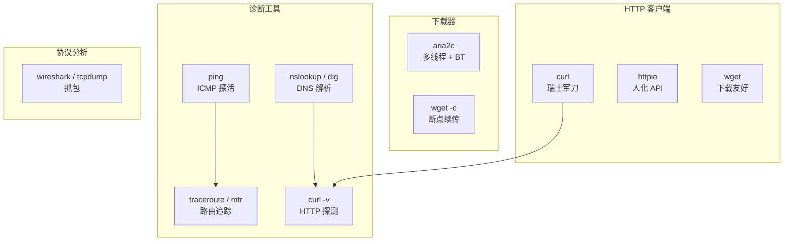
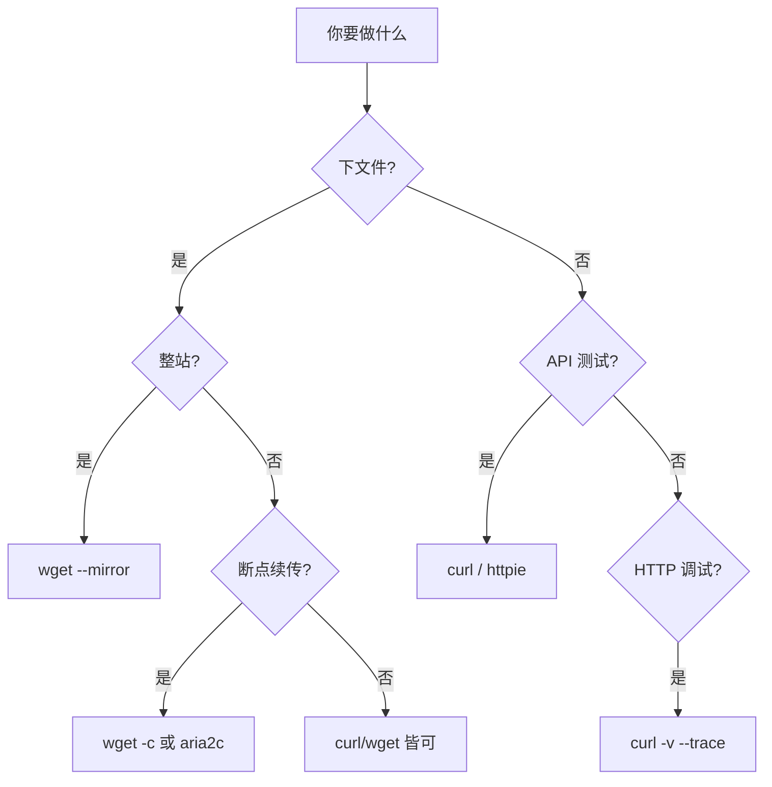
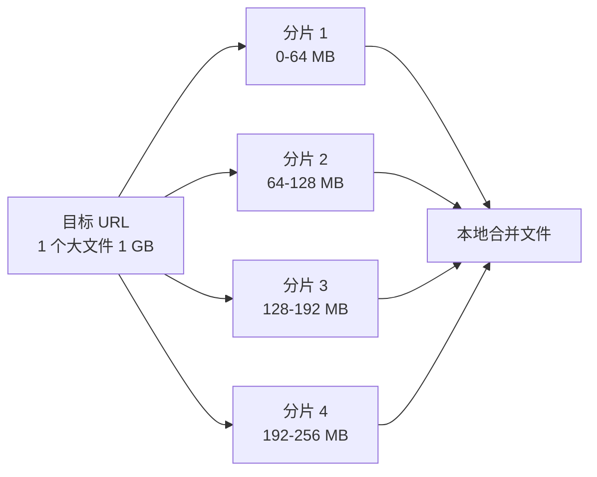
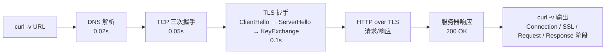

# Linux 网络工具全面指南

> **运维实操视角**：覆盖访问网页、文件下载、HTTP 调试、DNS 排查等核心场景的工具。
> 本笔记聚焦 4 类工具：**HTTP 客户端**（curl/wget/httpie）、**多线程下载器**（aria2c）、**诊断工具**（ping/traceroute/dig/mtr）。

---

## §0 心智模型：4 类工具分层



**心智模型核心**：

| 场景 | 首选工具 |
|------|----------|
| HTTP API 测试 | `curl` / `httpie` |
| 下载大文件 | `wget -c` / `aria2c` |
| 整站镜像 | `wget -m` |
| 多线程下载 | `aria2c -x 16` |
| DNS 排查 | `dig +trace` |
| 网络连通性 | `ping -c 4` / `mtr` |
| HTTP 调试 | `curl -v` / `--trace` |

---

## §1 工具全景速查表

| 工具 | 类型 | 核心优势 | 一句话场景 |
|------|------|----------|------------|
| **curl** | HTTP 客户端 | 功能最全、支持 20+ 协议 | "HTTP/FTP/SMTP 通吃" |
| **wget** | HTTP 客户端 | 递归下载、纯静态 | "镜像整站、断点续传" |
| **httpie** | HTTP 客户端 | 人化 API、彩色输出 | "日常 API 测试" |
| **aria2c** | 下载器 | 多线程、BT/磁力链 | "下大文件、下种子" |
| **ping** | 诊断 | ICMP 探活 | "主机通不通" |
| **traceroute** | 诊断 | 路由追踪 | "跳数卡哪一跳" |
| **mtr** | 诊断 | ping+traceroute 持续 | "持续观察丢包" |
| **dig** | DNS | DNS 完整查询 | "权威 DNS 排查" |
| **nslookup** | DNS | 简单 DNS 查询 | "快速查解析" |

**安装**（CentOS-7 / RHEL 系）：

```bash
yum install -y curl wget bind-utils traceroute
yum install -y httpie aria2 mtr nmap-ncat
# Debian/Ubuntu
apt install -y curl wget httpie aria2 dnsutils traceroute mtr-tiny
```

---

## §2 curl 详解（运维最常用）

curl 是 **C**ommon **URL** Library 的缩写，是 Linux 下访问网页 / API 的瑞士军刀。支持 20+ 协议（HTTP/HTTPS/FTP/SFTP/SMTP/IMAP/POP3/LDAP 等）。

### 2.1 基本用法

```bash
# 最简 GET
curl https://example.com

# 输出到文件
curl -o filename.html https://example.com
curl -O https://example.com/file.zip  # 保留远端文件名

# 只看 Header（HEAD 请求）
curl -I https://example.com

# 跟随重定向（默认不跟随）
curl -L https://bit.ly/xxx  # 短链跳转

# 静默模式 + 显示进度条
curl -s -o /dev/null https://example.com  # 只测可达性
curl -# -O https://example.com/big.iso    # 进度条
```

### 2.2 HTTP 方法（POST/PUT/DELETE）

```bash
# POST 表单
curl -X POST -d "name=foo&age=20" https://api.example.com/user

# POST JSON（推荐）
curl -X POST \
  -H "Content-Type: application/json" \
  -d '{"name":"foo","age":20}' \
  https://api.example.com/user

# 上传文件（multipart/form-data）
curl -F "file=@/local/path.txt" https://api.example.com/upload
curl -F "file=@photo.jpg;type=image/jpeg" https://api.example.com/upload

# PUT / DELETE / PATCH
curl -X PUT -d "data" https://api.example.com/resource/1
curl -X DELETE https://api.example.com/resource/1
curl -X PATCH -d '{"age":21}' https://api.example.com/user/1
```

### 2.3 Header / User-Agent / Cookie

```bash
# 自定义 Header
curl -H "Authorization: Bearer xxx" https://api.example.com
curl -H "X-Request-ID: $(uuidgen)" https://api.example.com

# 修改 User-Agent（默认是 curl/版本号）
curl -A "Mozilla/5.0 (Windows NT 10.0)" https://example.com

# Cookie 处理
curl -b "session=abc123" https://example.com  # 发送
curl -c cookies.txt https://example.com      # 保存响应 Set-Cookie
curl -b cookies.txt https.example.com        # 读 Cookie 文件

# 同时保存和发送（保持登录态）
curl -c cookies.txt -b cookies.txt -L https://example.com/login
```

### 2.4 认证

```bash
# Basic Auth
curl -u username:password https://api.example.com
curl --user user:pw https://api.example.com

# Bearer Token
curl -H "Authorization: Bearer xxx" https://api.example.com

# Digest Auth
curl --digest -u user:pw https://api.example.com

# 客户端证书（双向 TLS）
curl --cert client.pem --key client.key https://example.com
```

### 2.5 代理

```bash
# HTTP 代理
curl --proxy http://proxy.example.com:8080 https://api.example.com

# SOCKS5 代理
curl --socks5 localhost:1080 https://api.example.com

# 代理认证
curl --proxy-user user:pw --proxy http://proxy:8080 https://api.example.com

# 忽略代理（直连）
curl --noproxy '*' https://internal-api.example.com
```

### 2.6 调试与诊断

```bash
# 详细输出（看 DNS/TCP/HTTP 全过程）
curl -v https://example.com 2>&1 | head -30

# Trace（更详细，输出完整请求/响应）
curl --trace - https://example.com | head -50
curl --trace-ascii trace.txt https://example.com  # 写到文件

# 性能监控（输出格式串）
curl -s -o /dev/null -w "HTTP: %{http_code} | Size: %{size_download} bytes | Time: %{time_total}s | DNS: %{time_namelookup}s | TCP: %{time_connect}s\n" https://example.com

# 完整变量参考
curl --help | grep -A 100 "%{" | head -50
```

**常用 `-w` 变量**：

| 变量 | 含义 |
|------|------|
| `%{http_code}` | HTTP 状态码 |
| `%{time_total}` | 总耗时（秒）|
| `%{time_namelookup}` | DNS 解析耗时 |
| `%{time_connect}` | TCP 连接耗时 |
| `%{time_appconnect}` | SSL/TLS 握手耗时 |
| `%{size_download}` | 下载字节数 |
| `%{size_upload}` | 上传字节数 |
| `%{speed_download}` | 下载速度（字节/秒）|

### 2.7 下载与限速

```bash
# 断点续传
curl -C - -O https://example.com/big.iso

# 限速（100 KB/s）
curl --limit-rate 100K -O https://example.com/big.iso

# 超时控制
curl --max-time 30 https://example.com
curl --connect-timeout 5 https://example.com

# 失败重试
curl --retry 3 --retry-delay 2 https://example.com

# 下载整个目录（FTP）
curl -u user:pw -O ftp://ftp.example.com/dir/*
```

### 2.8 HTTPS 特殊处理

```bash
# 跳过证书校验（⚠️ 不推荐生产）
curl -k https://self-signed.example.com

# 指定 CA 证书
curl --cacert /etc/ssl/certs/ca-bundle.crt https://example.com

# 指定 TLS 版本
curl --tlsv1.2 https://example.com
curl --tls-max 1.3 https://example.com

# 查看证书信息
curl -vI https://example.com 2>&1 | grep -i "subject:|issuer:|expire"
```

### 2.9 实战：API 测试全流程

```bash
# 1. 登录拿 Token
TOKEN=$(curl -s -X POST \
  -H "Content-Type: application/json" \
  -d '{"user":"admin","pass":"admin123"}' \
  https://api.example.com/login | jq -r .token)

# 2. 用 Token 调用 API
curl -H "Authorization: Bearer $TOKEN" \
  https://api.example.com/users | jq .

# 3. POST 提交
curl -X POST \
  -H "Authorization: Bearer $TOKEN" \
  -H "Content-Type: application/json" \
  -d '{"name":"new_user"}' \
  https://api.example.com/users
```

---

## §3 wget 详解

wget 是 GNU 项目，**专注文本下载和递归镜像**。相比 curl，wget 更适合"下完就走"的场景。

### 3.1 基本用法

```bash
# 下载单文件
wget https://example.com/file.zip

# 改名
wget -O my.zip https://example.com/file.zip

# 后台下载
wget -b https://example.com/big.iso
tail -f wget-log  # 查进度

# 静默模式
wget -q https://example.com/file.zip

# 限速（避免占满带宽）
wget --limit-rate=500k https://example.com/big.iso
```

### 3.2 断点续传

```bash
# 续传
wget -c https://example.com/big.iso

# 自动重试
wget -c --tries=10 --retry-connrefused https://example.com/big.iso
```

### 3.3 递归下载与镜像

```bash
# 递归下载整个站点（限制深度）
wget -r -l 2 https://example.com/docs/  # 限制 2 层

# 镜像整站
wget --mirror --convert-links --adjust-extension --page-requisites \
     --no-parent https://example.com/

# 参数解释：
#   --mirror           镜像模式（-r -N -l inf --no-remove-listing）
#   --convert-links    本地化链接
#   --adjust-extension 补全扩展名
#   --page-requisites  下载 CSS/JS/图片
#   --no-parent        不下载上级目录

# 只下载特定类型
wget -r -A "*.pdf" https://example.com/docs/

# 排除目录
wget -r -X "/exclude/" https://example.com/

# 拒绝特定类型
wget -r -R "*.html" https://example.com/
```

### 3.4 HTTP 认证与代理

```bash
# Basic Auth
wget --user=user --password=pw https://example.com/

# 通过代理
wget -e use_proxy=yes -e http_proxy=proxy:8080 https://example.com/

# 配置 .wgetrc（用户级）
cat >> ~/.wgetrc <<EOF
use_proxy = on
http_proxy = http://proxy:8080
https_proxy = http://proxy:8080
EOF
```

### 3.5 wget vs curl 下载场景对比

| 场景 | curl | wget |
|------|------|------|
| 单文件下载 | ✅ | ✅ |
| 断点续传 | `-C -` | `-c`（更稳定）|
| 整站镜像 | ❌ 不擅长 | ✅ `--mirror` |
| 后台下载 | ❌ | ✅ `-b` |
| 多线程下载 | ❌ | ❌（用 aria2c）|
| HTTP API | ✅（强项）| ❌ 不擅长 |
| 跟随重定向 | `-L` | 默认跟随 |

---

## §4 curl vs wget 13 维度对比表

| 维度 | curl | wget |
|------|------|------|
| **历史** | 1996 起的命令行工具 | GNU 项目，1995 起 |
| **协议支持** | 20+（HTTP/FTP/SMTP/IMAP/LDAP/...）| HTTP/HTTPS/FTP 为主 |
| **库依赖** | libcurl（多语言绑定）| 无外部依赖 |
| **递归下载** | ❌ | ✅（强项）|
| **整站镜像** | ❌ | ✅ `--mirror` |
| **断点续传** | `-C -` | `-c`（自动检测）|
| **后台下载** | ❌ | ✅ `-b` |
| **限速** | `--limit-rate` | `--limit-rate` |
| **HTTP API** | ✅（强项，POST/PUT/DELETE）| ❌ |
| **Header/Body 控制** | ✅（精细）| ⚠️ 较弱 |
| **输出格式控制** | `-w` 变量（强大）| 无 |
| **管道友好** | ✅（默认 stdout）| 默认存文件 |
| **学习曲线** | 中（参数多）| 低（直觉）|

### 选谁？



**简记口诀**：
- **下文件** → wget / aria2c
- **测 API** → curl / httpie
- **HTTP 调试** → curl
- **镜像整站** → wget

---

## §5 httpie 详解（人化 API）

httpie 是 curl 的"现代化"替代品：**彩色输出 + JSON 内置 + 简洁语法**。日常 API 测试首选。

### 5.1 安装与基本用法

```bash
# 安装
yum install -y httpie    # CentOS-7
apt install -y httpie    # Ubuntu

# 基本 GET（彩色输出 + 语法高亮）
http https://api.example.com/users

# POST JSON（自动识别 Content-Type）
http POST https://api.example.com/users name=foo age=20

# 自动转 JSON 字段
http POST https://api.example.com/users name="John Doe" age:=20
# :=  强制转为数字
# =   转为字符串
# =@  从文件读取
```

### 5.2 常用操作

```bash
# Header
http https://api.example.com X-API-Key:abc123

# Query 参数
http https://api.example.com/search q==curl page==2
# == 表示 URL 参数（不加=）

# Basic Auth
http -a user:pw https://api.example.com

# Bearer Token
http https://api.example.com Authorization:"Bearer xxx"

# 文件上传
http -f POST https://api.example.com/upload file@/path/to/photo.jpg

# Cookie 持久化（保存到 ~/.httpie/sessions/）
http --session=mysession https://api.example.com/login user=admin pass=admin123
http --session=mysession https://api.example.com/dashboard
```

### 5.3 输出控制

```bash
# 只看 Body
http --body https://api.example.com

# 只看 Header
http --headers https://api.example.com

# 详细模式（看请求过程）
http -v https://api.example.com

# 输出到文件
http --download https://example.com/file.zip

# 格式化 JSON（默认就格式化）
http https://api.example.com | jq .
```

### 5.4 httpie vs curl 场景

| 场景 | httpie | curl |
|------|--------|------|
| 日常 API 调试 | ✅（首选，输出友好）| ✅ |
| 复杂 Header 组合 | ⚠️ 稍繁琐 | ✅（精细控制）|
| 大量并发请求 | ❌ | ✅（配合 xargs）|
| HTTPS 调试（看证书）| ❌ | ✅ `--cert` `--cacert` |
| 性能压测 | ❌ | ✅ `--parallel` |
| 输出格式处理 | ✅ 彩色 + 高亮 | ❌ 原始输出 |

---

## §6 aria2c 详解（多线程下载）

aria2c 是 **多协议、多源、多线程下载器**。最擅长：**大文件快速下载 + BT/磁力链**。

### 6.1 基本用法

```bash
# 安装
yum install -y aria2
apt install -y aria2

# 单文件下载（默认单线程，等同 wget）
aria2c https://example.com/big.iso

# 16 线程分片下载（同一个文件多连接）
aria2c -x 16 https://example.com/big.iso
aria2c -s 16 https://example.com/big.iso  # -s 等价 -x

# 限速
aria2c --max-download-limit=10M https://example.com/big.iso

# 续传
aria2c -c https://example.com/big.iso
```

### 6.2 多源下载（多镜像）

```bash
# 同一文件从多个镜像下载（加速）
aria2c https://mirror1.com/file.zip https://mirror2.com/file.zip https://mirror3.com/file.zip

# 从 URL 列表文件下载
aria2c -i urls.txt  # 每行一个 URL
```

### 6.3 BT / 磁力链

```bash
# BT 下载（.torrent 文件）
aria2c file.torrent

# 磁力链
aria2c "magnet:?xt=urn:btih:..."

# 限制上传速度、做种率
aria2c --max-upload-limit=1M --seed-ratio=1.0 file.torrent
```

### 6.4 配置文件（高级）

```ini
# ~/.aria2/aria2.conf
continue=true
max-concurrent-downloads=5
max-connection-per-server=16
min-split-size=1M
max-download-limit=0
max-upload-limit=1M
seed-ratio=1.0

# RPC（远程控制）
enable-rpc=true
rpc-listen-port=6800
rpc-user=admin
rpc-passwd=secret
rpc-allow-origin-all=true

# BT
bt-max-peers=100
bt-tracker=udp://tracker.opentrackr.org:1337/announce
```

**启动 aria2c 作为后台服务**：

```bash
aria2c --conf-path=/root/.aria2/aria2.conf -D
# -D 守护进程

# Web UI（推荐 AriaNg）
# https://github.com/mayswind/AriaNg
```

### 6.5 多线程下载原理



**优势**：1 GB 文件理论上 4 倍速（受限于远端服务器单连接限速）。

### 6.6 aria2c vs wget vs curl 下载场景

| 场景 | aria2c | wget | curl |
|------|--------|------|------|
| 大文件快速下载 | ✅ `-x 16` | ⚠️ 单线程 | ⚠️ 单线程 |
| 断点续传 | ✅ | ✅ | ✅ |
| BT/磁力链 | ✅ | ❌ | ❌ |
| 多镜像源 | ✅ | ❌ | ⚠️ |
| HTTP API | ❌ | ⚠️ | ✅ |
| 后台守护 | ✅ RPC | ✅ `-b` | ❌ |

---

## §7 诊断工具（ping/traceroute/dig/mtr）

### 7.1 ping（ICMP 探活）

```bash
# 基本（默认无限次，Ctrl+C 停）
ping example.com

# 限制 4 次
ping -c 4 example.com

# 指定间隔（秒）
ping -i 0.5 -c 10 example.com

# 指定包大小（默认 56 字节）
ping -s 1000 -c 4 example.com  # 1000 字节包

# IPv6
ping6 example.com

# 不显示时间戳（机器友好）
ping -c 4 example.com | awk '/time=/ {print $7, $8}'
```

**ping 不通排查**：

| 现象 | 可能原因 |
|------|----------|
| 100% loss | 主机不可达 / 防火墙禁 ICMP |
| 部分 loss | 网络拥塞 / 链路质量差 |
| 延迟忽高忽低 | Wi-Fi 不稳定 / 跨运营商 |

### 7.2 traceroute / mtr（路由追踪）

```bash
# 基本路由（UDP 默认，可能被防火墙拦）
traceroute example.com

# 使用 ICMP（绕过防火墙）
traceroute -I example.com

# 使用 TCP（80 端口，最常用）
traceroute -T -p 80 example.com

# 不解析主机名（更快）
traceroute -n example.com

# 设置最大跳数（默认 30）
traceroute -m 15 example.com

# mtr（持续观察丢包率，比 traceroute 强）
mtr -r -c 10 example.com  # report 模式，10 次
mtr example.com           # 持续模式（默认）
```

**mtr 输出关键列**：

```
HOST: Loss%  Snt  Last  Avg  Best  Wrst  StDev
 1. 192.168.1.1   0.0%   10   0.3   0.4   0.3   0.5   0.1
 2. 10.0.0.1      0.0%   10   1.2   1.5   1.2   2.0   0.3
 3. ???           100.0%  10   0.0   0.0   0.0   0.0   0.0  ← 卡这里
```

- Loss%：丢包率（>5% 算异常）
- Avg：平均延迟
- StDev：标准差（波动越大越不稳定）

### 7.3 nslookup / dig（DNS 解析）

```bash
# nslookup（简单）
nslookup example.com
nslookup example.com 8.8.8.8  # 指定 DNS

# dig（功能最全，运维首选）
dig example.com
dig example.com +short       # 只看 A 记录
dig example.com +trace       # 完整递归追踪（从根 DNS 查起）
dig @8.8.8.8 example.com     # 指定 DNS 服务器
dig -x 8.8.8.8               # 反向解析（PTR）
dig example.com MX           # 查邮件记录
dig example.com NS           # 查 NS 记录
dig example.com TXT          # 查 TXT 记录（SPF/DKDM）

# host（极简）
host example.com
host -t MX example.com
```

### 7.4 DNS 排查决策树


### 7.5 curl HTTP 探测

```bash
# 探活 + 测延迟
curl -s -o /dev/null -w "HTTP: %{http_code} | Time: %{time_total}s\n" https://api.example.com

# 看完整握手过程（DNS/SSL/HTTP）
curl -v https://api.example.com 2>&1 | grep -E "^(\*|>) "

# 测 HTTPS 证书有效期
echo | openssl s_client -connect api.example.com:443 -servername api.example.com 2>/dev/null | openssl x509 -noout -dates

# 或用 curl
curl -vI https://api.example.com 2>&1 | grep -E "expire date|start date"
```

### 7.6 tcpdump 抓包入门

```bash
# 抓 80 端口的 HTTP 包
tcpdump -i eth0 -A -s 0 'tcp port 80'

# 抓指定主机
tcpdump -i eth0 host 8.8.8.8

# 保存到文件（pcap 格式，wireshark 可打开）
tcpdump -i eth0 -w capture.pcap port 443

# 看 DNS 查询
tcpdump -i eth0 -n udp port 53
```

---

## §7.7 高级诊断：网络质量测试

```bash
# iperf3（点对点带宽测试）
yum install -y iperf3
iperf3 -s              # 服务端
iperf3 -c server_ip    # 客户端测速

# nuttcp（另一款）
nuttcp -S              # 服务端
nuttcp server_ip       # 客户端

# 测延迟抖动（iperf3 也支持）
iperf3 -c server_ip -u -b 10M -t 30  # UDP 模式测抖动
```

---

## §8 实战场景 10 例

### 场景 1：API 测试全流程

```bash
# 1. 拿 Token
TOKEN=$(curl -s -X POST \
  -H "Content-Type: application/json" \
  -d '{"user":"admin","pass":"admin123"}' \
  https://api.example.com/login | jq -r .token)

# 2. 调用受保护接口
curl -H "Authorization: Bearer $TOKEN" https://api.example.com/users

# 或用 httpie（更简洁）
http https://api.example.com/users Authorization:"Bearer $TOKEN"
```

### 场景 2：登录态保持

```bash
# 登录并保存 Cookie
curl -c cookies.txt -X POST \
  -d "user=admin&pass=admin123" \
  https://example.com/login

# 用 Cookie 访问受保护页
curl -b cookies.txt https://example.com/dashboard

# 或用 httpie 的 session
http --session=admin https://example.com/login user=admin pass=admin123
http --session=admin https://example.com/dashboard
```

### 场景 3：大文件分片下载

```bash
# aria2c 16 线程
aria2c -x 16 -s 16 https://example.com/big.iso

# 或 curl 模拟（用 range）
curl -r 0-100M -o part1 https://example.com/big.iso &
curl -r 100M-200M -o part2 https://example.com/big.iso &
wait
cat part1 part2 > big.iso
```

### 场景 4：整站镜像

```bash
wget --mirror \
     --convert-links \
     --adjust-extension \
     --page-requisites \
     --no-parent \
     --restrict-file-names=windows \
     -e robots=off \
     -w 1 \
     https://docs.example.com/
```

### 场景 5：DNS 排查

```bash
# 1. 看本地解析
nslookup example.com

# 2. 强制用 Google DNS 解析
dig @8.8.8.8 example.com +short

# 3. 看完整链路
dig +trace example.com

# 4. 查 MX 记录（邮件）
dig example.com MX +short

# 5. 反向解析
dig -x 8.8.8.8 +short
```

### 场景 6：HTTPS 调试

```bash
# 看 TLS 握手详细过程
curl -v https://example.com 2>&1 | grep -E "SSL|Certificate|TLS|cipher|verify"

# 测试 TLS 1.2 / 1.3 支持
curl --tlsv1.2 -vI https://example.com 2>&1 | grep "SSL connection"
curl --tlsv1.3 -vI https://example.com 2>&1 | grep "SSL connection"

# 看证书链
openssl s_client -connect example.com:443 -showcerts < /dev/null
```

### 场景 7：性能压测（简单版）

```bash
# 10 并发测延迟
for i in {1..10}; do
  curl -s -o /dev/null -w "%{time_total}\n" https://api.example.com &
done
wait

# 或用 ab（Apache Bench）
yum install -y httpd-tools
ab -n 1000 -c 10 https://api.example.com/

# 看 P50/P90/P99 延迟（用 vegeta）
echo "GET https://api.example.com" | vegeta attack -duration=10s -rate=100 | vegeta report -type=hist[0,50ms,100ms,200ms]
```

### 场景 8：代理链访问

```bash
# 内网通过代理访问外网
curl --proxy http://proxy.corp.com:8080 https://api.external.com

# 通过 SOCKS5 代理
curl --socks5 localhost:1080 https://api.external.com

# 跳板 SSH 隧道
ssh -D 1080 user@jump-host  # 本地开 SOCKS5 代理
curl --socks5 localhost:1080 https://internal-api.corp.com
```

### 场景 9：Webhook 测试

```bash
# 启动本地接收服务
nc -l 8080  # 简单接收
# 或
python3 -m http.server 8080

# 触发 Webhook 发送
curl -X POST \
  -H "Content-Type: application/json" \
  -d '{"event":"deploy","status":"success"}' \
  http://localhost:8080/webhook

# 用 webhook.site 在线测试
curl -X POST -H "Content-Type: application/json" \
  -d '{"test":"data"}' \
  https://webhook.site/unique-id
```

### 场景 10：健康检查脚本（生产用）

```bash
#!/bin/bash
# check_health.sh - 多 URL 健康检查

URLS=(
  "https://api.example.com/health"
  "https://api.example.com/users"
  "https://internal.example.com/status"
)

for url in "${URLS[@]}"; do
  CODE=$(curl -s -o /dev/null -w "%{http_code}" --max-time 5 "$url")
  TIME=$(curl -s -o /dev/null -w "%{time_total}" --max-time 5 "$url")
  if [ "$CODE" = "200" ]; then
    echo "[OK] $url - ${TIME}s - HTTP $CODE"
  else
    echo "[FAIL] $url - ${TIME}s - HTTP $CODE"
    # 发告警
    curl -X POST https://alert.example.com/notify \
      -d "url=$url&code=$CODE"
  fi
done
```

### HTTPS 调试链路（图）



### 场景 11：HTTP/2 和 HTTP/3 测试

```bash
# 测 HTTP/2 支持（默认 curl 8+ 支持）
curl -v --http2 https://example.com 2>&1 | grep "Using HTTP2"

# 强制 HTTP/1.1
curl --http1.1 https://example.com

# HTTP/3 (QUIC) 需要 curl 编译了 quiche/ngtcp2
curl --http3 https://example.com

# 看协议版本统计
curl -s -o /dev/null -w "Protocol: %{http_version}\n" https://example.com
```

### 场景 12：IPv6 测试

```bash
# DNS 查询 A + AAAA
dig example.com A +short
dig example.com AAAA +short

# 直接连 IPv6
curl -6 "https://[2606:4700:4700::1111]/"

# IPv6 ping
ping6 example.com

# 测本机 IPv6 连通
curl -6 -v https://ipv6.google.com
```

### 场景 13：CDN 节点测试

```bash
# dig CDN 边缘节点
dig example.com +short
# 返回多个 A 记录 = 多 CDN 节点

# 看特定地区 CDN（用 nslookup 指定 DNS）
nslookup example.com 8.8.8.8        # Google DNS (美国)
nslookup example.com 114.114.114.114 # 国内 DNS

# 测不同节点的延迟
for ip in $(dig example.com +short); do
  echo -n "$ip: "
  ping -c 2 $ip 2>/dev/null | grep "avg" | awk '{print $4}'
done

# curl 测各 IP 直连
curl -s -o /dev/null -w "Time: %{time_total}s\n" --resolve example.com:443:1.2.3.4 https://example.com
```

### 场景 14：容器/K8s 网络诊断

```bash
# 看容器 DNS 配置
docker exec container cat /etc/resolv.conf

# 从容器测外网
docker exec container curl -v https://example.com

# K8s pod 内测（用 kubectl debug）
kubectl debug -it pod/my-pod --image=nicolaka/netshoot -- curl https://api

# netshoot 镜像含全套网络工具
docker run -it --rm nicolaka/netshoot bash
# 内含：curl/wget/dig/ping/tcpdump/nmap/iperf3 等

# 测 service 连通性
kubectl run -it --rm --restart=Never netshoot --image=nicolaka/netshoot -- curl http://my-service.namespace:8080
```

### 场景 15：API 批量并发测试

```bash
# 用 xargs 并发 10 个 curl
seq 1 10 | xargs -n 1 -P 10 -I {} curl -s -o /dev/null -w "%{time_total}\n" https://api.example.com

# 用 GNU parallel
parallel -j 10 "curl -s -o /dev/null -w '%{time_total}\n' https://api.example.com" ::: {1..10}

# 配合 jq 解析批量响应
for id in 1 2 3 4 5; do
  curl -s https://api.example.com/users/$id | jq -c '{id, name: .name, email: .email}'
done
```

### 场景 16：Webhook 自托管接收

```bash
# 用 Python 起一个简易接收服务
python3 << 'EOF'
from http.server import BaseHTTPRequestHandler, HTTPServer
class H(BaseHTTPRequestHandler):
    def do_POST(self):
        length = int(self.headers.get('Content-Length', 0))
        body = self.rfile.read(length).decode('utf-8')
        print(f"[{self.command}] {self.path}: {body}")
        self.send_response(200)
        self.end_headers()
    def log_message(self, *args): pass
HTTPServer(('0.0.0.0', 8080), H).serve_forever()
EOF

# 触发测试
curl -X POST -H "Content-Type: application/json" \
  -d '{"event":"test","timestamp":1234567890}' \
  http://localhost:8080/webhook
```

---

## §2.10 curl 高级用法

### HTTP/2 与连接复用

```bash
# 强制 HTTP/2
curl --http2 https://example.com

# HTTP/1.1 强制
curl --http1.1 https://example.com

# 连接复用（keep-alive）— 多次请求共用一个 TCP 连接
curl --keepalive-time 60 \
  https://api.example.com/users \
  https://api.example.com/posts \
  https://api.example.com/comments

# 性能差异：复用连接可省 30-50% 延迟
```

### 并发请求

```bash
# --parallel 多 URL 并发
curl --parallel --parallel-immediate \
  -o users.json https://api.example.com/users \
  -o posts.json https://api.example.com/posts \
  -o comments.json https://api.example.com/comments

# 用 -Z（--parallel）+ URL glob
curl -Z -o "#1.json" https://api.example.com/{users,posts,comments}
# 自动展开为 3 个并发请求
```

### 文件上传高级用法

```bash
# 多文件批量上传
curl -F "photos[]=@/path/1.jpg" -F "photos[]=@/path/2.jpg" https://api.example.com/upload

# 二进制上传（POST raw body）
curl -X POST --data-binary @/path/file.bin https://api.example.com/upload

# 自定义 MIME type
curl -F "file=@doc.pdf;type=application/pdf" https://api.example.com/upload

# 流式上传（从 stdin）
cat big.csv | curl -X POST --data-binary @- https://api.example.com/import
```

### IPv6 与双栈

```bash
# 强制 IPv4
curl -4 https://example.com

# 强制 IPv6
curl -6 https://example.com

# Happy Eyeballs（同时尝试 IPv4/IPv6，谁先连上用谁，curl 7.59+）
curl --happy-eyeballs-timeout-ms 200 https://example.com
```

### 配置文件（.curlrc）

```ini
# ~/.curlrc — 用户级默认配置
user-agent = "Mozilla/5.0"
proxy = http://proxy.corp.com:8080
connect-timeout = 10
max-time = 30
retry = 3
retry-delay = 2
```

---

## §3.6 wget 高级用法

```bash
# 蜘蛛模式（不下载，只检查链接）
wget --spider https://example.com

# 限制响应大小（避免下载过大文件）
wget --max-redirect=5 --quota=100m https://example.com

# wget 实际是 GET-only，但 POST 可通过 --post-data 模拟
wget --post-data "user=admin&pass=admin123" https://example.com/login

# 输出到 stdout（管道友好）
wget -O - https://example.com/data.json | jq .

# 防止递归下载外站链接
wget --span-hosts https://example.com  # 默认不跨主机

# 排除特定文件
wget -R "*.zip,*.exe" https://example.com/

# 重试次数与等待
wget --tries=5 --wait=2 --random-wait https://example.com/
```

---

## §7.8 综合排查案例

### 案例 1：网站访问慢

```bash
# 步骤 1：ping 测延迟
ping -c 4 example.com

# 步骤 2：traceroute 看跳数
mtr -r -c 10 example.com

# 步骤 3：curl 看 HTTP 阶段耗时
curl -s -o /dev/null -w "DNS: %{time_namelookup}s\nConnect: %{time_connect}s\nSSL: %{time_appconnect}s\nTTFB: %{time_starttransfer}s\nTotal: %{time_total}s\n" https://example.com

# 步骤 4：对比多家 CDN
for dns in 8.8.8.8 114.114.114.114 223.5.5.5; do
  echo "DNS $dns:"
  dig @$dns example.com +short
done
```

### 案例 2：API 间歇性 5xx

```bash
# 步骤 1：批量测试看错误率
for i in {1..20}; do
  CODE=$(curl -s -o /dev/null -w "%{http_code}" https://api.example.com)
  echo "$i: $CODE"
done

# 步骤 2：分段计时看瓶颈
curl -s -o /dev/null -w "%{time_namelookup} %{time_connect} %{time_appconnect} %{time_pretransfer} %{time_redirect} %{time_starttransfer} %{time_total}\n" https://api.example.com

# 步骤 3：带 Cookie 复现（可能是 session 问题）
curl -c jar.txt -X POST -d "user=admin" https://api.example.com/login
curl -b jar.txt -w "Auth req: %{http_code}\n" https://api.example.com/dashboard

# 步骤 4：看服务端响应 Header
curl -vI https://api.example.com 2>&1 | grep -E "^< "
```

### 案例 3：下载大文件被卡

```bash
# 步骤 1：单线程测速
wget --report-speed=bits -O /dev/null https://example.com/big.iso

# 步骤 2：多线程加速
aria2c -x 16 https://example.com/big.iso

# 步骤 3：限速重试
curl --limit-rate 1M -C - -O https://example.com/big.iso
```

---

## §9 易错 ×10 + 速查表 + 面试 ×6 + 跨模块链接

### 9.1 易错点 ×10

1. **忘记加 `-L`**：curl 默认不跟随 30x 重定向，结果看到 301/302 误以为失败
2. **POST 没加 `-H "Content-Type: application/json"`**：服务端按表单解析报错
3. **断点续传 `curl -C -` 漏了 `-`**：必须 `-C -`（自动探测续传位置）
4. **wget 默认就跟随重定向，curl 不**：跨工具混用时容易困惑
5. **HTTPS 证书自签时 `-k` 跳过校验**：测试可以，生产严禁
6. **HTTP 代理环境漏配**：内网访问外网 API 没设 `http_proxy` 而失败
7. **DNS 缓存干扰排查**：本地缓存的解析可能不是最新的，用 `dig @8.8.8.8` 绕过
8. **ping 不通 ≠ 服务不可用**：ICMP 被防火墙挡是常见的（生产建议用 `curl` 测）
9. **大文件下载没限速**：占满生产带宽被运维投诉，加 `--limit-rate`
10. **API Token 暴露在命令行历史**：用环境变量或文件，不要直接 `-d "token=xxx"`

### 9.2 速查表

#### curl 速查

| 需求 | 命令 |
|------|------|
| GET | `curl URL` |
| POST JSON | `curl -X POST -H "Content-Type: application/json" -d '{...}' URL` |
| 跟随重定向 | `curl -L URL` |
| 详细输出 | `curl -v URL 2>&1` |
| 测延迟 | `curl -s -o /dev/null -w "%{time_total}\n" URL` |
| 下载 | `curl -O URL` |
| 续传 | `curl -C - -O URL` |
| 限速 | `curl --limit-rate 1M -O URL` |
| 跳过证书 | `curl -k URL` |
| 代理 | `curl --proxy http://proxy:8080 URL` |

#### wget 速查

| 需求 | 命令 |
|------|------|
| 下载 | `wget URL` |
| 续传 | `wget -c URL` |
| 后台 | `wget -b URL` |
| 镜像 | `wget --mirror URL` |
| 限速 | `wget --limit-rate=1M URL` |
| 递归 | `wget -r -l 2 URL` |

#### httpie 速查

| 需求 | 命令 |
|------|------|
| GET | `http URL` |
| POST JSON | `http POST URL key=value` |
| Header | `http URL K:V` |
| Auth | `http -a user:pw URL` |
| 上传文件 | `http -f POST URL file@path` |
| Session | `http --session=name URL` |

#### aria2c 速查

| 需求 | 命令 |
|------|------|
| 下载 | `aria2c URL` |
| 16 线程 | `aria2c -x 16 URL` |
| 续传 | `aria2c -c URL` |
| BT | `aria2c file.torrent` |
| 磁力链 | `aria2c "magnet:?xt=..."` |
| 后台 | `aria2c -D` |

### 9.3 面试 ×6 大追问

1. **curl 和 wget 的核心区别？**
   - curl：HTTP 客户端瑞士军刀，支持 20+ 协议、API 测试友好
   - wget：GNU 下载工具，强项递归下载、整站镜像

2. **HTTP 调试时如何看完整过程？**
   - `curl -v` 看 DNS/TCP/HTTP/TLS 阶段
   - `curl --trace` 输出完整请求/响应字节
   - `curl -w` 自定义输出格式（time_total、http_code）

3. **多线程下载的原理？**
   - 远端服务器支持 Range 请求
   - 客户端拆成 N 个分片并发请求
   - 本地合并为完整文件（aria2c `-x 16`）

4. **HTTPS 握手过程？**
   - ClientHello → ServerHello → Certificate → KeyExchange → Finished
   - 1-RTT（TLS 1.3）或 2-RTT（TLS 1.2）
   - 可用 `curl -v` 或 `openssl s_client` 观察

5. **DNS 排查的顺序？**
   - nslookup 看本地解析 → dig @8.8.8.8 排除本地 DNS → dig +trace 看权威链 → 检查 /etc/resolv.conf → 防火墙 53 端口

6. **API 自动化测试用什么工具链？**
   - 单次调试：curl / httpie
   - 批量：curl + xargs / jq 解析
   - 压测：ab / wrk / vegeta / hey
   - 集成测试：pytest + requests / Postman + Newman

### 9.4 跨模块链接

- [[Linux网络]] — HTTP/DNS/TCP/IP 协议层基础
- [[Linux文件传输]] — wget/scp/rsync 配合下载场景
- [[LinuxNginx]] — HTTP API 客户端测 Nginx upstream
- [[Linux服务与SSH]] — curl + SSH 隧道、SOCKS 代理
- [[LinuxDNS]] — dig/nslookup 联动 DNS 排查
- [[Linux防火墙]] — curl 走代理、iptables 影响 HTTP 出站
- [[LinuxKeepalived]] — 跨 VIP 健康检查用 curl
- [[LinuxLVS]] — LVS 后端健康检查 curl

---

## 📌 结尾

**总结**：

- **HTTP 客户端**：curl（瑞士军刀） / wget（下载） / httpie（人化）
- **下载器**：aria2c（多线程） / wget -c（断点续传）
- **诊断**：ping / traceroute / mtr / dig
- **协议分析**：wireshark / tcpdump（另开专题）

**学习路径建议**：

1. **入门**：curl 基本 GET/POST
2. **进阶**：curl -v 调试、Header/Auth/Cookie
3. **下载场景**：wget -c 断点续传、wget --mirror 镜像
4. **效率**：httpie 替代日常 curl、aria2c 加速大文件
5. **排查**：ping → traceroute → dig → curl HTTP 探测（完整排查链）

**关联资源**：

- curl 官方文档：https://curl.se/docs/manual.html
- wget 文档：https://www.gnu.org/software/wget/manual/
- httpie 文档：https://httpie.org/docs
- aria2 文档：https://aria2.github.io/manual/aria2c.html

---

## §10 综合速查大表（One Page Reference）

### 10.1 场景 → 工具 一句话速查

| 场景 | 推荐命令 |
|------|----------|
| 看 HTTP Header | `curl -I URL` |
| 看完整握手过程 | `curl -v URL 2>&1` |
| API GET 测试 | `http URL`（人化）或 `curl URL` |
| API POST JSON | `http POST URL k=v` 或 `curl -X POST -H "Content-Type: application/json" -d '{...}' URL` |
| 下载文件 | `wget URL` 或 `curl -O URL` |
| 大文件加速 | `aria2c -x 16 URL` |
| 断点续传 | `wget -c URL` 或 `curl -C - -O URL` |
| 整站镜像 | `wget --mirror URL` |
| BT 下载 | `aria2c file.torrent` |
| 磁力链 | `aria2c "magnet:?xt=..."` |
| 后台下载 | `wget -b URL` 或 `aria2c -D` |
| 跟随重定向 | `curl -L URL`（wget 默认跟随）|
| 测延迟 | `curl -s -o /dev/null -w "%{time_total}\n" URL` |
| 测下载速度 | `wget --report-speed=bits -O /dev/null URL` |
| 带宽测试 | `iperf3 -c server_ip` |
| DNS 简单查 | `nslookup URL` 或 `dig URL +short` |
| DNS 完整链 | `dig +trace URL` |
| 反向 DNS | `dig -x IP` |
| 主机探活 | `ping -c 4 IP` |
| 路由追踪 | `mtr -r -c 10 URL` |
| HTTP 协议升级 | `curl --http2 URL` |
| HTTPS 跳过证书 | `curl -k URL` |
| 走 HTTP 代理 | `curl --proxy http://proxy:8080 URL` |
| 走 SOCKS5 | `curl --socks5 host:1080 URL` |
| 文件上传 | `curl -F file=@path URL` |
| 限速下载 | `curl --limit-rate 1M -O URL` |
| 健康检查 | `curl -s -o /dev/null -w "%{http_code}" URL` |
| 抓包 | `tcpdump -i eth0 -A 'tcp port 80'` |
| 压测 | `ab -n 1000 -c 10 URL` 或 `wrk -t4 -c100 -d30s URL` |

### 10.2 HTTP 状态码速查

| 状态码 | 含义 | 排查方向 |
|--------|------|----------|
| 200 | OK | — |
| 301/302 | 重定向 | curl 加 `-L` 跟随 |
| 304 | Not Modified | 缓存命中，正常 |
| 400 | Bad Request | 请求格式错（JSON 语法、Header）|
| 401 | Unauthorized | 检查 Auth Token / Cookie |
| 403 | Forbidden | 权限不够 / IP 被 ban |
| 404 | Not Found | URL 路径错 |
| 429 | Too Many Requests | 触发限流，加 Retry-After |
| 500 | Internal Server Error | 服务端代码 bug，看日志 |
| 502 | Bad Gateway | 上游服务不可达（Nginx 后端挂）|
| 503 | Service Unavailable | 服务过载 / 主动下线 |
| 504 | Gateway Timeout | 上游响应超时 |

### 10.3 端口速查（运维常用）

| 端口 | 协议 | 用途 |
|------|------|------|
| 21 | FTP | 文件传输（明文）|
| 22 | SSH | 远程登录 / SFTP |
| 23 | Telnet | 明文远程登录（禁用）|
| 25 | SMTP | 邮件发送 |
| 53 | DNS | 域名解析（UDP/TCP）|
| 80 | HTTP | Web 明文 |
| 443 | HTTPS | Web TLS |
| 587 | SMTP Submission | 邮件提交（带认证）|
| 993 | IMAPS | 邮件 IMAP TLS |
| 1080 | SOCKS | 代理 |
| 3306 | MySQL | 数据库 |
| 5432 | PostgreSQL | 数据库 |
| 6379 | Redis | 缓存 |
| 6800 | aria2 RPC | 远程下载控制 |
| 8080 | HTTP Alt | 备用 Web |
| 8443 | HTTPS Alt | 备用 Web TLS |

### 10.4 DNS 记录类型速查

| 类型 | 用途 | 示例 |
|------|------|------|
| A | IPv4 域名 | `example.com → 1.2.3.4` |
| AAAA | IPv6 域名 | `example.com → ::1` |
| CNAME | 别名 | `www → example.com` |
| MX | 邮件服务器 | `example.com → mail.example.com` |
| NS | 权威 DNS | `example.com → ns1.example.com` |
| TXT | 文本记录 | SPF / DKIM / 域名验证 |
| SOA | 起始授权 | DNS 区域元数据 |
| PTR | 反向解析 | `1.2.3.4 → example.com` |
| SRV | 服务定位 | `_sip._tcp.example.com` |
| CAA | CA 授权 | 限制可签发证书的 CA |

### 10.5 性能调优速查

| 调优点 | curl 参数 / 命令 | 效果 |
|--------|------------------|------|
| 启用 HTTP/2 | `--http2` | 多路复用，省 RTT |
| 启用 keep-alive | `--keepalive-time 60` | 复用 TCP 连接 |
| 启用 HTTP/3 | `--http3` | 0-RTT 握手（需编译支持）|
| 压缩传输 | `-H "Accept-Encoding: gzip"` | 减少下载字节 |
| 并发请求 | `--parallel` | 多 URL 并发 |
| 跳过证书校验 | `-k` | ⚠️ 仅测试 |
| DNS 缓存 | 系统级 nscd / systemd-resolved | 减少 DNS 延迟 |
| 长连接（连接池） | `--keepalive` | 复用连接 |

### 10.6 常见错误速查

| 错误现象 | 可能原因 | 解决 |
|----------|----------|------|
| `curl: (6) Could not resolve host` | DNS 失败 | 检查 /etc/resolv.conf |
| `curl: (7) Failed to connect` | 端口不通 / 防火墙 | telnet IP 端口测试 |
| `curl: (28) Operation timeout` | 网络慢 / 服务卡 | 加 `--max-time` 或排查服务端 |
| `curl: (35) SSL connect error` | TLS 版本不匹配 | 加 `--tlsv1.2` 或检查服务端 |
| `curl: (60) SSL certificate problem` | 证书自签 / 过期 | `-k`（仅测试）或补 CA |
| `curl: (403) Forbidden` | 权限拒绝 | 检查 IP 白名单 / User-Agent |
| `wget: ERROR 403` | 服务器拒绝 wget | 加 `-U "Mozilla/5.0"` |
| `wget: ERROR 404` | 路径错 | 检查 URL |
| `aria2c: ERROR code=3` | 文件不存在 | 检查 URL |
| `aria2c: ERROR code=13` | 磁盘空间不足 | `df -h` 检查 |
| `dig: couldn't get address` | DNS 服务挂了 | `systemctl restart named` |

### 10.7 输出变量完整参考（curl `-w`）

```bash
# 完整变量列表
curl --write-out '%{variable}' URL
```

| 变量 | 含义 |
|------|------|
| `%{http_code}` | HTTP 响应码 |
| `%{http_connect}` | CONNECT 请求码（代理用）|
| `%{time_total}` | 总耗时 |
| `%{time_namelookup}` | DNS 解析 |
| `%{time_connect}` | TCP 连接 |
| `%{time_appconnect}` | SSL/TLS 握手 |
| `%{time_pretransfer}` | 请求准备 |
| `%{time_redirect}` | 重定向时间 |
| `%{time_starttransfer}` | 首字节（TTFB）|
| `%{size_download}` | 下载字节 |
| `%{size_upload}` | 上传字节 |
| `%{size_header}` | Header 字节 |
| `%{size_request}` | 请求字节 |
| `%{speed_download}` | 下载速度（B/s）|
| `%{speed_upload}` | 上传速度（B/s）|
| `%{num_connects}` | 连接次数 |
| `%{num_redirects}` | 重定向次数 |
| `%{num_headers}` | Header 数量 |
| `%{ssl_verify_result}` | SSL 验证结果（0=成功）|
| `%{remote_ip}` | 服务端 IP |
| `%{remote_port}` | 服务端端口 |
| `%{local_ip}` | 本地 IP |
| `%{local_port}` | 本地端口 |

**综合输出示例**：

```bash
curl -s -o /dev/null -w '
HTTP:                %{http_code}
Total time:          %{time_total}s
DNS lookup:          %{time_namelookup}s
TCP connect:         %{time_connect}s
SSL handshake:       %{time_appconnect}s
Server response:     %{time_starttransfer}s
Download size:       %{size_download} bytes
Download speed:      %{speed_download} B/s
Remote IP:           %{remote_ip}:%{remote_port}
' https://example.com
```