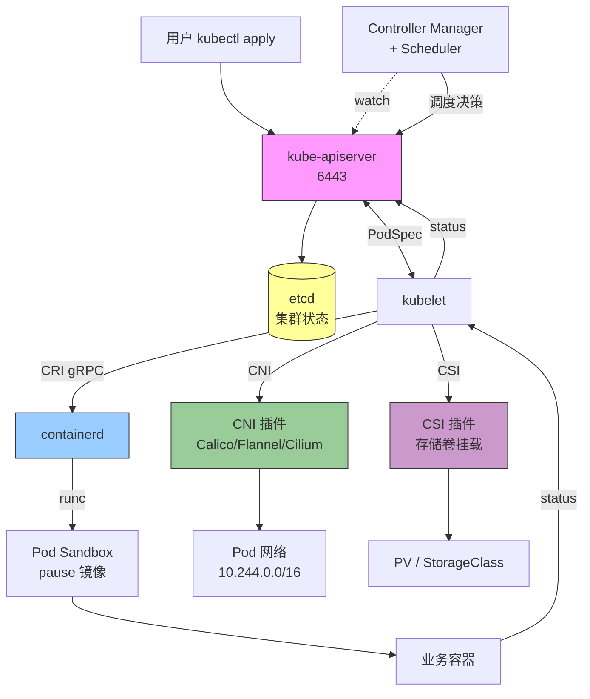
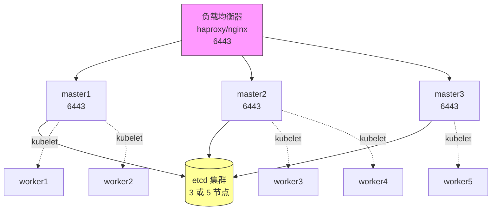

# Kubernetes 安装配置实战手册（containerd / cri-dockerd）

> **目标**：把课堂上学过的 K8s 知识落地为可直接抄执行的实战命令手册，覆盖从版本选型、系统前置、双运行时方案、集群初始化到生产实践与运维诊断的完整链路。
>
> **适用版本**：Kubernetes 1.24 ~ 1.31+
> **运行时**：containerd（推荐）/ cri-dockerd（Docker 过渡方案）
> **来源**：基于 `k8s-containerd-setup-guide.md`（827 行实战手册）+ 课堂笔记 0617~0702 + 项目实践优化

---

## §0 心智模型：Kubernetes 控制循环（安装视角）



### 0.1 安装视角的 5 个关键接口

| 接口 | 作用方 | 被作用方 | 安装时关注 |
|------|--------|---------|----------|
| **CRI** | kubelet | containerd / CRI-O / cri-dockerd | 运行时安装 + socket 配置 |
| **CNI** | kubelet / 运行时 | 网络插件 | Calico / Flannel / Cilium 选择 + Pod CIDR 匹配 |
| **CSI** | kubelet | 存储插件 | StorageClass + PV/PVC 供应 |
| **API** | kubectl / kubelet | API Server | 6443 端口 + 证书 + kubeconfig |
| **etcd** | API Server | etcd 集群 | 单 etcd / 外部 etcd 集群 / 备份策略 |

### 0.2 安装路径的本质

1. **节点准备**：内核模块 + sysctl + swap + SELinux + 防火墙 + 主机名解析 + 时间同步 → 让 Linux 主机符合 K8s 要求
2. **运行时**：containerd（推荐）/ cri-dockerd（Docker 过渡）→ 让 kubelet 能调 CRI
3. **控制平面**：kubeadm init → 生成 API Server + etcd + Controller + Scheduler
4. **网络**：CNI 插件 → 让 Pod 跨节点互通
5. **节点扩容**：kubeadm join → Worker 加入集群

### 0.3 与已有模块的链路

- [[00-Kubernetes学习路线]]：本笔记是路线图中"集群安装"环节的实战延伸
- [[01-容器运行时与集群安装]]：课堂知识回顾型（心智模型更深），本笔记偏实战命令
- [[08-Kubernetes命令与故障排查]]：集群对象层排错，本笔记 §10 是安装/初始化层排错
- [[Linux网络]]：IP、路由、转发、iptables 是 K8s 网络的前置基础
- [[Linux进程与负载]]：cgroup 是 kubelet 资源管理的基础

---

## §1 版本关系总览

### 1.1 K8s 与容器运行时演变

```text
K8s ≤1.23   内置 dockershim（Docker 默认）
K8s 1.24    移除 dockershim（必须 containerd / CRI-O / cri-dockerd）
K8s 1.25    正式推荐 containerd / CRI-O
K8s 1.26+   containerd 成为主流选择
K8s 1.28+   推荐 containerd 1.7+（CRI v1 默认）
K8s 1.30+   稳定生产组合（API 与运行时版本天然匹配）
```

### 1.2 CRI API 版本对照

| 组件版本 | CRI API 支持 | 说明 |
|---------|-------------|------|
| containerd < 1.7 | v1alpha2 | 旧版 crictl 兼容 |
| containerd ≥ 1.7 | v1 + v1alpha2 | **推荐**，双版本兼容 |
| crictl < 1.26 | v1alpha2 | — |
| crictl ≥ 1.26 | v1（默认） | 可通过 `CRI_V1=false` 回退 |
| K8s < 1.28 | 主要用 v1alpha2 | — |
| K8s ≥ 1.28 | 主要用 v1 | 与 containerd 1.7+ 天然匹配 |

**关键结论**：K8s 1.28+ 搭配 containerd 1.7+ 是最佳组合，CRI API 版本天然匹配。

### 1.3 推荐版本组合矩阵

| K8s 版本 | containerd 版本 | crictl 版本 | pause 镜像 | 备注 |
|---------|----------------|------------|-----------|------|
| 1.24 | 1.6.x 或 1.7.x | 匹配 K8s | 3.6~3.8 | CRI v1alpha2 为主 |
| 1.25 | 1.6.x 或 1.7.x | 匹配 K8s | 3.6~3.8 | CRI v1alpha2 为主 |
| 1.26 | 1.6.x 或 1.7.x | 匹配 K8s | 3.6~3.8 | 可启用 v1 |
| 1.27 | 1.7.x 推荐 | 匹配 K8s | 3.8~3.9 | v1alpha2 稳定 |
| **1.28** | **1.7.x** | 匹配 K8s | **3.9** | **CRI v1 默认**，推荐组合 |
| **1.29** | **1.7.x** | 匹配 K8s | **3.9** | **推荐组合** |
| **1.30** | **1.7.x** | 匹配 K8s | **3.9** | **推荐组合**（本手册默认） |
| 1.31 | 1.7.x 或 2.0.x | 匹配 K8s | 3.9~3.10 | 新版本，可选 |

### 1.4 场景决策表

| 场景 | 推荐组合 |
|------|---------|
| 新建生产集群 | K8s 1.28~1.30 + containerd 1.7.x + Calico 3.28+ |
| 已有 Docker 环境过渡 | cri-dockerd 0.3.x 桥接 → 后续逐步迁移到 containerd |
| 学习 / 实验 | K8s 1.30 + containerd 1.7 + kubeadm + Calico |
| 高性能 / 可观测 | K8s 1.30 + Cilium 1.15+（eBPF） |
| 极简环境 | K8s 1.30 + containerd 1.7 + Flannel |

---

## §2 系统前置准备

> 所有节点（master + worker）均需执行，步骤完全一致。

### 2.1 环境变量定义

```bash
# ===== 按实际环境修改以下变量 =====
export K8S_VERSION="1.30"          # K8s 大版本号（用于 yum/apt 仓库）
export NODE_IP="192.168.88.30"     # 当前节点 IP（master 用，worker 用对应 IP）
export POD_CIDR="10.244.0.0/16"    # Pod 网络段（必须和 CNI 匹配）
export SVC_CIDR="10.96.0.0/12"     # Service 网络段
export IMAGE_REPO="registry.aliyuncs.com/google_containers"  # 国内镜像仓库
export CONTAINERD_VERSION="1.7.22" # containerd 版本
```

### 2.2 关闭 swap

```bash
# 临时关闭
swapoff -a

# 永久关闭（注释 swap 行）
sed -i '/ swap / s/^/#/' /etc/fstab

# 验证
free -h  # Swap 行应全为 0
```

**为什么关 swap？**
- kubelet 资源管理依赖 cgroup，不允许 swap 干扰调度判断
- K8s 默认 `--fail-swap-on=true`，启用 swap 会启动失败

### 2.3 关闭 SELinux（CentOS/RHEL）

```bash
# 临时关闭
setenforce 0

# 永久关闭
sed -i 's/^SELINUX=enforcing/SELINUX=disabled/' /etc/selinux/config

# Ubuntu 通常无 SELinux，跳过
```

**为什么关 SELinux？**
- 容器需要访问宿主文件系统，SELinux 会拦截某些路径
- 生产环境应保留 SELinux 并配置策略，但安装阶段先关闭

### 2.4 关闭防火墙

```bash
# CentOS/RHEL
systemctl disable --now firewalld

# Ubuntu
systemctl disable --now ufw
```

**为什么关防火墙？**
- 简化 K8s 节点间通信（6443、10250、30000~32767 等）
- 生产环境应在防火墙规则中显式放行这些端口

### 2.5 加载内核模块

```bash
cat > /etc/modules-load.d/k8s.conf << 'EOF'
overlay
br_netfilter
EOF

modprobe overlay
modprobe br_netfilter

# 验证
lsmod | grep -E "overlay|br_netfilter"
```

模块作用：
- `overlay`：containerd/storage-driver 依赖
- `br_netfilter`：让 iptables 能看到桥接流量（k8s 网络关键）

### 2.6 配置内核参数

```bash
cat > /etc/sysctl.d/k8s.conf << 'EOF'
net.bridge.bridge-nf-call-iptables  = 1
net.bridge.bridge-nf-call-ip6tables = 1
net.ipv4.ip_forward                 = 1
EOF

sysctl --system

# 验证
sysctl net.bridge.bridge-nf-call-iptables net.ipv4.ip_forward
# 两个都应返回 = 1
```

参数含义：
- `bridge-nf-call-iptables`：让桥接流量走 iptables（kube-proxy 依赖）
- `bridge-nf-call-ip6tables`：IPv6 同上
- `ip_forward`：节点转发 IPv4 数据包

### 2.7 主机名与解析

```bash
# 设置主机名
hostnamectl set-hostname master  # master 节点
hostnamectl set-hostname worker1 # worker 节点

# 所有节点写入 /etc/hosts（按实际 IP 修改）
cat >> /etc/hosts << EOF
192.168.88.30 master
192.168.88.31 worker1
192.168.88.32 worker2
EOF

# 验证
ping -c 1 worker1
```

### 2.8 时间同步

```bash
# CentOS/RHEL
yum install -y chrony
systemctl enable --now chronyd
chronyc tracking

# Ubuntu
apt-get install -y chrony
systemctl enable --now chrony
chronyc tracking
```

K8s 要求节点时间差 < 30 秒，否则证书验证会失败。详见 [[Linux日志与时间]]。

### 2.9 安装基础依赖

```bash
# CentOS/RHEL
yum install -y yum-utils device-mapper-persistent-data lvm2 iptables conntrack

# Ubuntu
apt-get update
apt-get install -y ca-certificates curl gnupg lsb-release apt-transport-https software-properties-common
```

---

## §3 方案 A：containerd 运行时（推荐）

### 3.1 安装 containerd

#### 3.1.1 CentOS/RHEL

```bash
# 添加 Docker 官方仓库（containerd.io 包在此仓库中）
yum-config-manager --add-repo https://download.docker.com/linux/centos/docker-ce.repo

# 安装（不装 docker-ce，只装 containerd）
yum install -y containerd.io-${CONTAINERD_VERSION}
```

#### 3.1.2 Ubuntu

```bash
# 添加 GPG key
install -m 0755 -d /etc/apt/keyrings
curl -fsSL https://download.docker.com/linux/ubuntu/gpg | \
  gpg --dearmor -o /etc/apt/keyrings/docker.gpg
chmod a+r /etc/apt/keyrings/docker.gpg

# 添加仓库
echo "deb [arch=$(dpkg --print-architecture) signed-by=/etc/apt/keyrings/docker.gpg] \
  https://download.docker.com/linux/ubuntu $(lsb_release -cs) stable" | \
  tee /etc/apt/sources.list.d/docker.list > /dev/null

apt-get update
apt-get install -y containerd.io
```

### 3.2 生成默认配置

```bash
mkdir -p /etc/containerd
containerd config default > /etc/containerd/config.toml
```

### 3.3 修改关键参数

```bash
# 1. 启用 systemd cgroup（与 kubelet cgroupDriver 一致）
sed -i 's/SystemdCgroup = false/SystemdCgroup = true/' /etc/containerd/config.toml

# 2. 设置 sandbox 镜像（与 K8s 版本匹配）
#    K8s 1.28+ 默认 pause:3.9，老版本用 pause:3.6 或 3.7
sed -i 's|sandbox_image = ".*"|sandbox_image = "registry.aliyuncs.com/google_containers/pause:3.9"|' /etc/containerd/config.toml
```

**为什么要 systemd cgroup？**
- kubelet 默认 `cgroupDriver: systemd`
- containerd 必须一致，否则容器资源限制错位

### 3.4 镜像加速配置（推荐 config_path 目录方式）

> ⚠️ **关键提醒**：containerd 1.7 中 `config_path`（目录方式）与 `mirrors`（内联方式）**不能同时存在**，否则 CRI 插件加载失败！

#### 3.4.1 检查默认配置

```bash
# 应显示: config_path = "/etc/containerd/certs.d"
grep 'config_path' /etc/containerd/config.toml

# 应无输出（如果输出 mirrors，需要删除）
grep 'mirrors' /etc/containerd/config.toml
```

清理冲突的 mirrors：

```bash
sed -i '/\[plugins."io.containerd.grpc.v1.cri".registry.mirrors\]/,/^$/d' /etc/containerd/config.toml
```

#### 3.4.2 创建镜像源配置

```bash
# ===== docker.io =====
mkdir -p /etc/containerd/certs.d/docker.io
cat > /etc/containerd/certs.d/docker.io/hosts.toml << 'EOF'
server = "https://docker.io"
[host."https://docker.m.daocloud.io"]
  capabilities = ["pull", "resolve"]
  override_path = true
[host."https://docker.1ms.run"]
  capabilities = ["pull", "resolve"]
  override_path = true
[host."https://docker.xuanyuan.me"]
  capabilities = ["pull", "resolve"]
  override_path = true
[host."https://dockerhub.icu"]
  capabilities = ["pull", "resolve"]
  override_path = true
[host."https://docker.rainbond.cc"]
  capabilities = ["pull", "resolve"]
  override_path = true
EOF

# ===== registry.k8s.io =====
mkdir -p /etc/containerd/certs.d/registry.k8s.io
cat > /etc/containerd/certs.d/registry.k8s.io/hosts.toml << 'EOF'
server = "https://registry.k8s.io"
[host."https://k8s.m.daocloud.io"]
  capabilities = ["pull", "resolve"]
  override_path = true
[host."https://k8s-gcr.m.daocloud.io"]
  capabilities = ["pull", "resolve"]
  override_path = true
[host."https://registry.cn-hangzhou.aliyuncs.com/google_containers"]
  capabilities = ["pull", "resolve"]
  override_path = true
EOF

# ===== ghcr.io（可选，Helm chart 等场景）=====
mkdir -p /etc/containerd/certs.d/ghcr.io
cat > /etc/containerd/certs.d/ghcr.io/hosts.toml << 'EOF'
server = "https://ghcr.io"
[host."https://ghcr.m.daocloud.io"]
  capabilities = ["pull", "resolve"]
  override_path = true
EOF

# ===== quay.io（可选）=====
mkdir -p /etc/containerd/certs.d/quay.io
cat > /etc/containerd/certs.d/quay.io/hosts.toml << 'EOF'
server = "https://quay.io"
[host."https://quay.m.daocloud.io"]
  capabilities = ["pull", "resolve"]
  override_path = true
EOF
```

#### 3.4.3 镜像源 fallback 顺序说明

| 镜像站 | 提供方 | 速度 | 稳定性 | 推荐度 |
|--------|-------|------|--------|--------|
| `registry.cn-hangzhou.aliyuncs.com` | 阿里云 | ★★★★★ | ★★★★★ | ★★★★★ |
| `docker.m.daocloud.io` | 道客 | ★★★★ | ★★★★★ | ★★★★★ |
| `k8s.m.daocloud.io` | 道客 | ★★★★ | ★★★★★ | ★★★★★ |
| `docker.1ms.run` | 1ms.run | ★★★★ | ★★★★ | ★★★★ |
| `docker.xuanyuan.me` | 轩辕 | ★★★ | ★★★★ | ★★★ |
| `dockerhub.icu` | 社区 | ★★★ | ★★★ | ★★★ |
| `docker.rainbond.cc` | 灵雀云 | ★★★ | ★★★ | ★★★ |

**生产推荐**：`registry.aliyuncs.com` + `m.daocloud.io` 双源（官方+社区备份）。
**开发推荐**：任选 3 个 + 测试拉取速度后保留。

### 3.5 内联 mirrors（备选方案）

如果不使用 config_path，可以用内联方式：

```bash
sed -i 's|config_path = ".*"|config_path = ""|' /etc/containerd/config.toml
```

然后在 config.toml 中添加：

```toml
[plugins."io.containerd.grpc.v1.cri".registry.mirrors."docker.io"]
  endpoint = ["https://docker.m.daocloud.io", "https://docker.1ms.run"]
[plugins."io.containerd.grpc.v1.cri".registry.mirrors."registry.k8s.io"]
  endpoint = ["https://k8s.m.daocloud.io", "https://registry.cn-hangzhou.aliyuncs.com/google_containers"]
```

### 3.6 Harbor 私有仓库配置

#### 3.6.1 HTTPS + 自签名证书

```bash
# 假设 Harbor 地址为 192.168.108.30
mkdir -p /etc/containerd/certs.d/192.168.108.30

# 复制 CA 证书
cp /path/to/ca.crt /etc/containerd/certs.d/192.168.108.30/

cat > /etc/containerd/certs.d/192.168.108.30/hosts.toml << 'EOF'
server = "https://192.168.108.30"
[host."https://192.168.108.30"]
  capabilities = ["pull", "resolve", "push"]
  ca = "/etc/containerd/certs.d/192.168.108.30/ca.crt"
  skip_verify = false
EOF
```

#### 3.6.2 HTTP（仅测试环境）

修改 `/etc/containerd/config.toml`：

```toml
[plugins."io.containerd.grpc.v1.cri".registry.configs."192.168.108.30".auth]
  username = "admin"
  password = "Harbor12345"

[plugins."io.containerd.grpc.v1.cri".registry.configs."192.168.108.30".tls]
  insecure_skip_verify = true
```

### 3.7 启动并验证

```bash
systemctl daemon-reload
systemctl restart containerd
systemctl enable containerd

# 验证 CRI 服务
crictl info | head -15
# 确认 RuntimeReady: true, NetworkReady: true

# 测试拉镜像
crictl pull busybox

# 查看版本
containerd --version
crictl --version
```

### 3.8 安装 nerdctl（可选）

nerdctl 提供 Docker 风格的 CLI，底层用 containerd。

```bash
# 版本需与 containerd 大版本匹配
NERDCTL_VERSION="1.7.7"
wget https://github.com/containerd/nerdctl/releases/download/v${NERDCTL_VERSION}/nerdctl-${NERDCTL_VERSION}-linux-amd64.tar.gz
tar -xzf nerdctl-${NERDCTL_VERSION}-linux-amd64.tar.gz -C /usr/local/bin/ nerdctl

# 验证
nerdctl version
```

常用命令：

```bash
nerdctl --namespace k8s.io images        # 查看 K8s 命名空间下的镜像
nerdctl --namespace k8s.io ps -a         # 查看 K8s 命名空间下的容器
nerdctl --namespace k8s.io run -d --name web -p 8080:80 nginx
nerdctl --namespace k8s.io logs web
nerdctl --namespace k8s.io exec -it web sh
```

---

## §4 方案 B：cri-dockerd 运行时（Docker 过渡）

> 适用于已有 Docker 环境需要接入 K8s 1.24+ 的场景。
> cri-dockerd 是 dockershim 的替代品，桥接 Docker 与 CRI。

### 4.1 安装 Docker

#### 4.1.1 CentOS/RHEL

```bash
yum-config-manager --add-repo https://download.docker.com/linux/centos/docker-ce.repo
yum install -y docker-ce docker-ce-cli containerd.io
```

#### 4.1.2 Ubuntu

```bash
curl -fsSL https://download.docker.com/linux/ubuntu/gpg | gpg --dearmor -o /etc/apt/keyrings/docker.gpg
echo "deb [arch=$(dpkg --print-architecture) signed-by=/etc/apt/keyrings/docker.gpg] \
  https://download.docker.com/linux/ubuntu $(lsb_release -cs) stable" | \
  tee /etc/apt/sources.list.d/docker.list > /dev/null
apt-get update
apt-get install -y docker-ce docker-ce-cli containerd.io
```

### 4.2 配置 Docker daemon

```bash
mkdir -p /etc/docker
cat > /etc/docker/daemon.json << 'EOF'
{
  "exec-opts": ["native.cgroupdriver=systemd"],
  "log-driver": "json-file",
  "log-opts": {
    "max-size": "100m",
    "max-file": "3"
  },
  "storage-driver": "overlay2",
  "registry-mirrors": [
    "https://docker.m.daocloud.io",
    "https://docker.1ms.run",
    "https://docker.xuanyuan.me"
  ],
  "insecure-registries": []
}
EOF

systemctl daemon-reload
systemctl restart docker
systemctl enable docker
```

### 4.3 安装 cri-dockerd

```bash
# 下载 cri-dockerd（https://github.com/Mirantis/cri-dockerd/releases）
CRI_DOCKERD_VERSION="0.3.15"

# CentOS/RHEL
wget https://github.com/Mirantis/cri-dockerd/releases/download/v${CRI_DOCKERD_VERSION}/cri-dockerd-${CRI_DOCKERD_VERSION}-3.el8.x86_64.rpm
rpm -ivh cri-dockerd-${CRI_DOCKERD_VERSION}-3.el8.x86_64.rpm

# Ubuntu
wget https://github.com/Mirantis/cri-dockerd/releases/download/v${CRI_DOCKERD_VERSION}/cri-dockerd_${CRI_DOCKERD_VERSION}-3.ubuntu-jammy_amd64.deb
dpkg -i cri-dockerd_${CRI_DOCKERD_VERSION}-3.ubuntu-jammy_amd64.deb
```

### 4.4 配置 cri-dockerd 使用国内 pause 镜像

```bash
sed -i 's|^ExecStart=.*|ExecStart=/usr/bin/cri-dockerd --container-runtime-endpoint fd:// --pod-infra-container-image=registry.aliyuncs.com/google_containers/pause:3.9|' \
  /usr/lib/systemd/system/cri-docker.service

systemctl daemon-reload
systemctl restart cri-docker
systemctl enable cri-docker

# 验证
crictl --runtime-endpoint unix:///var/run/cri-dockerd.sock info | head -15
```

### 4.5 配置 crictl 使用 cri-dockerd

```bash
crictl config --set runtime-endpoint=unix:///var/run/cri-dockerd.sock
crictl config --set image-endpoint=unix:///var/run/cri-dockerd.sock
```

---

## §5 安装 Kubernetes 组件

> 所有节点均需执行。

### 5.1 添加 K8s 仓库

#### 5.1.1 CentOS/RHEL

```bash
cat > /etc/yum.repos.d/kubernetes.repo << EOF
[kubernetes]
name=Kubernetes
baseurl=https://mirrors.aliyun.com/kubernetes-new/core/stable/v\${K8S_VERSION}/rpm/
enabled=1
gpgcheck=1
gpgkey=https://mirrors.aliyun.com/kubernetes-new/core/stable/v\${K8S_VERSION}/rpm/repodata/repomd.xml.key
EOF
```

#### 5.1.2 Ubuntu

```bash
curl -fsSL https://mirrors.aliyun.com/kubernetes-new/core/stable/v${K8S_VERSION}/deb/Release.key | \
  gpg --dearmor -o /etc/apt/keyrings/kubernetes-apt-keyring.gpg

echo "deb [signed-by=/etc/apt/keyrings/kubernetes-apt-keyring.gpg] \
  https://mirrors.aliyun.com/kubernetes-new/core/stable/v${K8S_VERSION}/deb/ /" | \
  tee /etc/apt/sources.list.d/kubernetes.list

apt-get update
```

### 5.2 安装 kubelet / kubeadm / kubectl

```bash
# CentOS/RHEL
yum install -y kubelet kubeadm kubectl

# Ubuntu
apt-get install -y kubelet kubeadm kubectl
```

### 5.3 锁定版本（防止自动升级）

```bash
# CentOS/RHEL
yum install -y yum-plugin-versionlock
yum versionlock kubelet kubeadm kubectl

# Ubuntu
apt-mark hold kubelet kubeadm kubectl
```

### 5.4 启用 kubelet

```bash
systemctl enable kubelet
# 注意：此时 kubelet 还起不来，这是正常的，等 kubeadm init 之后才会正常运行
```

### 5.5 配置 kubectl / crictl 自动补全

```bash
# kubectl 补全 + 别名
echo 'source <(kubectl completion bash)' >> ~/.bashrc
echo 'alias k=kubectl' >> ~/.bashrc
echo 'complete -o default -F __start_kubectl k' >> ~/.bashrc

# crictl 补全
crictl completion bash > /etc/bash_completion.d/crictl

# 立即生效
source ~/.bashrc
```

---

## §6 集群初始化（master 节点）

### 6.1 kubeadm-config.yaml 详解

```bash
NODE_IP=$(hostname -I | awk '{print $1}')
echo "本机 IP: $NODE_IP"

cat > /root/kubeadm-config.yaml << EOF
---
apiVersion: kubeadm.k8s.io/v1beta3
kind: InitConfiguration
localAPIEndpoint:
  advertiseAddress: "${NODE_IP}"  # master 节点 IP
  bindPort: 6443
nodeRegistration:
  # 方案 A：用 containerd
  criSocket: unix:///var/run/containerd/containerd.sock
  # 方案 B：用 cri-dockerd（注释上面一行，取消下面注释）
  # criSocket: unix:///var/run/cri-dockerd.sock
  # 节点污点：master 节点默认 NoSchedule（控制平面专用）
  taints:
    - key: node-role.kubernetes.io/control-plane
      effect: NoSchedule
---
apiVersion: kubeadm.k8s.io/v1beta3
kind: ClusterConfiguration
kubernetesVersion: v1.30.2  # 必须与已安装的 kubeadm 版本匹配
# 国内镜像源，避免拉取超时
imageRepository: registry.aliyuncs.com/google_containers
networking:
  podSubnet: "10.244.0.0/16"    # 必须和 CNI 配置匹配
  serviceSubnet: "10.96.0.0/12"
  dnsDomain: "cluster.local"
# 如有自定义 SAN（负载均衡器域名等），在此添加
# apiServer:
#   certSANs:
#     - "k8s-api.example.com"
#     - "192.168.88.100"
# etcd 默认与控制平面同节点，生产建议外部 etcd 集群
etcd:
  local:
    dataDir: /var/lib/etcd
---
apiVersion: kubelet.config.k8s.io/v1beta1
kind: KubeletConfiguration
# 必须与 containerd 的 SystemdCgroup = true 一致
cgroupDriver: systemd
# 预留资源（生产环境建议开启）
systemReserved:
  cpu: "500m"
  memory: "512Mi"
  ephemeral-storage: "10Gi"
kubeReserved:
  cpu: "500m"
  memory: "512Mi"
  ephemeral-storage: "10Gi"
# Pod 驱逐阈值
evictionHard:
  memory.available: "200Mi"
  nodefs.available: "10%"
  imagefs.available: "15%"
EOF
```

### 6.2 字段含义详解

| 字段 | 作用 | 注意事项 |
|------|------|---------|
| `advertiseAddress` | API Server 对外通告 IP | 必须是节点真实可访问 IP |
| `bindPort` | API Server 监听端口 | 默认 6443，不要随意改 |
| `criSocket` | kubelet 调用的运行时 socket | 必须与实际运行时匹配 |
| `kubernetesVersion` | K8s 版本 | 必须严格匹配（`kubeadm version` 查看） |
| `imageRepository` | 镜像仓库 | 国内环境必须改 |
| `podSubnet` | Pod CIDR | 与 CNI 配置严格一致 |
| `serviceSubnet` | Service CIDR | 不要与 Pod/物理网重叠 |
| `cgroupDriver` | kubelet cgroup 驱动 | 与 containerd 一致（systemd） |
| `systemReserved` | 系统预留资源 | 防止系统进程被 OOM |
| `kubeReserved` | K8s 组件预留资源 | 同上 |
| `evictionHard` | 驱逐硬阈值 | 节点资源紧张时立即驱逐 Pod |
| `certSANs` | API Server 证书备用名 | 负载均衡域名/IP 必加 |

### 6.3 执行初始化

```bash
# 预检（可选，先检查环境是否就绪）
kubeadm init phase preflight --config=/root/kubeadm-config.yaml

# 正式初始化（输出保存到日志）
kubeadm init --config=/root/kubeadm-config.yaml | tee /root/kubeadm-init.log
```

> ⚠️ **务必保存输出末尾的 `kubeadm join` 命令**，worker 节点加入集群需要它。
> 如果丢失：`kubeadm token create --print-join-command`

### 6.4 配置 kubectl

```bash
mkdir -p $HOME/.kube
cp /etc/kubernetes/admin.conf $HOME/.kube/config
chown $(id -u):$(id -g) $HOME/.kube/config

# 验证
kubectl get nodes
kubectl cluster-info
```

`admin.conf` 是高权限凭据，不要复制到不可信机器。

---

## §7 Worker 节点加入集群

### 7.1 执行 join 命令

```bash
# 使用初始化时输出的 join 命令（示例）
kubeadm join 192.168.88.30:6443 \
  --token abcdef.0123456789abcdef \
  --discovery-token-ca-cert-hash sha256:xxxxxxxxxxxx

# 如果使用 cri-dockerd，需加上 --cri-socket 参数
kubeadm join 192.168.88.30:6443 \
  --token abcdef.0123456789abcdef \
  --discovery-token-ca-cert-hash sha256:xxxxxxxxxxxx \
  --cri-socket unix:///var/run/cri-dockerd.sock
```

### 7.2 验证节点加入

```bash
# 在 master 节点执行
kubectl get nodes
# 所有节点应显示 NotReady（安装 CNI 后变 Ready）

kubectl get pods -n kube-system
# 检查 kube-system 下所有 Pod 是否正常
```

---

## §8 CNI 网络插件

### 8.1 选型对比

| 插件 | 适用场景 | 特点 | 内核要求 |
|------|---------|------|---------|
| **Calico** | 生产首选 | 支持 NetworkPolicy，BGP/VXLAN 双模，IPIP 性能好 | ≥3.10 |
| **Flannel** | 简单环境 / 学习 | 轻量，仅 VXLAN，不支持 NetworkPolicy | ≥3.10 |
| **Cilium** | 高性能 / eBPF | 内核态网络，可观测性最强，可替代 kube-proxy | ≥4.19（eBPF） |

### 8.2 安装 Calico（推荐）

```bash
# 下载 Calico manifest
wget https://raw.githubusercontent.com/projectcalico/calico/v3.28.0/manifests/calico.yaml

# 修改 Pod CIDR（如果和默认 192.168.0.0/16 不同）
sed -i 's|# - name: CALICO_IPV4POOL_CIDR|- name: CALICO_IPV4POOL_CIDR|' calico.yaml
sed -i 's|#   value: "192.168.0.0/16"|  value: "10.244.0.0/16"|' calico.yaml

# 应用
kubectl apply -f calico.yaml

# 等待所有 Pod 就绪
kubectl get pods -n calico-system -w
```

Calico 安装后验证：

```bash
kubectl get pods -n calico-system
# 预期：所有 calico-node Pod Running

kubectl get ippools.crd.projectcalico.org
# 预期：default-pool 已创建，CIDR 与 kubeadm 配置一致
```

### 8.3 安装 Flannel（简单环境）

```bash
kubectl apply -f https://github.com/flannel-io/flannel/releases/latest/download/kube-flannel.yml
```

注意：Flannel 不会修改 Pod CIDR，必须保持默认 10.244.0.0/16。

### 8.4 安装 Cilium（高性能场景）

```bash
# Cilium CLI 安装
curl -L --remote-name-all https://github.com/cilium/cilium-cli/releases/latest/download/cilium-linux-amd64.tar.gz
tar xzvf cilium-linux-amd64.tar.gz
sudo mv cilium /usr/local/bin/

# 安装到集群
cilium install --version 1.15.5

# 验证
cilium status --wait
```

Cilium 要求内核 ≥4.19（旧内核启用 eBPF 兼容性开关）。

### 8.5 集群级验证

```bash
# 所有节点应变为 Ready
kubectl get nodes

# 所有系统 Pod 应为 Running
kubectl get pods -n kube-system

# 测试部署
kubectl create deployment nginx --image=nginx
kubectl expose deployment nginx --port=80 --type=NodePort
kubectl get svc nginx
curl http://<NODE_IP>:<NODE_PORT>
kubectl delete deployment nginx
kubectl delete svc nginx
```

---

## §9 生产级实践

### 9.1 高可用集群架构



#### 9.1.1 HA 集群配置要点

```bash
# kubeadm-config.yaml 增加 controlPlaneEndpoint
cat > kubeadm-config.yaml << EOF
---
apiVersion: kubeadm.k8s.io/v1beta3
kind: ClusterConfiguration
controlPlaneEndpoint: "k8s-api.example.com:6443"  # 负载均衡地址
kubernetesVersion: v1.30.2
imageRepository: registry.aliyuncs.com/google_containers
networking:
  podSubnet: "10.244.0.0/16"
  serviceSubnet: "10.96.0.0/12"
EOF

# 第一个 master 初始化
kubeadm init --config=kubeadm-config.yaml --upload-certs

# 其他 master 加入（使用 --control-plane）
kubeadm join k8s-api.example.com:6443 \
  --token xxx \
  --discovery-token-ca-cert-hash sha256:xxx \
  --control-plane \
  --certificate-key xxx
```

#### 9.1.2 HAProxy 负载均衡配置

```bash
cat > /etc/haproxy/haproxy.cfg << EOF
frontend k8s-api
    bind *:6443
    mode tcp
    default_backend k8s-api
backend k8s-api
    balance roundrobin
    mode tcp
    server master1 192.168.88.30:6443 check
    server master2 192.168.88.31:6443 check
    server master3 192.168.88.32:6443 check
EOF

systemctl enable --now haproxy
```

#### 9.1.3 Keepalived VIP（可选）

```bash
yum install -y keepalived
# 配置 vrrp_script 健康检查
# 详见 [[LinuxKeepalived]]
```

### 9.2 etcd 备份与恢复

#### 9.2.1 手动备份

```bash
# 安装 etcdctl
yum install -y etcd  # CentOS
# 或
apt-get install -y etcd  # Ubuntu

# 备份
ETCDCTL_API=3 etcdctl snapshot save /backup/etcd-snapshot-$(date +%Y%m%d-%H%M%S).db \
  --endpoints=https://127.0.0.1:2379 \
  --cacert=/etc/kubernetes/pki/etcd/ca.crt \
  --cert=/etc/kubernetes/pki/etcd/server.crt \
  --key=/etc/kubernetes/pki/etcd/server.key

# 验证快照
ETCDCTL_API=3 etcdctl snapshot status /backup/etcd-snapshot-*.db
```

#### 9.2.2 定时备份（crontab）

```bash
cat > /etc/cron.daily/etcd-backup.sh << 'EOF'
#!/bin/bash
BACKUP_DIR=/backup/etcd
mkdir -p $BACKUP_DIR
TIMESTAMP=$(date +%Y%m%d-%H%M%S)
ETCDCTL_API=3 etcdctl snapshot save ${BACKUP_DIR}/etcd-${TIMESTAMP}.db \
  --endpoints=https://127.0.0.1:2379 \
  --cacert=/etc/kubernetes/pki/etcd/ca.crt \
  --cert=/etc/kubernetes/pki/etcd/server.crt \
  --key=/etc/kubernetes/pki/etcd/server.key

# 保留 30 天
find $BACKUP_DIR -name "etcd-*.db" -mtime +30 -delete
EOF

chmod +x /etc/cron.daily/etcd-backup.sh
```

#### 9.2.3 恢复

```bash
# 停止 API Server（其他 master 仍提供服务）
mv /etc/kubernetes/manifests/kube-apiserver.yaml /tmp/

# 恢复
ETCDCTL_API=3 etcdctl snapshot restore /backup/etcd-snapshot-xxx.db \
  --data-dir=/var/lib/etcd-restore

# 替换数据目录
mv /var/lib/etcd /var/lib/etcd.bak
mv /var/lib/etcd-restore /var/lib/etcd

# 恢复 API Server
mv /tmp/kube-apiserver.yaml /etc/kubernetes/manifests/
```

### 9.3 kubelet 资源预留调优

在 kubeadm-config.yaml 的 KubeletConfiguration 中：

```yaml
systemReserved:
  cpu: "1"        # 系统进程预留 1 核
  memory: "2Gi"   # 系统进程预留 2G
  ephemeral-storage: "20Gi"
kubeReserved:
  cpu: "1"        # K8s 组件预留 1 核
  memory: "2Gi"
  ephemeral-storage: "20Gi"
evictionHard:
  memory.available: "500Mi"      # 内存剩余 < 500M 触发驱逐
  nodefs.available: "10%"        # 磁盘剩余 < 10% 触发驱逐
  imagefs.available: "15%"
evictionSoft:
  memory.available: "1Gi"
  nodefs.available: "15%"
evictionSoftGracePeriod:
  memory.available: "2m"
  nodefs.available: "5m"
maxPods: 110                     # 单节点最大 Pod 数
```

### 9.4 镜像垃圾回收

在 kubelet 配置中添加：

```yaml
imageGCHighThresholdPercent: 85   # 磁盘使用达 85% 触发 GC
imageGCLowThresholdPercent: 80    # GC 目标降到 80%
```

手动触发（在节点执行）：

```bash
crictl rmi --prune
```

### 9.5 容器日志轮转

#### 9.5.1 Docker daemon.json（cri-dockerd 方案）

```json
{
  "log-driver": "json-file",
  "log-opts": {
    "max-size": "100m",
    "max-file": "3"
  }
}
```

#### 9.5.2 kubelet 参数（containerd 方案）

```yaml
# kubelet 配置
containerLogMaxSize: "100Mi"
containerLogMaxFiles: 3
```

### 9.6 NetworkPolicy（生产必须）

```yaml
apiVersion: networking.k8s.io/v1
kind: NetworkPolicy
metadata:
  name: deny-all-ingress
  namespace: production
spec:
  podSelector: {}  # 匹配所有 Pod
  policyTypes:
    - Ingress
---
# 允许特定 Pod 访问
apiVersion: networking.k8s.io/v1
kind: NetworkPolicy
metadata:
  name: allow-frontend-to-backend
  namespace: production
spec:
  podSelector:
    matchLabels:
      app: backend
  policyTypes:
    - Ingress
  ingress:
    - from:
        - podSelector:
            matchLabels:
              app: frontend
      ports:
        - protocol: TCP
          port: 8080
```

注意：**Flannel 不支持 NetworkPolicy**，必须用 Calico 或 Cilium。

### 9.7 节点标签与污点

```bash
# 打标签
kubectl label node worker1 node-role.kubernetes.io/worker=worker
kubectl label node worker1 disk=ssd
kubectl label node worker2 gpu=true

# 打污点（master 节点默认就有）
kubectl taint node master1 dedicated=production:NoSchedule

# Pod 中使用
# spec:
#   nodeSelector:
#     disk: ssd
#   tolerations:
#     - key: dedicated
#       operator: Equal
#       value: production
#       effect: NoSchedule
```

### 9.8 Metrics Server（监控基础）

```bash
kubectl apply -f https://github.com/kubernetes-sigs/metrics-server/releases/latest/download/components.yaml

# 修改 metrics-server deployment 添加参数（解决自签名证书问题）
kubectl edit deployment metrics-server -n kube-system

# 在 spec.template.spec.containers[0].args 中添加：
#   - --kubelet-insecure-tls
#   - --kubelet-preferred-address-types=InternalIP

# 验证
kubectl top nodes
kubectl top pods -A
```

### 9.9 节点 NotReady 时自动摘流量

K8s 默认行为：

| 场景 | 默认行为 |
|------|---------|
| Node NotReady | Controller Manager 等待 `--node-monitor-grace-period`（默认 40s）后驱逐 Pod |
| API Server 不可达 | Node Controller 在 `--node-monitor-grace-period` 后标记 NotReady |
| kubelet 心跳超时 | 节点进入 `Unknown` 状态 |

调整参数（在 Controller Manager 启动参数中）：

```bash
--node-monitor-grace-period=40s
--node-monitor-period=5s
--pod-eviction-timeout=30s
```

---

## §10 运维诊断 Runbook

### 10.1 Node 长期 NotReady

**诊断决策树**：

```text
kubectl get nodes → NotReady
  ↓
journalctl -u kubelet -n 100 → 看错误
  ↓
├─ "connection refused" → containerd/cri-dockerd 未运行
│  └─ systemctl status containerd → 重启
├─ "x509: certificate is valid for ..." → 证书不匹配
│  └─ kubeadm reset && kubeadm join 重新加入
├─ "cni plugin not initialized" → CNI 未安装
│  └─ kubectl apply -f calico.yaml
├─ "failed to load plugin ... mirrors cannot be set" → config_path 与 mirrors 冲突
│  └─ 删除其中一个
└─ "no such file or directory" → 配置文件丢失
   └─ 重装 containerd 配置
```

**快速诊断命令**：

```bash
kubectl describe node <node-name> | grep -A5 "Conditions"
journalctl -u kubelet -b --no-pager | tail -50
crictl info 2>&1 | head -30
crictl pods
systemctl status containerd kubelet
```

### 10.2 Pod 一直 ContainerCreating

**诊断决策树**：

```text
kubectl describe pod <pod> → Events
  ↓
├─ "Failed to create pod sandbox" → 镜像问题或 sandbox 拉取失败
│  └─ crictl pull pause:3.9 测试
├─ "network plugin not ready" → CNI 异常
│  └─ kubectl get pods -n calico-system
├─ "FailedMount" → 存储卷挂载失败
│  └─ kubectl get pv, pvc
├─ "ImagePullBackOff" → 镜像拉取失败
│  └─ crictl pull <image> 测试
└─ "pending: no nodes available" → 资源不足
   └─ kubectl describe node | grep -A5 "Allocated"
```

**诊断命令**：

```bash
kubectl describe pod <pod-name> -n <namespace>
kubectl get events -n <namespace> --sort-by=.lastTimestamp
crictl pull <image>
ls -la /var/lib/kubelet/pods/
```

### 10.3 ImagePullBackOff

**常见原因对照表**：

| 错误信息 | 原因 | 解决 |
|---------|------|------|
| `failed to resolve reference` | 镜像名错误 | 检查 `kubectl get pod -o yaml` |
| `unauthorized` | 私有仓库认证失败 | 创建 imagePullSecret |
| `x509: certificate signed by unknown authority` | 仓库证书不受信任 | 配置 hosts.toml 或使用 insecure |
| `i/o timeout` | 网络问题或镜像站不可达 | 切换镜像加速源 |
| `manifest unknown` | 镜像标签不存在 | 改为正确的 tag |

**修复 imagePullSecret**：

```bash
kubectl create secret docker-registry my-registry \
  --docker-server=registry.example.com \
  --docker-username=admin \
  --docker-password=Harbor12345 \
  --namespace=production

# Pod spec 中使用
# spec:
#   imagePullSecrets:
#     - name: my-registry
```

### 10.4 kubelet 启动失败

```bash
journalctl -u kubelet -n 100 --no-pager
systemctl status kubelet
```

**常见错误对照表**：

| 错误 | 原因 | 修复 |
|------|------|------|
| `failed to read kubelet config` | 配置文件不存在 | 执行 `kubeadm init` 或 `kubeadm join` |
| `failed to initialize cgroup` | cgroup driver 不一致 | 统一 containerd 和 kubelet 的 cgroup driver |
| `failed to start containerd` | 端口冲突或权限 | `systemctl restart containerd` |
| `address already in use` | kubelet 端口被占用 | `lsof -i :10250` 检查 |
| `failed to load plugin ...` | containerd 配置错误 | `containerd config dump` 检查 |

### 10.5 CNI 网络不通

**Pod 间无法通信**：

```bash
# 在 Pod 所在节点检查
ip link show
ip route
iptables -L -t nat | head -30

# 检查 Calico
kubectl get pods -n calico-system -o wide
kubectl logs -n calico-system -l k8s-app=calico-node --tail=50

# 检查路由（Calico BGP 模式）
ip route | grep 10.244
```

**Service ClusterIP 不通**：

```bash
# 检查 kube-proxy
kubectl get pods -n kube-system -l k8s-app=kube-proxy
kubectl logs -n kube-system -l k8s-app=kube-proxy --tail=30

# 检查 iptables
iptables-save | grep <cluster-ip>
```

### 10.6 API Server 502 / 503

```bash
# 检查 API Server 是否运行
crictl ps -a | grep kube-apiserver
crictl logs <apiserver-container-id>

# 常见原因：
# 1. etcd 不可用 → 检查 etcd Pod
# 2. 证书过期 → kubeadm certs renew
# 3. 资源不足 → kubectl describe node

# 证书检查
kubeadm certs check-expiration
kubeadm certs renew all
```

### 10.7 etcd 性能问题

```bash
# 检查 etcd 指标
ETCDCTL_API=3 etcdctl endpoint status \
  --endpoints=https://127.0.0.1:2379 \
  --cacert=/etc/kubernetes/pki/etcd/ca.crt \
  --cert=/etc/kubernetes/pki/etcd/server.crt \
  --key=/etc/kubernetes/pki/etcd/server.key \
  -w table
```

关键指标对照表：

| 指标 | 阈值 | 含义 |
|------|------|------|
| `raft index` | 单调递增 | 写入是否正常 |
| `raft applied index` | 接近 raft index | 应用是否滞后 |
| `disk wal fsync duration_seconds` | p99 < 10ms | 磁盘写入性能 |
| `disk backend commit duration_seconds` | p99 < 25ms | 后端提交性能 |

性能调优：

```bash
# 在 etcd 启动参数中添加（kubeadm 场景编辑 /etc/kubernetes/manifests/etcd.yaml）
# - --quota-backend-bytes=8589934592  # 8G 配额
# - --max-snapshots=5
# - --max-wals=5
```

### 10.8 节点加入失败

```bash
# Worker 节点执行
kubeadm join 192.168.88.30:6443 \
  --token abcdef.0123456789abcdef \
  --discovery-token-ca-cert-hash sha256:xxx
```

**常见错误对照表**：

| 错误 | 原因 | 修复 |
|------|------|------|
| `connection refused` | 网络不通或 6443 端口未放行 | 检查防火墙、负载均衡 |
| `token expired` | token 24 小时过期 | `kubeadm token create --print-join-command` |
| `certificate hash mismatch` | 证书哈希错误 | 从 master 获取正确 hash |
| `cri socket not found` | 运行时未安装 | 安装 containerd/cri-dockerd |
| `port 10250 in use` | kubelet 端口冲突 | `lsof -i :10250` |

**重置 worker 重新加入**：

```bash
kubeadm reset -f
systemctl stop kubelet
rm -rf /etc/kubernetes /var/lib/kubelet /var/lib/etcd
systemctl start kubelet
# 重新执行 join
```

### 10.9 镜像拉取超时的 fallback 策略

```bash
# 在镜像源配置中按顺序尝试
# /etc/containerd/certs.d/docker.io/hosts.toml 中顺序排列：

cat > /etc/containerd/certs.d/docker.io/hosts.toml << 'EOF'
server = "https://docker.io"
[host."https://registry.cn-hangzhou.aliyuncs.com"]
  capabilities = ["pull", "resolve"]
  override_path = true
[host."https://docker.m.daocloud.io"]
  capabilities = ["pull", "resolve"]
  override_path = true
[host."https://docker.1ms.run"]
  capabilities = ["pull", "resolve"]
  override_path = true
[host."https://docker.xuanyuan.me"]
  capabilities = ["pull", "resolve"]
  override_path = true
EOF
```

containerd 按 hosts.toml 顺序尝试，第一个成功就使用。

### 10.10 kubeadm-config.yaml 字段错误

```text
unknown field "podSubnet"
```

**原因**：`podSubnet`/`serviceSubnet` 必须放在 `networking` 下，不能和 `kubernetesVersion` 同级。

**正确**：

```yaml
networking:
  podSubnet: "10.244.0.0/16"
  serviceSubnet: "10.96.0.0/12"
```

### 10.11 containerd 重启后配置不生效

```bash
# 检查配置语法
containerd config dump > /dev/null 2>&1 && echo "语法OK" || echo "语法有问题"

# 重启
systemctl restart containerd

# 验证
crictl info | grep -i "RuntimeReady"
```

### 10.12 CRI 插件加载失败

```text
failed to load plugin io.containerd.grpc.v1.cri:
"mirrors" cannot be set when "config_path" is provided
```

**原因**：config.toml 中同时存在 `config_path` 和内联 `mirrors`。
**解决**：二选一，删掉冲突的那个。推荐用 `config_path` 目录方式。

### 10.13 crictl 报 CRI v1 API 错误

```text
validate CRI v1 image API: unknown service runtime.v1.ImageService
```

**原因**：containerd 版本过低（<1.7）不支持 CRI v1。
**解决**：
- 升级 containerd 到 1.7+，或
- 临时设置 `export CRI_V1=false`

### 10.14 kubeadm init 拉镜像超时

**解决**：
1. 配置 `imageRepository: registry.aliyuncs.com/google_containers`
2. 或手动预拉取镜像：

```bash
kubeadm config images list --image-repository registry.aliyuncs.com/google_containers
kubeadm config images pull --image-repository registry.aliyuncs.com/google_containers
```

---

## §11 一键检查脚本

```bash
#!/bin/bash
echo "=== K8s 环境检查 ==="
echo "--- 系统 ---"
cat /etc/os-release | head -2
uname -r
echo ""

echo "--- swap ---"
free -h | grep Swap
echo ""

echo "--- 内核模块 ---"
lsmod | grep -E "overlay|br_netfilter" || echo "未加载！"
echo ""

echo "--- 内核参数 ---"
sysctl net.bridge.bridge-nf-call-iptables net.ipv4.ip_forward 2>/dev/null
echo ""

echo "--- 主机名解析 ---"
hostname
getent hosts $(hostname) || echo "hosts 解析异常"
echo ""

echo "--- 时间同步 ---"
timedatectl | grep -i synchronized
echo ""

echo "--- containerd ---"
systemctl is-active containerd
containerd --version
crictl --version
crictl info 2>/dev/null | grep -A2 "RuntimeReady" || echo "CRI 未就绪"
echo ""

echo "--- K8s 组件 ---"
kubeadm version -o short 2>/dev/null
kubelet --version 2>/dev/null
kubectl version --client --short 2>/dev/null
systemctl is-active kubelet 2>/dev/null || echo "kubelet 未运行"
echo ""

echo "--- 集群状态 ---"
kubectl get nodes 2>/dev/null || echo "kubectl 未配置"
echo ""

echo "--- 网络组件 ---"
kubectl get pods -n calico-system 2>/dev/null | head -5 || echo "未安装 Calico"
kubectl get pods -n kube-flannel 2>/dev/null | head -5 || true
echo ""
echo "=== 检查完成 ==="
```

---

## §12 与已有知识模块的交叉链接

- [[00-Kubernetes学习路线]] — K8s 整体知识地图
- [[01-容器运行时与集群安装]] — 课堂知识回顾型（与本笔记互补）
- [[08-Kubernetes命令与故障排查]] — 集群对象层故障排查（与 §10 Runbook 互补）
- [[09-Kubernetes面试与架构设计]] — 面试表达与架构设计
- [[Linux网络]] — IP、路由、DNS、端口和转发
- [[Linux存储]] — 挂载、文件系统、NFS、PVC
- [[Linux进程与负载]] — cgroup、systemd、进程和负载
- [[Linux服务与SSH]] — systemd 服务管理、SSH 密钥分发
- [[Linux防火墙]] — iptables 规则、端口放行
- [[LinuxSELinux]] — 容器访问宿主机文件时的安全上下文
- [[Linux启动原理]] — 系统启动后 kubelet、containerd 和静态 Pod 的关系
- [[Linux日志与时间]] — chrony 时间同步、journalctl 日志查看
- [[LinuxDNS]] — 集群节点主机名解析
- [[LinuxDHCP]] — 节点自动获取 IP
- [[Linux包管理]] — yum/apt 仓库配置
- [[LinuxKeepalived]] — HA 集群的 VIP 方案

---

## 附录 A：版本差异速查表

| 项目 | K8s 1.24~1.27 | K8s 1.28+ |
|------|--------------|-----------|
| 默认 CRI API | v1alpha2 | v1 |
| 推荐 containerd | 1.6.x | **1.7.x** |
| sandbox_image | pause:3.6~3.8 | pause:3.9 |
| kubeadm config API | v1beta3 | v1beta3 |
| containerd 配置 | mirrors 或 config_path | **仅 config_path**（不能混用） |
| CRI_V1 环境变量 | 可能需要 `CRI_V1=false` | 通常不需要 |
| cri-dockerd | 可选 | 可选 |
| 推荐 CNI | Calico / Flannel | Calico / Cilium |

---

## 附录 B：生产环境检查清单

| 项目 | 建议 |
|------|------|
| etcd | 独立部署，SSD 磁盘，3 或 5 节点 |
| kubelet 资源预留 | systemReserved + kubeReserved 避免系统 OOM |
| 镜像垃圾回收 | kubelet 内置 imageGCHighThresholdPercent=85 |
| 日志 | 配置 logrotate，容器日志限制 max-size |
| 节点标签 | 按角色打标签，Pod 用 nodeSelector 调度 |
| 网络策略 | 生产必须启用 Calico NetworkPolicy |
| 备份 | 定期备份 etcd 快照 + kubeadm-config.yaml |
| 高可用 | 至少 3 master + 负载均衡（haproxy/nginx） |
| 监控 | Metrics Server + Prometheus + Grafana |
| 审计 | 启用 API Server 审计日志 |
| 镜像源 | 至少 2 个镜像加速源，1 个官方（阿里云） + 1 个社区 |

---

> **最后更新**：2026-08-09
> **来源**：基于 `k8s-containerd-setup-guide.md`（827 行实战手册）+ 课堂笔记 0617~0702 + 项目实践优化
> **状态**：完成